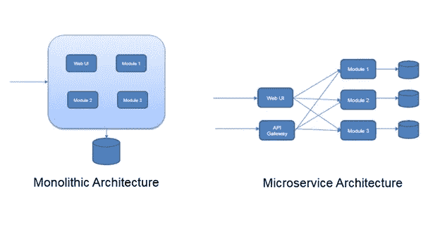
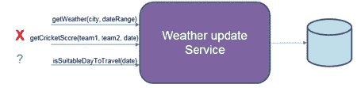

# 通过微服务找到自己的路

> 原文：<https://medium.datadriveninvestor.com/finding-your-way-through-microservices-1af41bc377b0?source=collection_archive---------21----------------------->

## 使用微服务架构构建应用时要采用的最佳实践

微服务已经存在。

Different services for different business logic (Photo by [Vinicius Amano](https://unsplash.com/@viniciusamano?utm_source=medium&utm_medium=referral) on [Unsplash](https://unsplash.com?utm_source=medium&utm_medium=referral))

那么，当服务数量增加时，我们如何构建工作良好且不会变得混乱的应用程序呢？

在这里，我们将介绍使用微服务编写应用程序时要遵循的一些最佳实践。但在此之前，如果你是第一次使用微服务，下图应该会给你一个概念。

Comparison to traditional architecture

是的，在传统架构中，您构建一个包(就像一个 war 文件)并将其部署在一个地方(一台服务器或一个集群)。每个需要使用 war 中任何函数的请求每次都需要命中相同的应用程序上下文。

微服务架构和这个有本质的不同，你会有几个不同的小服务，通过 REST API 开放。仅当需要特定的资源/功能时，服务才会收到命中。

微服务架构的每个服务都是彼此独立部署的。因此，我们需要确保以下几点:

a)逻辑上完成服务的分离。

b)数据库同样保持分离，并且在该数据库中具有服务特定信息。

c)相互之间的 API 调用确保您不会以大量网络延迟而告终。(即太多不必要的呼叫)

## 最佳实践

以下是构建微服务架构的一些最佳实践。

**服务是业务驱动的**

服务是业务驱动的，也就是说，你不能纯粹因为技术原因而分离服务。

这里有一个非常简单的例子:

我们有天气更新服务，可以通过联系其他服务器返回天气信息。因此，getWeather()是服务于业务目的的一种可能的方法。

然而，相同的服务当然可以联系不同的服务器，以获得最新的新闻，或最新的板球比分。技术上是可能的。然而，为了保持服务的业务逻辑完整，您不会在其中包含这样的服务。

isSuitableDayToTravel()呢？看起来它谈论天气，不是吗？如果您需要的服务只是返回天气信息，您就不会用不同的名称来实现这样一个额外的服务。如果这项服务也要结合其他旅游信息，检查当地的政治地位等。，那么很可能这个服务不适合保留这个方法。

**保持数据库独立**

很容易使多个服务使用相同的现有数据库。但是，这违背了架构。如果一个服务对数据库做了什么，你会在任何地方看到它的影响。因此，将特定于每个服务的信息保存在单独的数据库中。

好消息是，您不会受到一个巨大的 Oracle 数据库的限制。您可以决定您的服务要使用哪个数据库。您可以使用像 MongoDB 这样的 NoSQL 数据库，或者如果不需要这些，您可以使用像 Redis 这样的带有键值对的内存数据库。即使您的服务不需要任何类型的数据库，您也可以不需要数据库。

**不同服务的不同团队**

不再是 20 个开发人员开发一个大的应用程序，现在你将有 5 个团队，每个团队有 4 个开发人员，开发和测试 5 个服务。为什么需要这样做？

a)当来自其他服务的代码已知时，开发人员倾向于假设一些事情。每个服务应该彼此独立地编写。因此让不同的人来编码不同的服务是最好的。

b)这里不涉及单独的测试团队，而是在每个小团队中有一个测试人员(或者一个开发人员进行这项活动)。这样会提高团队的执行效率，而不是等其他团队。

c)一起测试所有东西，特别是当服务数量增加时，是复杂的，有时甚至是不可能的。如果每个服务都能够很好地照顾自己，那么整个画面就会自动适应。

**稳健的客户**

当对服务进行 REST API 调用时，您的客户机是否足够健壮来处理所有的故障场景？服务不可用怎么办？如果出现响应延迟怎么办？如果服务返回异常跟踪怎么办？当存在对其他服务的依赖时，您的应用程序如何服务于您的客户端？

构建您的客户端来处理所有这样的场景。

**DevOps 做法**

这是一个大的。当您的团队总是在开发一些东西时，如果您必须手动构建 jar，部署到服务器，并且手动进行所有的测试，这个过程会慢得多，对吗？

如果您的应用程序已经运行了几年，要实现以下目标并不容易。但对于新服务，您肯定可以实现以下一些目标:

a)为每种方法构建单元测试用例。

b)通过自动化工具自动化你的测试用例，这样它们就可以自己进行回归测试。这里尽可能避免手工测试。

c)设置一个 CI 服务(如 Jenkins)来自动化构建和部署流程。设置触发器，使版本控制中的每次提交都自动进行构建。一旦构建了 jar / war，单元测试和自动化测试应该在此之后运行。如果一切顺利，那么服务也应该自动部署到测试服务器上。出于这一点，尽可能减少手工操作。

## 结论

我们注意到了开发微服务的一些最佳实践。它可能会变得混乱，如果没有很好地理解，将会花费大量时间来调试问题。

虽然目前您只有一个服务要构建，但重要的是要记住，您的服务被其他人使用，因此要给出适当的消息(成功或错误)作为返回。同样，如果您正在调用其他服务，请意识到其他服务在某个时候肯定会失败，并相应地编写您的客户端。编码快乐！

如果你认为，你对微服务架构有一些想法，请点击几下👏👏👏，所以我会有动力去做更多这类文章！中等允许最多 50 次鼓掌，所以请随意！请通过评论让我知道你对这篇文章的想法！

我的职业是软件开发人员，过去几年一直在使用微服务。我主要写软件工程、生产力和书评。你可以在 [LinkedIn](https://www.linkedin.com/in/manjunathrajamanickam/) 和我联系。