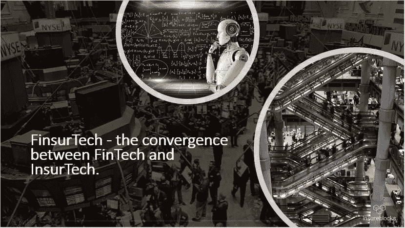
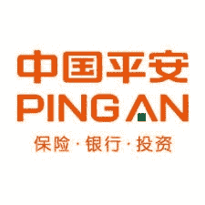
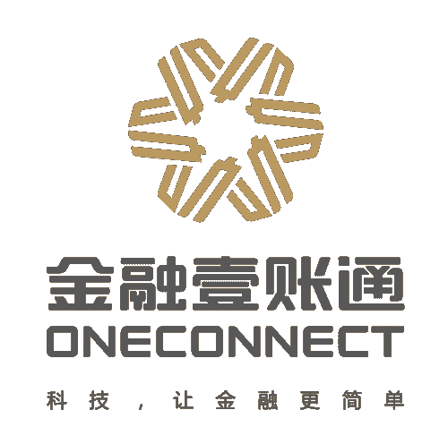
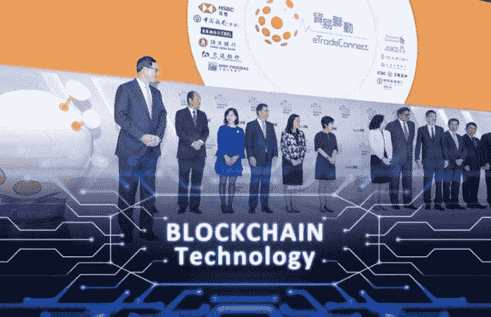
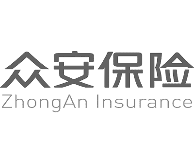
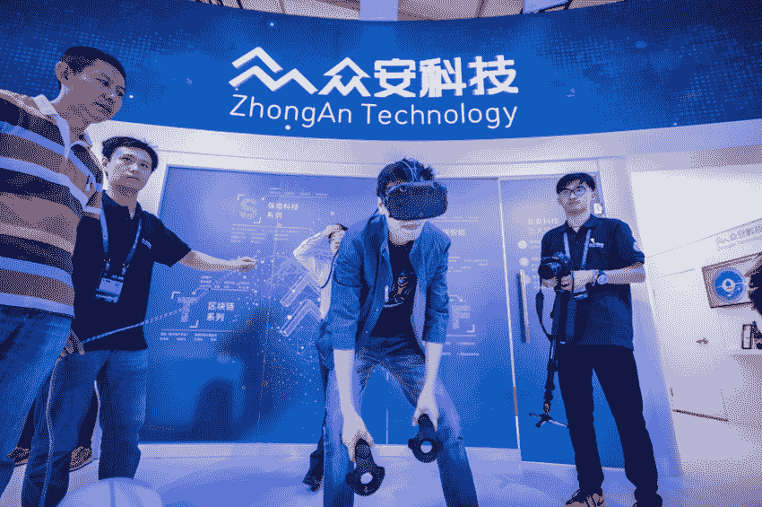
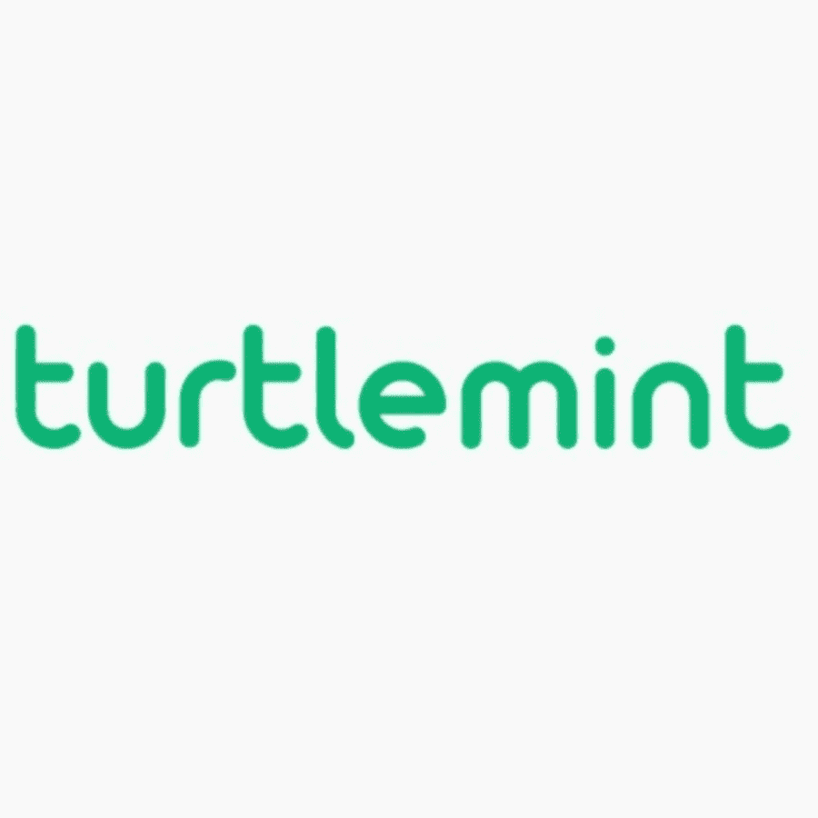

# 金融科技——多元化保险科技的未来。

> 原文：<https://medium.datadriveninvestor.com/finsurtech-the-future-of-diversified-insurtech-1beb5066620d?source=collection_archive---------4----------------------->

FinsurTech is the convergence between InsurTech and FinTech.

# 介绍

在这篇文章中，我将提出以下假设:**亚洲的顶级“保险科技”正在向金融科技多元化发展**(而且已经开始了！为此，**我将用四个深入的例子提供一个基于事实的论点。**

**术语注释** — **【保险技术】**，在我看来，指的是任何试图部署新兴技术的公司(保险公司、初创公司、服务提供商)，其主要业务是保险或与保险相关(通过收入或通过注册)。**在我看来，“金融科技”(FinTech)一词可以被宽泛地解释为新兴技术在金融领域的应用。**

** [## 正在改变行业的 5 个真实世界区块链应用——数据驱动的投资者

### 除非你一直生活在岩石下，否则我相信你现在已经听说过区块链了。而区块链…

www.datadriveninvestor.com](https://www.datadriveninvestor.com/2019/02/13/5-real-world-blockchain-applications/) 

金融科技(FinsurTech)是一个术语，最近由罗伯特·柯林斯(Robert Collins)使用，用来指拥有强大金融科技业务的保险科技公司。 **FinsurTech 是 FinTech 和 InsurTech** 的融合。我将从本文中介绍的公司所承担的健康技术风险中抽离出来(这肯定是另一个话题！)

# 一、平安保险股份有限公司

Ping An is a Chinese insurance conglomerate.

平安保险成立于 1988 年。2013 年，平安因宣布与[腾讯](https://www.tencent.com/en-us/)和[阿里巴巴集团](https://www.alibabagroup.com/en/global/home)合作推出[众安](https://www.the-digital-insurer.com/dia/zhong-an-chinas-first-complete-online-insurance-company/)而备受关注，众安是中国的一家全数字化保险公司，我们将在下一个例子中介绍。

在继续之前，如果你想对平安有更深入的了解，请随意参考我写的一篇关于平安的“生态系统”的文章。

所以你可能会问；平安(集团)提供哪些金融科技服务？嗯，下面是一个简单的例子:

*   云计算、大数据分析、数字咨询—提供特定于行业的服务。
*   面部和声音识别工具。基于区块链的服务；这份清单还在继续…..

# 平安科技

> 在 R&D 投资 500 亿美元，23000 名研究人员和 6000 多项 IT 专利…

你听说过提供基于云的托管服务的保险公司吗？好了，现在你有了……平安科技是平安旗下专门的(新兴)科技部门。它提供基于云的服务——**平安云**，这个项目于 2013 年启动。2018 年 10 月，[公司宣布与 GitHub Enterprise](https://www.prnewswire.com/news-releases/ping-an-fully-upgrades-ping-an-cloud-offers-services-to-external-customers-and-sets-up-strategic-partnership-with-github-300732884.html) 建立战略合作伙伴关系，通过中国平安云提供工具。

# 平安通

[**‘one connect**](http://www.oneconnectft.com.sg/)**’是平安的 FinTech 分支**。OneConnect 作为一个独立的私人实体，于 2018 年 2 月[筹集了**6.5 亿美元的首轮融资**。](https://www.ft.com/content/28f7fd06-332d-11e8-ac48-10c6fdc22f03)

[报道暗示](https://www.bloomberg.com/news/articles/2019-02-25/ping-an-is-said-to-plan-ipo-of-fintech-unit-at-8-billion-value)**one connect 可能会进行 10 亿美元的 IPO** (这将使该公司的估值达到 80 亿美元)——这就是根据[报道](https://www.bloomberg.com/news/articles/2018-03-28/ping-an-is-said-to-start-work-on-up-to-3-billion-oneconnect-ipo)它希望在 2018 年筹集 20-30 亿美元的原因。

**OneConnect 正在重新定义 InsurTech 子公司应该做什么以及有能力做什么** —它目前为 483 家银行、42 家保险公司和 2500 多家非银行金融机构提供金融科技相关服务。

**a .电子连接**

*   [国际贸易融资平台](https://www.etradeconnect.net/Portal)由香港金融管理局( [HKMA](https://www.hkma.gov.hk/eng/index.shtml) )和七家银行联合开发。
*   [于 2018 年 10 月推出](https://www.finextra.com/pressarticle/77368/ping-ans-oneconnect-commences-operations-in-indonesia)，构建于 [IBM Hyperledger 协议](https://www.ibm.com/blockchain/hyperledger)之上。

**b .地方感觉；全球抱负**

*   **新加坡**—2018 年 11 月，OneConnect 扩展到新加坡，提供其金融科技相关服务。OneConnect 希望利用新加坡的金融科技热潮，在这个市场上，监管机构——新加坡金融管理局(Monetary Authority of Singapore)遵循一种沙盒式的技术创新方法。
*   **印度尼西亚**—[最近](https://www.finextra.com/pressarticle/77368/ping-ans-oneconnect-commences-operations-in-indonesia)，OneConnect 已经开始在印度尼西亚开展业务。它打算承担的第一个项目是为当地(实物)市场协会 ASPARINDO 进行的数字化改造项目，其中包括为小商贩举办的讲习班。

**我还要指出一个有趣的投资**—2018 年 11 月，**平安旗下的航海家基金** [**向总部位于柏林的**](https://www.cnbc.com/2018/11/19/chinas-ping-an-invests-in-berlin-fintech-start-up-finleap.html) [**Finleap**](https://www.finleap.com/about/what-we-do/) 投资了 4700 万美元；回想一下 **Finleap 构建 FinTech 平台作为解决方案** ( **有意思？共发？我觉得不是**)。

然而，不仅仅是平安在亚洲推动 InsurTech 的边界，接下来，我们来看看众安。

# 二。众安在线 P&C 保险有限公司

ZhongAn is now a separate full-stack digital insurance company.

最初，腾讯、阿里巴巴集团(Alibaba Group)和平安保险(Ping An)在 2013 年成立的一家合资企业，促成了中国首家纯数字保险公司的成立。 [**众安**](https://www.zhongan.com/) **将于 2017 年 9 月在香港****上市，募集[**15 亿美元。**](https://www.ft.com/content/424e7b36-9f5d-11e7-9a86-4d5a475ba4c5)**

**众安在中国以外的金融科技推动由**众安国际**(众安与[国金环球控股](http://www.sinolinkhk.com/)在[成立的合资公司](https://www.scmp.com/business/companies/article/2123718/zhongan-forms-offshore-arm-sinolink-bets-fintech-insurtech))牵头。**

# **a.众安国际**

**众安国际成立于 2018 年 7 月，是一家 7.3 亿美元的合资企业，已经建立了令人印象深刻的合作关系:**

****

**东南亚正在准备一场[巨人的冲突](https://www.reuters.com/article/us-grab-gojek-indonesia/grab-go-jek-wage-street-fight-for-se-asia-super-app-supremacy-idUSKCN1NY2WQ)——**Grab v/s GoJek**(“移动”巨头或“打车应用”，随你怎么称呼！)**

**2019 年 1 月，众安国际宣布将**为 Grab 提供基础设施**(从核保、理赔、数据处理角度)**提供保险产品**。**请注意**:众安国际不承保这些产品；这是一个技术服务提供商式的协会。(这更像是一部金融科技剧，而非保险科技剧！)**

# **b.众安科技**

****

**沿着平安科技的思路，**众安科技**是众安的专业技术服务提供商。以下是主要进展的简要介绍:**

*   ****一站式理赔服务**:[2018 年 8 月](http://www.asiainsurancereview.com/News/View-NewsLetter-Article?id=43839&Type=eDaily)，众安科技推出理赔 e 平台。该平台被部署为 SaaS 工具，拥有 180，000 种药物的数据库，覆盖了 70%的医疗目录。安盛田萍在 10 个已知客户的名单中。**
*   ****保单支持令牌(PBT)**:2018 年[10 月](https://en.prnasia.com/releases/apac/zhongan-technology-publishes-a-white-paper-on-insurance-tokens-226603.shtml)，该公司发布了一份关于**使用许可协议令牌化资产的白皮书**l；应用包括 P2P 贷款、众筹等。**
*   ****S 系列和 T 系列产品**:该公司分别提供**范围广泛的 InsurTech 和 FinTech 解决方案**(“系列”概念)。承保、理赔服务、云计算、客户服务工具(聊天机器人/语音助手)、平台开发—所有这些都来自同一个供应商！**

**对于怀疑者来说，众安确实是一家保险科技公司(digitally native，成立于 2013 年)，已经多元化进入金融科技和其他领域(众安科技类似于亚洲的 [IBM](https://www.ibm.com/uk-en/) 和[埃森哲](https://www.accenture.com/gb-en)！)**如果这种金融科技的推动不足以说服你，这里有一些额外的证据****

**HKMA 将向腾讯、蚂蚁金服和阿里巴巴等“科技第一”公司发放六张新的数字银行牌照，然而，一个强大但被忽视的竞争者是众安！注意**众安将与** [**中信银行**](https://www.cncbinternational.com/home/en/index.jsp) **合作开发该数字银行**；最优秀的金融科技——全栈数字银行。**

**请注意:在这个阶段，我希望前面提到的例子能为“金融科技”的观点提供有力的论据；接下来的两个例子将涉及到一定程度的基于最近公司特定趋势的详细分析的推断。**

# **三。新加坡人寿私人有限公司**

****

**新加坡人寿是一家屡获殊荣的新加坡保险科技初创公司。在 2018 年亚洲保险大奖[中，它获得了‘年度初创企业’奖。2019 年 1 月 15 日，公司](https://insuranceasia.com/event/insurance-asia-awards-2018)[从](http://fintechnews.sg/28015/insurtech/singapore-life-aberdeen/)[阿伯丁标准投资](https://www.aberdeenstandard.com/)获得了 1300 万美元的融资，使其融资总额达到 8300 万美元。**

**你可能会问——为什么我觉得新加坡人寿会成为一家金融科技公司？**

**最近，新加坡人寿 [**支付$2M**](https://www.finews.asia/finance/28270-singapore-life-buys-spending-tracker) **收购了** [**YoloPay**](https://blog.yolopay.com.sg/) 的支付基础设施(包括 app，称为‘Canvas’)。这个想法是通过手机给孩子们提供一个预付借记卡来花他们的零花钱。长期计划是什么？下面是我的观点的简要概述**

*   ****游戏化 2.0 尝试** — SingLife 现在处于日常消费和一个幼儿之间的支付接口；为什么要游戏化？**回想一下，游戏化不是视频游戏** —真正的目的是提高客户参与度和品牌知名度；游戏化 2.0(正如我上面建议的)将会很微妙…**
*   ****品牌形象塑造**——培养孩子早期储蓄的习惯；奖励/忠诚机制，从小给客户增值。这正是保险公司想要的品牌形象。**

****带回家的一点——紧跟 SingLife 你可能会看到一家新兴的顶级保险科技公司涉足金融科技。在我看来，他们的长期愿望是金融，而不仅仅是金融科技**。这里有一个[小玩笑](https://www.finews.asia/finance/28270-singapore-life-buys-spending-tracker)——yolo pay 的一位 MD 将领导他们新成立的 FinTech 部门，你可以在这里找到详细的分析。**

**下一个例子来自我的祖国印度**

# **四。Turtlemint**

****

**红杉支持的 Turtlemint 是一家印度保险科技公司，到目前为止已经筹集了 3100 万美元的资金(不包括未披露金额的种子期)。**

**Turtlemint 与其他印度保险技术的不同之处在于它的**“仿生代理方法”** Turtlemint 为 PoS 保险经纪人开发了一款 **app，名为**'**[**mint pro**](https://www.mintpro.in/)**'。******

**Turtlemint 目前拥有 35，000 名代理商，并计划通过红杉资本最近一轮 2500 万美元的投资，将其网络扩大到 250，000 名代理商(主要集中在二、三线城市)。**

****Mintpro 是保险代理人的梦想工具** —平板电脑&移动兼容，它提供销售线索、实时报价、关于即将到来的续保的推送通知更新，以及提供洞察(潜在)客户保险概况的工具。**

****那么让我问你，这里的长期计划是什么？****

**简单——金融科技、金融和仿生个人财富管理。**

****(在我看来)人寿保险不太可能成为点击购买政策**——鉴于其重要性，客户可能希望与代理人交谈；在新兴市场，或许，考虑到影子经纪人的例子，甚至是亲自出马…**

**从长远来看，**通过配备了“Mintpro”的保险代理人建立的强大客户关系**可能会导致**“mint pro 2.0”(我的说法)**使专业人士能够为客户提供全面的财富管理服务；想象一下，你的财富经理坐在你的桌子对面，用笔记本电脑/平板电脑向你(实时)展示一系列不同的投资策略(根据你的客户资料进行个性化)，以及预计的投资组合价值和风险状况——星际迷航？不，这总有一天会成为现实…..**

# **结论**

****‘FinsurTech’——保险科技与金融科技的融合；多元化保险科技公司的未来就在眼前。平安和众安是这种(新)趋势的现有例子。鉴于，S **ingapore Life 和 Turtlemint 表明，亚洲新兴顶级保险科技公司正在迈出金融科技多元化的第一步。******

**还有无数其他的例子可以列出来，但是，我希望这篇文章能起到抛砖引玉的作用——也许“FinsurTech”会比你意识到的更快成为主流。你可以说你第一次听到这个消息是在这里，来自罗伯特·科林斯和我，拉胡尔·马图尔和 T21。**

# **承认**

**我要感谢罗伯特·柯林斯为“FinsurTech”带来的思想领导力，并感谢他允许我在整篇文章中使用这个短语。此外，我感谢他提供的意见、建议和意见；这篇文章从我们众多关于新兴市场保险技术的讨论中获得了灵感，作者是[帕特里克·凯拉汉](https://www.linkedin.com/in/patrickkelahan/)。**

# **关于作者**

**嗨！我在华威大学攻读硕士学位时，在保险公司担任研究分析师。**

**我对新兴市场的保险技术非常感兴趣，我的研究论文围绕三个想法展开:**

**I .健康技术和保险技术的融合。**

**二。相邻产业创新对保险业的影响。**

**三。多元化保险技术的未来。****