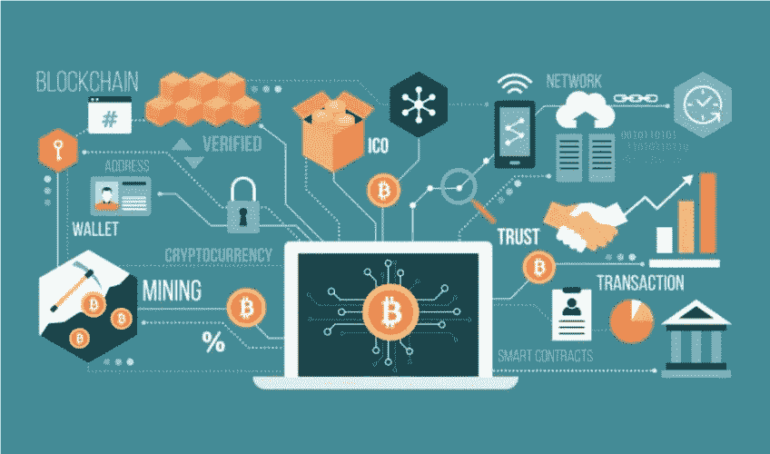
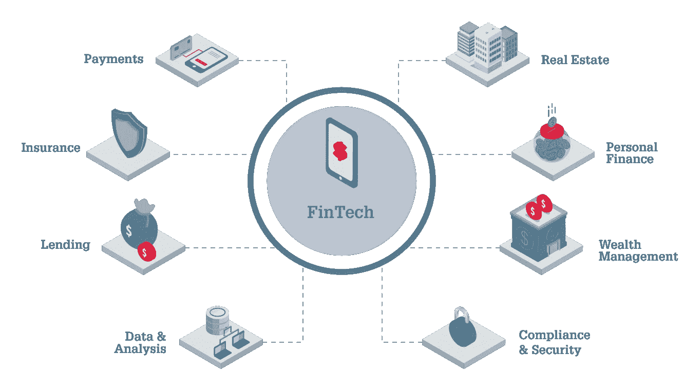

# 金融科技——金融科技

> 原文：<https://medium.datadriveninvestor.com/fintech-a-financial-technology-ebf535ee8918?source=collection_archive---------10----------------------->

# 利用支持金融科技的应用程序避开安全问题

*想想技术，首先击中的是‘便利’！*

毫无疑问，在过去的几年里有大量的创新和技术进步，但在技术领域仍有一些改进的余地，其中一个部门受益最大，那就是银行业。当然，银行部门已经从创新和创造力中获得了许多好处，但是在安全性方面仍有一些需要最终用户体验的改进。

在安全故障运行中，用户的财务数据似乎更容易受到攻击，但最近；技术的到来导致了更好的技术发明的出现。这是**金融科技(FinTech)**

 [## 深度学习、2019 年顶级技术趋势、金融科技术语表等...-数据驱动型投资者

### 这是本周我的 Twitter feed 的增值内容。希望你能从中学习、享受并有所收获。如果…

www.datadriveninvestor.com](https://www.datadriveninvestor.com/2018/11/18/deep-learning-top-technology-trends-for-2019-fintech-glossary-more/) 

## 让我们进一步了解金融科技:

**什么是金融科技？**

Fintech 是金融技术，它使用户能够处理与金融相关的问题。这种技术使得金融服务比以前更容易，并给银行和用户带来了创造性和与金钱相关的管理相融合的体验。

**用在哪里？**

Fintech 负责使用谷歌钱包、Apple Pay 或 PayPal 时发生的交易。它漂亮地抓住了交易、分期付款、资源管理、保护和比特币等领域。

不可否认，所有业务中发展最快的项目是 Fintech。它给了你一个强有力的理由，说明为什么你的业务需要这种技术进步。

**它为什么吸引用户？**

用户的方便和舒适是任何技术出现时首先考虑的问题。

Fintech 非常令人惊讶地满足了这一需求，用户不必担心丢失个人数据的危险，并成功完成货币交易。

金融科技被认为是一种福气，可以实现无缝交易并跟踪所有交易。尽管如此，仍有很多人不相信金融科技在其业务结构中的注入或集成，所以我们决定写这篇博客，让人们了解金融科技对他们业务的好处。

**1。贸易业务的数字视图:**如果您在数字平台上有业务，那么您必须仅通过数字平台进行交易，这对于您的业务在全球市场上的数字扩展非常有帮助。

这使得全球任何角落的任何用户都可以购买和访问您的服务，最终形成强大的收入模式。

**2。有助于促进众筹阶段:**众筹已经成为你的企业筹集资金的一种新方式。因为有很多方法可以帮助你发展业务，给你提供众筹的机会，这些方法补充了金融科技技术作为网络资金的高级生成器。

**3。提示网上银行:**在科技时代，app 技术已经成为提供网上银行服务的便捷方式。不用说，这吸引了用户并提供了在任何时间和从世界任何角落使用银行服务的便利，并且这增加了任何特定银行的交易率。

**4。简化用户体验:**金融科技让那些认为银行应用是最具挑战性的事情的人松了一口气，他们还担心如果输入任何错误的数据，他们的数据会丢失，因为它确保了交易的成功。

**5。可访问的分析:**金融科技技术使用户能够对其账户内发生的所有金融活动进行分析，这些信息可以在任何时间、任何地点轻松使用。

**6。定制和用户友好的方法:**支持金融科技的应用增加了消费者的基本需求，但银行部门的基本功能仍保持不变。金融科技技术可以轻松简化核心银行功能，如消费、储蓄和借贷，这进一步使流程更加用户友好，耗时更少。

**7。人工智能集成:**我们都变成了技术专家，生活的各个方面都将实现自动化。在金融科技注入人工智能的帮助下，资金管理也实现了自动化。通过这项技术创新，用户可以检查、跟踪和管理不必要的支出，并采取可能的措施为未来节省资金。先进的机器学习和聊天机器人与客户建立了联系，现在减少了后端成本，这涉及一对一的互动。

**8。Fintech &区块链:**区块链技术为用户打开了机会的闸门，在这里可以访问一个高度安全的数据平台，它只吸收认证，对用户来说是完全安全的。为了有效地访问他们的货币方面，金融科技技术带来了一个非常渠道化的通道，这导致了这一业务的巨大增长。

正如我们所知，移动应用是发展业务的最佳方式之一，因此为用户提供更方便、更安全的应用是一个好主意。