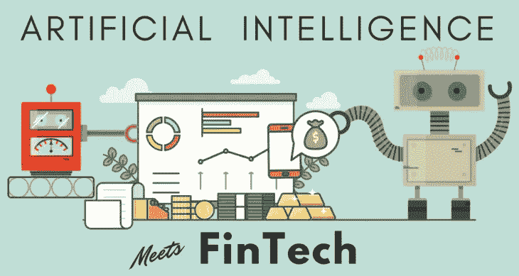
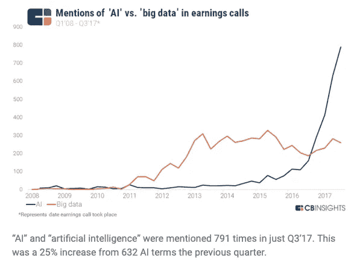

# 金融科技人工智能被夸大了

> 原文：<https://medium.datadriveninvestor.com/fintech-ai-is-overhyped-1058de8edab2?source=collection_archive---------7----------------------->

过去五年，金融科技人工智能公司共筹集了 648，662，773 美元。换句话说，在过去五年中，利用人工智能的金融科技公司平均每天筹集大约 355，431 美元。

人工智能和机器学习是最近在金融服务领域被抛出很多的术语，我们亲自听到它们在许多情况下被过度使用。尽管我们认识到这些技术是有意义的，但我们不相信它们会像其融资轮所显示的那样产生如此多的经济价值。

 [## 分散金融的出现|数据驱动的投资者

### 当前的全球金融体系为拥有资源、知识和财富的人创造了巨大的财富

www.datadriveninvestor.com](https://www.datadriveninvestor.com/2019/03/14/the-emergence-of-decentralized-finance/) 

迄今为止，很少有独立的案例被规模化和货币化；相反，我们在私人市场上看到的许多应用程序是对现有流程的补充。

以信贷承销为例。我们已经看到数十种信用增强工具应用替代数据，试图更好地模拟一个人的信誉。其中一些工具吸引了一小部分买家，但我们还没有看到替代数据集的使用取代传统方法。

大多数其他行业也是如此，但我们似乎仍在观察金融机构之间的竞赛，以获取潜在和现有客户的最多数据。

[https://www.cbinsights.com/research/artificial-intelligence-earnings-calls/](https://www.cbinsights.com/research/artificial-intelligence-earnings-calls/)

如上图所示，人工智能已经成为各行各业高管和决策者的热门话题。我们生活在一个残酷惩罚那些不适应的人的世界，我们经常想起百视达和西尔斯这样的昔日巨头，它们未能改变自己的企业战略，后来失宠了。如今，没有哪个行业领导者想成为新的[约翰·安提奥克](https://en.wikipedia.org/wiki/John_Antioco)，他们为此花费了无数的美元和资源。

回到筹资金额，[金融科技人工智能公司在过去五年中平均筹集了大约 772.2 万美元](https://www.crunchbase.com)(由于一些异常值，这个数字偏高；筹资额中位数为 179 万美元)。对这一领域的兴趣推动了融资规模和估值的上升，在过去十年的大部分时间里，私人和公开市场为金融科技公司支付的[溢价](https://www.barrons.com/articles/are-fintech-stocks-overpriced-51563590139)一直很高。

私人股本市场的许多投资者已经迷恋上了人工智能的潜在用例，而忽视了投资回报的难度。人工智能只有在已经收集了专有数据集的情况下才能有效工作。一旦在大规模范围内完成，大数定律就会发挥作用，算法可以仅根据数据做出更明智的决策。许多公司遇到的问题是，专有数据集不容易获得，收集它们需要相当多的时间和资源。

我们亲自看到许多基于人工智能的公司要求资金主要用于收购初始客户。换句话说，这些公司要求资金来获得他们的数据集；他们还没有，而且在一段时间内也不会有(假设一切按计划进行)。在这样的投资上收回投资意味着不仅必须首先获得客户，而且每个客户必须在船上停留足够长的时间以提供有意义的数据，然后这些数据必须足够有价值，一旦被大规模收集，就会对另一个金融或战略买家产生巨大的吸引力。

对那种情况做一个快速的决策树分析，一旦你有了，让我知道概率是什么样子。

总之，我应该说我是数据科学的忠实粉丝，我喜欢使用客观事实(如数字)来推动决策。我认为，机器学习和人工智能无疑将改变工作的某些方面，但我确实认为，围绕金融科技领域(和其他领域)的一些公司的炒作有点热。

我发现，当别人贪婪时，保守通常是一个好主意，我认为我们正在到达贪婪点。