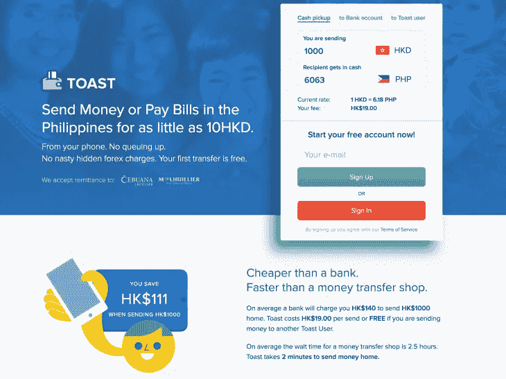
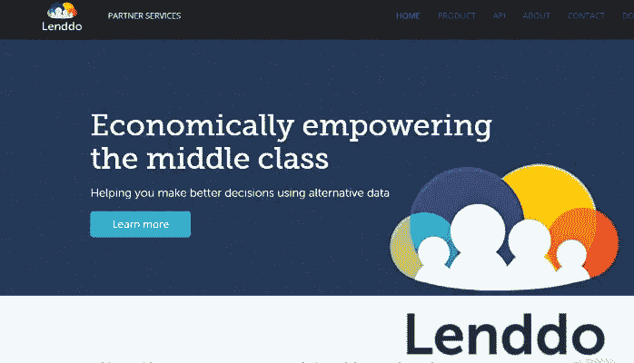
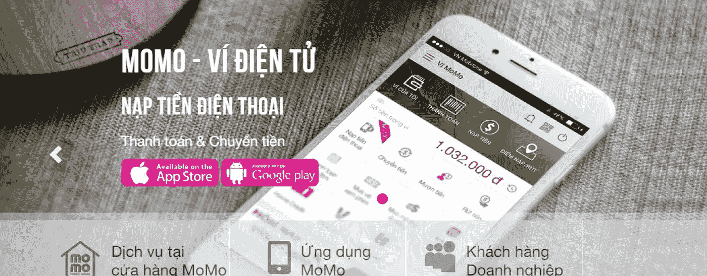
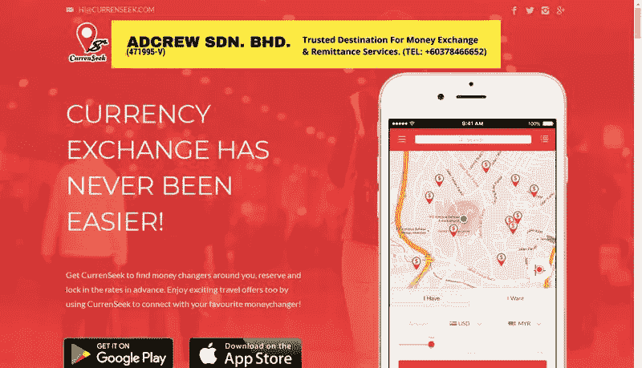

# 东南亚的金融科技公司值得关注

> 原文：<https://medium.datadriveninvestor.com/fintech-firms-in-southeast-asia-to-keep-an-eye-on-d21ef7daf0c7?source=collection_archive---------4----------------------->

在熙熙攘攘的东南亚现代化城市中，金融科技领域正在快速发展和变化。

Kuala Lumpur, Malaysia

正如我在上一篇文章中提到的，“东南亚是金融科技的新黄金国”——该地区目前在所有领域都有很大增长——尤其是在金融科技方面。

这个地区涌现出如此多令人兴奋的初创公司，它们创造出创新的金融应用和软件，真正改变了游戏规则。让我们来看看东南亚最热门的一些金融科技公司，以便未来关注。

# [举杯](https://toastme.com/hk#/)

许多在海外香港工作的菲律宾人希望能够快速方便地将钱汇回家。Toast 是一款点对点转账应用，允许他们直接从智能手机上转账。

过去，移民工人依赖西联汇款和速汇金等转账服务。这项服务比使用银行转账更便宜，同时也比汇款店更快。

Toast 背后的团队认为，没有理由不进行实时转账——不需要在银行排队或等待几天才能收到现金。用户甚至不需要有正式的银行账户。

该公司显然已经确定了一项重要的需求。该应用于 2016 年 3 月推出 10 个月后，从香港到菲律宾的汇款已增长到每月超过 700 万港元(902，750 美元)。

密切关注这家公司——他们计划向南亚和东南亚扩张。他们已经[获得了资金，并从新加坡金融管理局获得了在新加坡经营汇款代理的执照](https://www.todayonline.com/business/remittance-app-toast-secures-singapore-licence-s2m-funding)。

# [LenddoEFL](https://www.lenddo.com/)

世界各地新兴中产阶级的许多成员发现自己有点进退两难。他们有稳定的收入，但他们不能获得信贷，因为他们没有正式的信用记录。然而，他们无法建立正式的信用记录，因为他们无法获得信贷。

那么，你如何确定他们的信用度？

LenddoEFL 说:使用社交媒体。

LenddoEFL 是一家位于菲律宾的软件即服务公司，它使用智能手机记录和社交媒体等非传统数据来确定客户的财务稳定性。这些信息可以用来确定谁是借款人，以及他们对信贷的态度。

LenddoEFL 基于四年的实际网贷经验开发了这项技术，其中包括数十亿个数据点的收集和分析。对每份申请的 12，000 多个变量进行分析，从而非常准确地描绘出个人的信用状况。

它允许贷款人向这些个人提供信贷，这样新兴的中产阶级就可以获得建设美好未来所需的金融工具。

LenddoEFL 发展很快。它们于 2011 年在菲律宾推出，但迅速扩张至哥伦比亚、墨西哥、印度和韩国等其他市场。他们的最终目标是为全球发展中国家的“至少 10 亿人”提供金融普惠。

(更多信息，请阅读 [*我们为什么投资:Lenddo*](https://medium.com/positive-returns/why-we-invested-lenddo-3d1c654f4d62)[奥米迪亚网络](https://medium.com/u/67728d2f5658?source=post_page-----d21ef7daf0c7--------------------------------)。)

# [沫沫](https://momo.vn/)

Via [Fintech News Singapore](http://fintechnews.sg/3627/mobilepayments/momo-the-rising-star-of-vietnam-fintech-in-online-payments/)

在越南这个大多数人都没有信用卡的国家，像陌陌这样的移动支付 app 真的可以派上用场。25 岁以下的人口占总人口的 25%，智能手机的拥有率也在不断上升，陌陌真的有颠覆性的潜力。

陌陌的用户可以使用该应用程序获得许多不同的服务，例如支付水、有线电视和电力等账单，以及购买电影票和在线购物。注册账户很容易。你只需提供你的电话号码，验证码将会发送给你，然后你可以用它来激活你的帐户。

就在陌陌推出他们的移动钱包和支付应用一年后，他们宣布该应用拥有一百万用户。这还不包括陌陌在 2016 年宣布的 250 万移动货币客户。2017 年，陌陌[与优步](https://asia.nikkei.com/Business/Vietnams-MoMo-partners-with-Uber)签署协议，允许乘客使用其陌陌应用支付乘车费用。

# [当前搜索](https://www.currenseek.com/)

via [Funderbeam](https://www.funderbeam.com/startups/currenseek)

Currenseek 于 2015 年在马来西亚成立，是一款移动应用程序，旨在帮助旅行者找到他们附近的最佳汇率，以便他们可以避免被放债人敲诈。毕竟，没有什么比为旅行攒了一大笔钱，却被货币兑换费花掉了大半更令人沮丧的了。

这款手机应用程序允许用户在离他们最近的网点看到当前汇率的实时信息。应用程序中的信息会不断更新，因此用户可以随时看到最新的费率。此外，该应用程序显示有竞争力的街头利率，而不仅仅是银行间批发利率。

这款应用是由 Amir Haghbin 在吉隆坡开发的，他的灵感来自于将美元兑换成马来西亚林吉特的挫败感以及兑换点之间缺乏一致性。

毕竟，独立的货币兑换店实际上以一种相当简单的方式运作——他们经常像零售商一样低买高卖。因此，这意味着他们的价格将取决于租金、工资、管理费用和其他因素——甚至是商店的位置。在吉隆坡的一个地区，可能有 20 到 25 家货币兑换店，它们之间的汇率差异可能高达 25%。

随着旅行者越来越了解如何最大限度地利用他们的钱，他们会寻找像这样的应用程序，以避免被放债人敲竹杠。

# 你在关注哪些东南亚金融科技公司？

Hong Kong Harbour

你知道东南亚有一家公司正在做一些大胆的、引人注目的和创新的事情吗？请在评论中告诉我。我总是喜欢听到东南亚金融科技的新发展。

如果你喜欢这篇文章，感谢点击“鼓掌”按钮。这就告诉我要多写！

*保持游牧，*
*蒂姆*

*我是菲律宾一家融资公司*[*TendoPay*](http://tendopay.ph/)*的联合创始人，也是北美领先的展示顾问*[*Candy Banners*](http://www.candybanners.com)*数字广告工作室*[*Stinson Design*](http://www.stinsondesign.com)*的联合创始人。他曾是社交游戏 Predico 的创始人，也是广告技术公司 Viewor 的董事会成员。在 Instagram @timgrassin 上关注我的冒险经历*