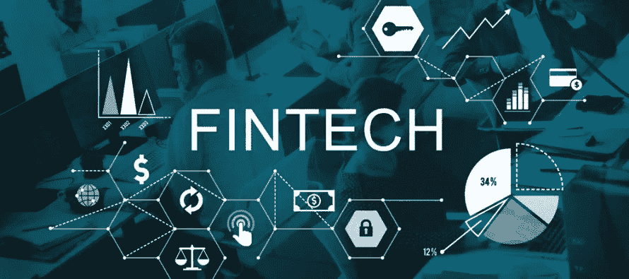
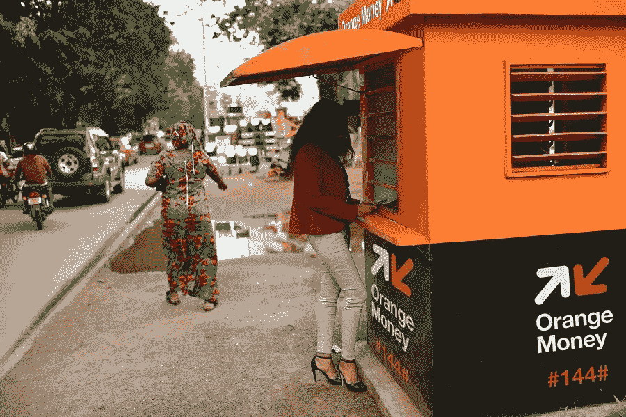

# 金融科技——喀麦隆金融普惠的门户

> 原文：<https://medium.datadriveninvestor.com/fintech-the-gateway-to-financial-inclusion-in-cameroon-45eb51d3cd3?source=collection_archive---------1----------------------->

随着世界的发展，新技术和创新不断发展，使生活变得舒适和便利。金融行业是采用技术发展最快的行业之一，全球普遍非常需要金融稳定。

金融科技指的是提高金融服务质量的数字创新。金融科技公司利用新技术和创新来开发新的和更好的金融服务。移动技术、互联网和手机用户的快速增长为 fintech 在喀麦隆提供金融包容性铺平了道路。

 [## 分散金融的出现|数据驱动的投资者

### 当前的全球金融体系为拥有资源、知识和财富的人创造了巨大的财富

www.datadriveninvestor.com](https://www.datadriveninvestor.com/2019/03/14/the-emergence-of-decentralized-finance/) 

**为什么是 FINTECH** ？

在对金融科技作为喀麦隆金融普惠的门户做出结论之前，让我们先了解一下金融普惠是什么。根据世界银行的定义，金融普惠是指个人和企业能够以负责任和可持续的方式获得有用且负担得起的金融产品和服务，以满足他们的需求——交易、支付、储蓄、信贷和保险。金融普惠旨在为无法获得银行账户、储蓄、信贷和其他金融交易等基本金融服务的人提供服务。

金融服务的高成本、服务和金融机构的距离、开户所需的冗长文书工作、糟糕的客户服务、缺乏担保和信用记录、排斥包括年轻人在内的妇女等因素将很大一部分人口排除在喀麦隆金融系统之外。

在喀麦隆，2017 年至少 15 岁的人口中只有 10%有银行账户。这是财政部在“FinScope”调查中披露的，该调查旨在评估全国获得和使用金融服务的水平。根据该文件，喀麦隆的金融包容性相对较低。事实上，人们普遍更喜欢非正式信贷(11%)而不是正式信贷(3%)。此外，大约 10%的人口从亲戚或朋友那里获得贷款。

[C](https://www.google.cm/url?sa=i&source=images&cd=&cad=rja&uact=8&ved=2ahUKEwir56aMkankAhWBzVkKHdrIDNsQjB16BAgBEAM&url=https%3A%2F%2Fwww.finallygoodnews.net%2F2018%2F05%2F14%2Fmobile-based-fintech-closing-economic-gap-africa%2F&psig=AOvVaw3dcbEzMgQDmsFi6kE0qZu4&ust=1567204291372614)ourtesy: [finallygoodnews.net](http://finallygoodnews.net)

“消费者教育和金融教育在喀麦隆是一个严重的问题，主要是在保险业，那里的大多数成年人缺乏金融知识，”该研究称。约 51%的受访成年人指出需要进行理财教育培训，主要是关于如何储蓄和理财产品的好处。同时，45%的人由于缺乏财务信息而不寻求财务建议。“在 15 岁及以上的人群中，只有 29%的人使用手机支付服务，而手机普及率为 76%。这意味着数字金融包容性仍然可以改善。这很重要，因为移动货币是一种相对较新的金融产品，潜力巨大，”FinScope 提到。

作为一种解决方案，金融科技(fintech)为促进喀麦隆的经济增长和扩大金融包容性提供了机会。金融普惠倡导各种方法，如方便、廉价地开立银行账户，让所有人都能获得金融产品和金融机构，金融教育，以及将人们的需求与金融产品和服务相匹配

# **金融科技初创公司/公司趋势**

移动技术是喀麦隆金融科技的关键要素之一，已使成千上万的人能够进行支付、转账和开户等金融交易。

在提供金融服务的过程中采用和使用移动技术(移动货币/移动钱包)正在改变金融服务提供商运营和向客户提供产品和服务的方式。喀麦隆邮电部(Minpostel)发布的一份报告显示，该国的移动普及率大幅增长，从 2005 年的 12%左右上升到 2016 年的近 83%。

根据电信监管机构(ART)最近的一份报告，2017 年喀麦隆的互联网普及率为 35.64%，比上年增长 2.39%。“互联网使用的增加是移动电话用户数量不断增加、提供互联网服务的公司以及智能手机数量增加的结果，”阿特解释道。

2017 年，喀麦隆所有类别(Wimax、移动互联网、ADSL 等)的互联网用户数量增长了 2.39%。从绝对数字来看，一年中有 193，487 名新用户注册。目前，827 万喀麦隆人接入了互联网。

手机销售的增长和互联网的扩张导致金融科技初创公司和移动运营商公司向非银行、商人、公司、未成年人等提供金融服务。在许多据说在喀麦隆的金融科技初创公司/公司中，只有少数几家被认为在整个非洲掀起了波澜。

Orange Money Agents can the found in streets and local neighborhood

Orange 和 MTN 在非洲实现了移动支付和汇款的民主化。它们是喀麦隆最常用的货币银行服务。这些移动运营商于 2011 年在喀麦隆推出了移动货币服务，但这不仅带来了一种新的生活方式(就处理货币而言)，还提高了金融交易的速度。此外，它还拉近了服务和金融机构与人民的距离，使所有人都能以较低的成本获得金融服务。

移动货币也可以作为用户的电子钱包，因为他们不再需要携带实物现金。用户可以购买燃料，在超市购物，在酒吧购买饮料和小吃等，并使用移动货币支付。电力供应公司、税务总局、CAMRAIL 等企业和机构也在利用技术革命来促进税收。如今，通过移动货币支付电费变得更加容易，企业可以同时为几个客户服务，而不是像以前那样在柜台前排长队。

由 Famba Collins 领导的 IWOMI Technologies service 发起的 Softeller 包括外包、咨询、服务集成、软件开发、业务流程工程、培训、IT 审计和咨询。他们还通过他们的在线服务[www.softeller.com](http://www.softeller.com,)拥有一个包括移动货币在内的支付网关，已经有大约 15 家公司签署了合同。喀麦隆的许多客户也在使用他们的群发短信解决方案来发送通知。

Wecashup 完全由 Infinity Space 的首席执行官 Cedric Atangana 构想，是一个通用支付平台，通过一个单一接口和一个通用 API 聚合不同的支付方式(现金、移动货币、钱包和银行卡、并发)。它使没有卡或银行账户的人能够方便地进行网上购物，使电子商家能够扩展他们的部署区域，从而获得新的市场(非洲，一个电子商家难以到达的市场)，使消费者和商家能够进行安全交易。它是非洲发展最快的金融科技初创公司之一，足迹遍布 36 个非洲国家。

要了解更多关于 WeCashUp 或 Infinity Space 的信息，请通过 LinkedIn(【https://fr.linkedin.com/in/cedricatangana】T2)访问塞德里克·阿坦加纳

由当地 fintech Adwa 开发的 AdwaPay 提供了一个移动应用程序，该应用程序聚合了喀麦隆可用的大多数数字支付解决方案，即 MTN 移动货币、Orange Money、Express Union Mobile、银行卡甚至 PayPal。通过该应用程序，用户可以进行各种金钱交易。AdwaPay 保证交易的安全性，因为这家初创公司订阅了 Digicert 的年度网络保险套餐。该方案为每笔交易提供 150 万美元的补偿。更多信息请访问[www.adwapay.com](http://www.adwapay.com)

Ovamba Solutions 由 Viola Llewellyn 和 Marvin Cole 于 2013 年创立，通过移动电话技术为微型、小型和中型企业提供短期资本。它可以提供高达 50 万美元的贷款。该公司正在通过其超越传统银行的非洲语言自然聊天机器人的创新来帮助企业发展。Ovamba 拥有语音和面部识别安全功能，并为投资者提供区块链解决方案，使他们能够加入其融资平台。这家公司被公认为世界经济论坛的“技术先锋”之一。这是一家我们未来必须关注的公司。www.ovamba.com

喀麦隆当地的个人储蓄标签“DJangui”也是喀麦隆人 Jules Guilain Kenfack 选择的名字，指的是他发明的在线管理个人储蓄的应用程序。Djangui 是一个应用程序，客户可以通过 Orange Money、MTN 移动货币和 Paypal 安全地支付自己的捐款；使用即时消息服务来与 tontine 的成员进行交流、组织自动抽奖、从 tontine 的账户中贷款、为董事会成员投票、通过视频电话获得先前会议的会议记录等。

尽管该应用程序仍处于开发阶段，需要添加更多功能，但该应用程序已被居住在欧洲的喀麦隆会员在德国的 tontines 使用。这一创新将大大有助于作为非洲文化一部分的 tontines 的现代化。www.ledjangui.com，[https://www.facebook.com/djanguicameroon](https://www.facebook.com/djanguicameroon)

WAZAPAY 是另一家位于 Buea Molyko 的喀麦隆金融科技创业公司。它是一个电子钱包和在线支付网关，允许用户通过移动电话在 internet.www.wazapay.net 安全地进行和接收支付

这些只是喀麦隆金融科技公司/初创公司的几个例子，它们被发现为自己创造了名字，并将金融业提升到了一个新的水平。其他金融科技初创公司，如 Diool、Qwalet、monetbill、ZuumPay、Ishangoo 等，仍然需要有机会展示他们的潜力

Courtesy: RIWI

# **为什么对金融科技感到恐惧**

尽管我们可以看到一些金融科技初创公司在喀麦隆获得了一席之地，但它们在这个体系中真的很难找到出路。虽然非洲大陆的一些国家已经处于使用开户、保险和信贷的另一个层次，但喀麦隆仍处于资金转移和支付的第一阶段。

这种担心的原因不能仅仅归咎于技术因素和基础设施的缺乏，而是地方金融机构和广大民众的约束和不太光彩的看法起了很大作用。

例如，当地金融家认为，金融科技对仍然过于脆弱的银行体系构成了威胁。他们认为，与金融科技公司有关联的银行犯了一个严重的错误。

金融科技初创公司没有提供足够的信息来说明他们提供了什么。他们没有意识到 80%的喀麦隆人没有银行账户，他们很少或根本不知道网上交易或使用他们的平台购买产品意味着什么。

人们仍然喜欢在银行排长队进行交易，例如支付账单，因为害怕被欺骗。

总之，金融科技对金融业并不构成威胁，而是一种进步，是该行业的一种发展。数字金融将在可及性和成本方面改善金融服务。世界银行也将其确定为金融包容性因素。喀麦隆为年轻开发商提供更多空间，以提出更先进的金融解决方案，这确实有助于金融包容性，并有效满足民众的金融需求。

文章作者:Zixtech 公司

www.zixtechcorporation.com

facebook.com/paulbabz