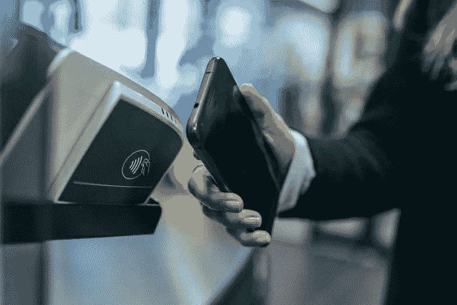

# 金融科技:改变拉丁美洲的金融格局

> 原文：<https://medium.datadriveninvestor.com/fintech-transforming-latin-america-s-financial-landscape-cdcda474f528?source=collection_archive---------2----------------------->

金融科技(fintech)是全球科技革命蓬勃发展的副产品。它对金融行业的公司产品和消费者体验产生了积极的影响。

金融科技满足了越来越多的人使用电子设备处理个人事务的需求。虽然拉丁美洲继续高速发展，但它对网络世界的滞后进入对金融科技公司有利。该地区的政府将金融科技的发展视为改善当地数字包容性和技术诀窍的推动因素。

想想席卷拉丁美洲的[最新数字金融趋势](https://www.bizlatinhub.com/top-drivers-behind-fintech-developments-in-latin-america/)，以及该地区的下一步可能是什么。

**什么是金融科技？**

金融科技是金融服务业的一个领域，旨在利用技术来增强传统银行机构向消费者市场提供的各种金融服务。

诸如寻求贷款/信贷、获得保险、支付和交易等服务可以通过技术改造得到加强。应用程序是金融科技公司和银行优化金融流程消费者体验的一种方式。

**拉丁美洲:金融科技发展的理想环境**

拉丁美洲金融科技的[演变](https://www.bizlatinhub.com/evolution-of-fintech-in-latin-america/)提供了完美的条件，因为这些创新有助于改善公共、私人和个人活动。

**改善数字和金融接入**

本区域各国政府努力应对将大部分人口带入数字领域的挑战。所有人都明白，数字和有技术能力的人口能够提高就业能力，推动国内外创新。各种包容战略旨在针对孤立或技术落后的社区，并找到建立其数字无障碍和使用的方法。

具体到金融服务，报告显示 89%的拉丁美洲人口无法从他们的银行机构获得信贷。该地区很少一部分成年人获得并使用银行账户。

尽管拉丁美洲的政策制定者正在努力跟上金融界的新创新，但大多数人都明白这一变化是积极的，并正在努力将监管框架正规化，以支持安全的金融科技活动。

**便利是关键**

私人银行可以看到数字化对拉丁美洲金融业客户参与度的深远影响。该地区智能手机的使用率正在上升，部分原因是该地区中产阶级的人口和财富不断增长。自 2012 年以来，拉丁美洲的[智能手机用户数量已经从 7810 万攀升至 2019 年的 2.545 亿。这个数字应该增加到 2.701 亿。](https://www.statista.com/statistics/285611/number-of-smartphone-users-in-latin-america/)

便利是游戏的名字。家庭财富的增加意味着更多的可支配收入用于购买商品和服务。个人更愿意也更有能力支付与他们日益增长的网上购物习惯相关的送货费用。

为了在这个不断发展的环境中保持竞争力，银行意识到他们需要调整他们的服务以适应在线世界。通过整合自动化流程和更强的电子访问能力，他们将保留并吸引更大的客户群。一些银行，如[软银](https://www.equities.com/news/softbank-invests-in-latam-tech-startups-what-does-this-mean)，正在寻求与该地区的科技创业公司[合作或投资，以合作创新。](https://www.thestartupvc.com/)

**区域枢纽**

随着地区力量的经济增长，拉丁美洲的手机使用率也在增加。该地区四个最大的经济体在采用金融科技方面处于领先地位。

墨西哥、巴西、哥伦比亚、智利和阿根廷正在成为金融科技增长的首选环境。墨西哥领先，其边境共有 294 家初创企业，2018 年批准了[墨西哥金融科技法](https://static1.squarespace.com/static/58d2d686ff7c50366a50805d/t/5ac450630e2e72d53c20f091/1522815078233/LRITF_090318.pdf)，这是这一指数增长的关键原因。巴西是 380 家金融科技初创企业的中心。

秘鲁也正在成为金融科技的热点，展示了金融科技采用的最高增长率。该国最近经历了 256%的金融科技公司成立增长，据报道，现在只有 5%的金融交易仍然是面对面进行的。

智利的私人和公共行为者聚集在一年一度的“[智利日](http://inbest.cl/chileday/)”上，寻找机会支持该国的金融科技。议程上的举措包括制定金融科技法，并召集业内专家召开“工作会议”，为建立支持性金融科技监管提供建议。

**顶级区域金融科技趋势**

在主要的金融科技公司墨西哥和巴西，流行的在线市场正在充分利用当地庞大的人口。因此，电子钱包和多样化的移动支付选择越来越受欢迎。

移动钱包或“电子钱包”允许客户在安全的在线应用程序中存储银行和信用卡/借记卡信息，如 Mercado Pago 和 Allied Wallet。这使得交易和网上购物变得简单快捷。

一些受欢迎的在线市场也在尝试二维码，这是一种目前在亚洲流行的移动支付方式。在线零售商正在经历的是，可用的支付选项越多，具有不同支付偏好的购物者就越容易获得他们的产品。

另一个主要趋势是出现了 100%在线经营的银行，被称为数字挑战者或新银行。客户现在可以通过完全在线的银行账户或虚拟信用卡来访问、管理和进行交易。这使得消费者能够避免一些银行机构的官僚程序。

**商机无限**

考虑进军拉丁美洲金融服务业的时机从未如此之好。政府正在努力吸引金融科技企业到他们的海岸，银行正在寻找可信的、创新的专注于金融的公司与之合作，以改善他们自己的客户体验。

公共和私营部门的专家正聚集在一起，寻找支持金融科技公司的最佳实践方法，并将更多的金融科技公司带入该地区。

虽然移动支付选项正在多样化，但专家们也预计“保险技术”方法的使用将会增加。与金融科技的许多其他分支一样，这是拉丁美洲金融科技的一个基本上不饱和的分支。

有无数的机会将新的金融科技创新引入这样一个渴望的市场，并获得持久的商业成功。随着越来越多的拉丁美洲发展中国家强调其数字包容议程，以及越来越多的人口上网，对数字化金融服务的需求将会增加。