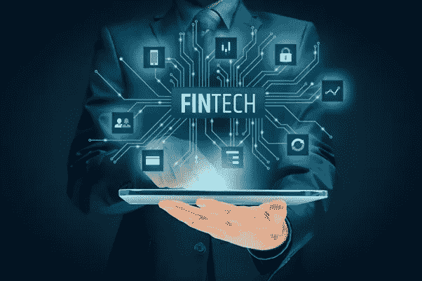
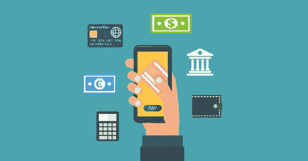
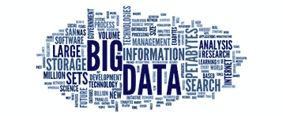

# 金融科技:改变 BFSI 行业

> 原文：<https://medium.datadriveninvestor.com/fintech-transforming-the-bfsi-sector-4fd7d59e38e9?source=collection_archive---------2----------------------->

金融科技，俗称 Fintech，是 BFSI(银行、金融服务和保险)行业术语，由利用最新技术提高金融服务效率的组织使用。

> 金融科技(Fintech)是一个术语，统称为 BFSI 行业的新应用、程序、产品或服务计划，由一项或多项补充金融服务组成，这些服务使用技术应用程序作为端到端流程交付。

金融科技正在迅速积聚力量，对于 BFSI 企业的规模和范围效率而言，它是一个游戏规则的改变者。越来越多的不同金融行业正在转向在线平台——几乎所有电子商务平台都接受移动支付方式，大多数金融活动，如交易、个人理财和货币兑换，都可以在移动应用程序上轻松完成。

# **金融科技的主要驱动力**

**多种技术的出现**:快速的技术进步加上不断增加的创新导致服务成本的降低。

**吸引客户:**越来越多精通技术的客户更倾向于在线或数字服务。他们寻求在没有人工干预的情况下随时随地方便地处理业务的能力。

**政府支持:**政府也明白，金融科技的出现将不可逆转地改变金融业的面貌。此类技术还能让政府更好地处理合规性(如 KYC 和反洗钱)

**资金可用性:**许多风险投资基金、私募股权基金和天使投资正在流入金融科技初创公司，导致创新成本下降，并将成本优势转移给客户。

# **对金融服务有潜在影响的五项技术**

## **1。** **数字钱包**

数字钱包是一个框架，它安全地存储用户的支付信息和许多支付方法和网站的密码。通过使用数字钱包，用户可以利用近场通信(NFC)技术轻松快速地完成购买。

> 数字钱包可以与移动支付系统结合使用，移动支付系统允许客户用智能手机支付购物费用。数字钱包也可以用来存储积分卡信息和数字优惠券。

## 数字钱包使用的技术

*   **NFC:** 近场通信(NFC)是一组通信规则，当我们将两个不同的设备带到 4 厘米的范围内时，它们可以相互连接。这项技术用于数字钱包和借记卡或信用卡。
*   **统一支付接口**:统一支付接口(UPI)由印度国家支付公司开发，用于将资金从一个银行账户即时转移到另一个银行账户。该服务全天候提供，并且跨越公共节假日。

> 与其他移动钱包不同，在转移到其他账户之前，UPI 会将资金存储在自己的账户中，并在需要交易时直接存入收款人的银行账户。

## **2。** **人工智能**

人工智能(AI)是计算机科学的一个分支，旨在使机器智能化。人工智能已经成为信息物理系统的组成部分，越来越多地消除 BFSI 地区的人类干预。人工智能已经缓慢但肯定地成为金融科技不可或缺的一部分。它的一些应用如下

## **-财富管理**

人工智能正被用来预测投资模式和分析，许多财富管理公司开始为他们的客户使用这种方法。传统算法交易用于在股票市场中寻找不同的机会，而使用人工智能的新一代算法作为市场上的独立交易员日夜工作，为客户寻找最佳投资机会。

> 由于人工智能系统中嵌入的深度学习算法，正常人很难匹配其准确性。

人工智能可以读取数十亿个数据点，也可以比人类更好地发现趋势。它可以帮助投资者准确预测未来价格，不受情绪的影响。

## **-改变游戏规则的洞察力和预测分析**

人工智能在金融科技领域的最大用途之一是产生可以准确预测客户行为的见解。人工智能系统已经存在，它可以学习客户过去的行为，并根据客户的信誉做出准确的投资建议。

> 如今，大多数机器学习算法越来越多地与预测分析相结合，以提供如何做出决策的基本原理。

预测分析将作为最佳实践要求被企业广泛采用。

## **-网络安全威胁的早期检测和预防**

安全是一个大问题，尤其是在网上交易的时候。利用生成式对抗网络(GANs)，金融科技公司可以在其解决方案中构建强大的安全系统。

> GAN 与两个相反的网络一起工作，一个发生器和一个鉴别器。生成器网络创建看起来与真实数据集一模一样的假数据。

鉴别器网络分析虚假数据和真实数据。每个网络互相学习，随着时间的推移变得更好。这一系统在发现欺诈行为和可疑交易方面特别有用。这有助于及早发现和预防网络安全威胁。

## **-视觉识别和验证**

使用通过“胶囊神经网络”建立的技术来直观地识别客户和文件，可以在简化账户创建、贷款和保险发放和文件记录等功能方面实现巨大的飞跃。人工智能实现可以直观地验证输入的文件是否真实，以及试图申请贷款的客户是否就是他或她声称的那个人。再加上为各方(律师、评估者、银行家)处理贷款文件的信贷管理软件，人工智能可以提供以前认为不可能的自动化程度。

## - **更“人性化”的聊天机器人**

此外，与客户参与平台相结合，人工智能工具可以为下一代聊天机器人提供动力，这些机器人可以智能地回答客户的询问，有效地减轻客户服务部门的负担。

> 聊天机器人可以与社交网站集成，并直接从社交媒体渠道接受应用程序和订单的请求。

据预测，到 2018 年，将有超过 20 亿人定期使用对话式人工智能在智能手机和联网设备上与虚拟客户助理互动。

## **3。区块链**

最近一段时间，区块链技术在金融科技领域变得越来越受欢迎。金融公司在其活动中采用区块链解决方案来增强安全性。这使得区块链成为在客户和企业之间建立信任的关键工具。

> 越来越明显的是，在未来几年，金融行业对区块链技术的需求将非常大。

## **-用于数字身份的区块链**

每个社区和公司都需要一个集中的身份信息来源。想象一下一个分散的数字身份系统，这是一个真实的来源，其中每个数据元素，如用户属性和凭证，都只通过分布式共识包含在系统中。

这种模式是许多企业关注的焦点，导致用户对其身份拥有更多控制权，因为他们只能与可信方共享身份。没有一个单一的中央实体可以篡改用户身份或数据。

> 对于用户来说，这种模式提高了数据的可访问性、隐私性和对个人数据的控制。对于企业而言，这种模式降低了身份管理成本，简化了监控流程，提高了客户服务和效率。

## **-跨境支付**

区块链技术可以改善金融领域的许多流程，例如跨境支付。价值的转移一直是一个昂贵而缓慢的过程。跨境支付更是如此。例如，如果一个人想把钱从欧洲转到他们在菲律宾的家人那里，他们在当地银行有一个账户，在这笔钱可以被收到之前，要经过许多银行(和货币)。使用西联汇款等服务进行同样的交易更快，但非常昂贵。

当监管实施后，区块链技术也将成为企业跨境支付的一个有趣选择。当交易对手破产或欺诈时，个人客户很难亏损。对于通过跨境支付转移大量资金的企业来说，万一没有交付产品和服务，这是有问题的。

> 有了适当的监管，银行将能够向它们的企业客户提供基于区块链技术的有趣提议。越来越多的技术提供商已经开始了解如何应用区块链技术来解决和保护此类跨境金融交易。

## **-智能合约**

智能合同(这是区块链技术最受期待的应用之一)是一种计算机程序，可以促进、验证或加强协议的协商或执行。智能合同经常模仿常规合同条款的逻辑。因此，许多种类的合同条款可以部分或全部自动执行，自动实施，或两者兼而有之。

区块链技术的优势是显而易见的，因为它导致了比传统合同更安全的智能合同。此外，他们可以减少与合同相关的交易成本，因为区块链技术省去了任何中间人。然而，事实仍然是，产出的质量取决于投入的质量。

> 智能合约绝不是理解用户意图并且总是完美无缺的神奇构造。

如果文本中有疏忽，结果可能比传统合同更具戏剧性，因为智能合同的规则记录在计算机代码中，不能根据“合同的意图”自由解释，而只能根据字面意思解释。

## **4。大数据**

大数据也在金融科技的普及中发挥了重要作用。

受到大数据积极影响的一个主要领域是贷款和信用评分。传统上，信用评分是基于基本的金融交易，这些评分是指金融部门的所有信贷活动。随着大数据的出现，范围已经扩大到考虑意愿、能力和行为等因素。

BFSI 公司正在大力利用大数据，并使用数字渠道来获取客户。数据分析有助于金融服务公司提供情境化和个性化的服务，并增加交叉销售和追加销售的机会。

> 事实上，人工智能和大数据的结合使用有助于金融机构从社交媒体中获得洞察力，从而提高客户参与度。这带来了更好的客户体验，因为他们受益于更好的投资建议。

# 大数据在 BFSI 领域的其他应用

## **-为客户提供更好的价值**

所有 BFSI 公司都在利用大数据提供更好的客户服务。然而，许多客户表达了对公司能够访问他们的数据的担忧。根据一些调查，客户表示，如果能够提供更好的服务，他们愿意让金融机构访问他们的数据，特别是在他们寻求贷款便利的情况下。

## **-更加一致地满足合规标准**

金融危机过后，世界各地的监管机构都采用了更严格的标准。大数据有助于进行更好的内部审计，从而降低公司受到金融监管机构处罚的风险。许多公司认为大数据已经完全改变了审计流程。

## **5。虚拟现实**

在金融科技世界，使用虚拟现实技术意味着在金融产品的虚拟商店中真实体验金融服务或产品，这将帮助客户在舒适的家中使用手持设备做出购买决定。

> 这些虚拟或增强空间将能够模拟真实生活场景，使您能够对金融产品或服务有更好的理解。

这项技术提供的实时用户体验(UX)有可能建立新的市场动态。尽管 VR 和 AR 仍处于早期阶段，但 BFSI 公司已经能够看到更广泛参与和采用的潜力。

金融科技完全是关于 UX 和客户参与，这是金融科技公司与传统金融公司的区别。反应式框架、标准数据格式和身临其境的体验只会加速这一趋势。

## **-利用 VR/AR 的数据可视化**

金融市场和交易严重依赖自动化过程和算法。然而，随着太多数据的出现，人类不可能理解分析的结果。这就是 VR 可以发挥作用的地方，它可以利用数据可视化产品创造机会。

> 使用数据可视化来分析大型数据集群可以帮助决策者理解复杂的概念并直观地识别新的模式。利用数据可视化工具，终端用户可以轻松、快速地访问一幅大图或更深入地了解高度具体的领域。

## **-扰乱银行的客户服务方式**

创新公司正在展示一个支持虚拟现实的财富管理原型，它可以融合可穿戴设备、算法和人际关系，使银行体验真正令人愉快。

## **-新的 VR/AR 支付机会**

VR/AR 技术还将带来新的支付选择，使客户能够虚拟支付。

在一个原型应用程序中，万事达卡展示了一种体验，客户可以在不退出虚拟世界的情况下进行购买。

截至目前，VR/AR 和相关技术都处于初级阶段。但是很快，它们就要爆发了，并对 BFSI 的所有部分产生巨大的影响。

# **结论**

目前，一些技术还处于初级阶段。显而易见，它们正处于拐点，它们的影响迟早会在金融领域显现。目前，数百家创业公司正在为金融部门开发新的应用程序和解决方案，以将金融科技带到另一个层面。

**关于作者:** *帕拉格·迪万博士是一位高科技爱好者，也是一位知名的“教育企业家”，他建立了一些最好的机构。目前，他对工业 4.0 及其如何被新兴技术塑造非常着迷。*