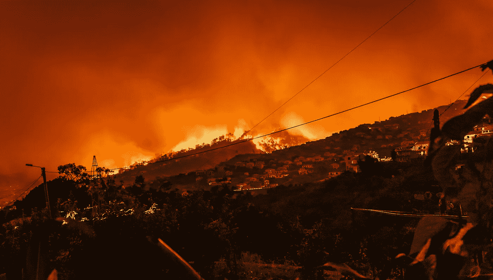

# 消防员+ AI 无人机 vs 野火

> 原文：<https://medium.datadriveninvestor.com/fire-fighters-ai-drones-vs-wildfires-b3e826192d4f?source=collection_archive---------33----------------------->

# 分散式消防无人机

Wildfire nearby… and not from the Burning Man… (photographer: Michael Held)

**什么是#dffd？**

#dffd 是一群由人工智能驾驶的现成飞行无人机，它们携带现成的机械臂，这些机械臂又携带现成的灭火器，或水桶，或连接到水泵的水管等。

**我们为什么需要#dffd？**

野火一年到头到处都在燃烧。2018 年 1 月 1 日至 11 月 15 日，共有 51898 场野火燃烧了 850 万英亩(来源:[https://www . iii . org/fact-statistics/facts-statistics-wild fires](https://www.iii.org/fact-statistic/facts-statistics-wildfires))。相比之下，850 万英亩的土地相当于 650 万个足球场，或曼哈顿的 600 倍，或整个加利福尼亚州的 8%，或夏威夷所有着火的岛屿。

在加州，200 万个家庭(15%的家庭)处于野火的高风险或极端风险中。在德克萨斯州，70 多万个家庭(7%的家庭)处于野火的高风险或极端风险中。在蒙大拿州，28%的家庭处于野火的高风险或极端风险中(来源:[https://www.iii.org/table-archive/74507](https://www.iii.org/table-archive/74507))。

这是压倒性的。从十分之一到四分之一的人会因为野火而失去家园，这只是时间问题。如果野火在最初几个小时内没有得到控制，可能需要几天才能控制住。如果野火在附近开始，你可能在几个小时内失去你的家。它在几分钟内从一个房子传播到下一个房子，在几个小时内从一个社区传播到下一个社区。

即使你的家幸免于野火，你的肺和健康也不能幸免。你将会呼吸到被烟雾污染的空气，就像抽了 10 支烟一样(来源:[https://www . pop sci . com/fires-California-air-quality-children](https://www.popsci.com/fires-california-air-quality-cigarettes))。

你不能留下来和野火战斗，因为你不能在烟雾中呼吸。你唯一的办法就是雇佣私人消防员，或者疏散并等待消防员。或者，我们可以开始创建和测试分散的消防无人机群，以帮助消防队员扑灭野火。

**为什么去中心化？**

面对野火燃烧和蔓延的范围和速度，消防队员资金不足，人手不足，装备不足。野火不仅每年都会发生，而且全年都会发生。

此时，联邦政府和州政府所能做的是有限的。我们应该站出来帮助消防队员，互相帮助，帮助我们自己。

无人机的航程有限，但如果人们像拥有汽车一样以分散的方式拥有无人机，附近的无人机可以及时集体到达野火，帮助控制火势。无人机可以批量生产和配送。更重要的是，无人机是可替换的。人类的生命不是。

**谁受益？**

你。我。环境。消防员。宠物。野生动物。房产。物品。记忆。储蓄。农产品。保险公司。再保险人。财政部。纳税人。这对任何地方的任何人都是双赢的。

**这些无人机在交火中会做什么？**

*   “送货的优步”,通过租赁无人机按需在任何地方为任何情况、紧急情况或零售提供任何东西。
*   帮助配送卡车进行最后一英里或最后一个街区的配送。
*   帮助搜索一个区域寻找失踪的人
*   应消防队员的要求，帮助扑灭附近多层建筑的火灾

**我们需要什么来让野火发生？**

*   现成的无人机、现成的机械臂、旧智能手机、灭火器、水泵、消防水管、太阳能电池板、发电机等。
*   机器人工程师、人工智能开发人员、DIY 爱好者、现场测试人员的时间
*   预购和捐赠用于资助年度消防无人机竞赛和年度获奖无人机的大规模生产

**如何加入扑灭野火的战斗并开始提供帮助？**

因为帮助扑灭森林大火、拯救生命和家园而下台？

在 Twitter 上用# dffd # DronesvsWildfires @ max _ woon 联系我，或者在下面发表评论。