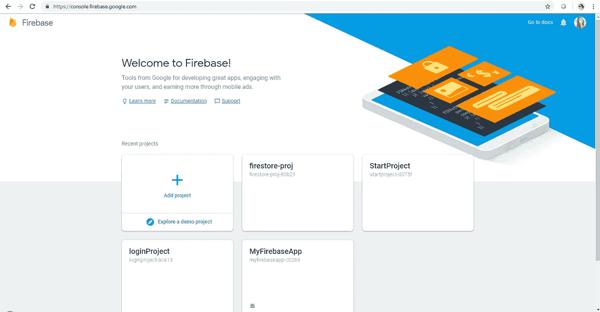
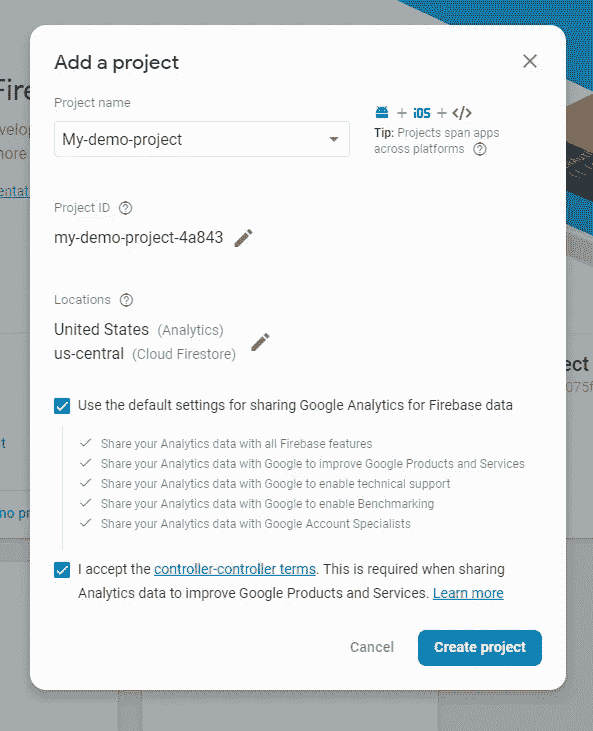
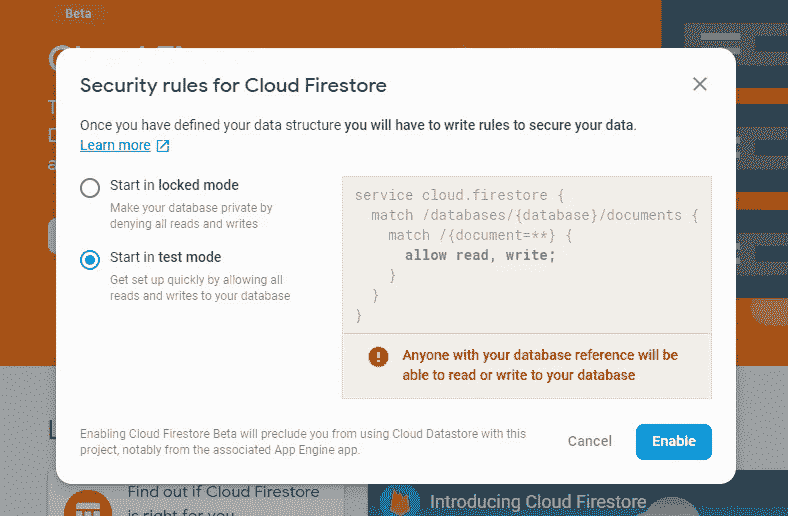
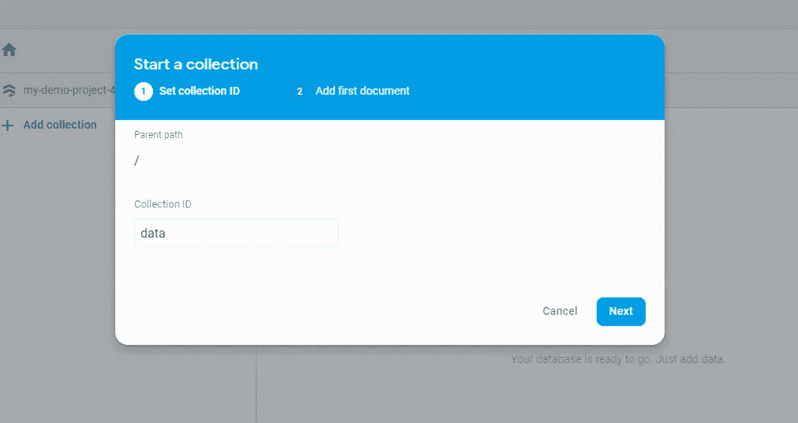
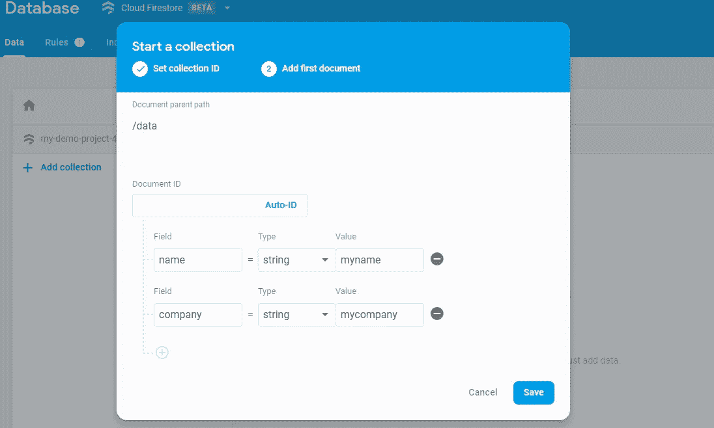
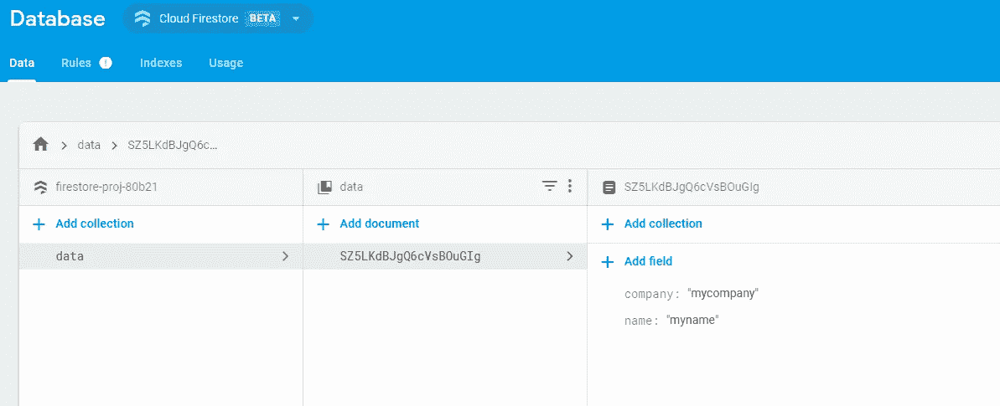
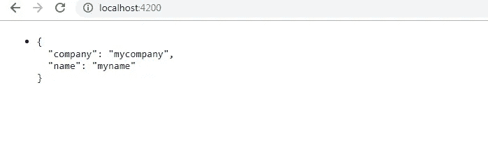

# 有棱角的 FireStore。但是 Firebase？

> 原文：<https://medium.datadriveninvestor.com/firestore-with-angular-but-firebase-c4050f1f6173?source=collection_archive---------5----------------------->

[](http://www.track.datadriveninvestor.com/1B9E)

许多人对 FireStore 和 Firebase 之间的区别感到困惑。在这篇文章中，我将重点放在 Firestore 推出的原因以及如何与 Angular 配合使用。

Firestore 可以称为 **Firebase 实时数据库**的进化。这是因为它提供了一个数据模型，通过添加 Firebase 不太擅长的查询创建工具来捕获所有有趣的特性。Firestore 的另一个好处是，它为移动和网络开发提供离线支持，因此我们可以在连接不良的情况下开发应用程序。

这两者的区别可以在这里的[](https://firebase.google.com/docs/firestore/rtdb-vs-firestore)****中详细找到。
现在让我们开始设置 Firestore，以便与 Angular 一起使用。****

****在 **firebase** 控制台上，使用您的 Google 帐户登录，并通过点击**添加项目创建一个新的应用程序。**看起来是这样的:****

********

****点击添加项目后，给你的项目起一个名字。它看起来如下:****

********

****现在让我们进入 Firebase 控制台->开发->数据库。点击**创建数据库**，我们将进入下面的屏幕。****

********

****将此设置为测试模式，因为它有助于禁用数据库访问控制，我们正在做一个演示应用程序。这将在以后的生产过程中恢复。****

****这就建立了 Firestore。是时候在我们的角度应用程序中设置它了。****

******内角******

****假设我们已经创建了一个名为 **firestore-proj** 的 Angular 应用。要创建一个新的，使用 **ng new *project-name。*** 这里我假设你已经安装了最新的 Angular 版本，如果没有，安装使用:****

```
**npm i -g @angular/cli@latest**
```

****现在，让我们为 firebase 安装 Angular 的官方库，****

> ****npm 安装@angular/fire firebase —保存****

****现在，为了最终在我们的项目中设置云 firestore 的配置，请转到 firebase 控制台，单击“将 Firebase 添加到您的 web 应用程序”，复制配置。****

****粘贴到***src/environments/environments . ts*中。**对***environments . prod . ts .***做同样的操作，应该是这样的:****

****现在，导入模块并更新 component.ts，看起来应该是这样的:****

******app.module.ts******

******应用组件******

****现在，我们在组件中提到的数据可以从数据库中找到，并在浏览器上更新。****

****为此，请转到 **Firebase 控制台- >数据库- >数据** 并点击添加集合。****

********

****下一步是将一些数据放入您的集合中，****

********

****单击“保存”后，我们刚刚输入的数据将进入浏览器，并显示在浏览器上。****

********

****现在让我们使用 ***ng serve*** 编译我们的应用程序，看看结果。****

********

****一个基本项目，了解如何在 Angular 中使用 Firestore。****

****编码快乐，各位！****