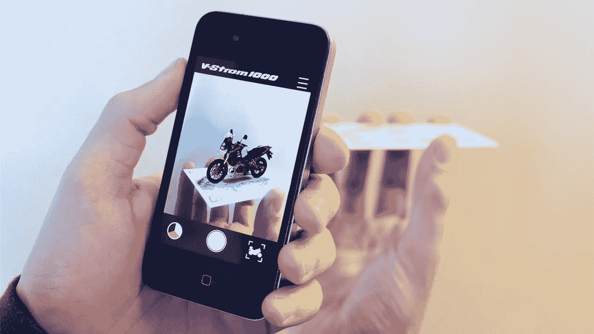

# 从 OpenCV 到 Vuforia 的第一种增强现实方法。

> 原文：<https://medium.datadriveninvestor.com/first-approach-to-augmented-reality-from-opencv-to-vuforia-e9327a2fbbb0?source=collection_archive---------4----------------------->

我从大学开始就听说过增强现实，科幻电影也谈到过它，一些电子游戏也包括这项技术。我记得 Pokémon Go，一款面向移动设备的增强现实游戏在 2016 年变得非常流行，这款游戏是由 Niantic 为 iOS 和 Android 设备开发并发布的。最酷的是，你可以与谷歌地图互动，在街上行走，寻找可以捕捉的生物。

现在，公司正在考虑增强现实来宣传他们的服务和产品。美容和零售品牌在创造有价值的 AR 方面处于领先地位。大型科技公司是 AR/VR 技术的领导者，他们通过让低预算的公司可以使用它们来帮助 AR 民主化。

这些公司如何进入 VR/AR 世界非常有趣。脸书拥有 Oculus Rift，这是一款虚拟现实护目镜，可以与你的游戏台式机或笔记本电脑配合使用。Oculus Rift 由公司内部的一个部门 Oculus VR 开发制造。亚马逊正在研究与 Alexa 环境兼容的智能眼镜。苹果刚刚为 iOS 开发者发布了 ARKit 工具，因此他们可以创建增强现实应用，这些应用将覆盖任何拥有 iPhone 6S 或更高版本的苹果客户。谷歌拥有 Cardboard，这是一个用于智能手机头戴式装置的虚拟现实平台。该平台旨在成为一个低成本系统，以鼓励对 VR 应用的兴趣和开发。

看看这个视频，英国增强现实技术公司 Blippar 创造了一种新的服务，帮助消费者购买新车，使用智能手机识别汽车，你只需用手机扫描汽车，获得 360 度的内部视图或解锁汽车的更多细节。

当你开始学习计算机科学中的新主题时，如数据科学、机器学习和计算机视觉，总会有新术语和新技术需要学习。

过去两个星期，我一直在用 Python 3 学习计算机视觉，我了解了许多用于图像处理的 Python 库，如 Numpy、SciPy、PIL、Pillow、Scikit-Learn 等等，OpenCV 是其中我最喜欢的一个。我不打算解释每一个，考虑到有许多资源可以了解这些库。

用 Python 编码真的很有意思，用 Jupyter Notebook 看看结果。我从来不认为可能的事情，像人脸识别，人脸检测，实时计数物体，基于颜色跟踪物体，识别手势，使用手势操纵鼠标和键盘，甚至创建增强现实，哦，等等…真的吗？我希望我几年前学计算机科学的时候就已经学会了这些！

在寻找库来创建用于增强现实的代码之后。我明白了 python 代码和 OpenCV 是如何做到这一点的。但是，看了很多教程视频和 StackOverflow 之后，我发现了 Vuforia！

Vuforia 是什么？

这是一个用于移动设备的增强现实软件开发工具包，支持创建增强现实应用程序。它使用计算机视觉技术实时识别和跟踪平面图像(图像目标)和简单的 3D 对象，如盒子。您需要获得 Unity 3D 和 Vuforia 增强现实支持包才能开始。我花了这个周末安装和实验它。

我不会解释我是怎么做的。你可以去官方网站获取安装说明，开始一个新的项目。看看这里:[https://www.vuforia.com](https://www.vuforia.com/)

经过几个小时的乐趣，并弄清楚如何在我的笔记本电脑上创建增强现实，这是结果。我的侄女看到龙非常高兴！

是不是很棒？！去创造一些增强现实吧！