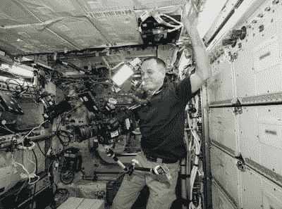

# 有史以来最好的 NASA 视频！

> 原文：<https://medium.datadriveninvestor.com/first-ever-8k-ultra-hd-video-from-space-b6d86dcc73d2?source=collection_archive---------10----------------------->

Youtube Video from NASA

使用 RED 公司的氦 8k 高清(UHD)摄像机，美国宇航局刚刚发布了第一个来自太空的 8K 视频。想象一下，如果这是登月可用的。在火星上的第一步应该是不可思议的，就像身临其境一样。这就像把 80 亿人带到火星表面一样。

[红色](https://www.red.com)是一家数字影院公司。这些 8K 视频具体是 8192 x 4320 像素。这台红色相机也是用来录制《霍比特人》三部曲、《银河护卫队》第二卷和《迷失太空》等电视节目的品牌。美国宇航局位于休斯顿的约翰逊航天中心的国际空间站项目通信经理迪伦·马西斯说:“这一新镜头比以往任何时候都更加生动详细地展示了人类太空飞行的故事。“相机技术的世界在不断进步，以高保真度观看我们的星球总是受欢迎的。我们很高兴看到未来会出现什么样的图像。”

原视频可从[这里](https://images.nasa.gov/details-First-8K-Video-from-Space.html)。但请注意，视频超过 3g。祝你好运找到一个 8K 的显示器来观看它。但是想象一下未来的虚拟现实，其分辨率如此之高，以至于你无法区分虚拟和真实。[#基础现实](http://twubs.com/BaseReality)。

这些牛逼的 8k 显示器来了。三星展示了一款使用人工智能将 4K 升级到 8K 的电视。不是真的 8K，但也差不多了。[索尼](https://www.digitaltrends.com/home-theater/sony-85-inch-8k-hdr-tv-10000-nit-a8f-oled-hands-on/)有真 8K 分辨率的电视样机。

现在好消息来了。夏普在欧洲销售 70 英寸 8K 电视。费用在 14000 美元左右。夏普显然与 RED 勾结设计并制造了他们的电视。

更小屏幕的电视确实已经有 8k 了，但是有什么意义呢？对于 32 英寸的显示器，您无法体验真实生活 8k 的魔力。

下面是美国宇航局宇航员里基·阿诺德在国际空间站上拍摄的照片。

美国宇航局刚刚发布了从太空拍摄的 8K 地球视频。这太棒了！

*原载于 2018 年 11 月 3 日*[*www.bestcameraapps.com*](https://www.bestcameraapps.com/2018/11/first-ever-8k-ultra-hd-video-from-space.html)*。*