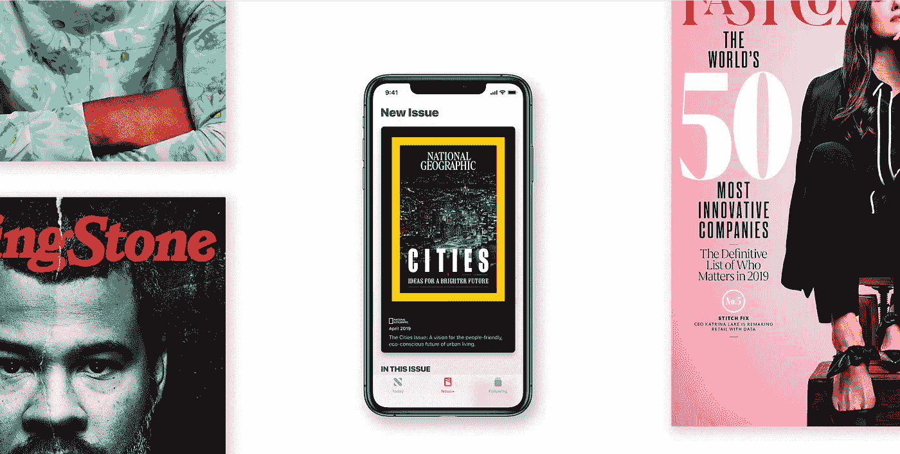
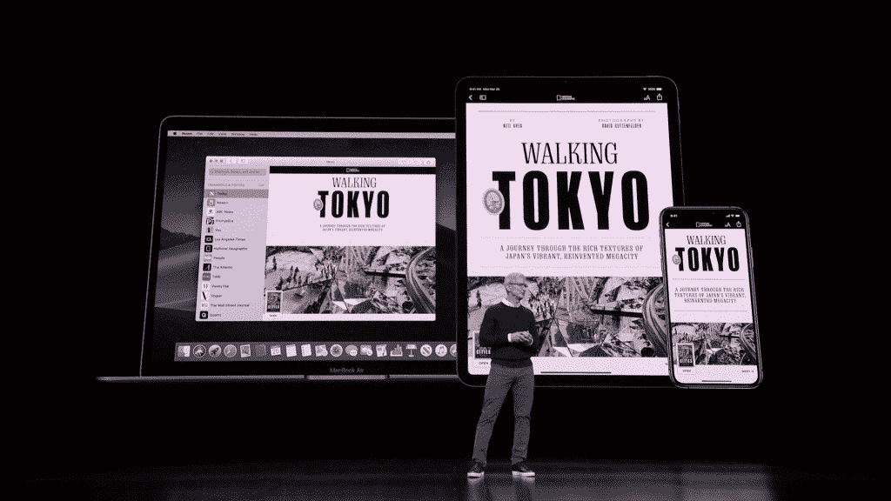
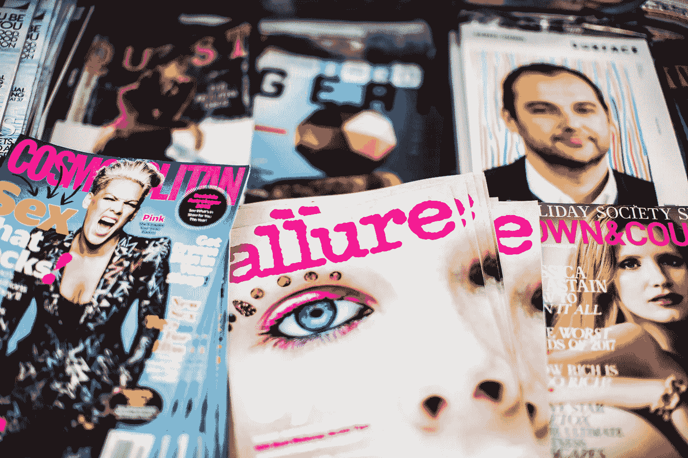
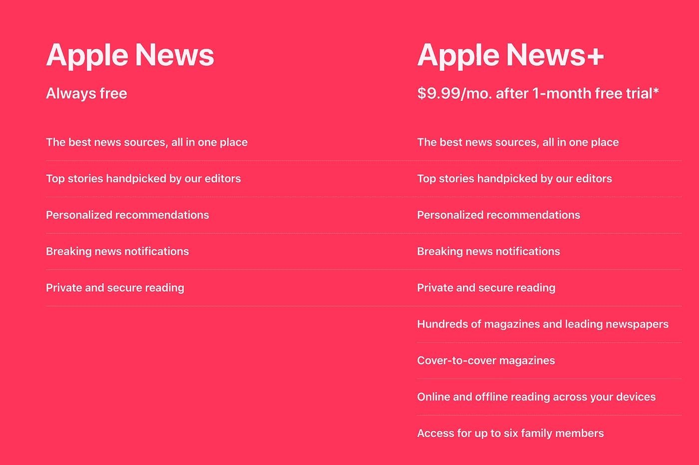
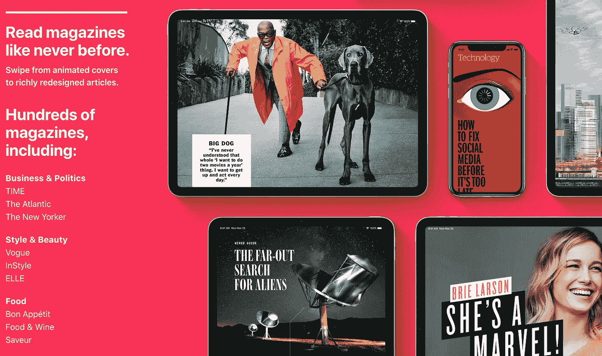

# 新闻的网飞:苹果新闻+

> 原文：<https://medium.datadriveninvestor.com/first-impressions-of-apple-news-5103a08b69ae?source=collection_archive---------12----------------------->

Screenshot from [Apple](https://apple.com/apple-news-plus)

昨天对我们的科技霸主来说是个大日子。不，我不是在说谷歌。

3 月 25 日周一上午，在史蒂夫·乔布斯剧院举行的“展示时间”活动中，苹果公司首席执行官蒂姆·库克显然非常兴奋，他宣布了四项独立的服务，其中大部分在过去几个月中都有传言。其中:一张[信用卡](https://www.apple.com/apple-card)，一项[游戏订阅服务](https://www.apple.com/apple-arcade/)，一项付费新闻服务，以及一项[流媒体视频服务](https://www.apple.com/apple-tv-plus/)。

当心，网飞和美国运通。苹果打算得到我们所有的钱。

玩笑归玩笑，我想把重点放在新闻订阅服务上——很大程度上是因为这是四种服务中唯一一种可以立即提供给公众的服务——并给出我对可以被称为杂志和报纸订阅的网飞的初步想法。

# 什么是苹果新闻+？

Photo courtesy of Apple

就像传闻已久的 Apple TV+一样，我们知道优质新闻服务即将到来。事实上，至少从 2018 年初开始，关于苹果正在为你最喜爱的印刷出版物创建一站式数字商店的传言就已经流传开来。

现在终于来了，News+到底是怎么回事？

据蒂姆·库克称，News+背后的部分灵感来自于在报摊上购买各种彩色杂志封面的经历。但是你通常会手里拿着一本或者两本杂志离开。

Photo by [Charisse Kenion](https://unsplash.com/photos/gpdDhqHebho?utm_source=unsplash&utm_medium=referral&utm_content=creditCopyText)

“新闻网飞”不仅仅是夸张。这是对优质新闻订阅服务的恰当描述，该服务提供 300 多种不同的标题，涵盖从娱乐到商业到健康等所有内容，所有这些都可以按需提供，以获得阅读乐趣。

 [## 苹果会成为新的网飞吗？-数据驱动型投资者

### 有可能。然而，该公司肯定会与大公司竞争。许多人不得不看到这一天的到来…

www.datadriveninvestor.com](https://www.datadriveninvestor.com/2019/02/15/will-apple-be-the-new-netflix/) 

不仅仅是这些出版物的新发行。你经常会发现有相当多的积压问题。在阅读服务时，我发现 *Bon Appétit* 的问题可以追溯到 2018 年 3 月，而*好莱坞报道*的问题可以追溯到 2018 年 4 月 25 日。

(顺便说一句，我想知道苹果是否没有打算更快发布 News+。否则，这些出版物几乎正好有 12 个月的过期刊物，这是一个相当大的巧合。)

Promotional video by [Apple](https://youtu.be/Im5c5WR9vMQ)

理论上(和实践中)，这是一个非常简单的想法，根据奥普拉的说法，新闻应用已经是“十亿部 iPhones”的免费新闻来源，并添加一个付费订阅，提供我们最喜欢的优质出版物。换句话说，你可以停止为年度杂志和报纸订阅付费，因为你喜欢的标题很有可能出现在 News+上。

*娱乐周刊*？检查。 *HGTV 杂志*？那也在这里。*建筑文摘*？毫无疑问。甚至是晦涩难懂的标题——CBS 深度肥皂剧，有人知道吗？—都在新闻+图书馆。它肯定会吸引那些仍然阅读杂志和报纸的人。(我一会儿会回到这个话题。)

它是这样运作的:每月 9.99 美元(大约相当于你从当地报摊上购买两本杂志的费用)，你和你的六名家庭成员就可以获得一些最受欢迎的出版物，除了我已经提到的那些，还包括《纽约客》杂志、国家地理杂志、时代杂志、时代杂志。 *男性健康*，*福布斯*，*风云榜*，*名利场*， *Inc.* ，*华尔街日报*。 这些甚至是给年轻人的头衔，像*高光*、*蟋蟀*和*瓢虫*。

在我继续之前，我想花点时间赞扬一下苹果的订阅模式。对于我们已经在使用的许多月度订阅服务，如果你想向你的账户添加其他用户，你需要一个更昂贵的计划，就像 Spotify 一样。如果你是单身人士，Spotify Premium 每月收费 9.99 美元，但要添加你的家人，你必须每月支付 14.99 美元的家庭计划(尽管公平地说，Spotify 即使是两个人，也比支付多个 9.99 美元的订阅费用要便宜)。

新闻+就不是这样了。无论你是单身汉(或单身女子)，还是有喜欢杂志的配偶和孩子，无论如何，News+的月费都是 9.99 美元。我已经抱怨过苹果公司一直附加在硬件上的不断上涨的价格，所以我觉得应该表扬就应该表扬。

> 随着所有数据滥用的发生，苹果通过 News+保持了对隐私的重视。

有趣的是，在昨天的演讲中，一个普遍的主题是苹果对隐私的强调，即使是新闻+服务。但是考虑到我们经常看到的所有数据泄露和数据滥用的头条新闻——像[这个](https://www.fastcompany.com/90323869/court-documents-reveal-that-facebook-allegedly-knew-about-data-misuse-earlier-than-we-thought)和[这个](https://www.techradar.com/news/pre-installed-android-apps-pose-huge-security-and-privacy-risks-study-says)和[这个](https://www.wsj.com/articles/google-exposed-user-data-feared-repercussions-of-disclosing-to-public-1539017194)——这可能不应该是一个惊喜。

News+的卖点之一就是个性化推荐。值得一提的是，新闻+推荐和内容监管发生在你的设备上。如果你不关心隐私和安全，这听起来可能没什么大不了的，但对于那些关心这些事情的人来说，这基本上意味着苹果无法收集你的阅读习惯，这意味着没有数据存储在苹果的服务器上或出售给第三方。苹果永远不会知道你在读什么，因为新闻+个性化完全是本地化的。

即使你持怀疑态度，News+至少值得一试，尤其是苹果给了你一个月的免费试用**。因此，举例来说，如果你是*流行木工*的狂热读者，并想确保你的钱花得值，使用免费试用看看苹果新闻+是否适合你。**

# **苹果新闻+是不是太晚了？**

****

**Screenshot from [Apple](https://apple.com/appple-news-plus)**

**你不得不称赞苹果提出了一个非常有趣的想法，一个可能会改变传统媒体游戏规则的想法。随着所有迪士尼 Pluses 和 CBS All Accesses 在左右弹出，几乎令人惊讶的是，新闻订阅服务在此之前根本不存在。虽然苹果最近被批评在竞争中姗姗来迟，因为竞争对手早就在他们的产品中实现了某些功能，但 News+的情况很像 2008 年的第一代 iPhone，苹果实际上正在开辟一条新的道路。**

**另一方面，需要每月订阅的优质新闻服务可能很难销售。如今，大多数人免费获取新闻。甚至在报摊上出售的杂志也经常维护网站，在那里你可以阅读他们的许多故事，而不必购买实体副本； [*好莱坞报道*](https://www.hollywoodreporter.com/) 就是一个最好的例子。**

****

**Photo by [Austin Distel](https://unsplash.com/photos/uPK2TbJlvMQ?utm_source=unsplash&utm_medium=referral&utm_content=creditCopyText)**

**千禧一代**——今年将成为最大的在世一代***—**—[拒绝传统媒体](https://mic.com/articles/30685/are-newspapers-and-books-really-going-extinct#.MQhA7WWWY)而青睐数字媒体，这一事实已经引起了广泛关注。有些人甚至认为杂志和报纸正处于过时和消亡的边缘。*********

*******正如《华盛顿邮报》最近的一篇文章所指出的，在 1994 年的高峰期，工作日的报纸发行量为 6000 万份。从那以后，发行量已经缩减到 3500 万份，减少了将近一半。此外，这个数字实际上包括了印刷和数字，这意味着这 3500 万中只有一部分是实际的，物理的，印刷材料。*******

> *******随着传统媒体慢慢消亡，News+几乎看起来像是最后的努力，这种努力太少，也太迟了。*******

*******与此同时，正如我之前所说，大多数人已经习惯了在网上免费获取新闻和娱乐。所以在这种背景下，News+开始看起来像是一个太少、太迟的想法。因为如果人们可以免费获取新闻，那还有什么动力为新闻+付费呢？*******

*******随着我开始实际使用 News+，这个问题的答案变得更加明显，一个新的问题浮现在脑海中。*******

*******新闻+能拯救传统媒体吗？*******

# *******新闻+ *体验********

**************

*******Screenshot from Apple*******

*******虽然我们经常把苹果和硬件联系在一起——iMacs、iPhones、iPods、MacBooks、AirPods 等等。—该公司也擅长软件。*******

*******为了证明这一点，只需看看当前的 iOS 版本就行了:它在开始时真的没什么好看的，但在接下来的几年里，iOS 变得更加精致、直观，而且——我敢说吗？—甚至优雅。从整体用户界面到具体的元素，比如你在滚动时看到的橡皮筋效果，都展示了精心的设计和艰苦的优化。*******

> *******新闻+直观互动。动画的存在只是为了帮助你浏览杂志、文章或媒体。*******

*******News+对细节的关注显而易见。正如在活动中所展示的(你可以在这里观看**——**News+是展示的第一部分)，让 News+成为最引人注目的服务的是它如何重振阅读体验。*******

*****使用 News+是令人难以置信的直观和互动。没有过度的动画使应用程序运行缓慢，使用起来令人沮丧；相反，过渡动画的存在只是为了帮助你浏览杂志、文章或媒体。*****

*****现在我已经使用 News+一整天了，我可以证明它是如何以一种印刷媒体永远不可能做到的方式将杂志带入生活的。它更具沉浸感和吸引力，我发现自己在寻找更多的东西来阅读，这样我就可以延长每次阅读的时间。*****

*****通过 News+，蒂姆·库克(Tim Cook)等人将一项平凡的任务和大多数人所说的垂死的媒介结合在一起，将它们变成了完全的、毫不掩饰的“苹果”。现在看杂志又变得有趣了，它让我想花更多的时间阅读。*****

> *****如果数字是自然选择，新闻+可能是让印刷媒体存活到下一代的突变。*****

*****这让我回到了我之前提到的问题，但是 News+看起来只是一项来得太晚的服务，直到你真正使用它。如果它是以不同的方式或由不同的公司制作的，我可能会认为它是一项注定失败的服务，旨在从一个衰落的媒介中赚点快钱，但几乎从我开始使用它的那一刻起，这种印象就消失了。现实中，News+感觉更像是未来，而不是过去。*****

*****如果我们将数字时代的到来视为一种现代自然选择，它将印刷媒体置于灭绝的边缘，这几乎就像新闻+是确保物种繁殖的突变。换句话说，苹果的优质新闻订阅服务给了印刷媒体一种生存的方式，并将丰富的故事传递给下一代。*****

# *****新闻+的潜在问题*****

*****如你所见，我对目前为止的新闻+体验非常满意。但是公平地说，我确实有几个问题，我会在这里快速地列出来。*****

**********

*****Photo courtesy of Apple*****

## *****扰乱出版业*****

*****我对 News+的主要疑问是，出版物能否从订阅费用中获得足够的收入，以继续在平台上以低廉的价格提供内容。事实上，有报道称苹果[与潜在合作伙伴存在问题](https://www.idownloadblog.com/2019/02/13/apple-news-subscriptions-revenue-sharing-issues/),因为据推测，每份出版物从新闻+订阅份额中获得的收入要比以每份五六美元的价格出售一本杂志少得多。*****

*****就我所见，我的理解是苹果向出版商付费，类似于 Medium 在用户“鼓掌”的文章作者之间分配用户订阅。更具体地说，苹果将从每月费用中扣除一半，然后剩下的一半在用户阅读的出版商之间分配，收入与用户阅读每个出版商内容的时间成正比。*****

*****尽管出版物从苹果公司每位读者身上获得的收入会比读者直接订阅时少，但他们仍然会有那些直接订阅者，这些订阅者肯定会占他们收入的大部分。*****

*****但是如果 News+成为杂志和报纸事实上的来源呢？当然，出版商会看到他们的直接订阅者跳到 News+上，因为他们可以花更多的钱。因此，他们不仅会从 News+那里得到一笔非常糟糕的交易，而且苹果的优质新闻订阅服务也可能让出版物失去直接订户。*****

*****我担心的是，付费新闻订阅服务的自助餐模式是不可持续的，就像电影通行证是如何[好得难以置信](https://www.inc.com/levi-king/moviepass-is-back-or-at-least-trying-heres-why-every-entrepreneur-should-pay-attention.html)。*****

## *****有限的吸引力和可用性*****

*****我的另一个潜在担忧是，News+基本上是针对 iPhones 和 iPads 的。目前，它还不能在 Android 设备上使用，虽然有一个版本可以在 macOS 上使用，但它远不如其 iOS 版本令人印象深刻。因此，你不仅有一种利基服务，而且这可能是一种新闻+的目标受众太窄的情况，只针对拥有 iPhone 的杂志读者，基本上没有其他人。*****

# *****你打算试试苹果新闻+？*****

*****但是要得到这些问题的确切答案还需要一些时间。与此同时，我将继续享受我的免费新闻+试用。*****

*****谁知道呢？我可能会留着它。*****

*****如果你(1)拥有一部 iPhone，(2)不会对订阅服务产生反感，(3)传统上喜欢阅读杂志和报纸，也许 Apple News+适合你。访问[苹果网站](https://www.apple.com/apple-news/)或在你的 iPhone 上打开新闻应用，今天就开始你自己的免费试用。*****

******原载于 2019 年 3 月 26 日* [*戴恩·奥利瑞传媒*](https://daneoleary.media/reviews/apple-news-plus/) *。******