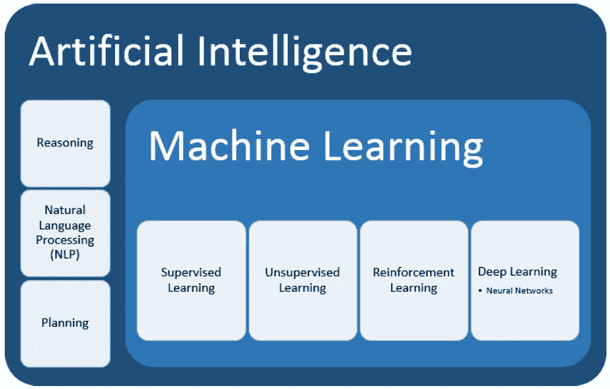
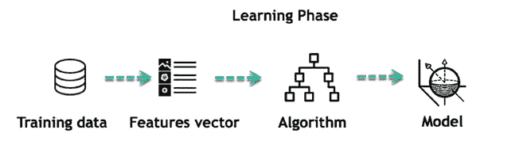
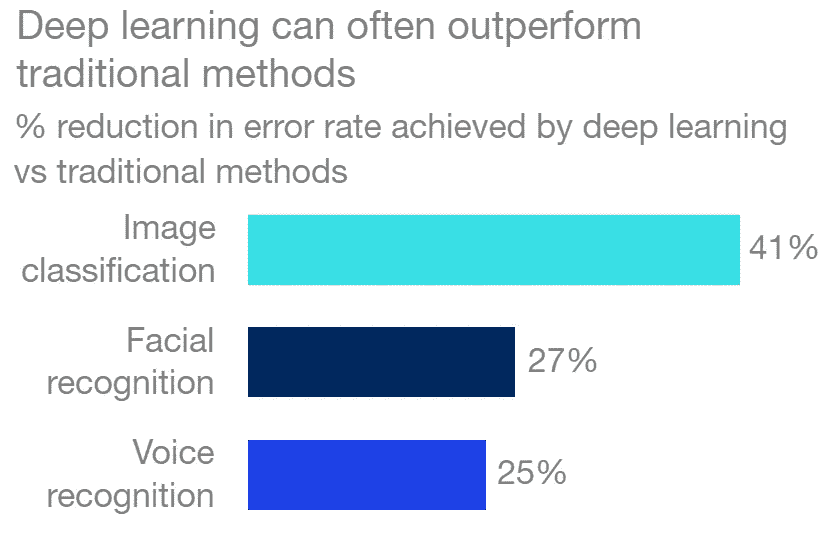

# 机器学习的第一步

> 原文：<https://medium.datadriveninvestor.com/first-steps-on-machine-learning-9347edc7fc1e?source=collection_archive---------6----------------------->

Source: [lexalytics.com](https://www.lexalytics.com/lexablog/machine-learning-vs-natural-language-processing-part-1)

人工智能(AI)是近年来变得流行的一个技术领域。根据 2018 年进行的[麦肯锡全球调查](https://www.mckinsey.com/featured-insights/artificial-intelligence/ai-adoption-advances-but-foundational-barriers-remain)，它已经在全球商业中迅速采用——最常用于电信、高科技和金融领域——其中一些人工智能功能已经在生产中实施，而另一些则是试点测试的一部分。人工智能是工业 4.0 的一个子集，是第四次工业革命的[关键驱动力，正在改变人们的生活质量——改变产品的制造和消费方式。](https://www.weforum.org/platforms/shaping-the-future-of-technology-governance-artificial-intelligence-and-machine-learning)

> 但是，人工智能是什么意思？

人工智能是约翰·麦卡锡在 1956 年创造的一个术语。它通常被定义为机器执行人类认知功能的能力，如学习、感知、解决问题、推理、互动和行使创造力。

 [## DDI 编辑推荐:5 本让你从新手变成专家的机器学习书籍|数据驱动…

### 机器学习行业的蓬勃发展重新引起了人们对人工智能的兴趣

www.datadriveninvestor.com](https://www.datadriveninvestor.com/2019/03/03/editors-pick-5-machine-learning-books/) 

目前，人工智能被用于解决与自动驾驶汽车、计算机视觉(即面部识别)、语言、虚拟代理等相关的问题。每台人工智能机器都有能力在特定任务中比人类更快地处理数据和得出结论。这就是所谓的**狭义 AI** (ANI)，常见的例子有 Siri、Alexa 等虚拟助手。它们的局限性在于，这些机器需要大量高质量的数据，并且它们的效率容易受到任务变化的影响。

Tesla is a popular company known for its autonomous cars manufactured with AI technologies. Source: [tesla.com](https://www.tesla.com/autopilot)

未来，人们希望机器能够在不同的环境中应用知识和技能。他们会像人类一样拥有自主学习和解决问题的能力。这就是所谓的**艾(AGI)** 将军。人脑将被具有高计算能力的机器模拟。每台机器都将通过反复试验来学习。

R2-D2 is an example of an AGI machine. Source: [starwars.com](https://www.starwars.com/databank/r2-d2)

人工智能分为四个主要子集:推理、自然语言处理(NPL)、规划和机器学习。

*   **推理**是机器基于数据进行推理，以便在数据不完整时填补空白的心理过程。换句话说，它包括从现有数据中得出结论和预测。
*   **自然语言处理**是专注于机器理解书面文本和人类语音的能力的子集。这是系统解释文本和口语的主要方式。
*   **规划**与机器自主行动构建一系列行动以达到最终目标的能力相关。这样，机器就适应了给定任务的环境。

Subsets of Artificial Intelligence (Hurwitz & Kirsch)

下一个子集是这个博客的主题，面向所有感兴趣的人——从业余爱好者到专家。它的概念，它的应用，和它的技术将以一般的方式被回顾。

# 机器学习

机器学习(ML)是人工智能的一个子集，旨在理解数据结构并建立人类使用的模型。ML 算法通过处理数据来检测模式并做出预测和建议。它们不同于传统计算，在传统计算中，算法是一系列显式编程的指令，执行这些指令是为了解决问题。相反，可以通过用 ML 算法构建的分析模型来创建自动化决策过程。

> 你的数据只有在你用它做什么以及你如何管理它的时候才是好的。

如今，大多数人都与现代应用程序进行交互，这些应用程序通过人工智能算法实现了令人难以置信的功能:最常用的音乐流媒体平台 Spotify 根据用户的再现为每个用户创建和推荐个性化的每日播放列表，最常用的社交网络脸书帮助用户通过面部识别技术标记朋友和分享照片，最受欢迎的电子商务网站 Shopify 根据用户的观点和阅读来展示和推荐产品。

有一些机器学习技术对解决每个问题都很有用。这些技术或方法基于数据的类型和数量，称为监督学习、非监督学习、强化学习和深度学习。

## 监督学习

这是一种技术，通常始于一组已建立的数据和对该数据如何分类的某种理解。机器配有标有所需输出的数据。这种技术的目的是在数据中找到可以应用于分析过程的模式。这种技术使用模式来预测附加未标记数据上的标记值。

监督学习的一个例子可能是机器预测公寓的租金价格。给定的数据必须有标签，可以是以下项目:

*   大小
*   邻里安全
*   邻居访问
*   楼层或水平
*   室内听到噪音

Supervised Learning technique could be used to calculates the rental price of an apartment. Source: [knoxridge.com](https://www.knoxridge.com/searching-for-an-apartment-in-knoxville/)

开发监督学习模型的第一步是创建训练集，该训练集由包含许多租金价格样本的数据集合组成，租金价格由建立的项目确定。根据训练集，机器可以找到租赁价格和物品之间的关系。例如，公寓越大，价格就越贵，但如果交通不便，价格就会受到影响。一旦机器经过训练，它就可以根据物品成功预测租赁价格，这意味着数据模型已经成型。

Learning phases of a machine that works with ML. Source: [guru99.com](https://www.guru99.com/supervised-machine-learning.html)

监督学习使用三种类型的算法:**二进制分类**，将数据分为两类——即是或否——**多类分类**、，在两个以上的答案选项中进行选择、和**回归**、，预测连续值。

有许多监督学习算法，如线性和逻辑回归、决策树、朴素贝叶斯、随机森林等。

监督学习技术可以应用于多种情况。银行可以使用二元分类算法来确定营销活动中的目标人群根据年龄、工作、资金余额等信息订阅定期存款的可能性(Altexsoft，2017)。可以在天气预报中实现回归，根据历史天气模式预测天气。

## 无监督学习

这是一种用于大量未标记数据的技术。属于这种技术的算法能够理解输入数据的含义，以便将它们分类成模式、组、特征或聚类，而无需人工干预。

当标记、组织和确定数据的上下文很复杂时，无监督学习可以用作监督学习之前的第一步。这是一种很有价值且最常用的技术，因为未标记数据比标记数据更常见。

Unsupervised learning technique is used to detect email spam. Source: [ventraip.com.au](https://ventraip.com.au/blog/security/spam-emails-what-to-look-for/)

有一些无监督的学习算法，如 **k-means 聚类**——将数据分类到具有相似特征的组中—、**高斯混合模型—**—在组的大小和形状方面比 k-means 聚类提供更多的灵活性—、**推荐系统—** 定义相关数据以做出推荐，等等。

无监督学习算法用于数据未被完全理解的多种情况。它在医疗保健中实施，以帮助医疗从业者提供关于症状模式的信息，并将它们与患者的结果相关联。此外，它还用于有针对性的营销活动，根据客户资料和购买类型推荐产品。其他常见用途涉及欺诈性信用购买检测和未标记的照片。

## 强化学习

这是一种其算法从数据分析中接收反馈的技术。它不同于其他 ML 技术，因为机器通过试错法而不是通过数据来学习。每台机器——或*代理——*通过经验提高其性能，或*动作*，获得技能而无需人工干预。

机器是根据它们所涉及的环境来训练的。每一个动作都会产生奖励，因此 AI 机器被训练成与环境互动，以最佳方式执行任务，获得大量的*奖励*。

Reinforcement learning is commonly modeled as a Markov Decision Process. Source: [getsmarter.com](https://www.getsmarter.com/blog/market-trends/the-applications-of-deep-reinforcement-learning/)

强化学习适用于多种环境。其中之一是在**机器人**——这些机器总是改变它们解决任务的方法，当它们失败时重新校准它们的数据。另一个是在**游戏中玩**——alpha zero，一个打败了下棋专家的机器——是**自我学习**的一个流行例子。在**自动驾驶汽车中，**这些机器经过训练和优化，可以在最复杂的场景下驾驶。

Google’s artificial intelligence, AlphaZero, is a system that works with reinforcement learning. Source: [smithsonianmag.com](https://www.smithsonianmag.com/innovation/google-ai-deepminds-alphazero-games-chess-and-go-180970981/)

## 深度学习

这是一种融合了多个神经网络(或基于软件的计算器的互连层)的 ML 技术，以便以迭代的方式从数据中学习。这种技术可以处理更大范围的数据，需要更少的人工干预，因为网络可以接收大量的输入数据，并通过多层进行处理。网络可以了解是否所做的每个决定都是正确的。根据它所了解的情况，它可以对新数据做出决定。

Graphical relation between Aritificial Intelligence (AI), Machine Learning (ML) and Deep Learning (DL). Source: [getsmarter.com](https://www.getsmarter.com/blog/market-trends/the-applications-of-deep-reinforcement-learning/)

深度学习被用于许多应用中，通常与图像分类、面部识别和语音识别有关。之所以在这些环境中实施 DL，是因为与提到的其他技术相比，这种技术产生的错误更少，如下图所示:

Error reduction achieved by DL vs other ML techniques. Source: [mckinsey.com](https://www.mckinsey.com/business-functions/mckinsey-analytics/our-insights/an-executives-guide-to-ai)

有一些属于深度学习的模型如**卷积神经网络(CNN)** 和**递归神经网络(RNN)。**第一种旨在提取各层数据日益复杂的特征，以确定 de 输出，用于了解客户品牌感知，通过图像检测生产线上的缺陷产品等。第二个具有通过上下文节点中的存储信息学习数据序列的能力。它的应用范围从语言翻译到高性能的聊天机器人。

Siri is a virtual assistant made with AI, which uses deep learning algorithms to recognize the user’s voice.

# 参考

*   Hurwitz 和 d . Kirsch(2018 年)。假人的机器学习。新泽西州:约翰·威利歌曲公司 ISBN:978–1–119–45495–3
*   麦肯锡公司。人工智能管理指南。来源:[https://www . McKinsey . com/business-functions/McKinsey-analytics/our-insights/an-executives-guide-to-ai](https://www.mckinsey.com/business-functions/mckinsey-analytics/our-insights/an-executives-guide-to-ai)
*   麦肯锡季刊。(2018).人工智能的经济学。来源:[https://www . McKinsey . com/business-functions/McKinsey-analytics/our-insights/the-economics-of-artificial-intelligence](https://www.mckinsey.com/business-functions/mckinsey-analytics/our-insights/the-economics-of-artificial-intelligence)
*   Tagliaferri，L. (2017)。机器学习导论。来源:[https://www . digital ocean . com/community/tutorials/an-introduction-to-machine-learning](https://www.digitalocean.com/community/tutorials/an-introduction-to-machine-learning)
*   戴维森，L. (2019)。狭义与广义人工智能:人工智能的下一步是什么？来源:[https://www.springboard.com/blog/narrow-vs-general-ai/](https://www.springboard.com/blog/narrow-vs-general-ai/)