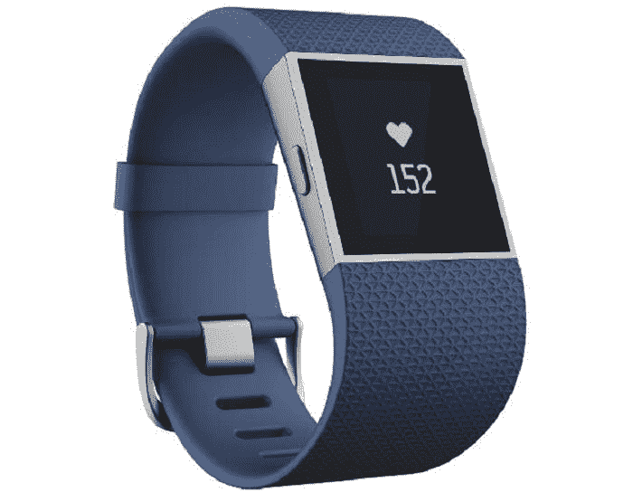
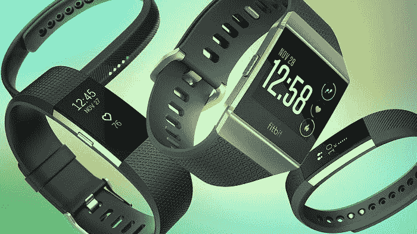

# Fitbit 反击苹果和三星这两大巨头

> 原文：<https://medium.datadriveninvestor.com/fitbit-fights-back-against-the-big-dogs-apple-and-samsung-d3d44bcc5607?source=collection_archive---------22----------------------->

## 但这都是关于健身和智能技术的，所以我们都赢了！

良性竞争不会伤害任何人。永远不要把失败者排除在外。[虽然苹果正在进入这个特定的人口统计和垂直领域](https://vigyaa.com/@pierre/apple-will-be-actively-targeting-a-most-unusual-industry-very-soo-7296bed7/)，但*可以*、 *Fitbit* 的小型智能手表仍在稳步前进，尽管随着苹果在竞争中一飞冲天，它显得有些松懈。

# 可以理解的是，Fitbit 现在的模式是成本效益

我们已经看到技术领域的品牌是如何运作的。这无疑填补了一个空白。对于那些需要更多关注预算的人来说，规模较小、层次较低的产品符合要求。当苹果继续用高价技术和品牌认知度冲击这个行业时，我们已经有了像 Fitbit 这样的赢家来分一杯羹。

证据就在那块馅饼的布丁中，因为他们营销的 Versa Lite 智能手表将售价 160 美元，低于其完整版的 200 美元。他们为精打细算的人提供了更具成本效益的选择，而且[每个人都知道技术是关于财务责任的](https://vigyaa.com/@pierre/5-reasons-why-mobile-technology-benefits-the-money-minded-00331c57/)。

现在，虽然这个 *lite* 版本的 Fitbit 可能会失去一些功能，如播放音乐，但它仍然会跟踪锻炼和心率，这是该产品的核心。事实上，Fitbit 的受众更多的是普通用户，尤其是儿童。目标是让孩子们和他们的父母更加关注健康的质量，而不是你所期待的大男孩的烟雾、镜子、浮华、魅力和技术特征。

毕竟，苹果在 2018 年已经卖出了 22.5 毫米的手表。他们是领导者。三星销售了 5.3 毫米。然而，Fitbit，*以 5.5 毫米略微领先于三星。然而，在 2018 年的最后三个月，三星超过了 Fitbit，Fitbit 在墙上写道，小公司需要专注于一个目标，因为技术进步只会让他们吃大男孩的灰尘。*

说真的，苹果的智能手表上有心电图选项！三星为他们的 Galaxy Active 手表提供了一个血压传感器。如果 Fitbit 想要保持相关性，他们要么也必须加强这项技术，要么瞄准更多较小的人群，而不是饱和这个健身技术市场。

# 你认为这对 Fitbit 来说是明智之举吗？

我们认为是的。至少目前是这样。想想吧。苹果智能手表的价格不会低于 279 美元。三星起价 200 美元。但是 Fitbit 呢？你可以花 100 美元买到一个简单的 Fitbit HR，做你想让它做的事情。甚至 Ace 2 的价格也只有区区 70 美元。重点应该是行业本身，如果它做了它应该做的，就不要把它复杂化。让大男孩提供更多。

喜欢智能手表，还是它只是科技领域的一个快速时尚？注册一个免费的 VIGYAA 账户，马上写下并发表你的想法！