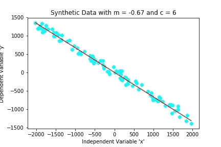
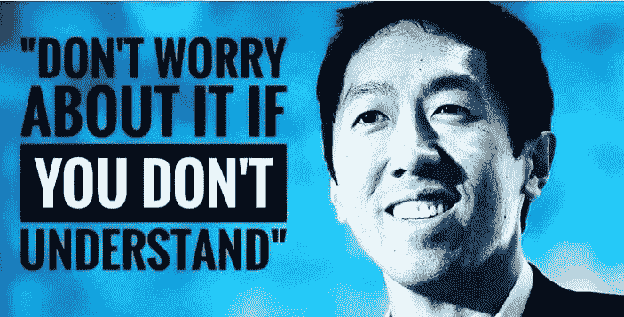
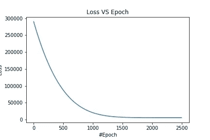
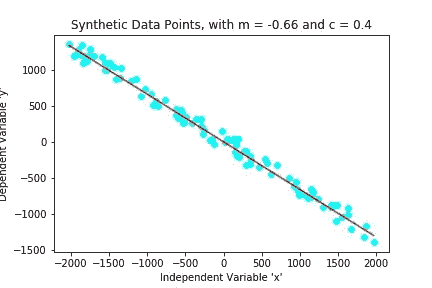
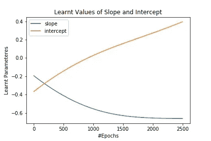

# PyTorch 中 2D 数据的直线拟合

> 原文：<https://medium.datadriveninvestor.com/fitting-a-straight-line-on-2d-data-in-pytorch-78d0e3450876?source=collection_archive---------5----------------------->

Fitting a Straight Line on 2D Data ;)

这个博客主要展示在 **PyTorch** 中制作和训练一个基本学习模型的流程。

还有什么比在 2D 数据上拟合一条直线更基本的呢？

 [## 金融中的机器学习|数据驱动的投资者

### 在我们讲述一些机器学习金融应用之前，我们先来了解一下什么是机器学习。机器…

www.datadriveninvestor.com](https://www.datadriveninvestor.com/2019/02/08/machine-learning-in-finance/) 

**没什么！！！**

说真的，没有什么比在 2D 数据上拟合直线更简单的了

单变量线性回归单变量回归是机器学习中最简单也是最基本的概念之一。

在一元回归问题中，给定 2D 空间中的多个数据点，要求我们在该 2D 空间中找到一条直线，使得所有数据点到该直线的垂直距离之和最小。换句话说，这条直线正好位于给定数据分布的中心。

我们不知道这个博客的作者是人还是机器人，但有一件事我们无法否认；2D 空间中的任何直线都可以用两个实数来表示， **m** 直线的斜率和 **c** 直线与 x 轴的截距。

因此，在 2D 空间中寻找一条符合给定点分布的直线的问题简化为寻找该直线的斜率 **m** 和截距 **c** 。

我们将使用 PyTorch 通过构建和训练一个非常简单的深度学习模型来解决这个问题。

是时候把手弄脏了…

我们从使用 PyTorch 导入编码的 [*基本必需品*](https://www.youtube.com/watch?v=5dhSdnDb3tk) 开始。

## 步骤 1:生成合成 2D 数据

为了找到适合给定数据的直线，我们首先需要生成数据本身。我们将以这样一种方式生成合成数据，即数据点大致位于一条直线上。我们将通过使用一些预定义的 **m** (斜率)和 **c** (截距)来做到这一点。

一旦随机选择了斜率(m)和截距(c ),我们就可以生成合成数据点。

让我们将合成数据点和由**m _ synthetic**amd**c _ synthetic 定义的线可视化。**

Synthetic points generated by using a synthetic slope and a synthetic intercept.

我们的任务是找出最适合所有数据点的直线方程！

换句话说，我们必须找到一条线的斜率和截距，这将给出位于数据点分布中心的线。

由于这是一个线性回归问题，我们希望找到所有必需参数的值(在我们的例子中是斜率 m 和截距 c，因为数据位于 2D 空间中)。

如果数据是高维的，我们将不得不求解更多的参数。

## 步骤 2:定义模型架构

我们将使用 **PyTorch** 来解决这个单变量回归问题。
我们需要一个非常简单的模型，它接受单个标量输入，并输出一些单个标量输出。

我们可以打印出**模型**来看看它的架构。

一旦我们创建了**模型**，让我们检查一下其中的参数。

模型中会有一些可学习的参数，这些参数在开始时是随机初始化的。

这是初始阶段初始参数的样子。

注意，参数的初始化值根本不在 **m_synthetic** 和 **c_synthetic** 值附近，这些值实际上已经被用于合成数据点。

但是当我们训练模型时，这些值将接近 m_synthetic 和 c_synthetic 的值！

我们将在本笔记本的末尾看到这一点。

## 步骤 3:定义损失函数和优化器

必须有一个度量标准，让我们知道我们的模型对给定数据的拟合程度。

这正是**损失函数**所做的！

PyTorch 在**反向传播**期间计算损失相对于所有可学习参数的导数，该导数随后被**优化器**用来更新模型的所有参数，在每个时期之后改进模型。

顺便说一下，一个**时期**是整个数据集仅通过神经网络向前和向后传递一次。

PyTorch 期望它的所有输入都是 **torch.tensors** ，所以我们将所有数据转换成 torch tensors。

## 步骤 4:训练模型并绘制损失图

在准备好数据、定义好模型、损失函数和优化器之后，终于到了训练我们的模型的时候了！

我们必须理解前面代码块中写的每一行代码。

**optimizer.zero_grad()** 是非常重要的一行代码。所以这里发生的是，当反向传播完成时，所有模型参数的梯度在**优化器**中累积，而不是被替换。这些梯度需要清除。这正是 **optimizer.zero_grad()** 所做的。

嗯，你一定想知道为什么 PyTorch 让我们做一些看起来显而易见的事情。实际上，在训练 RNN 或 LSTM 时，积累梯度非常方便，因为在这些情况下，每个模块都将被反向传播几次。

Don’t woory if you didn’t get this meme : p

我们可以看到模型学习的参数(m _ learnt 和 c _ learnt)。

接下来，我们绘制损失图

Decreasing loss during the model’s training

我们看到每一个纪元后损失都在减少。对于深度学习实践者:D 来说，这总是一个很好的景象

## 步骤 5:可视化模型学习的直线

现在让我们绘制由模型学习的斜率和截距定义的线，并查看它是否是数据分布的良好近似。

Line learnt by the model is fitting well on the data

看起来模型确实在给定的数据分布上拟合了一条直线！！！:D

## 在模型训练期间可视化斜率和截距

记得我们在训练过程中收集了模型的学习斜率和学习截距值。我们现在可以通过绘制它们的图来形象化它们。

Model’s parameters changing during the training

我们看到，在模型的训练阶段，模型的参数发生变化，并且它们接近模型的总损失最小的值。

事实上，这是任何深度学习模型背后的一般思想。它试图找到最适合模型的参数，以执行特定的任务，这是通过使用针对该特定任务的合适的损失函数来测量的。

## 结束。

我希望您理解了使用 PyTorch 解决线性回归问题背后的基本思想。

这是解决一元线性回归问题或一元回归问题的一个非常简单的例子。但是我们甚至可以用类似的方法解决多元回归问题。

我希望你喜欢这个教程！:D

## 查看以下链接

Kaggle 内核:[在 PyTorch 中对 2D 数据拟合直线](https://www.kaggle.com/n0obcoder/fitting-a-straight-line-on-2d-data-in-pytorch)

Github 库:[在 PyTorch 的 2D 数据上画一条直线](https://github.com/n0obcoder/Fitting-a-Straight-Line-on-2D-Data-in-PyTorch)

我写这篇博客是因为我通过阅读别人的博客学到了很多东西，我觉得我也应该尽可能多地写下并分享我的学习和知识。所以请在下面的评论区留下你的反馈！:D

我也是一个独立的音乐艺术家，喜欢在空闲时间演奏和录制音乐。也许你可以在 Spotify 上查看我的艺术家页面，表示你的支持:)
[Spotify 上的 8 楼和声！](https://open.spotify.com/artist/7G2BgSnludIYl1gFyJKG6X?si=Bv5L4ZAVQrmIsl5SgGRAUw)