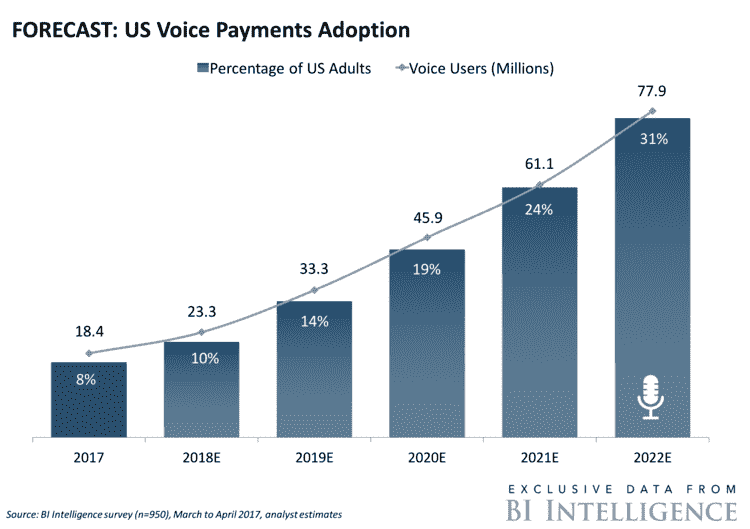

# 语音助手在体育运动中的五大应用

> 原文：<https://medium.datadriveninvestor.com/five-applications-of-voice-assistants-in-sports-466200493d81?source=collection_archive---------8----------------------->

近年来，体育组织在社交视频上投入了大量资金，试图向粉丝提供信息和娱乐。短片的美学吸引力和实用性使它们在互联网上流行起来，并像病毒一样传播，吸引了更广泛的粉丝，无论他们关注什么运动。2017 年初，Facebooks 的马克·扎克伯格(Mark Zuckerberg)甚至告诉投资者:“我认为视频是一个巨大的趋势，和移动一样”。同样，软件公司思科预测，到 2021 年，每秒将有一百万分钟的视频内容通过互联网。这是放映体验从传统电视到移动设备不断演变的结果。然而，最古老的通信手段，无线电广播，也在以惊人的速度发展，现在可以提供新的能力和无与伦比的互动，这要归功于虚拟助理和语音控制设备。在这里，我介绍了这些语音助手的 5 个应用程序，以撼动体育行业。

**1-数据驱动的预测**

虚拟语音助手可以与您的体育组织的数据库集成，以构建人工智能系统。所提供信息的准确性取决于数据库架构输入数据的能力。这对于棒球等数据驱动的运动来说尤其方便，球迷可以要求一系列类别的统计数据，从历史数据到比赛准备的平均击球率。最终，机器学习属性说明了可靠性，并可以通过使粉丝能够访问无价的信息范围来推动博彩和幻想游戏行业。与此同时，他们在电脑或移动设备上浏览互联网。

**2 场比赛回顾和讨论**

无论你是早点上床睡觉，还是决定与朋友出去玩，错过你最喜欢的球队比赛，基于语音的人工智能助手都可以告诉你第二天早上错过了什么。这种类似广播的报告根据用户的偏好建立正确的语调和游戏方式，甚至可以进入关于比赛的讨论。再也不会有人后悔错过了一场比赛，尤其是长期的无线电爱好者。语音助手似乎通过瞄准比千禧一代更广泛的受众获得了更多的市场份额。通过这样做，体育组织可以探索进一步的赞助机会，主要是通过向品牌提供这些新的属性，以便在消费者消费时与他们交谈。

**3 -在体育场点食物和饮料**

语音助手为铁杆球迷在体育场遇到的最常见问题之一提供了解决方案，即如何在不容错过的活动在他们眼前展开时获得食物和饮料。现在，这一问题可以通过简单的语音命令助手来解决，助手连接到酒吧服务，在几秒钟内你就可以得到啤酒和热狗。除了在线支付的便利性，节省球迷在人群中寻找现金的麻烦，这些系统还可以跟踪消费习惯，以大幅增加比赛日收入，同时增强观众的体验。

**4 个应用集成**

数据和机器学习是语音助手的基础，通过集成现有的第三方应用程序，可以处理越来越多的查询。由于 source 提供了一系列自助式 API、工具、文档和代码示例，开发人员可以构建新的技能集。因此，例如，体育组织可以立即从提供票务和接待服务中受益。随着新技术能够在线取代体育场体验，上座率是体育运动未来将遇到的一个棘手问题。然而，个人语音助理的功能正在推出，以建立与体育赛事的和谐关系，并推动球迷到现场观看现场比赛。

**5 -无线电广播**

个性化服务的范围是无限的，语音助手可以填补体育观看体验的又一个空白。你现在不仅可以让你的设备从不同的电台广播你的比赛，而且最重要的是，比如说，奥林匹克运动联合会可以自己提供。在一些小众体育项目中，关注一项赛事，如果解说员不太熟悉，只是流于表面，可能会让球迷不满意。作为所有与数据相关的事物的所有者，体育联合会能够分享由铁杆球迷为铁杆球迷制作的相当令人兴奋和愉快的比赛广播。这似乎有无限的市场潜力可以利用。

语音助手近年来大受欢迎，现在预装在大多数智能设备上，可以说 13 种不同的语言。最常见的有亚马逊的 Alexa，微软的 Cortana 和谷歌助手。到 2020 年，语音搜索预计将占所有在线查询的 50%，高于 2016 年的 20%。

你对体育行业的语音助手有什么想法？请在下面的评论中分享你的观点。

如果你喜欢读这篇文章，不要犹豫，点击“喜欢”按钮。