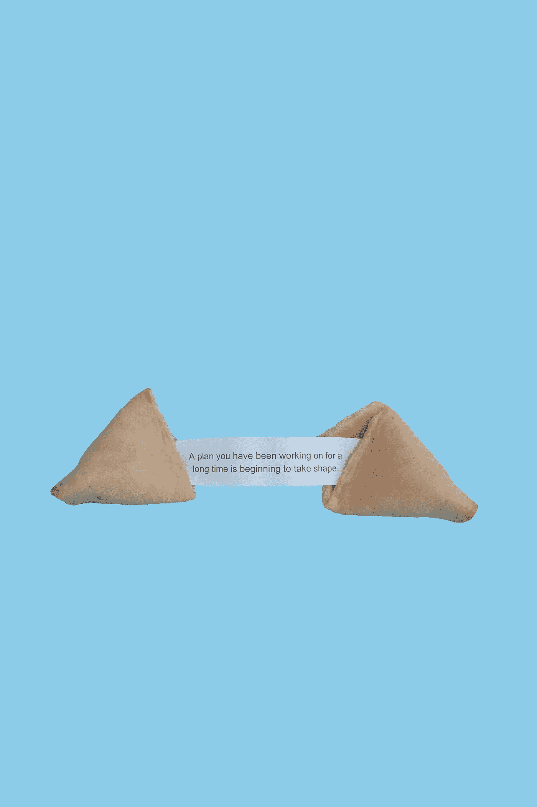

# 为了更成功，你应该停止的五个习惯

> 原文：<https://medium.datadriveninvestor.com/five-habits-you-should-stop-to-be-more-successful-77e5ff5ecf3d?source=collection_archive---------6----------------------->

用 Mack Story(二手灵感项目)关闭负面行为

二手灵感项目从一句激励性的引语开始，在创造性道路蜿蜒的任何地方冒险。

"对错误的事情说不创造了对正确的事情说是的空间."—麦克的故事

成功来自于不断钻研你的手艺，直到别人注意到你。然后继续高水平地做，直到人们欣赏你所提供的东西。然后，除非你非常幸运，否则继续努力。

你能做到的。相信我。但是如果你开始避免这五个危险的习惯，会有所帮助。

# 保持着“我对抗世界”的态度。

你肩膀上有一英里宽的芯片。没有什么是容易的。但是你一定会发财的，不管有多大的可能性，也不管谁挡着你的路。

我明白了。我一生中的大部分时间都是这样操作的。

这种策略在短期内是可行的。用这种观点，你可能会赢得一场比赛或者战胜一个个人挑战。你可以在工作中度过糟糕的一周，或者像这样艰难的一学期。但当谈到可持续的成功时，愤怒的局外人的做法可能会损害你的机会。

 [## 成功人生的 25 种自我提升方式|数据驱动的投资者

### “我活得越久，学到的就越多。学的越多，体会的越多，知道的越少。”―米切尔·莱格兰德时间到…

www.datadriveninvestor.com](https://www.datadriveninvestor.com/2019/03/12/25-self-improvement-ways-for-a-successful-life/) 

要想长期成功，试着成为一名领导者。领导不记仇，不把一切都扛在肩上，也不疏远自己。领导者采取坚定而审慎的方法，知道他们不需要单枪匹马，并在与他人的交往和联系中发现价值。

一个独立的不墨守成规者可能会取得一些个人胜利。但是要想获得持续的成功，就要抛弃独狼思维。

# 憎恨你所创造的东西。

我有幸在几个不同的领域取得了一点成功。在攀登这些不同的阶梯时，我注意到一个有影响的事情，那就是成功人士之间有一个共同的现象，不管他们在哪个领域。

这是一个潜规则，如果你渴望成为一个真正的 _ _ _ _ _ _ _ _ _ _，你应该讨厌你的作品。这种消极的自我对话超越了类型。创意人员、编码人员、企业和无数其他人都在实践这种自虐行为。

如果你有这个习惯，请停止。不仅仅是因为它很烦人。

在你和你的目标之间有很多时间、精力、眼泪和怀疑。你不能通过平移你的作品来跨越这个鸿沟。放弃努力不会让你得到晋升。沉湎于过去的错误不会让你成为更好的父母。

为实现目标而奋斗需要极大的勇气。如果你想成功，你最好热爱你正在做或发展的任何事情——尤其是如果你想让其他人也有同样的感觉。

# 试图找到简单的方法。

你可以继续寻找，但没有作弊代码，魔术子弹，或秘密黑客。

成功——无论你如何定义它——都是努力和坚持的副产品。但逃避并假设其他人拥有所有的突破是很容易的。很容易认为他们有你不喜欢的好处天生的天赋，额外的钱，关键的人脉。

但你的竞争对手可能也不具备所有这些优势。他们只是做你不会做的任务。他们只是愿意比你更努力地工作。

与其寻找捷径，不如把精力放在解决需要完成的事情上。鞭策自己，拓展你的界限，发挥你的潜力，然后更进一步。这本身就是一种成功。

Photo by [Elena Koycheva](https://unsplash.com/@lenneek?utm_source=unsplash&utm_medium=referral&utm_content=creditCopyText) on [Unsplash](https://unsplash.com/s/photos/fortune?utm_source=unsplash&utm_medium=referral&utm_content=creditCopyText)

# 坚持 A 计划太久了。

你有一个梦想。让我们称之为 a 计划吧。它完美无瑕，史诗般的，而且绝对不会失败。

但如果它真的坠毁了，不要固执地抓住冒烟的残骸不放。烧掉你的 A 计划，继续前进。如果你最初的策略失败了，你不能害怕切换到你的备份计划。

有时候我们把 B 计划当成是次等的选择。好像这是对我们错过最初想象的理想场景的一种安慰。但是让我们面对现实吧，A 计划并不总是成功的。当这种情况发生时，如果我们能够像对待 A 计划一样认真对待 B 计划，我们仍然有可能获得成功。

不要让一个看似万无一失的策略的消亡让你气馁。有时候你需要放弃 A 计划，投入 B 计划。B 计划可能不是你最初设想的那样，但是如果你足够熟悉做出牺牲，它会把你带到同样的目的地。

# 等待幸运降临。

成功不是运气的问题。是关于坚持。

每个奥运选手都是运动员，当他们遇到困难时不会停止比赛。每一个出版的小说家都是一个即使收到无数退稿通知也没有停止写作的作者。每个企业家都是冒险家，他们不会让不确定性阻止他们建立新的企业。

运气是一个你无法控制的变量。但是你可以利用你的努力。所以，用努力来激励你的毅力，朝着你的理想前进。

停止等待一些不太可能的意外之财。松开你的手指，让你的手开始工作。

关于成功，一个经常被遗忘的秘密是，你愿意放弃什么和你想要实现什么一样重要。

你可能会不由自主地做出一些行为，阻碍你得到你想要的东西。这些缺点会持续阻碍你的成功。但是不要担心——你有足够的意志力去克服这些障碍。找出是什么习惯阻碍了你，并做出必要的纠正，以最大限度地发挥你的潜力。

阿德里安·s·波特是一名作家、工程师、顾问和演说家。他写诗歌、短篇小说和各种主题的文章，包括创造力和个人成长。他是诗集[和散文集](https://www.amazon.com/Everything-Wrong-Feels-Adrian-Potter/dp/109519061X/ref=sr_1_4?qid=1560264651&refinements=p_27%3AAdrian+S.+Potter&s=books&sr=1-4&text=Adrian+S.+Potter)[的作者。在](https://e2857002-6118-41be-9746-64261e36cacb.filesusr.com/ugd/21d2c2_03522f10c7c84340a05a8d03a97e1642.pdf)[http://adrianspotter.com/](http://adrianspotter.com/)在线拜访他。

*原载于 2019 年 12 月 14 日*[*https://www.datadriveninvestor.com*](https://www.datadriveninvestor.com/2019/12/14/five-habits-you-should-stop-to-be-more-successful/)*。*