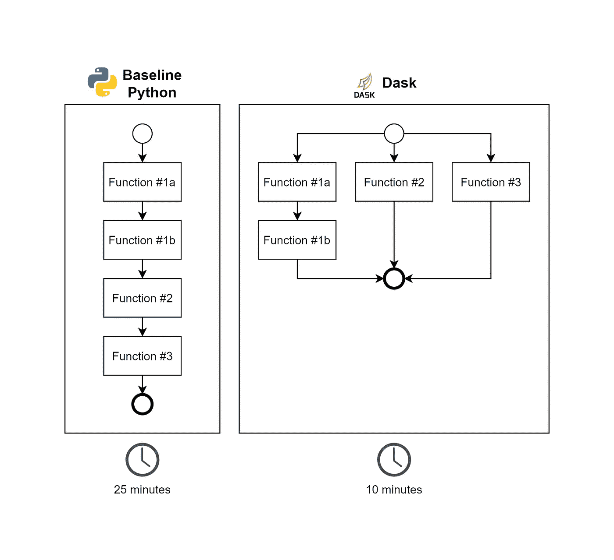
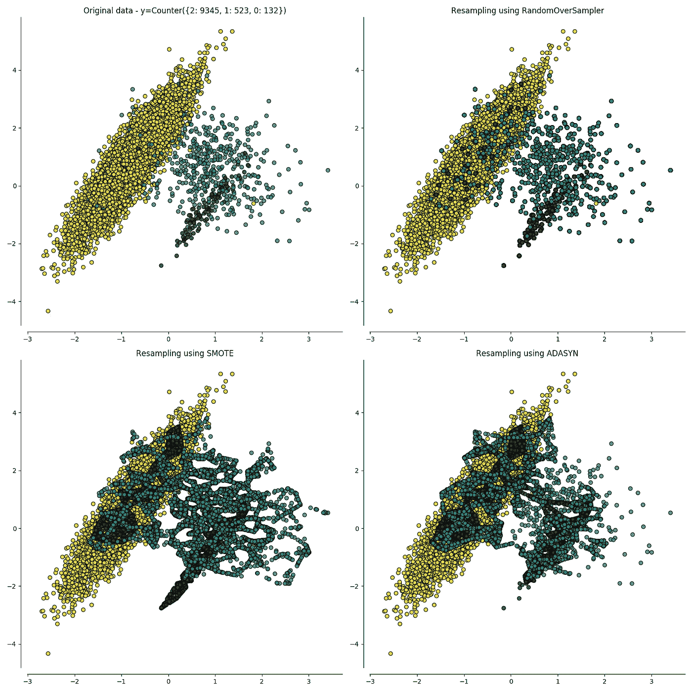
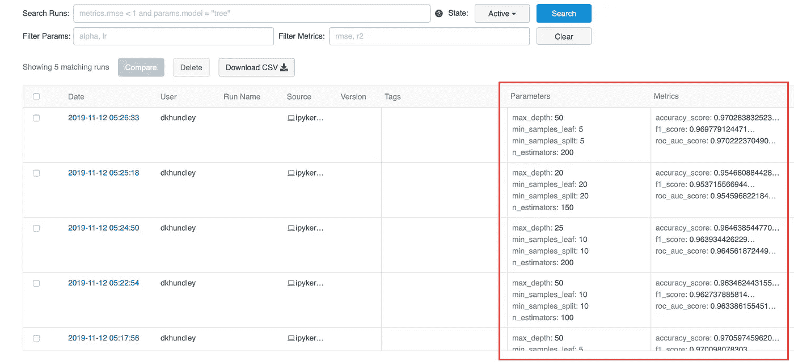

# 我喜欢的用于数据科学的五个不太常见的 Python 包！

> 原文：<https://medium.datadriveninvestor.com/five-less-common-python-packages-i-like-for-data-science-6635c3e6f3dd?source=collection_archive---------7----------------------->

说到数据科学，Python 绝对是我在所有预测建模方面的首选编程语言。我高中的第一堂编程课教的是 Visual Basic，后来我学习了 Java 作为我的下一门编程语言。这两种语言都不可怕，但是与 Python 相比，它们的语法有时会有点混乱。(诅咒你，分号！)

但也许我最喜欢使用 Python 的原因是它从各种人创建的辅助包中获得了强大的支持。如果你活跃在数据科学社区，那么我肯定你对 Numpy、Pandas 和 Matplotlib 之类的东西很熟悉。那些套餐太赞了；它们受欢迎是有原因的！如果我打开一个新的 Jupyter 笔记本的时候没有输入“导入熊猫作为 pd ”,那么我活着是为了什么？？

在这篇文章中，我想给一些 Python 包一点爱，它们没有像上面列出的大家伙一样得到那么多的关注。也许你听说过其中的一些，也许你没有。它们在功能上可能不如其他软件包，但它们是各自领域的大师。我的希望是你离开的时候学到一些你可以应用到自己实践中的东西。

让我们开始吧！🐍

## 达斯克

如果您熟悉像 Apache Airflow 这样的开源项目，那么您就会熟悉这个包背后的核心概念:通过延迟处理实现并行。如果您不熟悉这个概念，基本要点是惰性处理在执行某些函数之前尽可能长时间地等待，以便它可以适当地并行处理事情。我在上面创建的插图最好地解释了这一点。您将看到函数 1a 和 1b 相互依赖，而函数 2 和 3 是独立的。使用基线 Python，函数将按顺序一个接一个地处理。使用 Dask，您可以适当地标记函数，并让它们并行执行，从而大大减少处理时间。

 [## 数据科学和软件工程哪个更有前途？数据驱动的投资者

### 大约一个月前，当我坐在咖啡馆里为一个客户开发网站时，我发现了这个女人…

www.datadriveninvestor.com](https://www.datadriveninvestor.com/2019/01/23/which-is-more-promising-data-science-or-software-engineering/) 

如果您要在大型/复杂的数据集上执行大型转换，这是非常棒的。这里需要注意的一点是内存使用情况。Dask 可能很棒，但是如果你不小心的话，它会很快变成内存猪。如果你和 Dask 一起优化你的内存使用，你会发现这个包是你在数据处理中最好的朋友！🏃

[*在这里了解更多关于 Dask 的信息。*](https://dask.org)

## 不平衡学习

许多分类数据集面临的最大挑战之一是，目标类之间几乎永远不会达到平衡。在银行欺诈、癌症检测等案例中，这无疑是正确的。问题是，你怎么处理？对于这个特定的问题，没有一个放之四海而皆准的答案，但它很可能属于收集更多数据或对数据进行适当重采样的范围。

说到重采样，一种流行的技术是综合创建样本，代表你的代表不足的阶层来平衡游戏场地。这就是所谓的合成少数过采样技术，简称 SMOTE。不平衡学习包通过许多不同的易于使用的 Python 函数来帮助简化 SMOTE 的实现。不平衡学习提供了一套广泛的东西，不仅仅是 SMOTE，但 SMOTE 是我最常用的软件包！

(还有，是不是只有我，还是上面的那个画面让你想起了《蜘蛛侠》里的毒液？🕷)

[*了解更多关于不平衡的学习在这里。*](https://imbalanced-learn.readthedocs.io/en/stable/)

## 功能工具

任何数据科学家最耗时的工作之一就是测试数据特征，从中收集更多信息。这可能像分析单个要素的平均值一样简单，也可能像组合多个数据集的要素以从中收集全新的见解一样简单。难道你不希望有一种更简单、更快捷的方式来更快地获得大量见解吗？

这就是 Featuretools 发挥作用的地方！Featuretools 使您能够快速将一些数据集关联在一起，并在脑海中对目标实体进行“深度特征合成”,并快速为您生成大量新特征。当然，您仍然需要进行一些手动处理来获得真正精细的见解，但是如果您正在寻找一些快速和肮脏的东西，Featuretools 是您的理想选择。🔬

[*点击此处了解更多功能工具。*](https://www.featuretools.com)

## 皮林特

好吧，朋友们…我不得不承认，当开始使用新的 Jupyter 笔记本时，我并不是最干净的程序员。今天早上我刚刚看了一些以前的作品，注意到我在同一个笔记本的三个不同地方的不同点导入了同一个 Scikit-Learn 包。🤦🏽‍♂️

当你进入状态时，很容易忘记自己做了什么。无论是像我一样多次导入同一个东西，还是错误地标注你的一个变量，如果你试图将它们投入生产，这些小错误会很快累积起来。手动梳理代码会有所帮助，但是，嘿，我们也是人。我们都容易遗漏一些东西，所以这就是 Pylint 可以帮助我们的地方。Pylint 通过梳理您的数据，并就您可能需要进行调整的地方提出非常具体的建议，来自动化所有清理工作。这比手动检查代码要快得多，而且比你作为一个人更容易捕捉到东西！🧹

[*在此了解更多关于 Pylint 的信息。*](https://www.pylint.org)

## MLFlow

MLFlow UI

在这个列表上的所有包中，这个对我来说是最新的一个。它出现的时间并不长(在我发表这篇文章的时候可能才一年)，但它已经得到了机器学习社区的大量喜爱。当谈到优化机器学习模型时，真的没有一种很好的方法来使用 Scikit-Learn 这样的工具来测量使用特定参数的结果。MLFlow 通过添加一个简单的语法来帮助解决这个问题，该语法不仅记录您的参数、度量结果和模型本身，还启用了一个如上所示的漂亮的 UI 来帮助您比较所有这些结果。整洁！

但是等等，还有呢！MLFlow 还内置了一些东西，可以让您快速地提供模型，以便在批处理和同步推理中使用。正如我之前提到的，这个包对我来说很新，所以我自己还不能很好地使用它，但是互联网上有很多人已经使用了。我对这个包所展示的承诺感到兴奋，所以你可以放心，我计划继续尝试启用这个功能。👍🏽

[*在此了解更多关于 MLFlow。*](https://www.mlflow.org)

好了，伙计们，这篇文章就到此为止了！我希望你带走一些新的东西，可以用在你的数据科学武库中。你最喜欢的鲜为人知的 Python 包有哪些？请务必在评论中发表意见。下次见，造型快乐！