# 五种强大的 CNN 架构

> 原文：<https://medium.datadriveninvestor.com/five-powerful-cnn-architectures-b939c9ddd57b?source=collection_archive---------0----------------------->

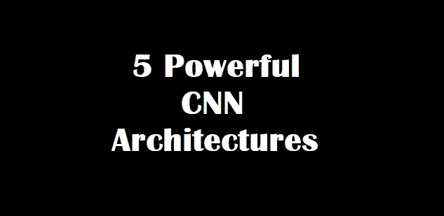

让我们回顾一些强大的卷积神经网络，它们为今天的计算机视觉成就奠定了基础，这些成就是使用深度学习实现的。

## LeNet-5 — LeCun 等人

**LeNet-5** ，一个 7 层卷积神经网络，被部署在许多银行系统中，用于识别支票上的手写数字。

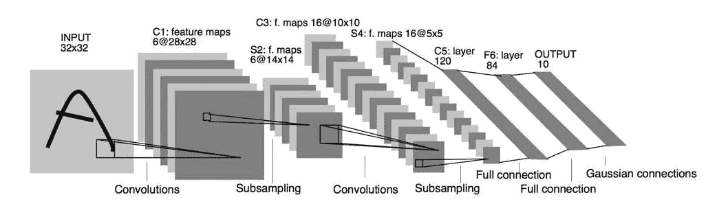

[***Gradient based learning applied to document recognition***](http://yann.lecun.com/exdb/publis/pdf/lecun-01a.pdf)

**LeNet-5——建筑**

手写数字被数字化成像素大小为 32×32 的灰度图像。当时，计算能力是有限的，因此该技术无法扩展到大规模的图像。

让我们来理解模型的架构。该模型包含 7 层，不包括输入层。既然是比较小的架构，那就一层一层来说吧:

1.  第一层:卷积层，核大小为 5×5，步长为 1×1，共有 6 个核。因此，大小为 32x32x1 的输入图像的输出为 28x28x6。层中的总参数= 5 * 5 * 6 + 6(偏差项)
2.  层 2:具有 2×2 内核大小、2×2 步距和总共 6 个内核的池层。这个池层的行为与我们在上一篇文章中讨论的略有不同。将接受中的输入值相加，然后乘以可训练参数(每个滤波器 1 个)，最后将结果添加到可训练偏差(每个滤波器 1 个)。最后，对输出应用 sigmoid 激活。因此，来自大小为 28x28x6 的前一层的输入被子采样为 14x14x6。层中的总参数= [1(可训练参数)+ 1(可训练偏差)] * 6 = 12
3.  第 3 层:类似于第 1 层，这一层是卷积层，具有相同的配置，除了它有 16 个滤波器而不是 6 个。因此，来自大小为 14x14x6 的前一层的输入给出了 10x10x16 的输出。层中的总参数= 5 * 5 * 16 + 16 = 416。
4.  第 4 层:再次类似于第 2 层，这一层是一个池层，这次有 16 个过滤器。记住，输出是通过 sigmoid 激活函数传递的。来自前一层的大小为 10x10x16 的输入被子采样为 5x5x16。层中的总参数= (1 + 1) * 16 = 32
5.  第 5 层:这一次我们有一个 5×5 内核大小的卷积层和 120 个过滤器。因为输入大小是 5x5x16，所以我们甚至不需要考虑跨度，因此我们将得到 1x1x120 的输出。层中的总参数= 5 * 5 * 120 = 3000
6.  第 6 层:这是一个有 84 个参数的密集层。因此，120 个单位的输入被转换为 84 个单位。总参数= 84 * 120 + 84 = 10164。这里使用的激活函数相当独特。我要说的是，你可以在这里尝试你的任何选择，因为以今天的标准来看，这个任务相当简单。
7.  输出层:最后使用 10 个单元的密集层。总参数= 84 * 10 + 10 = 924。

跳过损失函数使用的细节和为什么使用它，我建议在最后一层使用 softmax 激活的交叉熵损失。尝试不同的训练计划和学习速度。

LeNet-5 —代码

```
from keras import layers
from keras.models import Model

def lenet_5(in_shape=(32,32,1), n_classes=10, opt='sgd'):
    in_layer = layers.Input(in_shape)
    conv1 = layers.Conv2D(filters=20, kernel_size=5,
                          padding='same', activation='relu')(in_layer)
    pool1 = layers.MaxPool2D()(conv1)
    conv2 = layers.Conv2D(filters=50, kernel_size=5,
                          padding='same', activation='relu')(pool1)
    pool2 = layers.MaxPool2D()(conv2)
    flatten = layers.Flatten()(pool2)
    dense1 = layers.Dense(500, activation='relu')(flatten)
    preds = layers.Dense(n_classes, activation='softmax')(dense1)

    model = Model(in_layer, preds)
    model.compile(loss="categorical_crossentropy", optimizer=opt,
	              metrics=["accuracy"])
    return model

if __name__ == '__main__':
    model = lenet_5()
    print(model.summary())
```

## Alex net-Krizhevsky 等人

2012 年，在世界上最重大的计算机视觉挑战赛 [**imagenet**](http://www.image-net.org/) 中，Hinton 的深度神经网络将前 5 名的损失从 26%降至 15.3%，这是一个令人瞠目结舌的时刻。

该网络与 LeNet 非常相似，但更深入，有大约 6000 万个参数。

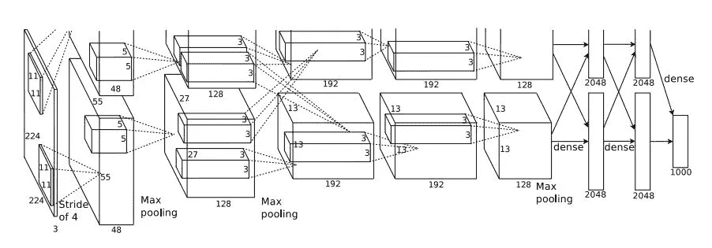

[***ImageNet Classification with Deep Convolutional Neural Networks***](https://papers.nips.cc/paper/4824-imagenet-classification-with-deep-convolutional-neural-networks.pdf)

**AlexNet —架构**

这个数字看起来很吓人。这是因为网络被分成两半，每一半同时在两个不同的 GPU 上训练。让我们把这变得简单一点，并引入一个更简单的版本:

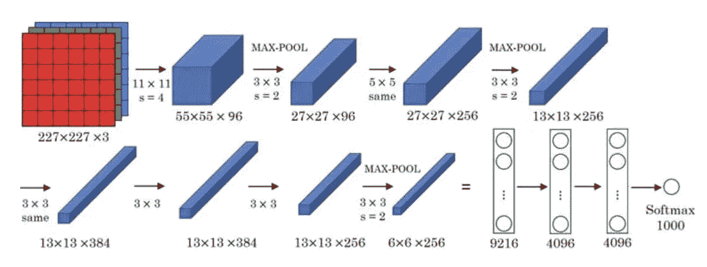

该架构由 5 个卷积层和 3 个全连接层组成。这 8 层结合了当时的两个新概念——MaxPooling 和 ReLU activation，让他们的模型有了优势。

您可以在上图中看到不同的层及其配置。下表描述了这些层:


> 注意:ReLU 激活应用于除最后一个 softmax 层之外的每个卷积和完全连接层的输出。

作者使用了各种其他技术(其中一些将在未来的帖子中讨论)——辍学，增加和随机梯度下降与动量。

**AlexNet —代码**

```
from keras import layers
from keras.models import Model

def alexnet(in_shape=(227,227,3), n_classes=1000, opt='sgd'):
    in_layer = layers.Input(in_shape)
    conv1 = layers.Conv2D(96, 11, strides=4, activation='relu')(in_layer)
    pool1 = layers.MaxPool2D(3, 2)(conv1)
    conv2 = layers.Conv2D(256, 5, strides=1, padding='same', activation='relu')(pool1)
    pool2 = layers.MaxPool2D(3, 2)(conv2)
    conv3 = layers.Conv2D(384, 3, strides=1, padding='same', activation='relu')(pool2)
    conv4 = layers.Conv2D(256, 3, strides=1, padding='same', activation='relu')(conv3)
    pool3 = layers.MaxPool2D(3, 2)(conv4)
    flattened = layers.Flatten()(pool3)
    dense1 = layers.Dense(4096, activation='relu')(flattened)
    drop1 = layers.Dropout(0.5)(dense1)
    dense2 = layers.Dense(4096, activation='relu')(drop1)
    drop2 = layers.Dropout(0.5)(dense2)
    preds = layers.Dense(n_classes, activation='softmax')(drop2)

    model = Model(in_layer, preds)
    model.compile(loss="categorical_crossentropy", optimizer=opt,
	              metrics=["accuracy"])
    return model

if __name__ == '__main__':
    model = alexnet()
    print(model.summary())
```

## VGGNet-Simon Yan 等人

2014 imagenet 挑战赛亚军命名为 [**VGGNet**](https://arxiv.org/pdf/1409.1556.pdf) 。由于其统一架构的简单性，它作为深度卷积神经网络的简单形式吸引了新来者。

在以后的文章中，我们将看到这个网络如何成为从图像中提取特征的最常用的选择之一(获取图像并将它们转换为包含关于图像的重要信息的更小维度的数组)。

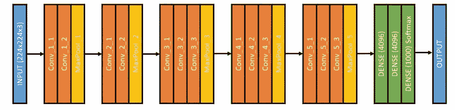

**VGGNet —架构**

VGGNet 有两条简单的经验法则需要遵循:

1.  每个卷积层都有配置—内核大小= 3×3，步长= 1×1，填充=相同。唯一不同的是过滤器的数量。
2.  每个最大池层都有配置—窗口大小= 2×2，跨距= 2×2。因此，我们在每个池层将图像的大小减半。

输入图像是 224×224 像素的 RGB 图像。因此输入大小= 224x224x3

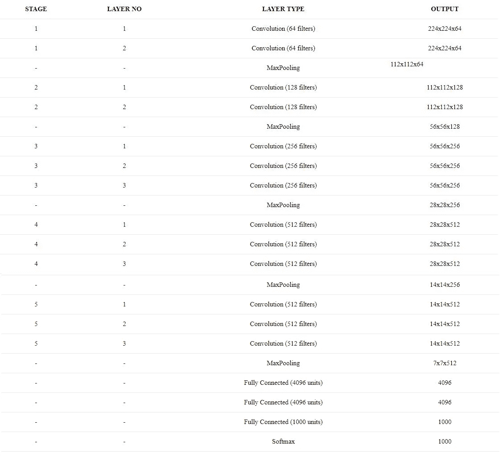

总参数= 1.38 亿。这些参数中的大多数是由完全连接的层贡献的。

*   第一个 FC 层的贡献= *4096 * (7 * 7 * 512) + 4096 = 102，764，544*
*   第二个 FC 层贡献= *4096 * 4096 + 4096 = 16，781，312*
*   第三个 FC 层贡献= *4096 * 1000 + 4096 = 4，100，096*

FC 层提供的总参数= *123，645，952。*

**VGGNet —代码**

```
from keras import layers
from keras.models import Model, Sequential

from functools import partial

conv3 = partial(layers.Conv2D,
                kernel_size=3,
                strides=1,
                padding='same',
                activation='relu')

def block(in_tensor, filters, n_convs):
    conv_block = in_tensor
    for _ in range(n_convs):
        conv_block = conv3(filters=filters)(conv_block)
    return conv_block

def _vgg(in_shape=(227,227,3),
         n_classes=1000,
         opt='sgd',
         n_stages_per_blocks=[2, 2, 3, 3, 3]):
    in_layer = layers.Input(in_shape)

    block1 = block(in_layer, 64, n_stages_per_blocks[0])
    pool1 = layers.MaxPool2D()(block1)
    block2 = block(pool1, 128, n_stages_per_blocks[1])
    pool2 = layers.MaxPool2D()(block2)
    block3 = block(pool2, 256, n_stages_per_blocks[2])
    pool3 = layers.MaxPool2D()(block3)
    block4 = block(pool3, 512, n_stages_per_blocks[3])
    pool4 = layers.MaxPool2D()(block4)
    block5 = block(pool4, 512, n_stages_per_blocks[4])
    pool5 = layers.MaxPool2D()(block5)
    flattened = layers.GlobalAvgPool2D()(pool5)

    dense1 = layers.Dense(4096, activation='relu')(flattened)
    dense2 = layers.Dense(4096, activation='relu')(dense1)
    preds = layers.Dense(1000, activation='softmax')(dense2)

    model = Model(in_layer, preds)
    model.compile(loss="categorical_crossentropy", optimizer=opt,
	              metrics=["accuracy"])
    return model

def vgg16(in_shape=(227,227,3), n_classes=1000, opt='sgd'):
    return _vgg(in_shape, n_classes, opt)

def vgg19(in_shape=(227,227,3), n_classes=1000, opt='sgd'):
    return _vgg(in_shape, n_classes, opt, [2, 2, 4, 4, 4])

if __name__ == '__main__':
    model = vgg19()
    print(model.summary())
```

## **谷歌网/盗梦空间——塞格迪等人**

2014 年 imagenet 竞赛的获胜者— [**GoogLeNet**](https://arxiv.org/pdf/1409.4842.pdf) (又名 Inception v1)，取得了 6.67%的前 5 名错误率。它使用了一个初始模块，这是一个新的概念，具有更小的卷积，允许将参数数量减少到仅仅 400 万。

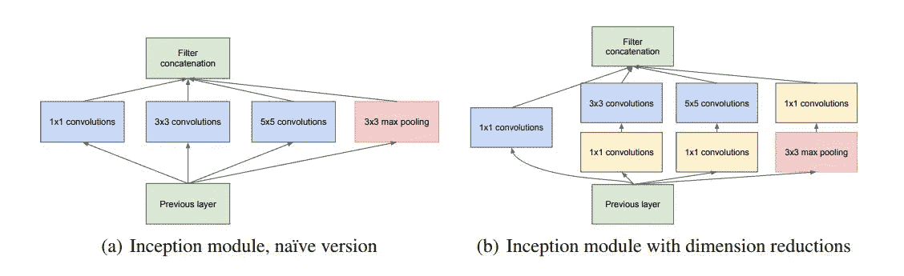

Inception module

使用这些初始模块的原因:

1.  每种图层类型从输入中提取不同的信息。从 3×3 层收集的信息将不同于从 5×5 层收集的信息。我们如何知道在给定的层上哪种转换是最好的呢？所以我们都用！
2.  使用 1×1 卷积进行降维！考虑一个 128x128x256 的输入。如果我们让它通过 20 个大小为 1×1 的滤波器，我们将得到 128×128×20 的输出。因此，我们在 3×3 或 5×5 卷积之前应用它们，以减少用于降维的初始块中这些层的输入滤波器数量。

**GoogLeNet/Inception —架构**

完整的初始架构:


[***Going deeper with convolutions***](https://arxiv.org/pdf/1409.4842.pdf)

你可能会在这个结构中看到一些带 softmax 的“辅助分类器”。这里引用一篇论文——“通过添加连接到这些中间层的辅助分类器，我们希望鼓励分类器中较低阶段的区分，增加传播回来的梯度信号，并提供额外的正则化。”

但这意味着什么呢？基本上他们的意思是:

1.  在较低阶段的辨别:我们将在网络中训练较低的层，其梯度来自于输出概率的较早阶段的层。这确保了网络在早期对不同的对象有一些区分。
2.  增加传播回来的梯度信号:在深度神经网络中，通常，流回来的梯度(使用反向传播)变得如此之小，以至于网络的早期层几乎无法学习。因此，较早的分类层通过传播强梯度信号来训练网络是有帮助的。
3.  提供额外的正则化:深度神经网络倾向于过拟合(或导致高方差)数据，而小型神经网络倾向于欠拟合(或导致高偏差)。早期的分类器调整更深层的过度拟合效果！

辅助分类器的结构:

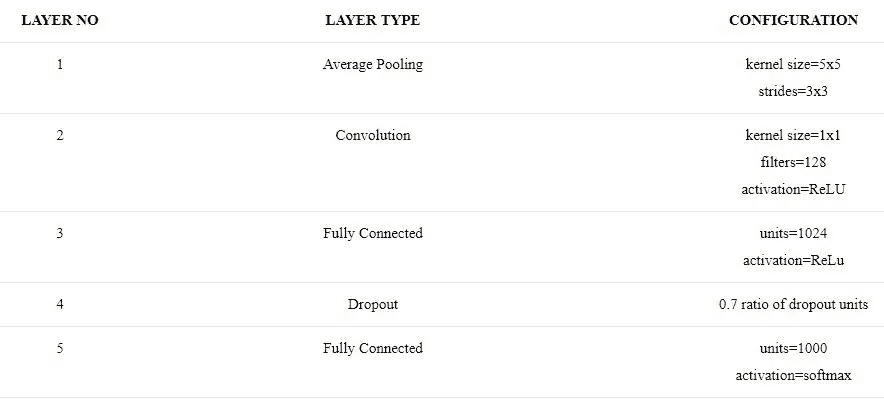

> 注意:这里，
> 
> #1×1 表示初始模块中 1×1 卷积中的滤波器。
> 
> #3×3 reduce 表示初始模块中 3×3 卷积之前的 1×1 卷积中的滤波器。
> 
> #5×5 reduce 表示初始模块中 5×5 卷积之前的 1×1 卷积中的滤波器。
> 
> #3×3 表示初始模块中 3×3 卷积中的滤波器。
> 
> #5×5 表示初始模块中 5×5 卷积中的滤波器。
> 
> Pool Proj 表示初始模块中最大池之前的 1×1 卷积中的过滤器。

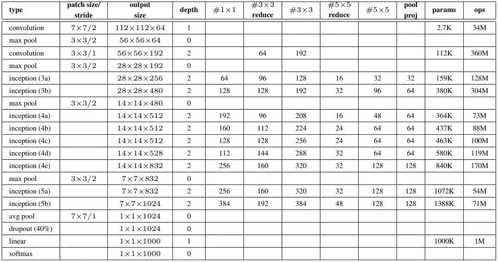

GoogLeNet incarnation of the Inception architecture

它使用了批量标准化，图像失真和 RMSprop，这些我们将在以后的文章中讨论。

GoogLeNet/Inception —代码

```
from keras import layers
from keras.models import Model

from functools import partial

conv1x1 = partial(layers.Conv2D, kernel_size=1, activation='relu')
conv3x3 = partial(layers.Conv2D, kernel_size=3, padding='same', activation='relu')
conv5x5 = partial(layers.Conv2D, kernel_size=5, padding='same', activation='relu')

def inception_module(in_tensor, c1, c3_1, c3, c5_1, c5, pp):
    conv1 = conv1x1(c1)(in_tensor)

    conv3_1 = conv1x1(c3_1)(in_tensor)
    conv3 = conv3x3(c3)(conv3_1)

    conv5_1 = conv1x1(c5_1)(in_tensor)
    conv5 = conv5x5(c5)(conv5_1)

    pool_conv = conv1x1(pp)(in_tensor)
    pool = layers.MaxPool2D(3, strides=1, padding='same')(pool_conv)

    merged = layers.Concatenate(axis=-1)([conv1, conv3, conv5, pool])
    return merged

def aux_clf(in_tensor):
    avg_pool = layers.AvgPool2D(5, 3)(in_tensor)
    conv = conv1x1(128)(avg_pool)
    flattened = layers.Flatten()(conv)
    dense = layers.Dense(1024, activation='relu')(flattened)
    dropout = layers.Dropout(0.7)(dense)
    out = layers.Dense(1000, activation='softmax')(dropout)
    return out

def inception_net(in_shape=(224,224,3), n_classes=1000, opt='sgd'):
    in_layer = layers.Input(in_shape)

    conv1 = layers.Conv2D(64, 7, strides=2, activation='relu', padding='same')(in_layer)
    pad1 = layers.ZeroPadding2D()(conv1)
    pool1 = layers.MaxPool2D(3, 2)(pad1)
    conv2_1 = conv1x1(64)(pool1)
    conv2_2 = conv3x3(192)(conv2_1)
    pad2 = layers.ZeroPadding2D()(conv2_2)
    pool2 = layers.MaxPool2D(3, 2)(pad2)

    inception3a = inception_module(pool2, 64, 96, 128, 16, 32, 32)
    inception3b = inception_module(inception3a, 128, 128, 192, 32, 96, 64)
    pad3 = layers.ZeroPadding2D()(inception3b)
    pool3 = layers.MaxPool2D(3, 2)(pad3)

    inception4a = inception_module(pool3, 192, 96, 208, 16, 48, 64)
    inception4b = inception_module(inception4a, 160, 112, 224, 24, 64, 64)
    inception4c = inception_module(inception4b, 128, 128, 256, 24, 64, 64)
    inception4d = inception_module(inception4c, 112, 144, 288, 32, 48, 64)
    inception4e = inception_module(inception4d, 256, 160, 320, 32, 128, 128)
    pad4 = layers.ZeroPadding2D()(inception4e)
    pool4 = layers.MaxPool2D(3, 2)(pad4)

    aux_clf1 = aux_clf(inception4a)
    aux_clf2 = aux_clf(inception4d)

    inception5a = inception_module(pool4, 256, 160, 320, 32, 128, 128)
    inception5b = inception_module(inception5a, 384, 192, 384, 48, 128, 128)
    pad5 = layers.ZeroPadding2D()(inception5b)
    pool5 = layers.MaxPool2D(3, 2)(pad5)

    avg_pool = layers.GlobalAvgPool2D()(pool5)
    dropout = layers.Dropout(0.4)(avg_pool)
    preds = layers.Dense(1000, activation='softmax')(dropout)

    model = Model(in_layer, [preds, aux_clf1, aux_clf2])
    model.compile(loss="categorical_crossentropy", optimizer=opt,
	              metrics=["accuracy"])
    return model

if __name__ == '__main__':
    model = inception_net()
    print(model.summary())
```

## ResNet 何等

2015 年 imagenet 比赛带来了 3.57%的 top-5 错误率，低于 top-5 上的人为错误。这是由于微软在竞争中使用的 ResNet(剩余网络)模型。该网络引入了一种叫做“跳过连接”的新方法。


Residual learning: a building block.

这个想法是作为对一个观察结果的解决方案出现的——*深度神经网络随着我们不断增加层*表现越来越差。但直觉上来说，不应该是这样的。如果有 k 层的网络表现为 y，那么有 k+1 层的网络至少应该表现为 y。

这个观察带来了一个假设:*直接映射很难学*。因此，不要学习层的输出和它的输入之间的映射，而是学习它们之间的差异——学习*残差*。

比如说，x 是输入，H(x)是学习输出。因此，我们需要学习 F(x) = H(x) — x。我们可以这样做，首先制作一个层来学习 F(x)，然后将 x 加到 F(x)上，从而获得 H(x)。结果，我们在下一层发送了与我们之前应该发送的相同的 H(x )!这就产生了我们上面看到的残余块。

结果令人惊讶，因为通常使深度神经网络对学习麻木的消失梯度问题被消除了。怎么会？我们可以称之为“跳过连接”或“捷径”,它为之前的层提供了一个渐变的捷径，跳过了中间的一堆层。

**ResNet —架构**


让我们在这里使用它:

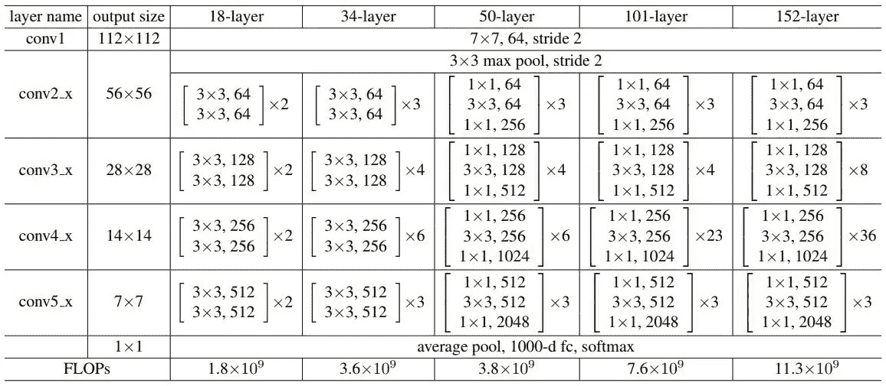

这篇文章提到了瓶颈在更深层次上的应用— 50/101/152。该网络不使用上述残差块，而是使用 1×1 卷积来增加和减少信道数量的维度。

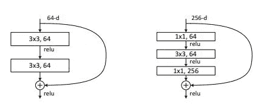

**ResNet —代码**

```
from keras import layers
from keras.models import Model

def _after_conv(in_tensor):
    norm = layers.BatchNormalization()(in_tensor)
    return layers.Activation('relu')(norm)

def conv1(in_tensor, filters):
    conv = layers.Conv2D(filters, kernel_size=1, strides=1)(in_tensor)
    return _after_conv(conv)

def conv1_downsample(in_tensor, filters):
    conv = layers.Conv2D(filters, kernel_size=1, strides=2)(in_tensor)
    return _after_conv(conv)

def conv3(in_tensor, filters):
    conv = layers.Conv2D(filters, kernel_size=3, strides=1, padding='same')(in_tensor)
    return _after_conv(conv)

def conv3_downsample(in_tensor, filters):
    conv = layers.Conv2D(filters, kernel_size=3, strides=2, padding='same')(in_tensor)
    return _after_conv(conv)

def resnet_block_wo_bottlneck(in_tensor, filters, downsample=False):
    if downsample:
        conv1_rb = conv3_downsample(in_tensor, filters)
    else:
        conv1_rb = conv3(in_tensor, filters)
    conv2_rb = conv3(conv1_rb, filters)

    if downsample:
        in_tensor = conv1_downsample(in_tensor, filters)
    result = layers.Add()([conv2_rb, in_tensor])

    return layers.Activation('relu')(result)

def resnet_block_w_bottlneck(in_tensor,
                             filters,
                             downsample=False,
                             change_channels=False):
    if downsample:
        conv1_rb = conv1_downsample(in_tensor, int(filters/4))
    else:
        conv1_rb = conv1(in_tensor, int(filters/4))
    conv2_rb = conv3(conv1_rb, int(filters/4))
    conv3_rb = conv1(conv2_rb, filters)

    if downsample:
        in_tensor = conv1_downsample(in_tensor, filters)
    elif change_channels:
        in_tensor = conv1(in_tensor, filters)
    result = layers.Add()([conv3_rb, in_tensor])

    return result

def _pre_res_blocks(in_tensor):
    conv = layers.Conv2D(64, 7, strides=2, padding='same')(in_tensor)
    conv = _after_conv(conv)
    pool = layers.MaxPool2D(3, 2, padding='same')(conv)
    return pool

def _post_res_blocks(in_tensor, n_classes):
    pool = layers.GlobalAvgPool2D()(in_tensor)
    preds = layers.Dense(n_classes, activation='softmax')(pool)
    return preds

def convx_wo_bottleneck(in_tensor, filters, n_times, downsample_1=False):
    res = in_tensor
    for i in range(n_times):
        if i == 0:
            res = resnet_block_wo_bottlneck(res, filters, downsample_1)
        else:
            res = resnet_block_wo_bottlneck(res, filters)
    return res

def convx_w_bottleneck(in_tensor, filters, n_times, downsample_1=False):
    res = in_tensor
    for i in range(n_times):
        if i == 0:
            res = resnet_block_w_bottlneck(res, filters, downsample_1, not downsample_1)
        else:
            res = resnet_block_w_bottlneck(res, filters)
    return res

def _resnet(in_shape=(224,224,3),
            n_classes=1000,
            opt='sgd',
            convx=[64, 128, 256, 512],
            n_convx=[2, 2, 2, 2],
            convx_fn=convx_wo_bottleneck):
    in_layer = layers.Input(in_shape)

    downsampled = _pre_res_blocks(in_layer)

    conv2x = convx_fn(downsampled, convx[0], n_convx[0])
    conv3x = convx_fn(conv2x, convx[1], n_convx[1], True)
    conv4x = convx_fn(conv3x, convx[2], n_convx[2], True)
    conv5x = convx_fn(conv4x, convx[3], n_convx[3], True)

    preds = _post_res_blocks(conv5x, n_classes)

    model = Model(in_layer, preds)
    model.compile(loss="categorical_crossentropy", optimizer=opt,
	              metrics=["accuracy"])
    return model

def resnet18(in_shape=(224,224,3), n_classes=1000, opt='sgd'):
    return _resnet(in_shape, n_classes, opt)

def resnet34(in_shape=(224,224,3), n_classes=1000, opt='sgd'):
    return _resnet(in_shape,
                  n_classes,
                  opt,
                  n_convx=[3, 4, 6, 3])

def resnet50(in_shape=(224,224,3), n_classes=1000, opt='sgd'):
    return _resnet(in_shape,
                  n_classes,
                  opt,
                  [256, 512, 1024, 2048],
                  [3, 4, 6, 3],
                  convx_w_bottleneck)

def resnet101(in_shape=(224,224,3), n_classes=1000, opt='sgd'):
    return _resnet(in_shape,
                  n_classes,
                  opt,
                  [256, 512, 1024, 2048],
                  [3, 4, 23, 3],
                  convx_w_bottleneck)

def resnet152(in_shape=(224,224,3), n_classes=1000, opt='sgd'):
    return _resnet(in_shape,
                  n_classes,
                  opt,
                  [256, 512, 1024, 2048],
                  [3, 8, 36, 3],
                  convx_w_bottleneck)

if __name__ == '__main__':
    model = resnet50()
    print(model.summary())
```

# 参考资料:

1.  [基于梯度的学习应用于文档识别](http://yann.lecun.com/exdb/publis/pdf/lecun-01a.pdf)
2.  [基于梯度学习的物体识别](http://yann.lecun.com/exdb/publis/pdf/lecun-99.pdf)
3.  [用深度卷积神经网络进行 ImageNet 分类](https://papers.nips.cc/paper/4824-imagenet-classification-with-deep-convolutional-neural-networks.pdf)
4.  [用于大规模图像识别的极深度卷积网络](https://arxiv.org/pdf/1409.1556.pdf)
5.  [用回旋更深入](https://arxiv.org/pdf/1409.4842.pdf)
6.  [用于图像识别的深度残差学习](https://arxiv.org/pdf/1512.03385.pdf)