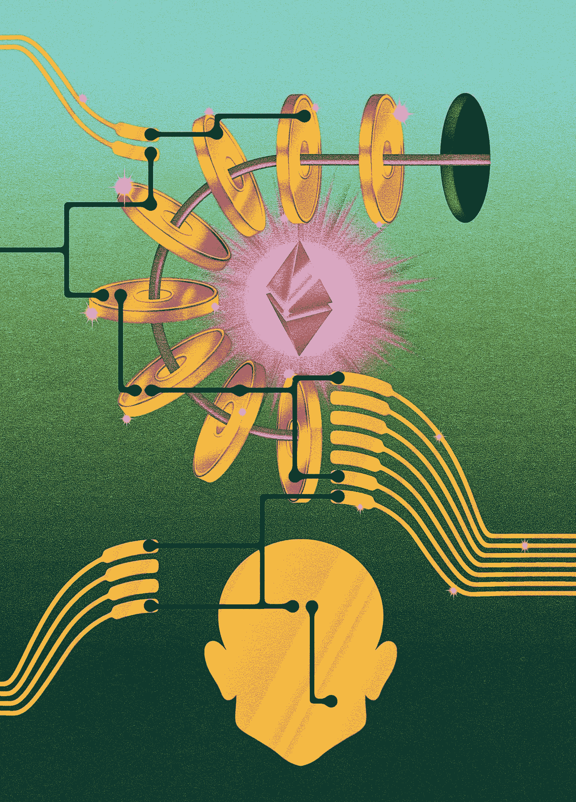
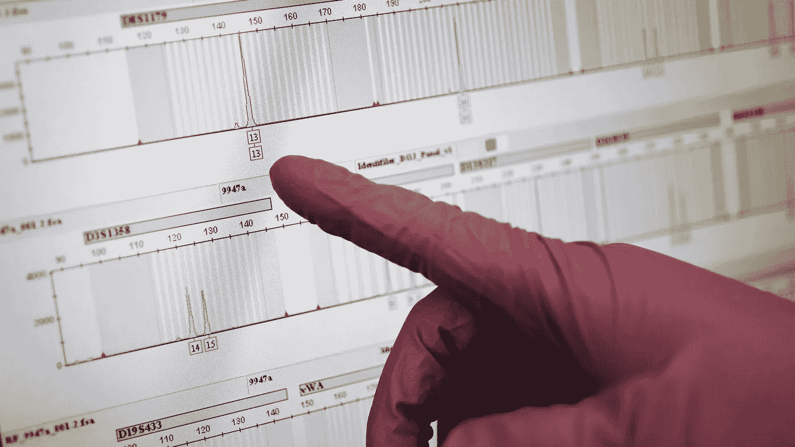
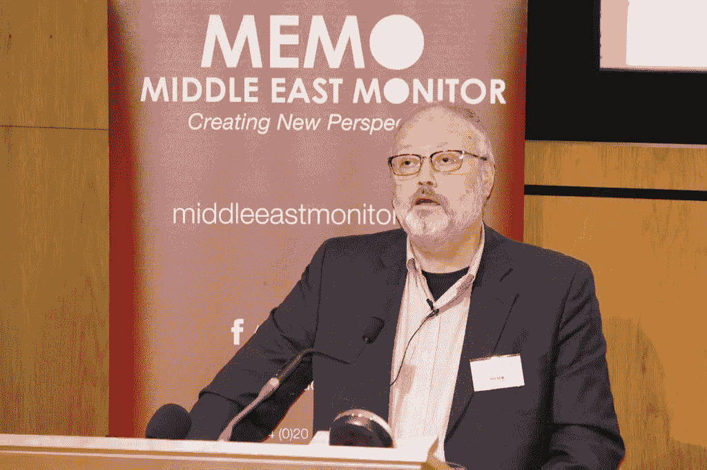

# 五读:以太坊冲击世界

> 原文：<https://medium.datadriveninvestor.com/five-reads-ethereum-impacts-the-world-9e15d700f22d?source=collection_archive---------26----------------------->

## 《阿甘正传》四部曲:2018 年 10 月 19 日

接下来是我们对过去几天发现的五个最引人注目的故事的综述。每周在这个空间寻找这个专栏。

*如果你想要更多引人注目和前瞻性的内容，那么看看本周早些时候发生的本赛季最大的内容公告***(来自 SXSW PanelPicker 的 500 多个会话)。**

**否则，我们鼓励你早读书，常读书！**

***以太坊可能如何改变世界** 在《纽约客》的[勇敢新世界栏目](https://www.newyorker.com/magazine/2018/10/22/the-prophets-of-cryptocurrency-survey-the-boom-and-bust)中，尼克·鲍姆加滕(Nick Paumgarten)邀请“加密货币的预言家们”调查该行业的繁荣与萧条，并深入“关于比特币、以太坊和区块链是否正在改变世界的持续争论中”这是一篇冗长的文章，但对于任何希望抓住以太坊联合创始人约瑟夫·卢宾(Joseph Lubin)的人来说，这是一篇极好的背景阅读，他是 2019 SXSW [区块链和加密货币赛道](https://www.sxsw.com/conference/blockchain-cryptocurrency/)的主题演讲人。一个有趣的卢宾评论道:“作为一个生活在指数时代的人是很难的。”*

**

***挖掘大脑以扩大人工智能** 每个人都已经在我们体内装了一台电脑:我们的大脑。硅谷兽医杰夫·霍金斯(Jeff Hawkins)花了数年时间试图更多地了解灰质是如何工作的——这样他就可以对其进行逆向工程。在《纽约时报》的一篇文章《T4》中，霍金斯说，在世界能够建造人工智能之前，它必须弄清楚如何建造像大脑一样工作的机器。这篇文章预告了他的公司发布的新研究。
在另一则人工智能新闻中，该领域向前迈出了一大步[宣布](https://www.nytimes.com/2018/10/15/technology/mit-college-artificial-intelligence.html?action=click&module=In%20Other%20News&pgtype=Homepage&action=click&module=Latest&pgtype=Homepage)麻省理工学院将斥资 10 亿美元建立一所新学院，专注于为学生探索麻省理工学院斯蒂芬·a·施瓦茨曼计算学院的人工智能课程做准备，该学院将于 2019 年秋季开学。还有，在 SXSW 2019 的[智能未来赛道继续探索明年春天的 A.I。](https://schedule.sxsw.com/2019/events/track/Intelligent%20Future)*

**

***天才之死**
保罗·艾伦从未停止像黑客一样思考。在《连线》杂志为这位于周一因非霍奇金淋巴瘤去世、享年 65 岁的微软联合创始人撰写的讣告中，克林特·芬利打开了一扇通往天才心灵的窗户，这位天才从未停止寻找下一个突破并实现一个异想天开的梦想。他使他的许多“疯狂的想法”成为现实。正如比尔·盖茨在童年好友去世后的一份声明中所说，“没有他，个人电脑就不会存在。”艾伦在晚年成为一名慈善家，向艾伦脑科学研究所和艾伦人工智能研究所捐赠了大量资金。*

**

*保护基因隐私可能为时已晚
基因检测上周成为重大新闻，这要感谢一位[可能成为 2020 年总统候选人的](https://elizabethwarren.com/fact-squad/heritage/?source=BPI2018-AN-GS-US_C&subsource=GS-General-Warren%20trump&utm_source=BPI-GS&utm_campaign=BPI2018-AN-GS-US_C&utm_term=Warren%20trump&gclid=CjwKCAjw3qDeBRBkEiwAsqeO7qsoH9CHrp4ARigEd6fmNKr6AdiswXwno9fmGSzOmiFJi-LGeDaaBxoCO40QAvD_BwE)，他似乎没有意识到事实对这位椭圆形办公室官员来说无关紧要。但是在《洛杉矶时报》上，[黛博拉·内特本报道了一项研究，该研究表明大多数美国人在涉及到他们的 DNA 时，无意中失去了他们的隐私。“这项新研究背后的研究人员表示，一旦 300 万美国人将他们的基因组上传到公共家谱网站，几乎每个美国人都可以通过他们的 DNA 和一些额外的线索来识别。”已经有 100 万人这样做了。](http://www.latimes.com/science/sciencenow/la-sci-sn-dna-genealogy-privacy-20181012-story.html)*

**

*很难知道从何说起贾马尔·哈肖吉，这位持不同政见的沙特记者显然被他自己政府的特工折磨、杀害和斩首。令我们震惊的是，美国政府为了保护盟友和商业伙伴，会对谋杀案置之不理到什么程度，目前还不得而知。但是 Khashoggi 在他死前为华盛顿邮报撰写的最后一篇专栏文章中，为阿拉伯世界的言论自由发出了尖锐的呼吁。凯伦·阿提亚(Karen Attiah)在编者按中写道，卡肖吉的专栏“完美地捕捉到了他对阿拉伯世界自由的承诺和热情。他显然为之献出生命的自由。”现在只要人们愿意为此做点什么。*

*休·福里斯特在全球最独特的创意专业人士聚会[*【SXSW】*](http://www.sxsw.com/)*担任首席编程官。他还试着每天至少在媒介上写四段***。这些帖子通常涵盖与技术相关的趋势；其他时候，他们关注书籍、流行文化、体育和其他时事。***