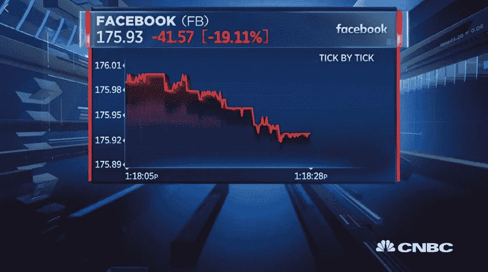
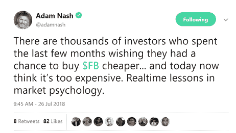
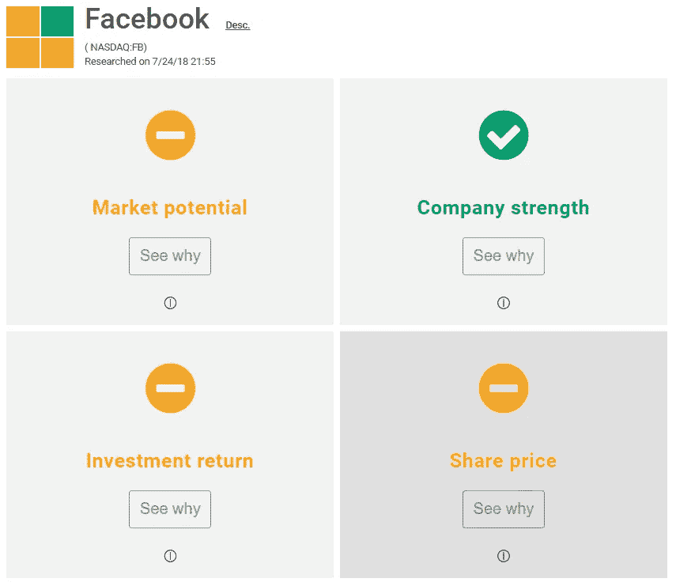
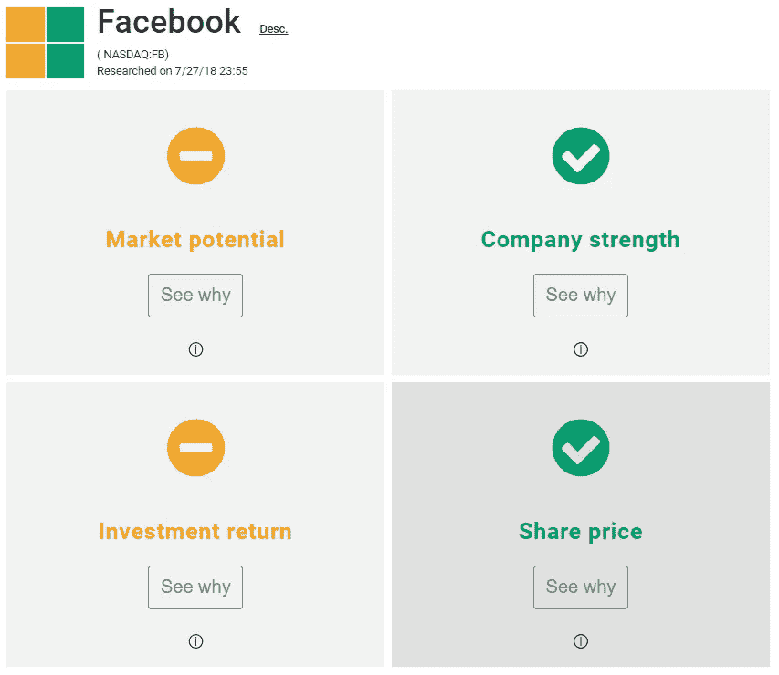

# 你不应该卖出脸书股票的五个理由

> 原文：<https://medium.datadriveninvestor.com/five-reasons-you-should-not-sell-your-facebook-stock-28f1da4cc8ed?source=collection_archive---------0----------------------->

7 月 25 日，美国消费者新闻与商业频道在脸书直播节目中直播了脸书股价下跌，而股市投资者却一片哗然！大多数投资者认为他们是逻辑和基于事实的决策者。但是，7 月 25 日，他们露出了真面目。亚当·纳什(董事会@Acorns。前 CEO @Wealthfront 等。)用最好的方式表达。

**你不应该卖出脸书股票的五个理由:**

**1)在 7 月 25 日之前，你是一名快乐的股东。**
你想卖掉脸书股票的唯一原因是，在 7 月 25 日，你对公司的感觉发生了变化。暂停一下，想想你在 7 月 25 日之前持有 FB 股票的 2-3 个理由。如果媒体对脸书的报道不是你投资 FB 的原因，那是什么改变了呢？

**2)你是一名长期投资者，总是把“买入并持有”作为你的主要投资策略。这意味着你投资于伟大的企业，只要他们保持伟大的企业，你就能与他们同甘共苦。从短期来看，公司实力与股价波动之间的关系有限。你认为买入并持有是什么意思？**

您同意，如果脸书投资于安全领域，它将成为一家更强大的公司。把你在媒体上听到的一切放在一边，问问你自己，投资于安全会让脸书变得更好吗？如果这很难回答，想象一下你的朋友是一个非常好的厨师，你投资了他的受欢迎的餐馆，忠诚的顾客对他们所有的朋友都赞不绝口。现在，厨房管道出了问题，它淹没了餐厅。你的厨师朋友周末关闭餐馆两天来修理东西。你是在敲门要求退钱吗？如果答案是否定的，用脸书的股票替换你朋友的餐馆，用数据泄露替换管道破裂事件。再回答问题！

没有你在脸书投资的钱，你也可以照常生活。7 月 25 日脸书传奇正是那种表明需要将你的生活开支和投资储蓄分开的事情。不要成为那个男生/女生。不要投资你需要的钱去过你现在的生活。投资是你储存起来的钱，用来建造你想要的生活，而不是你现在的生活。

7 月 25 日前后，脸书没变。如果你对控制自己的情绪、忠于事实和逻辑感到自豪，比较一下这两个形象:

Before July 25th price fall — Source: https://stockcard.io/FB

After July 25th price fall — Source: [https://stockcard.io/FB](https://stockcard.io/FB)

上面的是 7 月 25 日之前(传奇之前)脸书股票的备忘单，下面的是 7 月 2 日之后同样的投资备忘单。市场增长、公司实力和过去的投资回报都没有改变，唯一改变的是右下角的方框，这个方框显示，脸书股票价格已经进入低估范围。如果你想买便宜货，你认为你还能怎样买到便宜货？