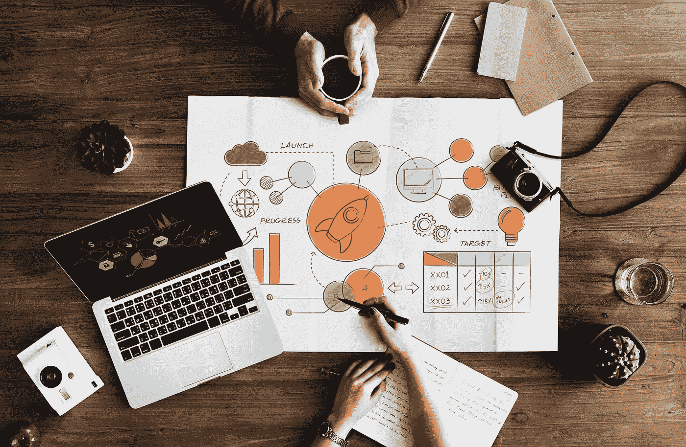
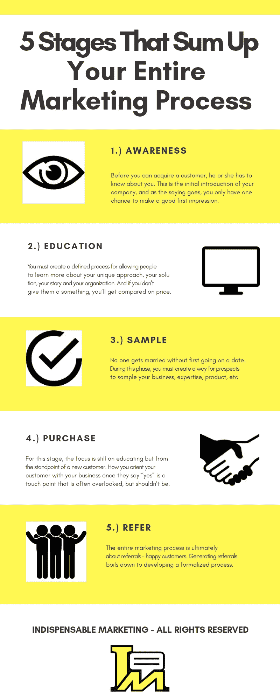

# 营销过程的五个阶段

> 原文：<https://medium.datadriveninvestor.com/five-stages-of-the-marketing-process-f28f15e69f25?source=collection_archive---------8----------------------->

大多数小企业主从非常传统和过时的角度看待客户之旅，包括认知、考虑和购买等阶段，但多年来，我一直在推动和咨询在我们今天生活的这个“以客户为中心的时代”执行更全面和有效的方法:认知、教育、样品、购买和推荐。

这些阶段也代表了解释和回答“什么是营销过程？”的最简单的方法简单实用的术语。在一天结束的时候，你需要理解(并且在某些情况下发展)一个领导在与你的组织发展关系时必须遵循的逻辑路径。

# 营销过程的五个阶段是什么？

# 营销过程由哪些活动组成？

**1。知名度** —你的广告、博客、有机搜索、公共关系、社交媒体参与、演讲、商业事件、内容和推荐线索
**2。教育** —你的网站、电话交谈、演讲、评论、客户推荐、电子邮件简讯、营销套件、白皮书、成功案例和销售演示
**3。样本** —您的审计、网络研讨会、课程、评估、提案、试用和演讲
**4。购买** —移交介绍、新客户工具包、季度活动、快速入门指南、回顾签到、深入的用户手册、交付、客户支持社区和财务安排
**5。参考** —张贴客户调查、礼券、客户答谢活动、营销材料中的特色成功案例以及合作伙伴介绍

# 构建营销流程

了解客户的接触点和旅程后，您可以开始用您的发现填充营销流程的逻辑阶段，这将带来更有利可图的业务。

通过采用这种营销过程方法，并对产生认知和建立信任给予同等的关注，你就可以让你的企业创造一种始于整个营销过程的动力。

为了开始思考营销流程概念和差距，您可能需要思考以下问题:

*   人们将如何了解我们的业务和品牌？
*   人们将如何信任我们的业务和品牌？
*   人们如何评价我们的业务和品牌？
*   人们如何从我们的服务或产品中获得更多？
*   我们如何有意识地产生推荐？

每当你进入一个新的市场或开发一种新产品或服务时，你都可以用这个营销过程框架来确保你的组织走上成功之路