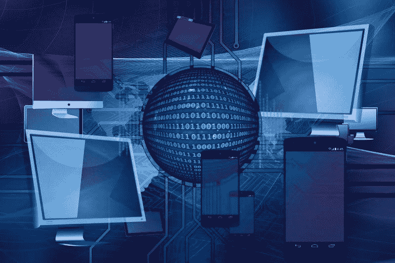
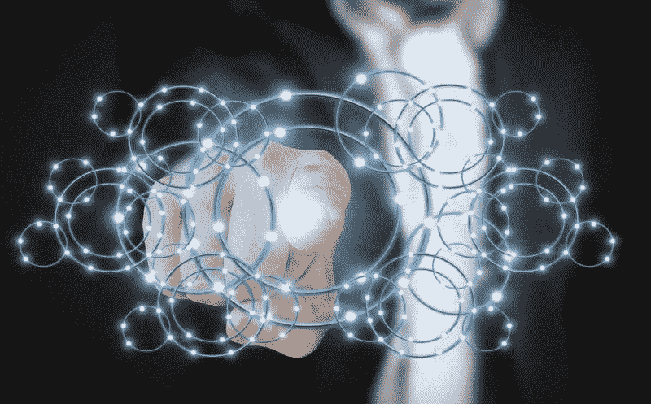
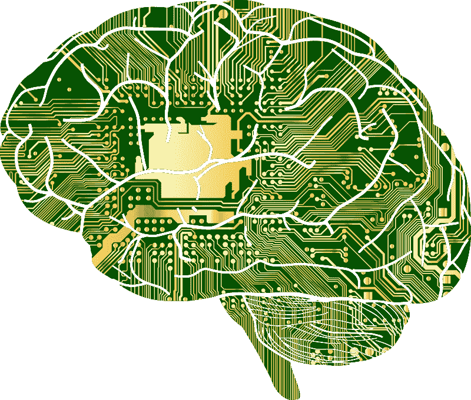
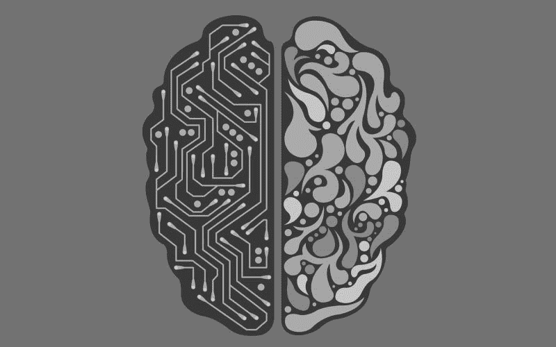
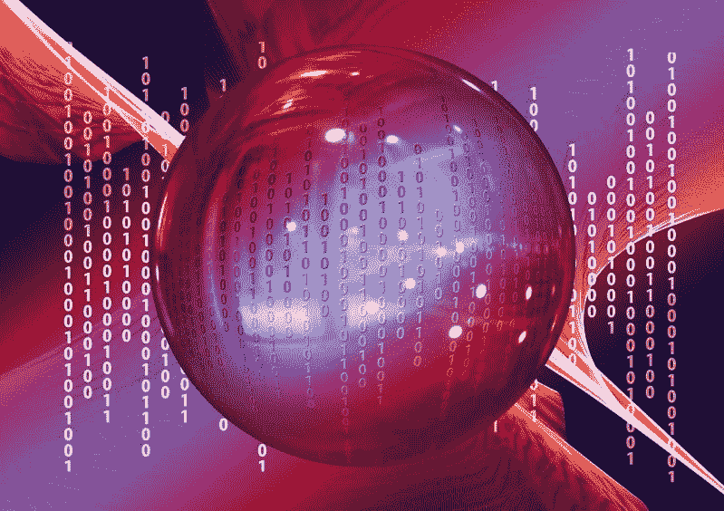

# 关于人工智能你需要知道的五件事——市场疯人院

> 原文：<https://medium.datadriveninvestor.com/five-things-you-need-to-know-about-artificial-intelligence-market-mad-house-f1cd400d1115?source=collection_archive---------14----------------------->

你需要了解人工智能(AI)，因为它很快就会扰乱我们的生活。不幸的是，大多数人对人工智能的了解都是炒作、歇斯底里和宣传，往往基于科幻小说。

关于人工智能，以下是每个人都必须了解的五件事:

 [## 挑战你对人工智能和社会的看法的 4 本书——数据驱动的投资者

### 深度学习、像人类一样思考的机器人、人工智能、神经网络——这些技术引发了…

www.datadriveninvestor.com](https://www.datadriveninvestor.com/2019/02/28/4-books-on-ai/) 

# 1.媒体贴上“AI”标签的，大部分都不是人工智能。

澄清一下，真正的人工智能会在没有人类帮助的情况下思考和创造。

相反，如今几乎所有贴上人工智能标签的东西都只不过是更好的数据处理。例如，在[机器人过程自动化](https://www.cio.com/article/3236451/what-is-rpa-robotic-process-automation-explained.html)中，数字算法执行一种功能，例如重复交易股票。他们称之为机器人，因为数字机器人做这项工作。然而，数字机器人只是模仿人类的行为，没有思考。

在[机器学习](https://www.sas.com/en_us/insights/analytics/machine-learning.html)中，计算机或算法检测到一种模式，并基于该模式做出决定。例如，**网飞(纳斯达克股票代码:NFLX)** 根据你过去的选择，使用机器学习来推荐视频。

机器人过程自动化和机器学习依赖于原始计算能力；不是创造力，而是决策。机器学习算法比人类决策更快，因为它们处理数据的速度远远超过人类。因此，网飞的算法可以检查网站库中的每一个视频，并将标题与你过去的选择进行匹配。

# 2.算法和机器人不需要 AI 胜过人类。

值得注意的是，Alpha Go Zero 算法使用机器学习来教会自己玩复杂的策略游戏 Go。

Alpha Go Zero 在没有人类帮助的情况下，通过研究超过 100，000 场围棋比赛的数据库来学习围棋， *The Verge* [报道](https://www.sas.com/en_us/insights/analytics/machine-learning.html)。此外，该算法的早期版本在 2017 年的四场比赛中击败了世界围棋冠军。

计算机科学家认为，一种算法要掌握围棋需要几十年的时间，围棋是一种以难度著称的中国游戏， *The Verge* [揭示了](https://www.theverge.com/2017/5/27/15704088/alphago-ke-jie-game-3-result-retires-future)。但是，阿尔法围棋；从 **Alphabet 的**，DeepMind 子公司学会了在几个小时内主宰游戏。此外，阿尔法围棋提出了冠军们不知道的新围棋策略。

因此，算法可以快速学习并成功完成复杂的任务。学习一项任务所需的所有算法都是关于该任务的大量原始数据。

# 3.算法不需要 AI 来抢你的饭碗。

例如，**沃尔玛(纽约证券交易所:WMT)** 正在[使用](https://marketmadhouse.com/walmarts-ai-customer-surveillance-raises-ethical-questions/)算法来监控长岛一家商店的顾客行为、货架上的商品水平和库存。具体来说，智能零售实验室的算法通过摄像机监视货架和过道。

如果货架是空的；或者接近空的时候，该算法指示人类助手重新进货。此外，算法可以检测出溢出或商品摆放不当等问题。

沃尔玛在纽约莱维敦的邻里市场商店的目标是减少对经理的需求。希望通过淘汰高薪经理来降低劳动力成本和改善客户服务。并非巧合的是，美国消费者新闻与商业频道声称沃尔玛正在想办法精简管理人员。

沃尔玛的算法可能使用机器学习来跟踪商品。然而，零售管理并不是人工智能可能威胁的唯一工作。

自动驾驶汽车和自动半挂牵引车机器学习自学如何驾驶。为了澄清，车辆的算法会检查交通模式、路况、路线、交通法规和其他数据，以模拟人类驾驶员。

美国邮政署​[、](https://cdllife.com/2019/usps-tries-out-robot-trucks-to-replace-team-truckers/)[、**亚马逊**、](https://www.cnbc.com/2019/01/30/amazon-is-hauling-cargo-in-self-driving-trucks-developed-by-embark.html)、**(纳斯达克股票代码:AMZN)、**和[沃尔沃](https://singularityhub.com/2018/10/11/no-safety-driver-here-volvos-new-driverless-truck-cuts-the-cab/)都是测试无人驾驶半卡车的机构。目前，自动驾驶的大型钻机在州际公路上的仓库之间进行长距离行驶。

# 4.你害怕智能机器和人工智能是对的。

在错误的手中，像机器学习、机器人流程自动化和人工智能这样的技术可能会造成很大的破坏。例如，交易机器人可能会导致股票崩盘；或大宗商品市场，盲目地快速卖出大量股票或衍生品。

更可怕的场景是坏人利用机器学习来增强他们的能力。例如，算法可以帮助恐怖分子制造更大更具破坏性的炸弹。

欺诈者可以使用 Alpha Go 之类的工具来设计更有效的骗局。与此同时，窃贼可以使用 Alpha Go 这样的程序来策划更有效的抢劫。黑客可以利用机器学习来破解代码和安全。

最后，机器学习可以让坦克、无人机、导弹、鱼雷、潜艇、武装直升机和战斗机等战争机器更加致命、更具破坏性。一种算法可以分析军事历史和过去的数据，为无人机或机器人坦克设计更好的战术。

该算法可以引导导弹；或炮火，攻击防御工事中最薄弱的地方；或者一艘战舰。因此，机器学习可能会让下一场战争更加致命。

# 5.真正的人工智能可能会到来，但谁也不知道它会在什么时候到来。

专家认为人工智能和人类一样聪明；或者“人工智能(AGI)”是可能的，但是还没有制造出来。事实上，*未来派的*丹·罗毕茨基[写的](https://futurism.com/human-level-artificial-intelligence-agi)；“我们不知道如何建设 AGI。”

相反，所有媒体标签“AI”的构造都是更快、更令人印象深刻的数据处理器。然而，我们在数据处理方面越来越棒。

创建一个 AGI；“大脑”的委婉说法远比数据处理复杂。例如，AGI 将不得不分析数十亿个主题的数据并得出结论。

重要的是，专家们认为 AGI 是可能的。GoodAI 和 SingularityNet 估计，事实上，98%的计算机专家认为人类水平的人工智能是可能的。另一方面，专家们对我们何时能实现人类水平的人工智能意见不一。

# 人工智能可能在 10 年后出现

Robitzski 报告说，引人注目的是，37%的专家认为我们将在 10 年内创造 AGI。另外，28%的专家认为我们将需要 20 年来开发人工智能。因此，65%的专家认为我们将在 2040 年前发展出人类级别的人工智能。

在这种情况下，到 2050 年，我们可以造出比人类聪明得多的机器。因此，我们最好现在就讨论 AGI 的哲学、伦理、政治和实践意义。

我的预测是，人类水平的人工智能将在我们的有生之年到来。然而，在 AGI 到来之前，像机器学习和机器人流程自动化这样的技术将彻底扰乱我们的生活和经济。

*原载于 2019 年 6 月 5 日*[*【https://marketmadhouse.com】*](https://marketmadhouse.com/five-things-you-need-to-know-about-artificial-intelligence/)*。*