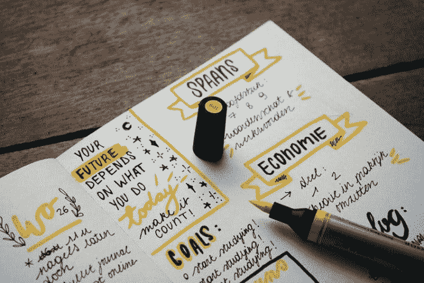

# 开始并坚持你的目标的五个建议

> 原文：<https://medium.datadriveninvestor.com/five-tips-to-start-and-stick-with-your-goals-cdb317e5fef0?source=collection_archive---------14----------------------->

与巴勃罗·毕加索一起策划你的总体规划(二手灵感项目)

Photo by [Estée Janssens](https://unsplash.com/@esteejanssens?utm_source=unsplash&utm_medium=referral&utm_content=creditCopyText) on [Unsplash](https://unsplash.com/s/photos/goals?utm_source=unsplash&utm_medium=referral&utm_content=creditCopyText)

二手灵感项目从一句激励性的引语开始，在创造性道路蜿蜒的任何地方冒险。

> “[我们的目标只能通过计划的载体](http://www.success.com/article/10-steps-to-achieve-any-goal)来实现，我们必须坚信这个计划，并且必须积极行动。没有其他的成功之路。”—巴勃罗*毕加索*

我从各种各样的人那里听到了许多绝妙的想法。我觉得很神奇。

人们为新的文学作品探索他们的思想，头脑风暴以提炼技术流程，并形成创新的解决方案，这种独创性令人惊叹。他们的理念是高超的。他们的理论很有趣。即使没有一个单词或一段代码被公式化，我也非常想看到他们潜在的最终产品。

几周后，我可能会问，“这个想法怎么样了？你完成了多少？”

答案往往是，“我还没做多少事情。”

在某种程度上，几乎每个人都考虑过写故事、作曲、画肖像或其他创造性的努力。同样，在工作中，我们都在幻想发现下一个解决方案，给我们的公司带来竞争优势，促进我们的职业发展。

 [## 面向 Noobs |数据驱动型投资者的数字身份

### 聪明人如何在增强现实中创造身份价值？我最近刚满 40 岁。作为一个生物…

www.datadriveninvestor.com](https://www.datadriveninvestor.com/2019/02/28/digital-identity-for-noobs/) 

我们都希望看到我们的想法从构思到完成都欣欣向荣。

保持对目标的专注可能很难，但也不一定不可能。这里有五个技巧来调整你的心态，并推动你越过分隔你的愿望和现实的精神障碍。

# 行动。然后继续，直到你取得进展。

听起来很直观，对吧？如果你想完成某件事，那么你需要采取行动。但是人们太专注于细节、疑虑或分心的事物，以至于他们还没走出起跑线就停下来了。

在项目的早期阶段停滞不前可能是危险的。你会失去动力，降档，然后空转而不是前进。

例如，在写作项目的第一阶段，世界是一张充满可能性的白纸。过分专注于特定的台词、场景或对话片段会导致视野狭窄。你的注意力变得狭窄，想法变得混乱或乏味。这削弱了你的动力，让你忘记了开始时的想法。

同样，在一个新工作项目的开始阶段，你可能有一些绝妙的想法，但不知道如何推进它们。但是如果你徘徊在不确定性中，你可能永远也不会找到最终的解决方案。例如，花几个小时去研究一个复杂的微软 Excel 函数，而不是完整地记录你的灵光一现可能会阻碍你的整体进步。

从大处着手。把你的新想法写在纸上或屏幕上。稍后可以进行修改。

不要让细节、怀疑或分心这三个因素阻止你追逐成功。一旦你开始朝着你的目标前进，这三个 d 在你的后视镜里看起来会很微小。

# 别对自己太苛刻了。说真的。

我们都会犯错。一路上磕磕绊绊是迈向成功的常见副作用。

如果你被驱使，你可能会成为自己最糟糕的批评家，对自己过分苛刻。但是你不必把整个世界的重量都扛在肩上，即使感觉你需要这样做。

对自己太苛刻会产生自责、自我批评、自我评判等负面想法和感受。你开始担心取悦别人，即使在这个过程中你并没有取悦自己。你会觉得你需要对每件事都说好，即使你想说不。你会过度劳累，直到你崩溃，然后收拾残局，从头再来。

这种行为无助于你达成目标。对自己苛刻可以成为一种动力，但只是在一定程度上。这是一个令人疲惫的习惯。你的精力最好花在瞄准你的目标上，而不是憎恨自己。

# 对你的目标感兴趣。

最令人困惑的现象之一是，成功者有时会对他们追求的目标失去兴趣。他们完成了个人项目的一部分，但之后就无法继续了。他们的梦想破灭了。他们厌倦了，放弃了追求，尽管这仍然是他们想要完成的事情。

你对自己的目标感兴趣吗？你最好是。

有东西引诱你到书桌前打开电脑。一些想法促使你拿起画板或日记。一些紧急情况促使你今晚去舞蹈室。

回想一下那个催化剂。是什么引发了那场火灾？是什么让你在晚上坐立不安，或者在白天抓住了你的注意力？什么样的激情让你的思维转向了一个新的目标？

一旦你记起了促使你开始的那点灵感，就不要忘记它。紧紧抓住它。它不仅会在最初的步骤中有所帮助，还会在更长期目标的后期阶段有所帮助，比如完成一部小说或为三项全能运动进行训练。

集中精神。要有激情。欣赏你的目标和旅程。相信自己。

Photo by [Isaac Smith](https://unsplash.com/@isaacmsmith?utm_source=unsplash&utm_medium=referral&utm_content=creditCopyText) on [Unsplash](https://unsplash.com/s/photos/goals?utm_source=unsplash&utm_medium=referral&utm_content=creditCopyText)

# 制定一个一致的时间表(并坚持执行)。

你可能在翻白眼。*日程安排？*唉。

很难。我们都在应付太多的事情——事业、学业压力、课外活动、志愿者工作、家庭生活、健康问题等等。找到时间蹲下并专注于某件事，同时远离这些限制可能是一个挑战。根据日常生活的混乱程度，它可能会在睡眠和健康方面带来一些不幸的权衡。然而，找时间坚持不懈地(或者每天，如果可能的话)朝着一个目标努力是实现这个愿望的关键。

为什么？

因为如果你朝着一个目标努力的时间是支离破碎的，你的努力也会变得支离破碎。

一个早上 6 点就去健身房锻炼的勇士通常不是在一整天的工作和疲劳后下午 6 点才出现的人。那个人在两种情况下都得到了锻炼，但是其中一个可能比另一个更专注。

或者，如果你是一个夜猫子，在孩子们睡着后，你可能是一个更有效的作家，而不是在他们放学回家时试图写一个故事。如果你混合和匹配，你可能会发现你的部分情节脱节或声音不均匀。

找时间坐下来一段时间，朝着你关心的目标努力。这有助于使这些会议保持一致。如果你想让你的目标被认真对待，就要足够认真地制定一个适合你并能最大限度发挥你潜力的时间表。

# 不要只是拿着你够不到的胡萝卜晃来晃去——设定现实的里程碑来缩小差距。

当我开始我的课程时，一开始我觉得获得 MBA 学位的目标很艰巨。我白天在一家咨询公司工作，晚上上课。大多数走这条路的人需要三到四年才能走完，或者更久。

在我上完第一堂课后，我知道我坚持不了 3 年以上。我讨厌学校的所有事情——老师偏心、人们只为听到自己的声音而说话、不一致的评分——都被放大了，就像立体声音响开到最大音量一样。我想退出，逃避整件事，

我几乎放弃了自己在乎的东西，才说服自己为自己设定里程碑。

我受不了这种繁琐的程序，所以我制定了如何快速完成的策略。我制定了自己的道路，打算在两年内完成 MBA 课程——就像一名普通的全日制学生一样——同时保持白天工作/夜校的二分法。我列出了我想要的教授，潜在的暑期班，并致力于掌握快速阅读。我执行了这个计划，尽管只上了夜校，但还是在两年内拿到了 MBA 学位。

它之所以有效，是因为我设定了要达到的中间里程碑。短期目标演变为长期成功，并推动我保持专注，尽管机会渺茫，反对者不断。

里程碑是获得成功的最关键的步骤之一。也是最个人化的——你的里程碑不需要和其他人的相匹配。它们应该根据你的技能和舒适度量身定制。任何中期目标都是有价值的目标。专注于残局。想象自己在山顶，然后到达那里。

设定目标。评估你的努力，对你的进步诚实。做出调整以赢得胜利。

归根结底，你会从推动你前进的东西中获得动力。这些建议并不具有突破性，但它们可以帮助你集中注意力，确保你不会在最初几天的目标追逐后失败。

阿德里安·s·波特是一名作家、工程师、顾问和演说家。他写诗歌、短篇小说和各种主题的文章，包括创造力和个人成长。他是诗集[和散文集](https://www.amazon.com/Everything-Wrong-Feels-Adrian-Potter/dp/109519061X/ref=sr_1_4?qid=1560264651&refinements=p_27%3AAdrian+S.+Potter&s=books&sr=1-4&text=Adrian+S.+Potter)[的作者。在](https://e2857002-6118-41be-9746-64261e36cacb.filesusr.com/ugd/21d2c2_03522f10c7c84340a05a8d03a97e1642.pdf)[http://adrianspotter.com/](http://adrianspotter.com/)在线拜访他。

*原载于 2019 年 12 月 18 日*[*https://www.datadriveninvestor.com*](https://www.datadriveninvestor.com/2019/12/18/five-tips-to-start-and-stick-with-your-goals/)*。*