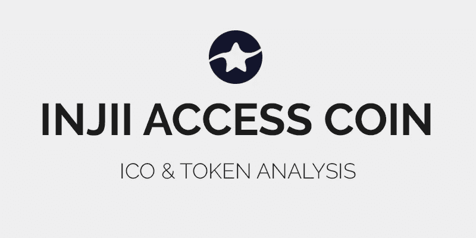
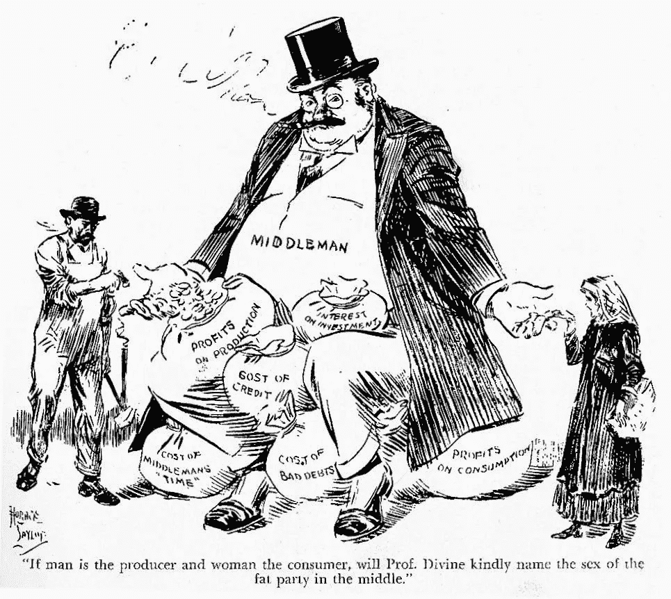
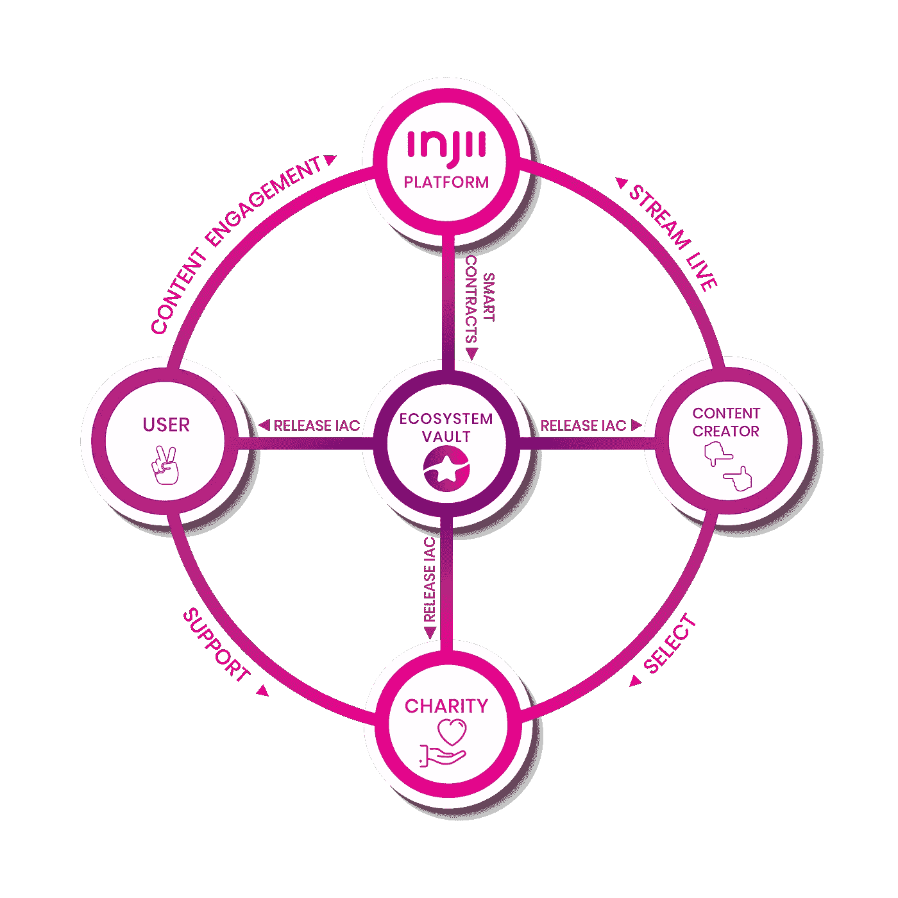
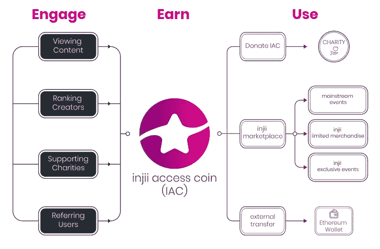
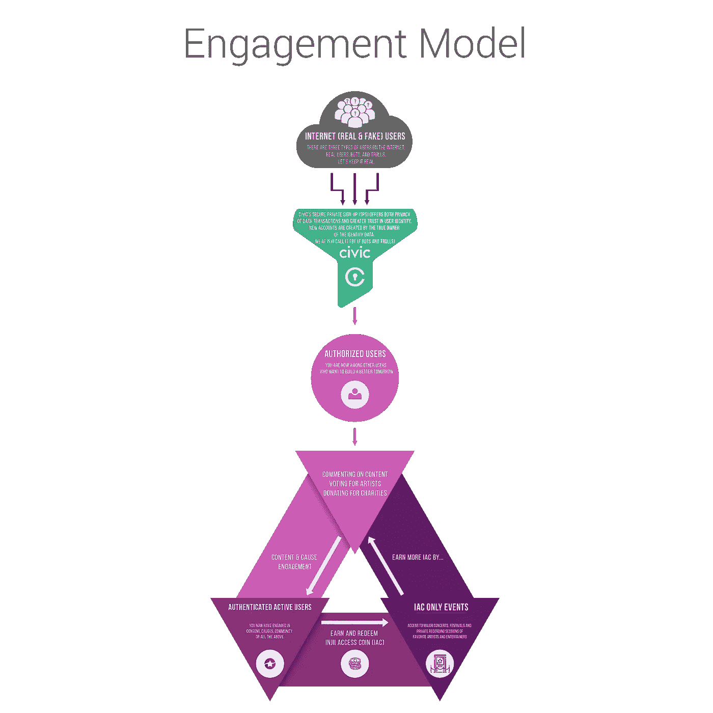
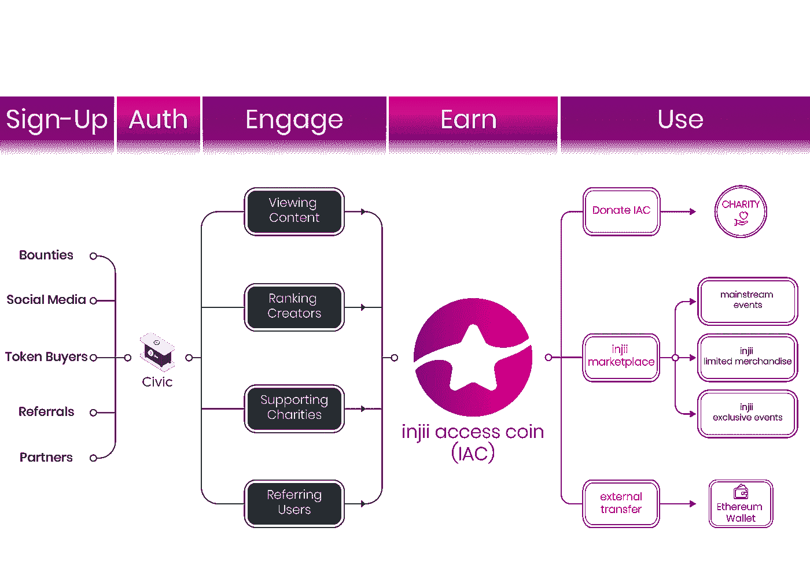
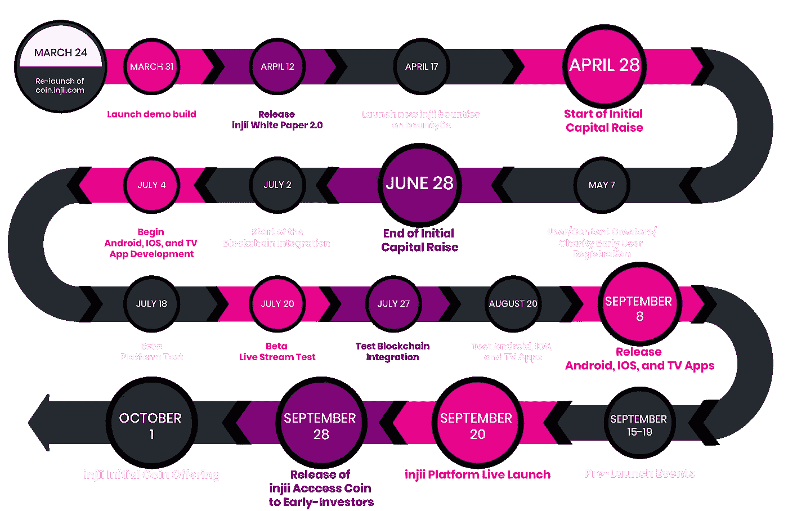
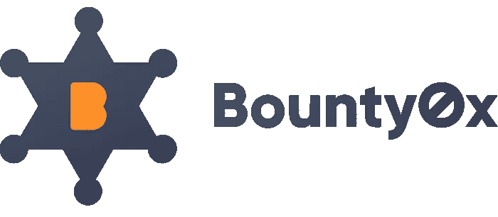

# 修复在线流媒体:从黑手党到 Injii 生态系统

> 原文：<https://medium.datadriveninvestor.com/fixing-online-streaming-from-a-mafia-to-an-ecosystem-with-injii-d8f6860b39a3?source=collection_archive---------9----------------------->

在线流媒体现在是一种商品。主要演员，例如 [YouTube，产生了令人兴奋的流量:](https://www.youtube.com/yt/about/press/)每分钟上传 300 个小时的视频，10，0 00 个视频超过 10 亿次观看，并且**在全球范围内拥有美国以外产生的 80%的总观看量**。

# 是行业还是黑手党？

> 没有创造者，这些平台什么都不是，但它们都拿走了近一半的广告收入。

在线视频流市场非常集中，这导致了几个问题:

*   **不明确的政策/执行** : YouTube 经常因为各种原因将视频摘牌或除名。这是打击垃圾邮件和其他滥用行为的要求，但一些制作合理内容的创作者也受到了打击。报道敏感话题的 YouTubers 尤其受到影响，比如 [LGBT 权利](https://theoutline.com/post/2258/youtube-is-leaving-its-creators-in-the-dark?zd=1&zi=maemjoxx)。
*   贪婪的中间人:在线视频分享是去中心化的典型案例。这是一个真正的技术挑战，考虑到高质量的视频是资源饥渴的，但是 YouTube 目前采取的**削减是荒谬的**。一个创作者只赚到其视频广告收入的 55%。剩下的 45%归 YouTube。
*   **缺乏选择**:如果一个创作者想抛弃 YouTube，他没有太多的选择，而且都是基于同一个模式。

视频分享平台对用户不公平，任意禁止或限制不被认为“有利于广告商”的话题，并集中了过多的影响力。没有创造者，这些平台什么都不是，但它们都拿走了近一半的广告收入。在线视频平台正在变得像常规媒体公司一样，[腐败和可笑的集中。](https://en.wikipedia.org/wiki/Concentration_of_media)

# 问题出在模型上

> 创造者仍然不得不屈服于武断的规则，希望最多得到他应得份额的一半

总的来说，互联网上的整个内容分发模式是有缺陷的。无论内容类型和平台如何，创作者仍然不得不屈服于任意的规则，希望最多得到他应得份额的一半。此外，正如[剑桥分析公司丑闻所显示的，集中化也带来了个人数据安全的严重风险。](https://medium.com/@BBerdah/facebook-x-cambridge-analytica-the-hidden-cost-of-free-services-3f5724e80baf)

虽然数字广告模式的不可持续性在业内已经众所周知多年，但它最终还是触及到了主流受众。越来越多的人意识到[广告模式是现在支持免费服务的唯一方式；这甚至可能是最糟糕的。](https://medium.com/@BBerdah/growing-beyond-the-advertising-model-to-achieve-democracys-true-potential-5990de48a86f)

# 构建公平、可持续的流媒体平台

随着区块链的崛起和发展，我们现在有工具来组织一个更公平、更高效、开放、无信任和去中心化的系统，最终将能够与 YouTube 的规模相匹敌。这是 Injii 使命的一部分，但它比这更广泛。它不仅解决了技术挑战(托管、安全性、公平性、公平报酬)，还解决了平台变大后出现的社会挑战。(责任、内容质量、收入分享)

# 使命 INJII 是什么

Injii 是一个分散的平台，将内容创作者、观众、慈善机构和赞助商联系在一起。Injii 是一个开放的运动，旨在创建一个**公平、可持续和透明的内容共享服务**。Injii 将让其用户以分散的方式自由广播、互动和参与。

Injii 是对当前内容共享平台的回应和改进。它的目标是成为一个社会公益网络。

Overview of Injii’s mission

# 问题已解决

Injii 提出了一个更公平的模式，在服务的创造者和使用者以及慈善机构之间分享收入。当前内容共享平台上的观点和喜欢集中度非常高:许多艺术家和制作人不被关注，他们的工作没有得到适当的回报。 **Injii 将为内容创作者提供一种更好的方式来接触大量受众，而不会影响他们的收入或放弃对其内容的权利。**

Injii 不仅解决了内容分发的问题，还解决了当前慈善机构筹款方式的低效问题。美国慈善机构募集的资金中大约有三分之一被用于筹集更多的资金。Injii 的目标是将筹资成本边缘化。

# 为平台提供动力的令牌:IAC-INJII 接入币

Injii 接入币是一个 ERC-223 令牌，为 Injii 生态系统提供动力。

# 令牌实用程序摘要

IAC 在这里是为了组织和提供服务的四个主要参与者之间的互动结构:内容创作者，观众，慈善机构和赞助商。他们的目标是**让整个社区共同努力，使 Injii 平台成为一个引人注目、引人入胜和有影响力的体验。**

有许多不同的方法来赚取和花费 IAC 这张图表给你一个清晰的概述([来源](https://s3.amazonaws.com/injiiaccesscoin/injiiWhitePaper.pdf)):

Injii Access Coin Utility Overview

# 赚取 IAC(用户):参与度模型

**IAC 令牌将成为平台上大多数交互的基础**。一旦用户通过 Civic 被验证为正版(更多信息见下文)，他们就有资格**通过定期使用该服务**获得 IAC。以下是可以赢取 IAC 代币的参与活动的概述:

*   与内容创作者互动
*   投票/评级内容创建者
*   评论内容
*   投身于事业
*   向慈善机构捐款
*   提高对事业的认识
*   与合作伙伴和赞助商合作
*   合作伙伴服务的使用
*   提及朋友/家人

Injii 的团队再次制作了一个非常清晰的图表来说明他们的参与模型。

# 收入 IAC(创作者):内容货币化模式

每个人都因观看内容、分享和评论而获得 IAC。内容创作者也可以获得额外的 IAC。内容创作者将能够从第一天开始赚钱，赚取总收入的 75%至 80%。

广告收入在主要参与者之间分配:创作者得到 80%，选定的慈善机构得到 15%，剩下的 5%给用户。

# 支出 IAC

令牌被分发到:

1.  内容创建者的钱包
2.  用户的钱包
3.  用户支持的慈善机构的钱包

通过奖励机制获得的硬币可用于**捐赠给慈善机构**、**参加活动**(例如，音乐会、节日、录音会、在线表演等。)，以及 **Injii 商品**(艺术家&艺人纪念品、限量版纪念品以及数字/模拟媒体内容)。

# ERC-223 令牌标准

你可能熟悉 ERC-23 令牌，[2015 年建立的以太坊网络](https://5n.wikipedia.org/wiki/ERC20)上当前最通用的令牌标准。ERC-223 标准(2017 年 3 月推出)旨在解决 ERC-20 标准提出的几个问题:

1.  令牌意外丢失
2.  处理传入的令牌交易
3.  简化交易流程
4.  标准化以太网和令牌交易之间的行为。

直接从申请人的 GitHub 了解有关 ERC-223 的更多信息。

# INJI 生态系统:伙伴关系概述

Injii 的主要优势之一是团队充分利用以太坊生态系统的能力。

他们的任务范围被很好地定义，并且他们与被证明的行动者合作以获得他们主要范围之外的专业知识和服务。

User flow within Injii’s ecosystem

# 思域(CVC)

Civic 为企业和个人提供身份保护和验证工具。它让用户能够更好地控制他们的数据，这些数据只被收集一次，而且很容易获取。该信息由区块链验证。

Civic 将为 Injii 带来两个主要功能:垃圾邮件和欺诈防范:Injii 旨在创造一个积极的环境，因此 Civic 将有助于确保该平台的所有用户都是真实的。跨平台唯一 ID: Civic 用于跨所有平台和设备的身份验证。

# 锡亚金(SC)

Sia 是一个分散式存储平台。它提供了一个负担得起的，私人的，安全的托管服务。Sia 用于在 Injii 平台上托管视频，并用于数字版权合规。

**这三个合作伙伴一起构成了一个令人信服的命题，并允许 Injii 团队快速推进一个雄心勃勃的路线图。**

# 路标

Injii 的路线图非常密集，具有挑战性。以下是我期待的主要地标:

*   2018 年夏季首次测试建造
*   2018 年第三季度发布的移动应用(9 月
*   在 ICO 之前提前进入平台(对早期投资者)

以下是 Injii 网站上发布的完整项目路线图:

Injii’s project roadmap ([source: official website](http://coin.injii.com/))

# 结论

许多项目都在从产业链的各个环节解决内容分发问题——有些着眼于内容如何托管，有些着眼于广告分发模式: [Steemit](http://steemit.com) 、[正派](https://decent.ch/)、[创意链](https://www.creativechain.org/project/)、 [Viuly](https://viuly.com/#) 、[真实度](https://verasity.io/) …其他一些项目更激进:他们正在寻找广告模式的更好替代方案，比如像 [OysterPearl](https://oysterprotocol.com/) 这样的分布式客户端挖掘。

在这场混乱中，Injii 的团队选择了一个定义明确的范围，这个范围足够窄，可以快速移动。由于他们的合作，平台的可用性没有任何妥协。最后，慈善机构和赞助商的角色可能会有所不同——Injii 不仅仅是一个视频分享平台，它还是一个分散的知识和价值分享企业。

**此篇文章是通过** [**赏金 0x**](https://bounty0x.io/) **换取潜在令牌奖励而创作的。**

如果你喜欢这篇文章，请告诉我，并查看我的维基以获得更多类似的内容。 **别忘了拍拍它** **帮它传播:**可以一直按👏高达 50 次鼓掌。

[Learn more about Bounty0x, a decentralized bounty hunting platform](https://bounty0x.io/)

# 有用的链接

## 主要链接

*   [网站](https://coin.injii.com/)
*   [介绍视频](https://www.youtube.com/watch?v=ygv4q5bbn10)
*   [白皮书](https://s3.amazonaws.com/injiiaccesscoin/injiiWhitePaper.pdf)
*   [Git 储存库](https://github.com/injiiAccessCoin)

## 官方社交网络账户

*   [中等](https://medium.com/@injii)
*   [推特](https://twitter.com/injii)
*   [脸书](https://www.facebook.com/injii)
*   [领英](https://www.linkedin.com/company/injii)
*   [电报](https://t.me/injiiaccesscoin)
*   [钢模](https://steemit.com/@injii)
*   [Reddit](https://www.reddit.com/user/injiiaccesscoin)