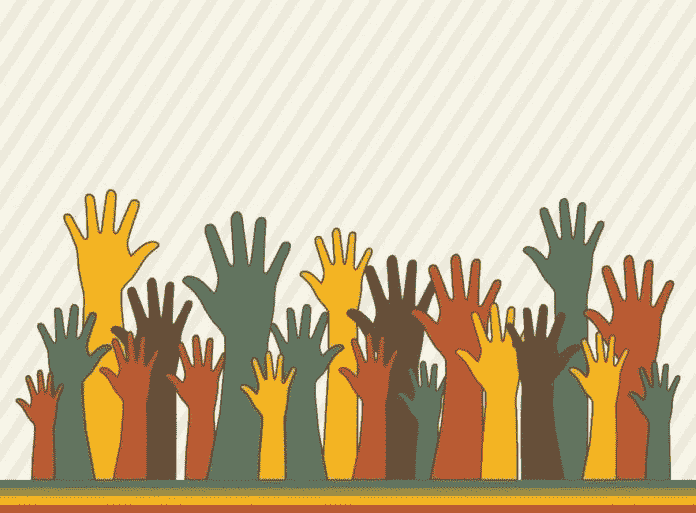
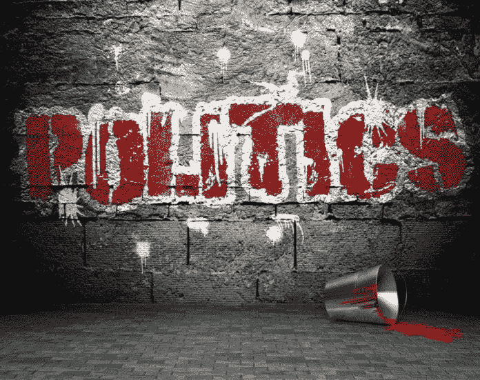
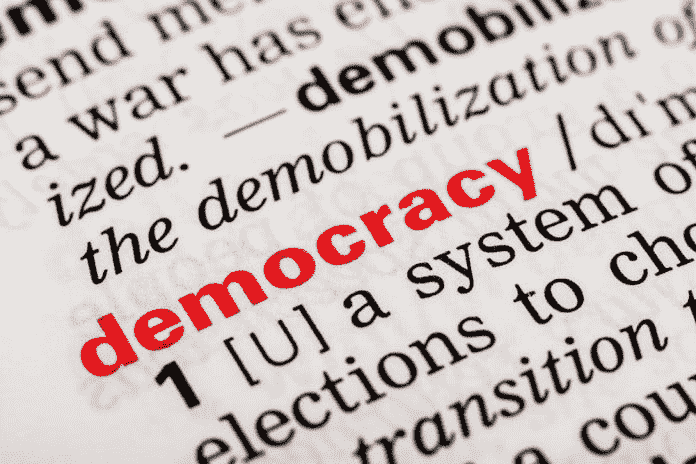

# 修正政治意味着更新我们的民主制度

> 原文：<https://medium.datadriveninvestor.com/fixing-politics-means-updating-our-democratic-system-fb2139f42fd5?source=collection_archive---------14----------------------->

我们都曾抱怨过我们的政客。我们都熟悉他们的行为模式。我发现有趣的是，我们经常对政治家令人恼火的行为不屑一顾，认为这只是正常的行为，没什么可做的。

例如，许多政治家在政治生涯末期致力于不受欢迎但又必要的立法。那时他们知道对该法案的反应不会影响他们自己的个人生活。他们不能连任，所以他们只有在那时才实施这些法律。因此，人们往往必须等待，也许还要忍受几年，一项法律才能生效，尽管从技术上讲，这项法律可以更快地制定出来。

 [## 保护主义、政治和经济动荡——数据驱动的投资者

### 美国股市昨日出现 400 多点的大幅反转，为未来的事情发出了警告信号。市场…

www.datadriveninvestor.com](https://www.datadriveninvestor.com/2018/06/28/protectionism-politics-economic-turmoil/) 

类似地，每个人都同意的受欢迎的法案经常在方便政治生涯时付诸表决。这些受欢迎的立法对一些公民的生存是否重要并不重要。政客们以这种方式保护他们的生计。如果我们处在他们的位置，我们会有不同的做法吗？

总之，我们知道这种行为是一种自我保护。政客是要养家糊口的人，就像其他人一样。然而，政治家是公仆，他们的工作是做对我们最有利的事，而不是为他们，这就是难题所在。

我不责怪政治家是人，并以此为生。玩政治很难。许多人参与政治是出于影响变革的热情。我知道许多人热衷于做正确的事情，并努力让法律通过，这将有利于他们所服务的人，我们。但是，尽管所有的意图都是好的，为了影响变化，政治家需要留在游戏中，这意味着当选。要想当选，政治家需要受欢迎，受人喜欢，并且看起来有能力。

这就是问题所在。现实地说，要通过有益于人民的惊人的进步法律，一个人不需要受欢迎或受欢迎。一个人必须有能力。为了更好地为人民服务，立法者应该是我们当中最好的。

我们当中最好的政治家不是。

没有一个理智的人会说民主是完美的。那么，我们如何改变这个体系，让政客们能够像人一样行事，而民众仍然能够获得最有利于他们的立法呢？

**需要可信的专家政治家**

我在我的著作和我的书中讨论的一个方面是我们需要一个在各自领域选举领导者的系统。政治家的工作会因其职责的不同而不同。一些立法者关注住房，一些关注教育，预算，渔业等等。我们公民要求这些人取得最好的结果，但我们从竞选中选举他们，感觉更像是高中的受欢迎程度竞赛，而不是严肃的辩论。我们希望我们的生活得到改善，我们的税收得到合理使用。我们希望享受帮助我们在社区中保持活跃并在我们运气不好时照顾我们的支持计划。如果我们知道我们选出的官员是他们立法职责范围内的精英中的精英，也许我们会相信他们会毫不犹豫地尽可能做好工作。

当我们做检查的时候，我们会一直怀疑我们的牙医吗？在我们的会计师为我们报税后，我们会怀疑他吗？没有那么多。

如果我们可以让最好的立法者为我们服务，由我们的税收支付，我们应该有同样的信心。但是怎么做呢？

**过时的系统**

首先，在这个高度互联的时代，我们还需要每个地理区域都有一名代表吗？在社交媒体时代，我们需要选举我们中的一个人来代表整个群体代表我们说话的原则是可笑的。我们可以为自己辩护。一个地区的人口提供了太多的信息和反馈，让工作人员难以筛选？没问题，[人工智能](https://www.datadriveninvestor.com/glossary/artificial-intelligence/)可以在瞬间分析和提取关于每栋房子、每条街道、全国每个地区的所有人口统计数据的有效信息，汇总成每日/每周/每月报告，供各级政府部门消化和采取行动。

为什么我们会满足于假设一个地区的一个人知道我们和我们需要什么，而不是我们可以通过文本、视频或语音信息在线书写、口述和记录的东西？地方代表是一种过时的传统。

我们可以利用简单的现有技术做得更好。

除了地方代表，我们的民主政治制度在其他方面已经过时。在北美，选举中获胜的候选人通常是筹集了资金的候选人。最受欢迎的候选人获胜，因为他或她有更多的钱花在广告和跨国旅行上。因为这些政客一旦上台，我们的生命就掌握在他们手中，所以我们想对他们有一个好的感觉。另一方面，捐款的数量赢得了比赛，这也困扰着你。人们不禁要问，一旦政客赢得竞选，他们会欠捐助者什么。我们还必须把钱从等式中去掉。没有竞选。我们要的是精英中的精英，而不是最有市场或者更糟，最有卖点的候选人。

如果没有竞选，没有筹款，我们将如何选择候选人？

老实说，我们每个人都知道一些在不同利益领域带头立法的最佳候选人。如果你是农民，你可能认识一位专门研究农村地区或农业的立法者。如果没有，你知道在哪里可以找到这个人。如果你是一名医生，你应该知道谁是医疗改革立法或咨询的最佳人选。那是因为他们在你感兴趣的领域。这些专家个人可能不渴望政治生涯，但如果一个行业中的许多人都同意谁是他们中的佼佼者，那么从事其他不相关工作的其他人又怎么会知道呢？那些知道最好的政治家的人通常是其他的政治家或和他们一起工作的职员。

如果不同领域的专家可以提名其中最优秀的专家担任特定责任领域(预算、农业、医疗保健、住房等)的特定政治职位，情况会怎样？).然后在被提名的候选人中，该领域的专家可以一起决定谁在候选名单中做得最好，对吗？你会问办公室经理谁是这个国家最好的医生吗，或者你会问其他医生这个问题吗？我们会让医生找到他们的最佳，让办公室经理找到他们中的最佳。我们当然可以用投票来决定谁是每个领域的最佳专家，但是只有那些在相同领域有经验的人才会投票。

那么，如果被选中的人是我们中最好的，并作为我们新的主要政治家开始工作，在不超过 4 年的时间内立法，会怎么样？

他们的同龄人和普通民众会尊重这些选举的获胜者。大多数成年公民会投票支持一个或几个候选人，这取决于他们自己的专业领域，但不是全部。

**一人一票，但不一样**

虽然公平是一个伟大的理念，但我们知道一个事实，一人一票的民主理念给我们带来的是平庸的结果。它帮助我们防止可怕的灾难，但我们总是以一个“不伟大”的领导者而告终。我们都想参与并对谁将领导我们的政府有发言权。这是一种美好的情绪，但我们知道我们会得到什么结果:不合格的个人尽最大努力立法，但往往也会为他们的政治自我保护而行动。

如上所述，我们可以有一个系统，在这个系统中，人们可以对谁来领导我们政府的各个方面有发言权，如果做得合乎逻辑，我们可以得到惊人的结果。

如果我们选择个人为我们服务，没有竞选活动，没有筹款，并且有一个固定的任期，我们可以获得惊人的结果，并迅速为我们的社会做事情，无论这项立法是否受我们欢迎。请记住，如果我们让真正的专家负责，有时他们会制定立法，这将暂时伤害部分人口，但这将永远是为了国家和公民的更大利益和长期繁荣。

**不需要派对**

请注意，到目前为止，我没有提到政党或党派。那是因为我们不需要。选举我们当中最优秀的专家意味着我们是在选举个人，而不是政党。现在，每个被提名的候选人都有左翼、中间派或右翼倾向，但我们是根据他们在特定领域的资格和需求来选举他们的。“最佳教育周期”可能意味着一个具有 40 年创建新课程经验的渐进式系统变革者，因为现在是实现教育系统现代化的时候了。经济学最好的人可能是左倾社会主义者，因为在未来 4 年，我们需要在国家建立更多的社会项目来支持穷人。我们将根据能力和意识形态选举每个政治领导人。

使用在线平台，我们可以很容易地与政治专家联系，并为这些人提供关于我们的社区和生活中正在发生的事情的有价值的信息，知道他们是帮助我们的最佳候选人。候选人无需向投票给他们的人回馈，也不需要花一半的时间为下一届任期筹款。我们会信任他们，因为我们知道他们没有要求这份工作。我们给了他们服务的特权和做正确事情的巨大责任。然后，在他们任期结束后，将根据他们的成绩对他们进行评判。

我们需要尽快考虑重建我们的民主政治体系。修补它和争论它没有意义。我们知道这个系统最多还存在于 20 世纪早期。是时候用现代化的方式做事了。

我们应该得到更好的，如果我们有勇气改变，我们可以建立一个更好、成本更低的体系。

Sylvain 是一位国际主题演讲人、未来学家、企业家，也是非虚构书籍《工程天堂:你准备好了吗？。作为一名企业家，他与来自世界各地的多个合作伙伴一起支持和经营娱乐技术、数字媒体和国际基础设施融资业务。他拥有加拿大渥太华大学的生物化学、化学工程和教育学士学位，从高中到大学教了 20 多年书，公开演讲超过 12 年。此外，他目前是世界未来协会的代表，加拿大大众传播研究所的负责人，是蔻驰认证的企业家培训师。他现在热衷于通过文章、其他出版物和其他媒体格式(如视频和播客)撰写和讲述人工智能将如何彻底改变我们的社会和经济。

*原载于 2019 年 6 月 4 日*[*【https://www.datadriveninvestor.com】*](https://www.datadriveninvestor.com/2019/06/04/fixing-politics-means-updating-our-democratic-system/)*。*