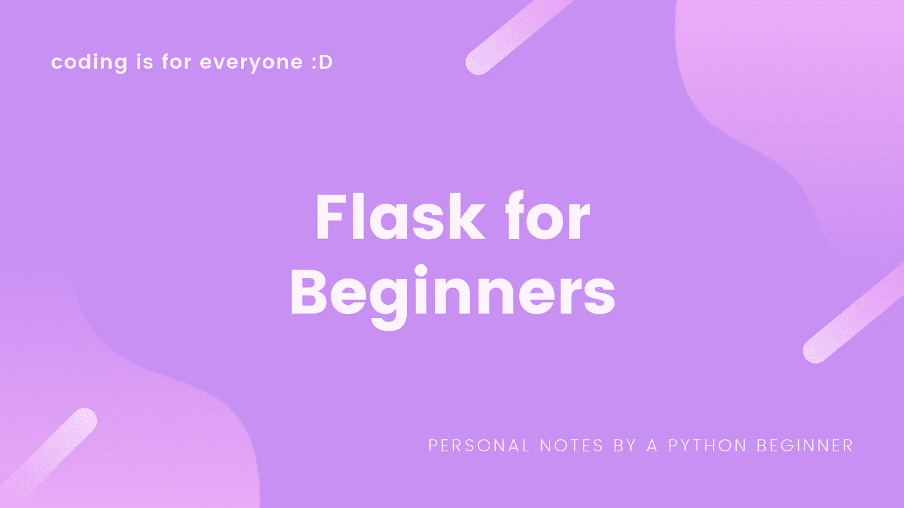
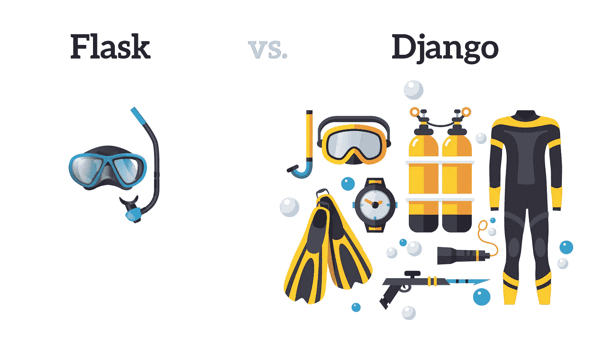
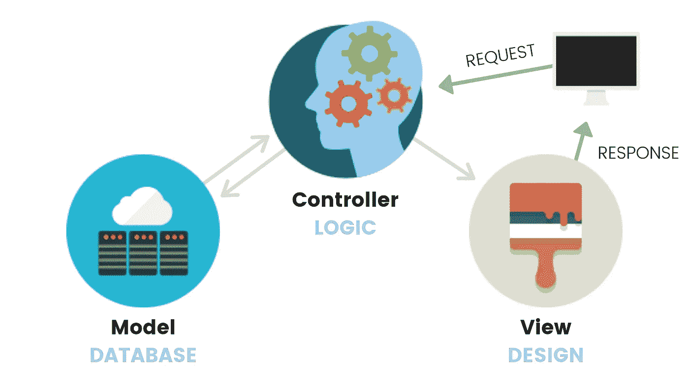
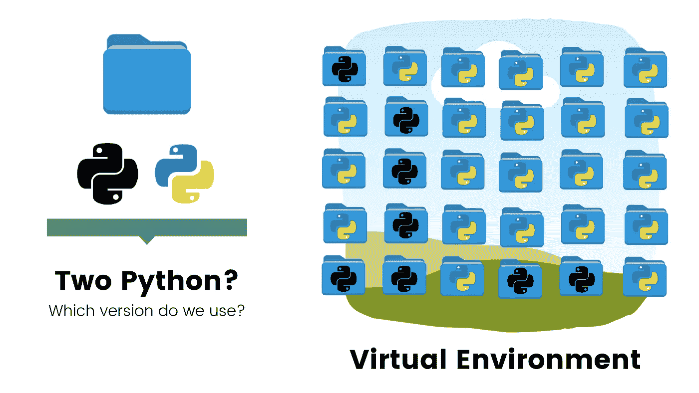

# 初学者用烧瓶

> 原文：<https://medium.datadriveninvestor.com/flask-for-beginners-3ea6d9849eae?source=collection_archive---------2----------------------->

在谷歌上有大约 17，500，000 个关于“烧瓶教程”的结果，但是如果你像我一样是一个初学者——因为你没有完全理解人们使用的术语或者在 Youtube 上看完教程后感到迷茫，所以有点暗示要开始——我希望这篇文章能有所帮助:)

什么是烧瓶？你为什么要在乎？

你可能在查找 Flask 时听到了 Django。

两者都是用 Python 写的 web 框架。

 [## 2019 年最值得学习的编码语言|数据驱动的投资者

### 在我读大学的那几年，我跳过了很多次夜游去学习 Java，希望有一天它能帮助我在…

www.datadriveninvestor.com](https://www.datadriveninvestor.com/2019/02/21/best-coding-languages-to-learn-in-2019/) 

> Django 是 Python 的全栈 web 框架，而 Flask 是轻量级的可扩展 Python web 框架( [Mindfire Solutions](http://www.mindfiresolutions.com/blog/2018/05/flask-vs-django/) )。

vectors by @[pch-vector](https://www.freepik.com/pch-vector) @[iconicbestiary](https://www.freepik.com/iconicbestiary)

弗拉斯克就像浮潜，而姜戈是水肺潜水。Flask 很轻也很容易，而 Django 能够帮助你进入更深的水域。

> Django 的标签是，**有期限的完美主义者的网络框架。**因为一切都是内置的，所以你不需要费心创建文件，也不需要考虑如何构建你的应用。一切都为你准备好了，你可以立即开始构建你的应用程序( [Prax](https://dev.to/benprax/flask-vs-django-1l4k) )。

这真的取决于你在做什么，但如果你在构建一个简单的应用，考虑 Flask:)

**#2:砂箱结构**

Flask 帮助您将(1)逻辑、(2)设计和(3)数据库组织到单独的文件中，而不是将所有代码塞进一个地方。

from [Web Programming with Flask — Intro to Computer Science — Harvard’s CS50 (2018)](https://www.youtube.com/watch?v=zdgYw-3tzfI)

*   逻辑:' main.py '导入 Flask 模块，创建一个 web 服务器，创建 Flask 类的一个实例——您的新 web 应用程序！这是您编写所有构建 web 应用程序的“逻辑”代码的地方。
*   设计:Flask 框架在名为 **templates 的文件夹中寻找 HTML 文件。把你所有的 HTML 文件放在那里。在**静态**文件夹中，存储 CSS、JavaScript、图片等文件。**
*   数据库:Flask 本身不支持数据库，但是有很多 Flask 扩展，比如 [Flask-SQLAlchemy](http://packages.python.org/Flask-SQLAlchemy) 。

> SQLAlchemy 支持一长串数据库引擎，包括流行的 [MySQL](https://www.mysql.com/) 、 [PostgreSQL](https://www.postgresql.org/) 和 [SQLite](https://www.sqlite.org/) ( [Grinberg](https://blog.miguelgrinberg.com/post/the-flask-mega-tutorial-part-iv-database) )。

**#3:准备**

我个人认为萨尔瓦多·维拉隆的这篇文章以一种非常简单、平易近人的方式解释了每一个步骤。因此，我不会解释 Flask app 项目准备的“如何做”,而是着重于 virtualenv 的“为什么”:

假设您有两个不同的 web 项目，但是一个使用 Python 版本 3.7.2，而另一个使用版本 2.7.2。每次你在做一个不同的项目时，你会重新下载不同的 Python 版本吗？如果你有不是两个而是 50 个网络应用程序要审查，那该怎么办？100?1,000?

> 虚拟环境是一种工具，它通过为不同项目创建隔离的 python 虚拟环境(GeeksforGeeks)来帮助保持不同项目所需的依赖关系。

用于创建和管理虚拟环境的模块称为`[venv](https://docs.python.org/3/library/venv.html#module-venv)`。确保在使用 Flask 创建 web 应用程序时，相应地激活 virtualenv。

**#4:部署**

在你辛苦编码之后，你想要与世界分享:要分享你的网络应用，你需要**部署**它。

> 许多云托管提供商提供一个托管平台，应用程序可以在这个平台上运行。要将应用程序部署在这些平台上，您需要提供的只是实际的应用程序，因为硬件、操作系统、脚本语言解释器、数据库等等。都是由服务管理的([格林伯格](https://blog.miguelgrinberg.com/post/the-flask-mega-tutorial-part-xviii-deployment-on-heroku))。

*   [在 Heroku 部署烧瓶](https://devcenter.heroku.com/articles/getting-started-with-python)
*   [在谷歌应用引擎上部署 Flask](https://cloud.google.com/appengine/docs/standard/python/getting-started/python-standard-env)
*   [在 AWS 弹性豆茎上展开烧瓶](https://docs.aws.amazon.com/elasticbeanstalk/latest/dg/create-deploy-python-flask.html)
*   [在 Azure (IIS)上部署](https://docs.microsoft.com/en-us/azure/app-service/containers/how-to-configure-python)
*   [在 PythonAnywhere 部署](https://help.pythonanywhere.com/pages/Flask/)

**#5:结论**

我希望这有助于你的编码之旅:)如果你有任何令人兴奋的 Flask 应用程序，或者只是想谈谈 Python，请随时联系我们。

**其他资源:**

*   “[学习 Python 的 Flask 完整教程](https://www.youtube.com/watch?v=Z1RJmh_OqeA)”freeCodeCamp.org，Youtube，2019 年 5 月 28 日
*   " [Flask 初学者教程——40 分钟学会 Flask(2019)](https://www.youtube.com/watch?v=EnJKHVEzHFw)“漂亮印刷，Youtube，2019 年 3 月 21 日
*   “ [Python Flask 初学者教程](https://www.youtube.com/watch?v=lj4I_CvBnt0)”，Edureka，Youtube，2018 年 12 月 18 日
*   “[使用 Flask 进行 Web 编程—计算机科学导论—哈佛大学 CS50(2018)](https://www.youtube.com/watch?v=zdgYw-3tzfI)”freeCodeCamp.org，Youtube，2019 年 1 月 29 日
*   Villalon，Salvador " [如何使用 Flask 构建 web 应用并将其部署到云](https://www.freecodecamp.org/news/how-to-build-a-web-application-using-flask-and-deploy-it-to-the-cloud-3551c985e492/)"，FreeCodeCamp，2018 年 8 月 28 日