# CSS 中的 FlexBox

> 原文：<https://medium.datadriveninvestor.com/flexbox-31d52c862194?source=collection_archive---------4----------------------->

[](http://www.track.datadriveninvestor.com/1B9E)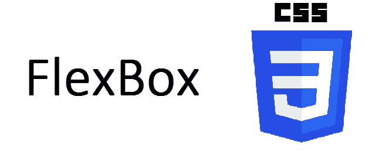

CSS3 引入了一个名为 Flexbox 的新布局模块。它的引入主要是为了减少我们对浮动的依赖，帮助创建更好的、响应更快的布局。

> 我们如何定义 Flexbox？

**flex** 是一个显示属性，类似于*块、内嵌或内嵌块。*定义一个 div 的显示属性为 *flex* ，自动创建一个 flex 容器，它的所有子容器都成为它的 *flex 项。*

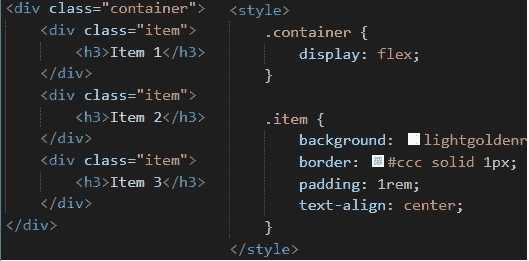

creating a flexbox

> 弯曲方向

默认情况下，flex 容器的方向是值 *row* ，这意味着容器中的所有 flex-item 将表现为一行中的列。

[](https://www.datadriveninvestor.com/2019/02/21/best-coding-languages-to-learn-in-2019/) [## 2019 年最值得学习的编码语言——数据驱动的投资者

### 在我读大学的那几年，我跳过了很多次夜游去学习 Java，希望有一天它能帮助我在…

www.datadriveninvestor.com](https://www.datadriveninvestor.com/2019/02/21/best-coding-languages-to-learn-in-2019/) 

如果我们想让容器以列的方式对齐 flex-items。这可以通过添加一个名为***flex-direction***的属性并将其设置为等于*列*来轻松完成。这样的话，所有的条目都将表现为行对列。

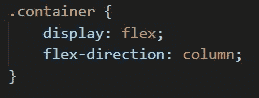

flex-direction

**注:* ***伸缩方向*** *的其他属性可以是行反转、列反转。*

> Flex 属性

正如我们在下面看到的，目前 flex 项目并没有占据浏览器的所有空间。

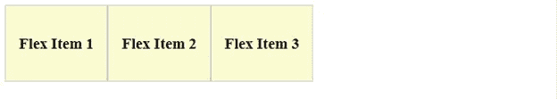

The size of the items are equal but they are not taking up all the space(width)

为了解决这个问题，我们可以定义一个名为 ***flex*** 的新属性，并将其值设置为 1。这将使每个子容器的宽度相等，并填满容器的宽度。这也使得项目更具动态性，它们会根据浏览器的宽度自动调整项目的宽度。

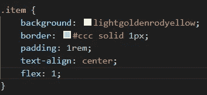

flex 1 makes all the items of equal width

正如我们在下面看到的，宽度增加了，它适合浏览器的宽度。

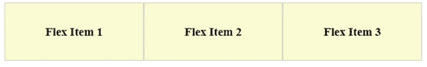

*The width is dynamic and will change according to the screen size*

注意:我们可以利用 flex 属性来创建自定义的动态布局。

让我们使 Flex Item 1 和 3 大于 Flex Item 2，我们可以通过添加新的类或者为每个项目指定一个唯一的 ID 来实现。现在，让我们只使用伪选择器 last-child 和 first-child，并将 *flex* 属性设置为 2。

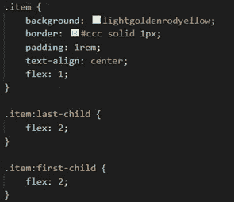

creating custom layout

> 柔性包装

如果我们在一个 flex 容器中有多个 flex 项目，这可能会导致溢出，这是我们应该尽量避免的。

让我们添加多个 flex 项目，看看会发生什么。

* *注意:在 vs-code 中，您可以使用下面的简写来创建多个 div 元素:*

```
*.item(classname){<h3>Flex Item $(incremental val) </h3>}*10*
```

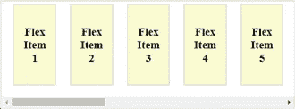

We get an overflow of x

像*自动换行*属性帮助我们将单词分成多行以适应 div 的宽度，我们有一个类似的 flex 属性叫做 ***flex-wrap*** 。它将根据父宽度自动调整弹性项目。

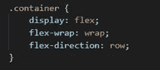

add flex-wrap property to the container

通过添加*柔性包装*，布局变得更加动态。

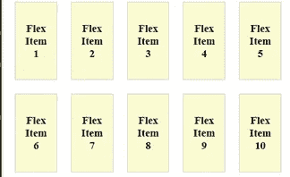

overflow of x gets removes and items arrange dynamically

> 弹性流动

当我们在 CSS 中定义 *border* 属性时，我们可以定义多个参数，而不是定义多个属性。这有助于我们编写更干净的代码。

```
border: 1px solid black;
```

同样还有另一个 flex 属性叫做 ***flex-flow*** ，它帮助我们将 flex-direction 和 flex-wrap 合并成一个属性。


defining a single property for direction and wrap

这将与上面的例子一样。

定义任何布局时，最重要的部分是定义布局元素的对齐。FlexBox 使用单独的属性来对齐 flex 容器中定义的 flex 项目。

让我们来看看一些主要属性:

> 弹性基础

如果我们想定义自己的宽度而不使用 flex 属性呢？

简单的答案是使用*宽度、*，但是 flexbox 提供了自己的属性***【flex-basis】***。

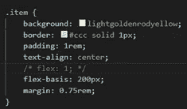

defining flex-basis

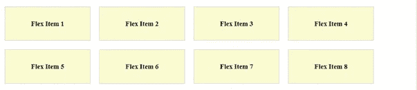

output

在定义将在最终 DOM 中使用的 flex-item 的宽度*和宽度*时，应该记住优先顺序。

```
width < flex-basis < max/min-width
```

*   如果 *flex-basis* 和 *width* 都被定义，那么 *width* 将被忽略。

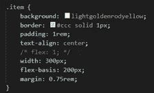

defining both width and flex-basis

我们可以通过在开发工具的样式区域中的*计算选项卡*来检查这一点。

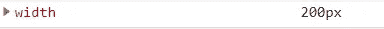

final computed width 200px

*   如果定义了*最大/最小宽度*和*伸缩基准*，那么*伸缩基准*将被忽略。

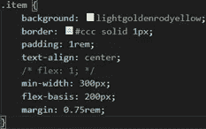

defining both min-width and flex-basis

我们可以看到，由于 max/min-width 的优先级，计算出的宽度是 *300px* 。

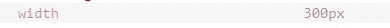

final computed width 300px

使用 *flex-basis* 而不是简单定义宽度的主要原因之一是，它本质上更具动态性。如果可用空间(父宽度)小于所需的宽度，它会自动应用 ***伸缩*** 并使项目适合伸缩容器的宽度。

* *注意:如果有额外的空间，将 flex-grow 定义为 1，项目的行为将与 flex 定义为 1 时一样。*

> 调整内容

为了在水平面上对齐元素，我们使用属性，***justify-content***。该属性在 flex 容器级别实现。

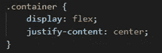

justify-content is a container level property

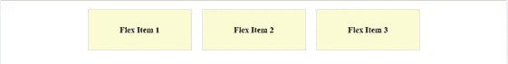

Alignment updated

**注:默认设置为 flex-start(左对齐)。*

我们可以定义为*曲端*右对齐，*居中*居中对齐。这些是基本值，但是使用 flexbox，我们可以获得一些有趣的属性值:

*   *环绕空间*:在伸缩项周围添加相等的空间。

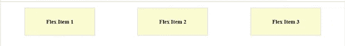

space is added around(left & right) the flex items

*   *space-between* :增加伸缩项之间的空间。

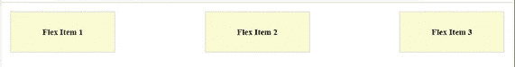

space is added between the flex items

*   *空间均匀:*从四周均匀地增加柔性项目周围的空间。

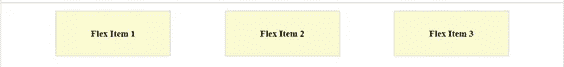

space added around the flex-items evenly from all sides.

> 对齐-项目

为了在垂直平面上对齐元素，我们使用属性 ***align-items*** 。该属性也在 flex 容器级别实现。

**注意:要垂直对齐项目，必须定义高度。*

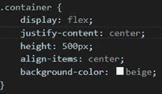

defining align-items

**注意:添加背景色，以便更清楚地了解容器的高度。*

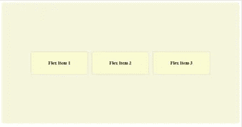

output screen

对齐项目属性值:

*   如果没有定义 align-items，默认属性设置为*拉伸*。
*   *flex-start* :将物品与 flexbox 顶部对齐。

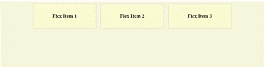

flex items are aligned to the top of the flex-box

*   *flex-end* :将物品与 flexbox 底部对齐。

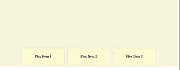

flex items are aligned to the bottom of the flex-box

*   *居中:*将根据 flexbox 高度居中对齐项目。


align center

*   *基线*:类似弹性启动

> 对齐内容

要在垂直平面上对齐元素，当有大量可用空间时，我们可以使用属性***align-content***。该属性在 flex 容器级别实现，应该是 *flex-wrap* 。

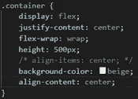

defining align-content

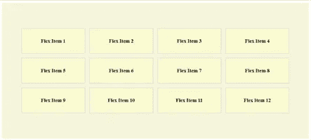

result

对齐内容属性值:

*   如果没有定义 align-items，默认属性设置为 *stretch* 。
*   *flex-start* :将物品与 flexbox 顶部对齐。

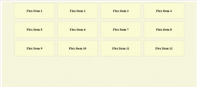

will align the flex-items to the top of the flex-container

*   *柔性端*:将物品与柔性盒底部对齐。

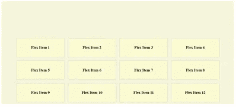

will align the flex-items to the bottom of the flex-container

*   *居中*:将项目居中对齐到柔性容器的高度。

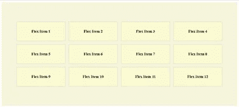

will center align the flex-items

> 自我对齐

如果我们希望每个 flex 项都有自己的对齐方式，我们可以为此定义***align-self****属性。*

*Align-Self 属性值类似于 *align-items* 的属性值。*

*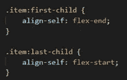*

*defining align-self*

> *命令*

****order*** 属性用于定义 DOM 在 flexbox 上显示 flex-items 的顺序。*

*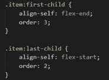*

*defining order*

*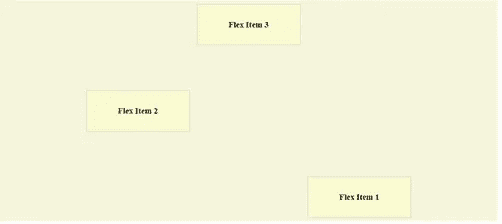*

*order and align self-assign example*

*我希望这给了你一个基本的概念，如何实现一个 **FlexBox** 来为你的 HTML 模板创建动态布局。*

*如果你仍然面临任何问题，请检查我的 [*git 库*](https://github.com/devAbhimanyu/flexBoxBasics) 中我创建的模板来演示上述例子。*