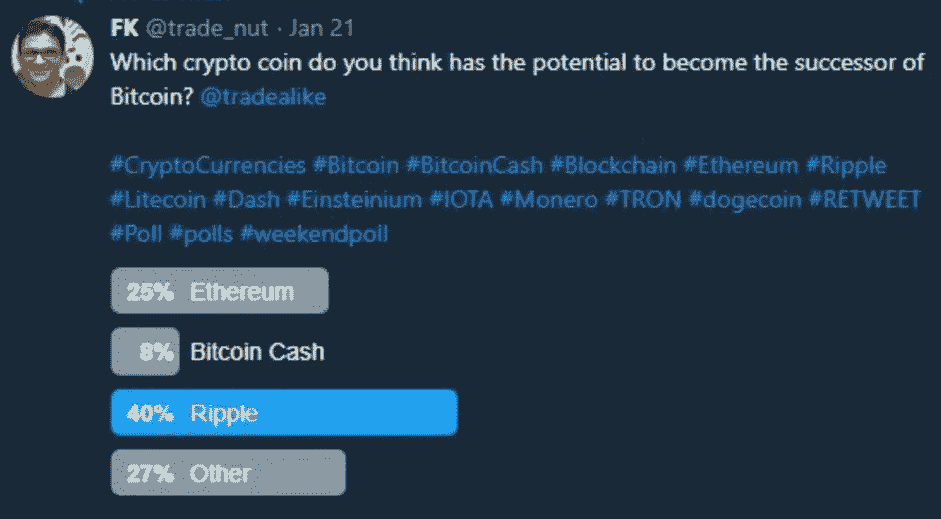
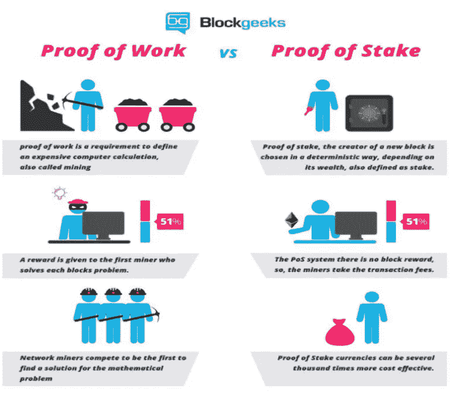
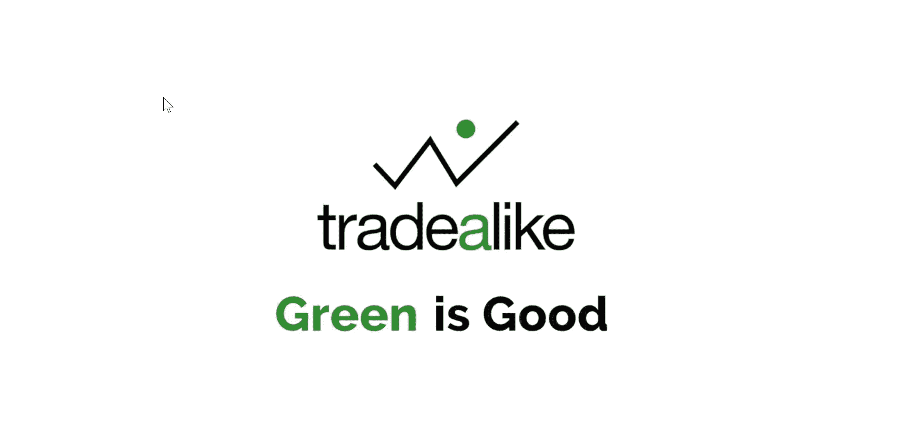

# 轻率——比特币霸权的真正威胁

> 原文：<https://medium.datadriveninvestor.com/flippening-a-real-danger-to-the-bitcoins-supremacy-1e777c6ab72d?source=collection_archive---------1----------------------->

我从未听说过 Flippening 这个词，直到几个月前它开始在**隐文**上流行。我没花多长时间就明白了这是什么意思，为什么这个术语会被创造出来。以至于他们有一个专门针对这种现象的网站，名为 [***翻转手表***](https://www.flippening.watch/) 。

该网站有一个有趣的图表，显示了 ETH/BTC 市值比率扣除
百分比后的变化——目前，该图表仅基于这一指标就徘徊在 50%左右。但是还有其他有效的理由使轻率成为一种真正的可能性，我将在后面讨论。

让我们从一个基本的定义开始，根据这个定义，Flippening 指的是未来某个可能的事件，当比特币从加密世界的头把交椅被一些替代硬币取代时——目前最大的竞争者是以太坊，其背后有强大的基础。这一理论在最近几个月获得了很大的关注，比特币的主导地位从 2017 年初的约 90%下降到本文撰写时的约 38%。

我对 Flippening 的想法非常感兴趣，所以我在我的 Twitter feed 上做了一项调查，以了解人们认为哪种加密硬币有可能取代比特币成为冠军硬币&看到这个结果我有点惊讶。人们以 40%的比例选择 Ripple 作为首要竞争者，而以太坊仅领先于比特币现金，落后于其他替代硬币！对于即将提出的理由，我不敢苟同。加密市场处于不断变化的状态&将近 10 年的时间里，比特币已经变得不那么有竞争力了，它在加密世界的顶端变得自满起来。以太坊总体上呈现的强大效用价值使其成为头把交椅的有力竞争者。

以太坊(ETH)在 2015 年推出时被视为比特币的重要替代品。比特币建立在**工作证明(PoW** )的基础上，这需要解决非常复杂的计算，以挖掘硬币并确认交易，这需要大量的电力成本&巨大的计算能力，此外还需要 10 分钟来验证一笔交易，而 ETH 需要 14 秒。

以太坊正在向**赌注** (PoS)转移，备受期待的 **Casper 升级**更快，不包括采矿。本质上，那些拥有大约 1000 以太的人可以成为赌注者或矿工。股权的数量将决定基于交易费用返还给股权的年度股息。这将大大提高以太坊交易的速度。它还将使以太坊更容易扩展，并有助于进一步成为主流。**卡斯珀升级**，将带来股份证明，也将降低安全维护成本，并通过消除采矿减少能源消耗。这里有一个视觉帮助你理解。

以太坊平台的智能合约能力使其与比特币相比具有巨大优势，因为它的平台能力也可以推出其他加密硬币，这有助于过去 12 个月 ico 的快速增长。在撰写本文时，我们有 1517 个令牌在 [**Coinmarketcap**](https://coinmarketcap.com/) 上报告。除了以太的交易价值，它还为加密市场的基础扩展提供了基础。

比特币因交易成本高和速度慢而臭名昭著，这使得它不是小额支付的理想数字货币——比特币交易成本为 2.12 美元，而在撰写本文时，以太网的交易成本约为 0.67 美元。然而，对于比特币来说，这仍然是对 2017 年 12 月中旬 55 美元交易成本的巨大改善，这要归功于即将到来的 [**闪电网络**](https://lnmainnet.gaben.win/) ，这基本上是一条具有智能合约功能的数字高速公路，比特币区块链连接到一个替代支付网络，从而避免了区块链拥堵。ETH 的答案是[**Raiden Network**](https://raiden.network/)(正在进行中的工作)，这是一个离线扩展解决方案，能够为基于以太坊的令牌实现近即时、低费用和可扩展的支付。

在最初的比特币代码上做了无数的分叉，以解决可扩展性、安全性、交易速度&成本等问题(**比特币现金、比特币黄金、比特币钻石、Segwit2x 等)。**)以及几个失败的硬分叉——这表明比特币社区除了试图解决这些问题之外，还缺乏团结。如前所述，ETH 正通过 Casper 升级向 PoS 转移，目前的 Ether 所有者可以开采更多的矿，从而导致硬币价格进一步飙升。

比特币交易是在一个公开的区块链上进行的，比特币钱包与地址哈希绑定在一起，一旦被识别，就会泄露所有当前和未来的交易。zk-SNARK 的更新为以太坊交易增加了急需的隐私功能，使其与最近需求量很大的其他专注于安全的硬币如 Dash ( **DASH** )、Monero ( **XMR** )、z cash(**ZEC**)&Verge(**VXG**)保持竞争力。

以太坊的核心团队非常活跃，反应迅速——由天才程序员 Vitalik Buterin 负责事务——尽管从更好的方面来看，他最近关于密码跌至零的推文并没有让他成为密码爱好者的财务顾问。至于比特币，我们甚至不知道谁是**中本聪**(化名)——一个程序员、一家公司、某个政府或者也许是一台超级计算机！

**Ripple (XRP)** 荣誉奖——第三大最有价值的加密货币，在撰写本文时市值为 370 亿美元，被银行业普遍接受，最低交易费&每秒可处理 1500 笔交易。

Ripple 的唯一缺点是加密的集中性——它实际上是由一家公司拥有的。然而，随着最近发布的“ ***”涟漪论文*** ”他们似乎正在走向去中心化，该论文涉及以向网络添加独立验证器的形式进行管理的去中心化。

谁知道 Ripple 最终会成为黑马呢！其他一些令人印象深刻的硬币在主流适应性、可扩展性、隐私、即时交易和零费用方面具有巨大的潜力，如 **Cardano、Stellar、Nano & EOS** 。留意那些。

该结束了。如果您喜欢接收股票、外汇和密码方面的交易想法和技术分析，您可以在[Twitter](https://twitter.com/trade_nut)&[stock wits](https://stocktwits.com/trade_nut)上关注我，或者在[trade like](http://www.tradealike.com/)应用程序上关注@fakd，获取实时提醒。此外，您可以在我的# [AMACrypto](https://cryptoama.amafeed.com/ama-i-am-a-crypto-enthusiast-technical-trader-writer-an-avid-482480) 上找到这些主题的答案。

*签署……*

[www.Tradealike.com](http://www.tradealike.com/) Download Today to get my Trading alerts in real time…

*原载于 2018 年 2 月 25 日*[*【medium.com】*](https://medium.com/@tradealike/flippening-a-real-danger-to-the-bitcoins-supremacy-b87cb0dd6a76)*。*