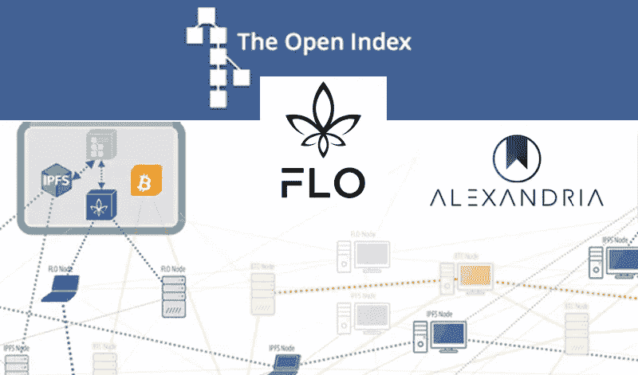
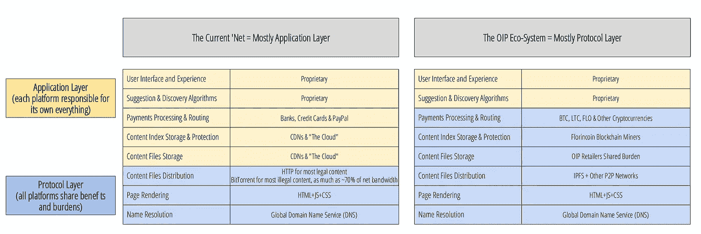
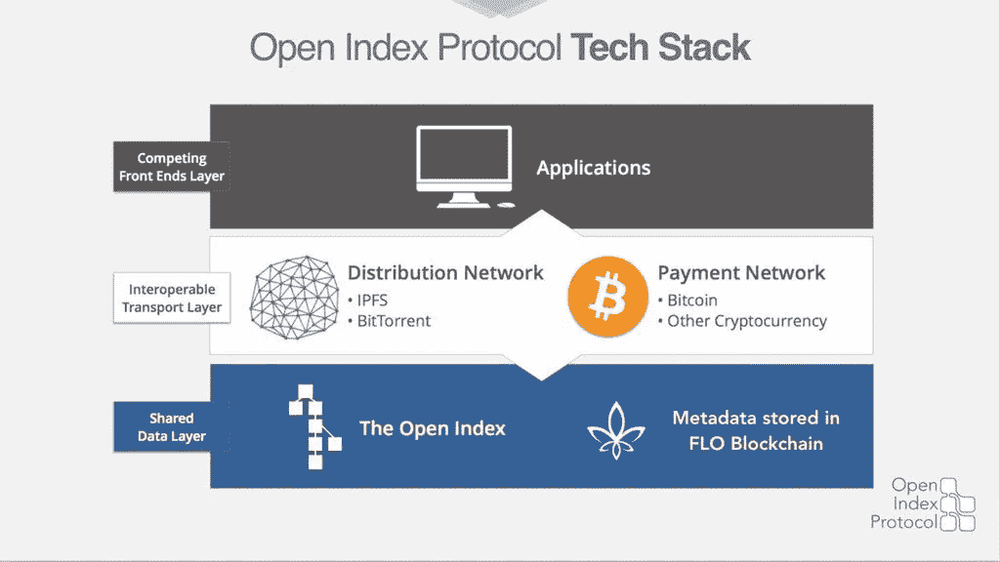
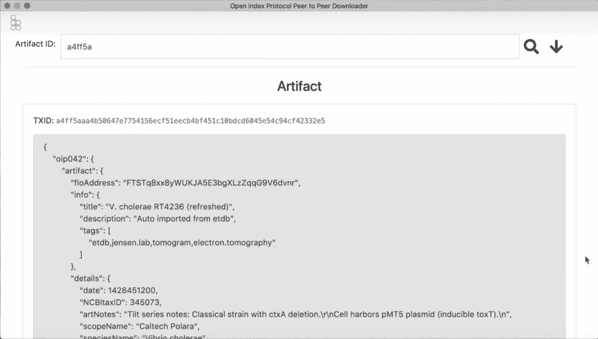
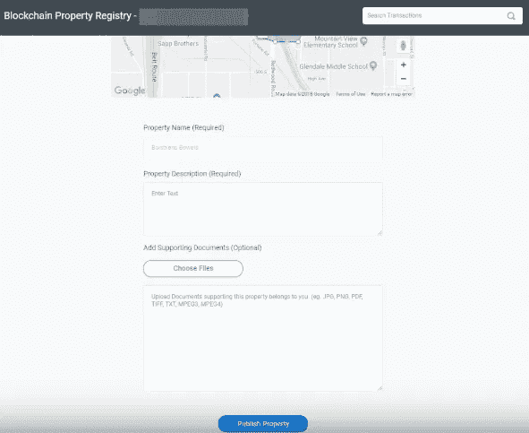

# FLO 和开放索引协议(OIP)

> 原文：<https://medium.datadriveninvestor.com/flo-and-the-open-index-protocol-oip-530c8f0aa807?source=collection_archive---------3----------------------->

*这是聚焦 FLO 区块链生态系统系列文章的第三篇。在* [*第一篇*](https://medium.com/@valueprop/florincoin-the-tzero-connection-66697c81c873) *中，我重点介绍了 tZERO 与 FLO 区块链之间鲜为人知的联系。在* [*第 2 篇*](https://medium.com/@valueprop/flo-tzero-and-how-the-dlr-aims-to-disrupt-5bd34634f928) *中，我深入介绍了 tZERO 如何利用 FLO 的先进 DLR 技术。如果你想更多地了解 FLO，请访问 FLO 电报频道***。**

*互联网正成为一个越来越封闭和受审查的地方。像 [YouTube](https://steemit.com/youtube/@bernardchapin/dr-jordan-peterson-demonetized-again-by-youtube) 和 [Patreon](https://www.youtube.com/watch?v=m0K-A10iJC0) 这样的平台最近已经成为新闻，因为它们对宣扬他们不同意的观点的个人进行去货币化和审查。虽然互联网可能看起来像是免费的公共空间，但现实是互联网越来越多地被大规模、封闭的平台应用程序所定义，这些应用程序完全由少数几家大公司控制。虽然这些公司提供的空间，如 Twitter 或 YouTube，可能感觉像公共空间，但它们实际上代表了对围墙花园模式的回归，在这种模式下，应用程序的每一个元素都完全由他们随心所欲地支配。这些封闭的系统正变得越来越成问题，并与期望的开放和分散的互联网背道而驰，这就是 FLO 区块链和开放索引协议(OIP)介入解决这个日益严重的问题的地方。*

# *什么是开放索引协议？*

*想一想我们今天所知道的互联网是如何运作的。我们已经就构成互联网几层的协议达成一致，但我们交互的绝大部分是集中的和专有的。开放索引协议将 web 的大部分从集中和专有的应用层转移到分散的协议层。下图对比了当前互联网的结构，以及它在 OIP 世界中的样子。*

**

*How it works now vs. how it works in a world with OIP*

*一开始，理解开放索引协议的具体操作可能有点困难，但是可以将其分解成几个部分，使其更容易理解。*

**

## *共享数据层*

*在 OIP 科技的最底层，我们有 FLO 区块链。FLO 区块链充当系统的索引，它之所以能够实现这一点，是因为它能够向区块链发布元数据交易评论。就其本身而言，存储元数据的能力并不特别，但是当与开放索引协议配合使用时，无限多的大门就打开了。看待 OIP 的最佳方式，是将其视为一种类似于谷歌搜索的去中心化模式。开放索引协议实现了一套将元数据存储到 FLO 区块链的标准。通过使用标准化格式，可以可靠地查询区块链的元数据，有效地作为区块链搜索引擎运行。*

**

*An example of OIP formatting*

## *互操作传输层*

*在共享数据层之上，我们有可互操作的传输层。这一层由分销和支付网络组成。目前，OIP 利用 [IPFS](https://hackernoon.com/a-beginners-guide-to-ipfs-20673fedd3f) 进行点对点文件共享。当使用 OIP 与世界共享文件时，与用户交互的应用程序将使用 IPFS 播种文件，然后 IPFS 散列将包含在元数据事务中。所有这些都将通过应用程序 GUI 来完成。希望显示这些内容的应用程序将回调存储在 FLO 区块链上的标准化 OIP 元数据。通过在 OIP 元数据中包含加密货币地址来处理内容付费。希望支持尽可能多的加密货币，如 BTC、FLO 或 RVN，以便最好地扩展系统，并最大化创作者和消费者之间的匹配。无论创建者决定接受哪个支付选项，应用程序都将回调 OIP 标准化格式内的加密货币地址，并向消费者显示这些支付选项。在可互操作的传输层利用 OIP 将数据存储和支付从集中式数据网络和信用卡或 PayPal 转移到用于对等文件存储和区块链支付的分散式协议。*

## *竞争前端层*

*这是最终用户有意识地与之交互的层。在 OIP 系统中，这一层是您的应用程序所在的地方，并且这是唯一仍然由专有内容组成的层。那么这看起来像什么？下一节将完全致力于一些已经利用 OIP 和 FLO 区块链的应用，但我们可以看看一个具体的例子。*

**

*上图是美第奇土地治理公司建造的区块链财产登记处的例子。在后台，名称、描述和文档都按照 OIP 元数据标准进行格式化。这是如何运作的，可以从美第奇土地治理公司的演示中看出，大致从 [14:55](https://youtu.be/SWkXCn0JMlQ?t=895) 开始。最终，最终用户可以无缝地与应用程序交互，而不需要知道他们使用的是基于 OIP 区块链的系统，而不是传统的集中式模型。值得注意的是，OIP 并不与当前的应用程序不兼容，如 YouTube 或 iTunes。当前的应用程序可以简单地实现 OIP 标准，使用 IPFS 进行数据存储，并几乎毫不费力地过渡到更加分散的模式，同时降低成本。*

# *OIP 是如何被使用的:*

*许多基于开放索引协议的应用程序已经在现实世界中使用，并利用区块链技术实现了以前没有它不可能实现的结果。下面详细介绍一些最有前途的应用。*

## *亚历山大*

*亚历山大也许可以被描述为打开索引协议的窗口。Alexandria 是由开放索引协议的开发者构建的一个分散的对等应用程序，它允许内容创建者直接接触消费者，并直接从这些消费者那里获得报酬。与集中式方法相比，该系统的效率为内容创建者带来了更高的收入，并为消费者增加了节省。在下面的视频中，亚历山大公司的联合创始人艾米·詹姆斯讲述了在亚历山大平台上发布内容的过程。*

*关于亚历山大公司和其他内容分发平台如何在 OIP 运营的更详细的解释，我推荐观看亚历山大公司联合创始人戴文·詹姆斯的演讲[06:32–09:05](https://youtu.be/_02IWDIVaNI?t=392)*

## *美第奇土地治理*

*美第奇土地治理(MLG)是 Overstock 的子公司，该公司正在利用 OIP 建立一个产权登记处。财产权，或者更确切地说，缺乏正式的财产权，是发展中国家的一个大问题。大约有 50 亿人无法获得正式的财产或土地权利，由于缺乏正式的土地权利，一些人估计未经确认的财产价值高达 170 万亿美元。MLG 一直在努力工作，并建立关键的战略合作伙伴关系，以便通过利用 OIP 将正式的产权带到 FLO 区块链上。八月，MLG 宣布他们[正与赞比亚政府](https://www.coindesk.com/zambia-overstocks-medici-ink-deal-on-blockchain-land-registry-pilot)合作，以便将土地所有权登记引入区块链。12 月 28 日，杰克逊·霍尔的家乡怀俄明州[提顿县](https://www.coindesk.com/wyoming-county-moves-to-put-land-records-on-blockchain)宣布将与 MLG 合作，将其土地注册放在区块链。Overstock 首席执行官 Patrick Byrne 亲自给怀俄明州区块链任务组写了一封喜气洋洋的支持 OIP 的信。有关 Medici Land Governance 如何利用 OIP 的更多信息，我强烈推荐观看下面的视频，这是 MLG 高级软件工程师 Chris Chrysostom 的演示。*

## *（美国）加利福尼亚理工学院*

*加州理工学院是世界上顶尖的大学之一，它也是通过 OIP 和 FLO 将区块链理工学院应用于现实世界用例的先驱之一。加州理工学院的詹森实验室使用开放索引协议发布了[电子断层扫描数据库(ETDB)](https://etdb.caltech.edu/) 。根据 ETDB 网站，*

> *电子断层扫描数据库是一个公共存储库，拥有 11293 个完整的细菌和古细菌细胞的电子断层扫描数据集，代表 85 个物种。*

*选择使用 OIP 在基于区块链的分布式数据库上发布科学数据，与传统的集中式方法相比具有许多优势。这些优势包括更广泛的信息传播，消除限制数据访问的集中故障点，以及由于 IPFS 的使用而节省大量存储空间的能力。有关什么是 ETDB，以及如何使用 OIP 构建它的更多信息，我推荐观看下面的视频，这是加州理工学院博士后学者和 FLO 团队核心成员达维·奥特加博士的演示。*

# *互联网的未来*

*开放索引协议旨在迎来下一个互联网时代 Web 3.0。通过摆脱专有的、有围墙的花园模式，创作者和消费者都获得了许多好处，同时在互联网上创造了一个真正开放的、不受审查的空间。*

*以这篇文章为引子，下一篇文章将有针对性地看看 OIP 能为一个特定的和不断增长的运动做些什么，这个运动被称为**知识暗网** …*