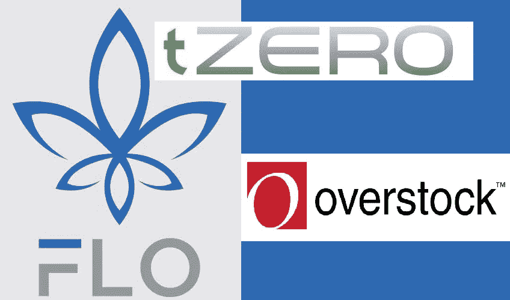
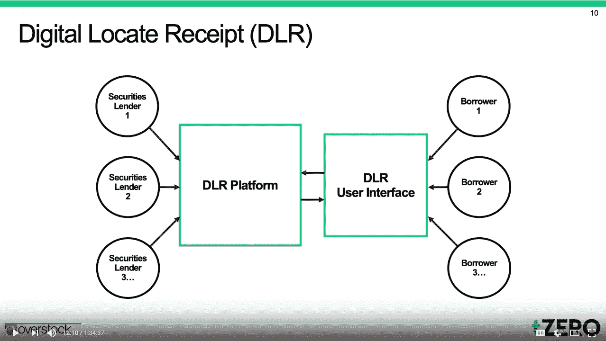
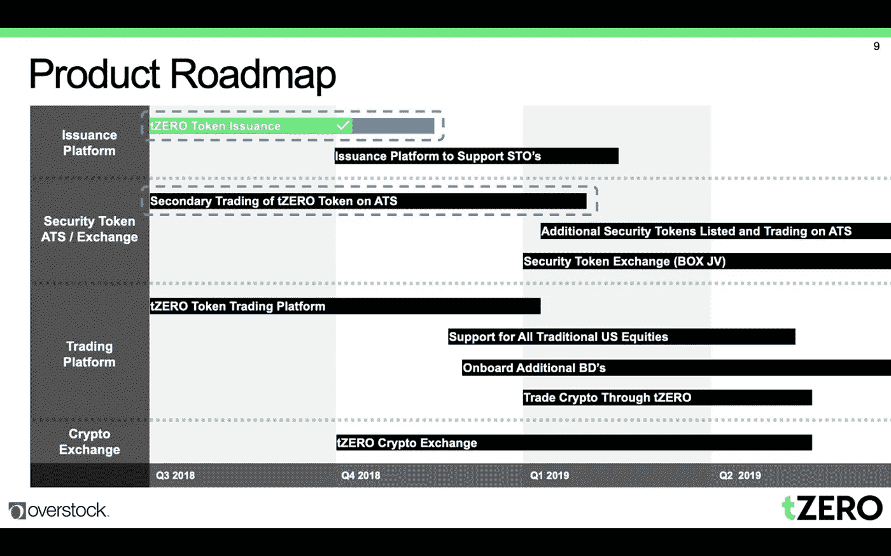
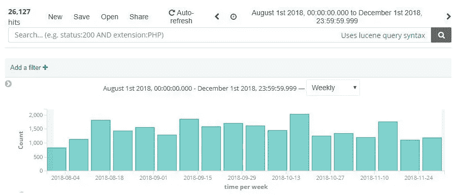
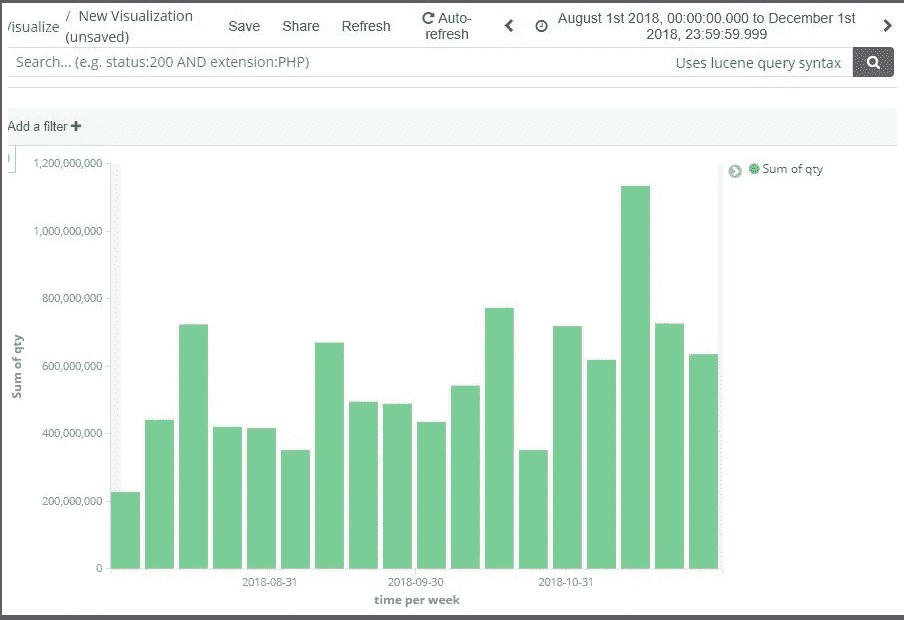

# FLO，泽罗，以及德国国防研究中心的目的是如何破坏。

> 原文：<https://medium.datadriveninvestor.com/flo-tzero-and-how-the-dlr-aims-to-disrupt-5bd34634f928?source=collection_archive---------2----------------------->

在 1 月 21 日的那一周，tZERO 将会上线。八月，我发表了一篇关于策罗和一个不知名的区块链人 FLO 之间的[联系的详细分析。随着 tZERO 的发布时间越来越近，很明显，tZERO 打算将 FLO 作为数字定位收据的后端。](https://medium.com/@valueprop/florincoin-the-tzero-connection-66697c81c873)

> [DDI 编辑推荐——认证区块链开发者](http://go.datadriveninvestor.com/blockchain-dev/matf)

那么为什么是 FLO 呢？两位 FLO 的主要开发者在 [FLO 电报频道](https://t.me/floblockchain)提供了一些理由:

> FLO 现在出来工作了，而这些新连锁店还在“发展”
> 
> 约瑟夫·菲舍尔:这有很多原因:
> 
> 1.floData 易于访问和阅读。你不需要对智能合约进行反编译，也不需要有专门的软件来阅读它。在链上是明文。这有助于审计和向监管者解释它是如何工作的。任何额外的步骤都是采用的障碍。
> 
> 2.floData 很容易写。使用简单的 RPC 命令将它附加到区块链。这使得围绕解决方案维护软件的成本更低。
> 
> 3.FLO 是一个相当发达的区块链，没有溢价或 ICO。同样，这有助于实际的管理原因，但也是那些维护软件的人做出的哲学选择。它指导我们软件的决策，也允许那些实现它的人勾选一个框，如果没有这些特性，他们就不能使用另一个链来勾选。
> 
> 4.FLO 有工作证明担保。这可以说是网络所能获得的最好的安全性，需要实际购买物理设备和恒定的人力和电力运营成本。
> 
> 5.在此基础上，FLO 开发了开源软件(OIP)，可用于构建更高级的应用程序(这就是 etdb.caltech.edu 的由来)。

这是 tZERO 董事会成员 Bruce Fenton 在 01:30:38 确认 Overstock 向 FLO 发展公司捐款的视频。

与使用他们自 2018 年 1 月 24 日以来一直在建造的那款相比，突然切换到另一款区块链毫无意义。有人推测，FLO 只不过是一个“试验网络”FLO 已经被**测试过**现在它正在被**使用**这是 tZERO 用来注册 DLR 的网络。事实上，FLO 的 DLR 已经**看到了商业用途，这将在本文的下一节进一步阐述。tZERO 每天在市场开放时发布数百份 DLR，并且已经这样做了好几个月。这可以通过检查 floData 来验证。**

> 执行报告:SOI(5049) STI(12504)券商(817)账户(010508GEBR)时间(12/12/2018 09:47:52.919)方(买入)符号(MLSS。DLR)数量(2000)价格(0.01250)订单类型(限额)时间(IOC)

也就是说，现在是时候深入研究数字定位收据了，检查它为什么是必要的，它是如何工作的，以及它对打破华尔街现状有什么影响。

# 裸露的短裤

为了全面掌握 DLR 的功能，有必要对[裸卖空](https://www.investopedia.com/terms/n/nakedshorting.asp)和[规定 SHO](https://www.investopedia.com/terms/r/regsho.asp) 有一个初步的了解。简而言之，裸卖空是指在没有股票支持的情况下进行卖空。一个简单的例子是一只股票有 100 股。一个大庄家不喜欢公司老板，就卖空 120 股。这使得股票价格大幅下跌。只有 100 股要做空，怎么会发生这种事？目前的系统在卖空后给了银行家 3 天的时间来寻找借入的股票。他可以在第一天找到 40 股股票并借走。然后所有者可以将这些股票卖给其他人。第二天，银行家找到新的所有者，再次借走那 40 英镑。现在他找到了 80 股，尽管他只拿到了 40 股。这种行为会在定价和流动性方面产生违规行为，为操纵打开大门，并使内部人士很容易不公平地操纵市场。帕特里克·伯恩(Patrick Byrne)一直是对此直言不讳的批评者，他创建 tZERO 背后的全部理由是让金融市场恢复信任和透明度。

# 它是如何工作的？

在目前的股票借贷和结算系统中，如果你持有苹果公司的股票，这些股票就在你的经纪账户中。当另一个人想做空苹果时，你的经纪公司会将股票借给他们，通常收取高昂的日利率，这在 4 月份表现出来。经纪公司目前通过出借客户的股票，每天大约赚1920 万美元，同时提供过时的 20 世纪类型的服务。

Per Overstock Q4 Earnings Call — Slide 10

总部位于 FLO 的 DLR 技术将贷款人和借款人匹配起来，并允许股东设定他们愿意借给卖空者的价格。相反，它还允许卖空者对他们愿意借入这些股票的价格进行出价。最终结果是在卖空的保护伞下创造了一个股票借贷市场。

想一想，养老基金、退休账户或投资公司可以利用的机会。这些机构往往持股数十年。他们现在能够进入这个新创建的市场，并让他们的财产发挥作用。这些机构能够指定价格，将自己的股票借给卖空者，赚取额外收入，而不是让他们的经纪人背着他们这样做，并保留所有利润。反过来，想想卖空者。他们不再需要支付由经纪公司强制规定的不透明的价格。这个新的市场允许价格发现和一个更公平的价格，卖空者将支付做空股票。

通过利用区块链的不可改变和无许可的性质，公布的 DLR 没有为裸卖空的可能性留下任何空间。这是第一次，没有人会怀疑一个份额是否被占有，这要归功于 DLR 技术和 FLO 区块链。

# OSTK 第四季度收益电话会议

11 月初，发生了两起库存积压事件。第一个是 11 月 8 日的 Overstock 收益电话会议。

tZERO Product Roadmap

安全令牌和 tZERO 路线图(如上图)对于了解 tZERO 离发布还有多远很重要，但迄今为止最大的亮点是对 DLR 的特别关注。季度收益电话会议视频的 DLR 部分从 [11:17 到 12:07](https://www.youtube.com/watch?v=_Lon6Ha8RXY&feature=youtu.be&t=677) 。演讲者是 Overstock 的一名高级管理人员，他说:

> 我们基于区块链的 DLR 技术将证券出借人与证券借款人相匹配，因为它允许库存提供商为其长期库存设定报价，借款人对该库存进行投标。该产品仍处于测试阶段。我们在 stock-cross 和我们的经纪交易商 Speedroute 之间签订了股票贷款佣金分成协议，因此，自年初以来，Speedroute 的股票贷款收入增长了 5-6 倍。这个平台在收入增长方面取得了不错的进展。我们目前也在增加资源来扩展这项业务，并将其从测试版转移到更广泛的采用。

简而言之，这非常重要。这不仅证实了德国航天中心已经在 FLO 区块链上投入商业使用，而且在 tZERO 甚至推出德国航天中心并推向市场之前，它就已经产生了可观的收入。在[库存过剩投资者日活动](http://investors.overstock.com/phoenix.zhtml?c=131091&p=irol-calendar)期间，德国零售商协会的潜在盈利能力被进一步强化。

# 2018 投资者日活动

我想先说下一部分，不幸的是，我无法提供投资者日活动的可靠消息来源，因为 Overstock 尚未上传录音或文字记录。这个活动不是私人的，事实上在他们的投资者关系网站上对所有人开放。我已经给 Overstock 投资者关系部发了电子邮件，但是我还没有收到任何回复。一旦 Overstock 提供了该事件的录音或抄本，这篇文章将被更新以反映它。在那之前，我不能责怪你对这部分有所怀疑。我是现场聆听它的幸运儿之一。(如果谁刚好有录音，随时联系我！)

在 11 月 13 日举行的投资者日电话会议上，首席执行官帕特里克·伯恩提到了一个观点。首先，有多家养老基金排队使用 tZERO 和 flo(DLR)技术出借股票。他接着表示，到 2019 年 3 月，它们将全面上线并投入运行。Byrne 还表示，他从一些养老基金那里听到，他们实际上受到了大银行的威胁，他说“如果你使用 tZERO，我们不会再让你在我们这里存钱了。”这不是 [Patrick Byrne 第一次公开谈论证券借贷的潜在破坏性，而 tZERO 试图利用这一点。](https://www.wired.com/2015/08/overstock-ceo-uses-bitcoin-tech-loan-stocks-directly/)

Patrick Byrne 探讨了 15 亿美元的 tZERO 估值的 5 个主要影响因素，这也是与德国航空航天中心/FLO 公司密切相关的。作为参考，15 亿美元的估值来自于 8 月份私募股权公司 GSR Capital 以 15 亿美元的估值向 tZERO 投资 4 . 04 亿美元的公告。Patrick Byrne 将这 5 个因素表述为:

> 1.发行
> 2。交换(ATS 和安全令牌)
> 3。【T4 交易平台(零售经纪交易商)】4。DLR
> 5。密码交换机

Byrne 继续说，“如果这 5 个中的任何一个最终成功，它将证明 15 亿美元的估值是合理的。”本质上，根据 Overstock 的内部预测，如果成功，仅 DLR 技术就证明了 15 亿美元的估值是合理的。GSR 和 OSTK 怎么可能在平台推出之前就达成对 tZERO 估值为 15 亿美元的协议呢？好吧，让我们深入一点。

*我也强烈建议大家在继续前进之前，先看完这篇* [*2015 连线采访帕特里克·伯恩*](https://www.wired.com/2015/08/overstock-ceo-uses-bitcoin-tech-loan-stocks-directly/) *的前两节。它将帮助你理解 DLRs、tZERO 和 FLO 角色的完整概念。*

# **潜在破坏性**

看看《连线》采访中的这四句话:

> “我们正在一个黑暗的市场，”伯恩说，“我们把它放在一个交易所里。

> 这是一个由相对较小的参与者群体控制的市场，最明显的是一级经纪商。

> 仅代理贷款人一天就能赚 1920 万美元

> [Patrick]希望打破代理贷款人和主要经纪人的控制，认为目前情况下，他们从贷款市场赚了无数的钱，却没有给股票持有人适当的份额。

通过利用 FLO 区块链的不变和透明的性质，tZERO 旨在照亮一个历史上“黑暗”的市场，该市场由相对较小的玩家群体控制，很少被追究责任。tZERO 旨在为市场参与者提供更加公平的交易，同时提供面向 21 世纪的结算服务。这些流氓放贷者每天获利超过 1900 万美元，或每年超过 70 亿美元。如果 FLO 区块链的 tZERO DLRs 能够占领该市场的 10%,他们每年仅从 DLR 就能获得超过 7 亿美元的利润。参考上述 15 亿美元的估值，一家每年产生 7 亿美元利润的公司完全没有理由获得 15 亿美元的估值。

# 未来增长

From August 1 to December 1 tZERO has posted between 1500–2000 DLR’s per week on FLO blockchain.

尽管围绕德国航天中心和 FLO 的数字和预测可能令人兴奋，但重要的是至少对该技术的实际工作原理以及它旨在解决的当前问题有一个基本的了解。在一个最近被高估的区块链定义为缺乏功能性产品的领域，似乎只有深入研究少数几个具有实际内容和创收应用程序背后的技术才是正确的。

The present quantity of stocks traded per week based on published DLRs

从 8 月 1 日到 12 月 1 日，tZERO 每周使用 FLO 区块链的 DLRs 注册大约 4 亿只股票。这些是真实的，真实的股票收益。请记住，每个 DLR 可以登记任何数量的股票，这个图表是严格的股票数量。不考虑每只股票的价格。此外，四种类型的 DLR 被发布到链中。这四种类型是:库存报告(证券出借人提供其证券)、客户利益(借款人出价)、执行报告(完成交易)和取消(取消要约或出价)。

在 1 月 21 日的那一周，离现在还有不到一周的时间，tZERO 就要上线了。建立在 FLO 区块链基础上的 DLR 技术，理论上仅价值**15 亿**，不考虑 tZERO 的任何其他元素。一个运行着**15 亿美元**应用程序的区块链，目前市值为**380 万美元**。这是一个区块链，投资公司 GSR 承诺投资[**【4 . 04 亿美元**在积压库存中，以获得建筑在 FLO 顶部的项目 tZERO](http://investors.overstock.com/mobile.view?c=131091&v=203&d=1&id=2363163) 的部分所有权。对于一个有真实用例的项目来说，380 万美元的估值似乎低得令人难以置信，一个建立在其上的功能性应用程序正在积极地产生收入，但这只是我的两分钱…

*   *此处提供的信息不构成财务建议，仅代表我的个人观点。本着充分披露的精神，我的投资组合中目前确实有 FLO，这是在做了充分研究后做出的决定。*