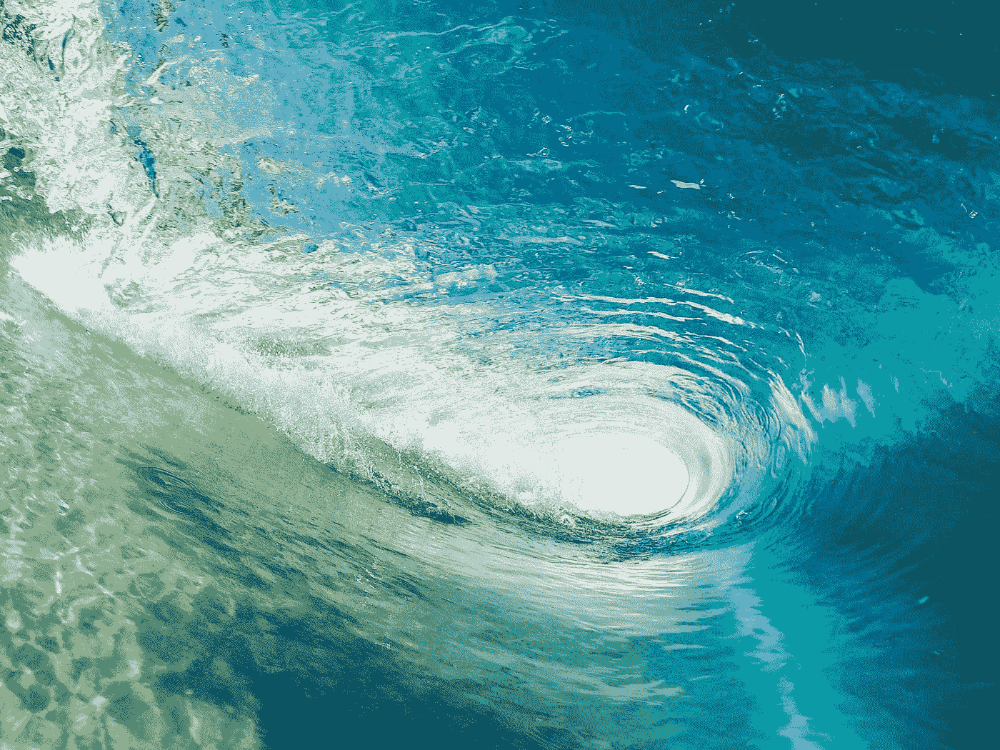
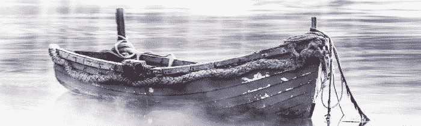

# 流动状态[再访]

> 原文：<https://medium.datadriveninvestor.com/flow-state-revisited-b4a6cbdf509e?source=collection_archive---------4----------------------->

更深入地了解我们如何优化我们的精神表现

Photo by [Jeremy Bishop](https://unsplash.com/@jeremybishop?utm_source=medium&utm_medium=referral) on [Unsplash](https://unsplash.com?utm_source=medium&utm_medium=referral)

独自在南极洲呆了 54 天，除了完全的寂静、狂风和远在零度以下的气温，科林·奥布拉迪完成了一项不可能的任务，他成为了第一个独自穿越南极洲的人。

尽管如此，他几乎没能熬过第一个小时。

 [## 成功的生活数据驱动型投资者的 25 种自我提升方法

### Faisal 在加拿大工作，拥有金融/经济和计算机方面的背景。他一直积极从事外汇交易…

www.datadriveninvestor.com](https://www.datadriveninvestor.com/2019/03/12/25-self-improvement-ways-for-a-successful-life/) 

是什么驱使他成功实现了这一雄心壮志？十多年前，在泰国的一场火灾中，他的下半身被大面积烧伤，医生告诉他再也无法行走。他的回答:心流状态。

> “我最终处于我心目中真正高性能的这个永恒、无空间的地方，这几乎是我所能想象的最深、最平静的冥想状态。在我心目中，到达那里是非常深刻和美好的。”—首席执行官

不久前，[我写了关于心流状态的文章，总结说存在一种精神状态，意识通过这些不同的增强思维状态流动，类似于当前时刻的某种超意识](https://medium.com/datadriveninvestor/flow-state-the-super-mind-5265932ba900)。从那以后，我在播客和其他形式的媒体中多次听到它，促使我重新评估我最初描述这种特殊意识框架的方法。

科林·奥布雷迪出现在《T2》的乔·罗根经历的一集里，在讲述他如何成功穿越南极海岸的过程中，他比我想象的更好地描述了这种心流状态，在这个过程中，他拖着 375 磅的东西。

关于我的上一篇文章，我意识到我试图填鸭式地灌输一些人们已经很大程度上意识到的东西是幼稚而突然的。然而，我并没有感到愚蠢，而是对这确实是一种普遍现象的前景感到兴奋。

因此，在接下来的努力中，我计划更深入地观察大脑，看看是什么导致了这种意识的心理状态，是什么神经化学活动在起作用，以及如何更好地理解这种增强的心理状态。类似于科林的任务:

> “到目前为止，对我来说，精神层面是最有趣的一面……对我来说，探索心灵就是这样……”

科林是以和我相似的方式意识到这些状态的——通过沉浸在身体耐力中。

> “我开始能够触发这些心流状态..作为一名终身职业运动员，在我的生活中经历了不同的能力，我已经利用了这一点，我小时候是一名游泳运动员，所以在游泳池里游泳，有时我会利用这个永恒的空间，也许 30 分钟在两分钟内就会过去，但我从来不知道我是如何到达那里的，只是有时会利用它，有时不会..

和我一样，只是在更加极端、激烈和值得称赞的情况下，他开始尝试触发这种心智能力，而不是让它自然产生:

> “随着我越来越多地进入这些空白，盯着指南针，盯着这片广阔的风景，我开始寻找方法来触发我脑海中的流动状态，所以它达到了这样一个点，我可以连续几天处于这种深度流动状态。”

那么，在头脑中会发生什么呢？我们西方理性主义者似乎需要我们的科学证明，才能对人类存在的规范功能之外的任何事情睁一只眼闭一只眼。所以可能在这里。

这个概念最初是由心理学教授米哈里·契克森米哈在 1975 年命名的，以他的研究对象唤起的感觉命名——类似于被水流携带(流动)。

当一个人进入这种心流状态时，他们会失去对周围所有其他事物的意识——时间、干扰、人、身体需求。沉浸在心流状态中的人的所有精神能量都指向手边的任务。举一个相当简单的例子——一个虔诚的游戏玩家可以一次玩几个小时而不会感到饥饿、口渴等。他们已经进入状态，比其他任何人都要好。

从神经生物学的角度来看，心流状态是大脑功能各种变化的副产品——特别是前额叶皮层的失活，正如专家史蒂文·科特勒所揭示的。随着前额叶皮层从行动中消失，我们失去了自我意识、自我监控和冲动控制。其结果是创造潜力、想象力和对新可能性的理想化的巨大增长。

> “大脑产生一系列巨大的神经化学物质。你会得到去甲肾上腺素、多巴胺、anandamide、血清素和内啡肽。所有这五种都是增强表现的神经化学物质。”—史蒂文·科特勒

去挖掘它吗？

似乎需要的一个特征是促使自己完全沉浸在任何给定的活动中，以至于一个人的时间和空间意识，简单地说，被忽视了。

米哈里·契克森米哈在他的书《最佳体验》中写道:

“人类有机体不能作为一束神经反射，甚至刺激反应学习路径而生存。为了在它适应的无限复杂的生态系统中表现，它需要从基因决定的指令中建立自主性，这些指令在漫长的进化过程中塑造了它的行为。”

换句话说，我们的思维已经发展到可以在我们本能中表现出来的基因指令之间进行调节，所有这些指令都在影响我们行为的文化指令下工作。当我们进入心流状态时,“应该”和“应该”会消失，因为我们完全沉浸在此刻发生的任何事情中。

> “我进入了一种心流状态。我以前爬山的时候去过那里。你没有提前考虑。你只是每一秒都在思考你面前的东西。”—阿伦·罗斯顿

虽然我不一定能代表别人说话，但帮助我进入心流状态的是一种积极的愿望，即尽可能保持对自己精神状态的警惕，提升我的意识，这样我就能俯视自己的思维模式。当然，除此之外，还必须有一项活动能够吸引我的全部注意力——山地自行车、比赛，甚至有时(在较小程度上)写作。

但是，当我发现自己处于那种特殊的精神状态时，那种感觉完全是超现实的，当我意识到自己就在那一瞬间时，那种感觉更加不可思议。不仅要站在心智潜能的悬崖边，而且要意识到它。

在一天结束的时候——这就是吸引我们注意力的地方，也是你选择阅读这篇文章的原因。心灵是一个美丽而神秘的实体，无论我们如何努力，都无法完全解开。但是，总的来说，我们可以在前进的过程中学到越来越多的东西——分享我们的经验，记录我们的想法，传达我们的见解。因此，可以说，理解心智的真正关键在于它的外部和内部，在于那些选择在自我发现的迷宫般的道路上漫步的人的经历中。

[**读下去:意识之渊**](https://theascent.pub/fathoms-of-consciousness-9261c9d52f65)

Diving below the shallows of surface consciousness

**参考指南**

https://www . psychologytoday . com/ca/blog/the-playing-field/2014 02/flow-States-and-creativity

米哈里·奇克森米哈伊(1990 年)。 [*心流:最佳体验的心理学*](https://books.google.com/books?id=V9KrQgAACAAJ) 。哈珀&排。国际标准书号 978–0–06–016253–5。

 [## 人类最佳表现的科学

### “跑步者的高潮”或“心流”，这个术语是我们意识的最佳状态，是真实的。

time.com](http://time.com/56809/the-science-of-peak-human-performance/)