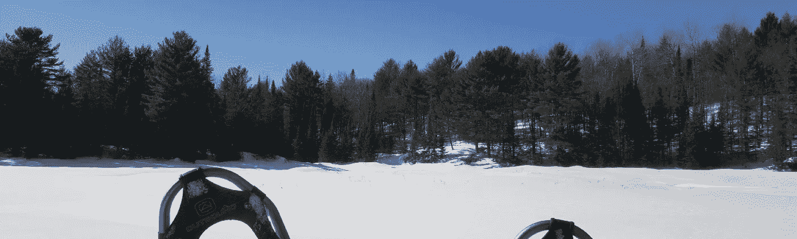

# 心流状态:超能力

> 原文：<https://medium.datadriveninvestor.com/flow-state-the-super-mind-5265932ba900?source=collection_archive---------2----------------------->

## 我们意图之河的思想实验

## 当我们越来越意识到这一点，以至于我们可以预言一个想法如何在我们头脑的创造性渠道中潮起潮落，或者我们如何动态地应对挑战时，奇迹就发生了。毕竟，我们需要辨别一种模式，我们对这种模式了解得越多，我们就能更好地利用这种模式为自己谋利。

Photo by [Sharon McCutcheon](https://unsplash.com/@sharonmccutcheon?utm_source=medium&utm_medium=referral) on [Unsplash](https://unsplash.com?utm_source=medium&utm_medium=referral)

> “兴奋和催眠带给一个舞蹈演员的超人力量，在他高度紧张状态下几乎不可思议的持久力中表现得尤为明显。”在舞蹈中，即使最弱小的人也能创造奇迹。"
> 
> **—科特·萨克斯**

有件事我已经做了几年了，是一种实现而不是一个概念。我确信它已经以多种方式被理解和阐明了，但是我的一部分不想通过另一个人的话在外部语境中理解它——所以我还没有真正走出我自己的方式去寻找它。

很久以前，我第一次注意到，当我们的肾上腺素流动时，我们倾向于进入的这个*区*，可以被扩展和更好地理解。事情发生在我骑山地车的时候——这是我的一个爱好，我钦佩这种令人印象深刻的方式，即反应能力、瞬间决策和肌肉反射以互补的方式结合在一起，防止骑车人面临严重的身体后果。

我不想说我开始操纵它，以某种方式在这个*区*内违背物理定律和时间，我会发现自己在 *—* 内，尽管这是一个更引人入胜的概念。这更像是在进行一种安静的观察，我的思维在这些不同的增强意识状态中流动，类似于当前时刻的某种超意识，同时总是保持专注于一个终点或最终结果。然后，我开始注意到同样的事情发生在我发现自己完全沉浸和参与的许多其他活动中:徒步旅行，参加竞技体育，甚至偶尔的运动或赛车视频游戏。越是关注，越是体会。

这本身并没有什么了不起的，我确信一个心理学家可以用神经功能术语来简洁地解释它，这些术语编织在一起说明了正在发生的事情。但最终，随着我锻炼这块肌肉，事情变得更有趣了。

最终，我开始做的不仅是在上述爱好和活动中预期这种*心流状态*(我现在应该称之为——有点俗气，但确实有效)的激活，而且我开始将其转录到其他努力和日常活动中。写作，健身，辩论或争论，头脑风暴，社交，追求想法。

令我惊讶的是，在某种程度上，这似乎很有效。在某些情况下，我对自己反应的高度关注让我对正在发生的事情有了更深刻的理解，说实话，这不是一件容易的事情，但我肯定会努力。

> "解决问题、发明、破解和编码更多的是内啡肽的肾上腺素激增，而不是一种感觉."———沃尔特·奥布莱恩

这都在等式的元素里。我能提供的最好的例子，也是我经历中最强的例子之一，与体育和写作有关。

在一个非常宽松的量子物理学背景下考虑这一点可能会有所帮助，因为这与我们的行动和我们在某些方向上移动的可能性有关(从字面上和比喻上讲)，我将在稍后更详细地讨论这一点。如果我们把自己从常规思维的界面中分离出来，克服语言带来的限制，这可能有助于更有意义。

所以我们试试。就该等式而言，必须存在以下元素:

A)自我意识到我们的行动和我们朝着某个方向、某个机会或促使一系列事件发生的意图。

b)从我们的主观观点来看，对时间的无情意识。可以说，时间可以成就我们的动力，也可以摧毁我们的动力。[我以前写过，当参与一项特定的运动或沉浸式活动时，时间是如何在主观上为我们变慢的](https://theascent.pub/bending-time-696c2f11fb03)——只要我们暂停对时间的标准客观感知，这一点就变得无可辩驳。

c)我们对前两点的持续意识；我们意识到我们的机动状态，也意识到我们的存在和时间进程。

这听起来像是一个心理医生耸人听闻的胡言乱语，我明白。但是，一旦我们偏离了传统的思考方式，思考我们应对生活挑战或驾驭战略的能力——我们的抱负、方向、目标和计划，以及我们在时间中的位置——就没那么复杂和不寻常了。

这个方程的应用可能有助于澄清。

> “肾上腺素太强了，我们谁都不理解。”—杰瑞·刘易斯

假设我们有了一个想法，一个创建新业务或写书的想法，或者一个博客帖子的想法或任何需要一些头脑风暴的新创意项目。

我们通常会经历兴奋、疲劳、沮丧、恢复兴奋、纪念等常见状态。我们会在新想法涌入的夜晚睡不着觉，也会在我们只想完全放弃那些想法的夜晚睡不着觉。有时我们意识到了这一点，有时我们没有。但是，如果我们提升我们的意识，理解我们正处于一个令人兴奋的阶段，或者我们正在穿越一个不可避免的减速带，在我们实现这个想法的动机中(即作家的阻碍)，如果我们理解时间可以决定我们的动机，如果我们把目光放在目的地，我们就喂养了这个永恒的注意力循环——流动状态。

在体育运动中，我利用这一点。我通常依靠我的超意识来做出必要的游戏或移动，或者在关键的游戏时刻故意将我的运动控制缰绳交给我的本能(同时有意识地这样做)。当骑山地自行车时，我不再看着前方 20 英尺的地方，这样我就能完全沉浸在下坡时必须绕过的无数障碍中。我越相信我的自然反射，我的表现就越好，我越意识到这一点，我就越沉浸在活动中。

你可以称之为意识。

当我有一个新的想法要写一篇博客，或者有一个新的角度要扭转我的书时，我不一定要强迫它——意识到我处于一种非创造性的精神状态，我把它放在一边，知道我最终会在一个更合适的时间重新接近它，等待我的创造力最强的时候。我心中有我的终点，我决心到达那里，同时明白时间是唯一能对我不利的东西，因为我真的能够朝着我想要的任何方向前进。

当我把足球或飞盘扔进端线时，我不一定会考虑我的脚的位置或风速，防守者伸出的手臂或我的动量的后续动作——这些都是我的大脑已经考虑过的因素——它们是第二自然运动功能，而不是大脑的最前沿。相反，头脑中最重要的是球的预期目的地和我把球放在那里的意识。

因此，从某种意义上说，在时间的背景下，对运动和环境、目标和机会的认识，将等于我们想要的结果。

> “我们必须清楚，当谈到原子时，语言只能像在诗歌中一样使用。”——尼尔斯·玻尔

我并没有花太多时间去筛选量子科学，试图找到一个与此大致对应的理论。非常宽松地说，[天生法则](https://en.wikipedia.org/wiki/Born_rule)似乎是合适的。最简单的形式是，在给定点发现粒子的概率密度与该点粒子波函数的平方成正比；简而言之，测量和观察有助于最终结果。粗略地说，这就是头脑在做的事情。

因此，我们可以通过始终专注于终点，目的地，对沿途的任何路障或障碍保持格外的警惕，来显化我们想要的。

当我们观察自己向目的地前进时，我们的每一个行动都会随着时间的推移而产生涟漪，因为我们非常清楚这一点，所以我们真的可以充分利用这些微小的行动。在某种程度上，我们甚至可以利用我们的能量。以学习为例:熟练且有意识的学生在考试前几个月每天都会学习一到两页课本，因此能够轻松通过考试。没有意识到这一点的学生将会在临近结束时临时抱佛脚，给自己带来更多的麻烦，并且可能表现得更差。每一个行动都沿着我们的意图之河顺流而下。

很明显，我不是物理学家，不管是量子还是其他，但是我的经历证明了这个理论。自 2018 年 10 月以来，我已经在 Medium 上写了 150 多篇文章——也就是说每天一篇，平均每篇 1100 字；通过遵循这个*理论*，我比我一生中任何时候都锻炼得更有效率；我已经提高了我的山地自行车技术，当我认为我真的不能得到更好的时候；我已经开始写一本关于哲学的自我发现本质的书，同时在我的事业、家庭和一段关系中全职工作。

这不是什么疯狂的革命性理论——这是我试图阐明的一种保持动力并获得成功的方法。它可能很难被认为是吸引力法则或简单的努力工作等概念的附属品。具有讽刺意味的是，它甚至可以用一个词来概括(意识)，尽管我觉得要真正解释这个过程还需要更多的东西。

对我来说，这有点类似于那些无数的东方哲学格言，宣扬在生活的许多障碍或挑战中流动——像水一样，像一阵风一样。虽然这不一定像是试图成为轻松绕过障碍物的水——这更像是整条河本身。

[**上读:雪中行迹**](https://theascent.pub/tracks-in-snow-limits-in-sky-f787c09f2b86)

Trudging Over The Illusions of Limitation