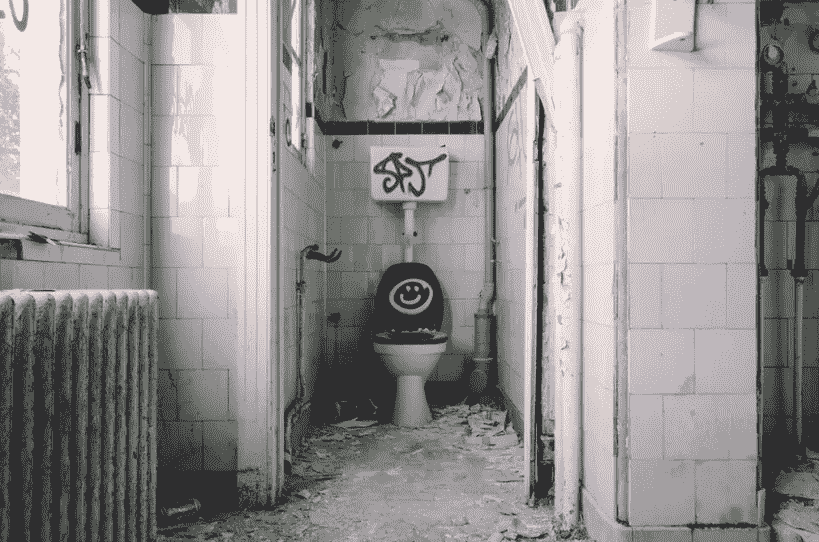
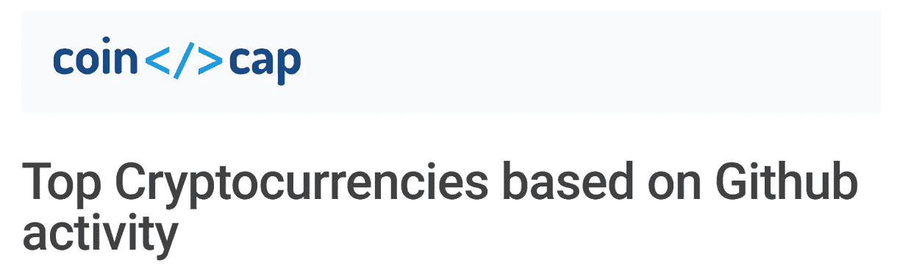
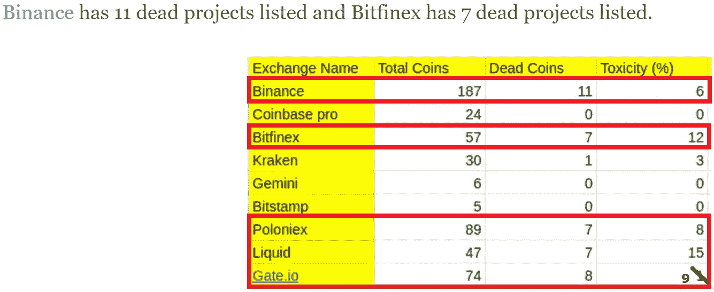

# 冲嘘！走出密码市场始于交易所

> 原文：<https://medium.datadriveninvestor.com/flushing-sh-tcoins-out-of-crypto-markets-begins-with-exchanges-e7081d1d6a1d?source=collection_archive---------6----------------------->

## 别忘了摇动把手，币安

## 最近对 3100 多个区块链项目的分析显示，有 1200 多个项目停滞不前。今天我将分享一个免费的资源，告诉你如何避免踩到它们。

把自己想象成一名密码新手。你知道比特币和以太坊，但有传言称，这些巨大的收益来自更广泛的比特币市场。人们对价格可能飙升 100 倍的数字资产的潜力感到兴奋，开始寻找一颗隐藏的宝石。

 [## 如何创建加密货币[逐步指南] |数据驱动的投资者

### 加密货币是如何工作的？如何制作加密货币？如何创建自己的加密货币？所有这些问题…

www.datadriveninvestor.com](https://www.datadriveninvestor.com/2019/03/25/how-to-create-your-own-cryptocurrency-and-make-your-business-ready-for-the-future/) 

现在，许多加密新秀首先偶然发现了[**CoinMarketCap**](https://coinmarketcap.com/)——但是 [**CoinGecko**](https://www.coingecko.com/) 和 [**Coinpaprika**](https://coinpaprika.com/) 也拥有独特的功能。但不管偏好如何，大多数对加密资产的搜索都是从价格聚合网站开始的。

被超大的资产选项菜单弄得不知所措，你可能会拿起一袋名字最吸引人的东西，甚至是当天价格最高的任何一种代币。“要是我昨天找到这个就好了。明天肯定会再涨 10%！”

在 2017 年疯狂的牛市中非常有可能。但在 2019 年末的熊市中，尽管不在可能性范围之外，但可能不会。

现在，大多数投资者都充分意识到了多元化。毕竟，将 100%的可投资资金放在单一资产中被认为是不明智的。

同样的原理也适用于加密货币研究。对 BTC 或瑞士联邦交易所的价格波动和交易量是很好的指标。但是不要让那些巨大的马卡普愚弄你。

在一枚硬币的生态系统中流动的数百万美元并不能自动证明它是一笔好买卖。你看，在绿色蜡烛和红色落下的刀的过山车下面，有一个更重要的标准。

所以，坐下来，让自己舒服点，读这个关于它的小故事。

# 超越市值

没有编码，区块链项目就不存在。嗯，他们仍然可以假装拯救世界，这是太多的人正在做的事情。

在 2017 年的 ICO 热潮中，投资者愿意在任何有前途的白皮书项目上投入数百万美元。这些项目基本上是在说，“现在把你的钱给我们，我们会用它来建造一些伟大的东西。”问题是，这些项目中的许多除了炒作之外，并没有创造任何东西的意图。

现在，如果说这场旷日持久、残酷的熊市教会了我什么的话，那就是你不能轻信他们的话。从退出骗局到持续错过的项目里程碑，2019 年是失信之年。

当然，即使是动机最好的项目也会遇到坎坷，甚至归零。也就是说，有一种简单的方法可以区分哪些区块链项目正在编写代码，哪些项目正在用投资者的钱在全球包机上啜饮香槟。

现在，为了更深入地了解任何项目的长期潜力，查看代码开发是至关重要的。检查一个项目的**提交数量**可以告诉你你是否正在寻找一种正在积极改进的加密货币。

你可能会问，什么是“提交”？

嗯，很简单。任何时候有****对项目代码**的变更，该变更被记录为**提交**并接收一个唯一的 ID。因此，提交越多，代码升级越多。**

**提交信息随时可用。大多数开源项目从他们的网站链接到他们的 [**GitHub**](https://github.com) 库。毕竟,“开源”的意义在于代码对任何想使用它的人都是公开的。**

**现在你知道你在找什么，在这里你可以找到关于谁在推动区块链收养和谁在开车睡觉的信息:[**CoinCodeCap.com**](http://CoinCodeCap.com)。**

****

**Image courtesy of [Daniel Jensen](https://unsplash.com/@dallehj) via Unsplash**

# **令牌化僵尸**

**希望你永远不会看到人类僵尸，但某些区块链项目正在给人留下最好的印象。**

**除了根据提交数量对项目进行排名，CoinCodeCap 还包含一个听起来很吓人的“死亡项目”部分。工厂如何识别漂浮物？计算——尽管有些武断，特别是在考虑“成熟”代码时——是基于 90 天的窗口。**

**如果一个项目的代码在过去的三个月里收集了数字灰尘，它就有可能永远不会复活。**

> **访问 [CoinCodeCap 的“死亡项目”部分](https://coincodecap.com/dead-crypto-project)来看看哪些加密货币在上海！列表。你也可以[点击这里](https://blog.coincodecap.com/dead-coins-on-crypto-exchanges/)找到该网站最近对数千个项目的分析。**

**现在，根据一些硬币的效用——或者说缺乏效用——来判断，这个项目很可能是一个骗局。是的， [**GCN 币**](https://coinmarketcap.com/currencies/gcn-coin/) ，我正看着你。**

**项目代码库缺乏前进的动力是困扰业界的一个问题。而且，作为提供交易能力的服务提供商！首先，加密交换让消费者失望了。**

**你看，商业行为有问题的项目首先就不应该出现在交易所。密码交易所有责任彻底调查和监控所列项目，从而减少欺诈。**

**但在某些情况下——比如下面的例子——交易所就像它们的一些上市一样可疑。**

****

**Image credit: [CoinCodeCap](https://blog.coincodecap.com/dead-coins-on-crypto-exchanges/)**

# **做正确的事**

**从比特币基地、双子星和 Bitstamp 上的数字资产的小得多的选择来看，人们可以假设项目审查过程是稳健的。**

**交易所运营商在道德上有责任保持 sh！tcoins 侵扰他们的业务。比特币基地也有它的敌人，但是加密资产保险在今天的市场上是罕见的。除了项目选择越来越少，资金也在不断改善。**

**换句话说，贪钱、内爆的定时炸弹项目不会在比特币基地及其同类身上看到阳光。在你指责我先令集中交易之前…听着，马，没有附属链接！**

****

**Um, Binance, you stepped in something**

# **来吧，伙计们，拿起你的 Sh！一起 t！**

**在一个整洁、易于理解的图表中包含的并排比较使评估变得快速和容易。而且，仅从漂浮在鱼缸中的硬币数量来看，币安是赢家。**

> **币安是世界上“最受欢迎”的密码交易所，拥有 11 个可供交易的交易平台，拥有最多由死亡项目管理的资产。**

**也就是说，在“百分比”类别中有一个令人惊讶的冠军:液体。这一个令人费解，因为液体是众所周知的游戏规则。该交易所在新加坡受到全面监管，其股票在日本股市交易。**

**但是高达 15%的比例，液体成为了密码世界中最有毒的集中交易。考虑到该交易所的产品规模是其中国竞争对手的 1/3，并且 [**Liquid 的博客** **将** **项目放在用户的雷达上**](https://redfoxlabs.io/redfox-labs-appears-on-liquid-exchanges-radar/)**——死去的项目不应该有资格使用 Liquid 作为交易基地。****

****你很容易在其他交易所发现可疑的商业行为，包括 P2PB2B。试图在那里存钱，你可能再也见不到他们了:****

**** [## 加密中的不幸:幽灵存款

### 花足够的时间在区块链上，你肯定会遇到打嗝。交易所里放错位置的零可能意味着…

hackernoon.com](https://hackernoon.com/misadventures-in-crypto-the-phantom-deposit-vg31e35lw) 

好消息是主要的加密资产有交易重叠。在某些情况下，你将不得不加入一个不知名的交易所来捞起一个特定项目的袋子。但在大多数情况下，获得排名第一的硬币和代币是一个选择你喜欢的交易所的问题。

# 最后的想法

死亡项目在加密宇宙中没有业务。合法的非诈骗项目看到他们的努力被华而不实、误导性的白皮书所掩盖。

从投资、收养和道德的角度来看，每一个 sh！tcoin——其运营商永远不会发布具有实际效用的产品——对区块链工业是一种伤害。

努力工作、编写代码、创新的项目值得我们关注。当 8 亿多美元在硬币和代币的生态系统中流动时，这些硬币和代币只不过是沉重的负担，我们有一个需要升级的破碎系统。

这种增强始于交流。当 Trabek 的 Turd Ferguson Coin(TTFC)没有流动性市场时，推动它们的人就少得多，因此保护了大多数投资者免于不可避免的垮台。

交易所欠我们所有人——为了长期生存，也欠它们自己——清理门户。是否需要成千上万的密码资产。没有。

当更少的粪便漂浮在数字资产的海洋中时，整个生态系统会更加健康。它们是对时间和资源的真正浪费。而且，就像人们坚持带进杂货店的非服务犬一样，对那些诚实工作的人来说，它们只不过是一种干扰。

去坐下，币安。你昨晚吃得太多了，该拉屎了！**** 

# ****特别感谢****

****如果你还没有，去看看 [**CoinCodeCap**](https://coincodecap.com/) 。没有他们出色的分析工作，这篇文章就不复存在。****

> *******免责声明*** *:这不是投资或理财建议。本文中的信息主要是推测性的观点，仅供娱乐。过去的表现不能保证未来的结果。*****
> 
> *****在参与任何项目之前，无论是在加密市场还是在加密市场之外，都要进行自己的研究。作者可能持有本文提到的某些项目的原生加密货币。*****

# ****无耻的插头****

****如果你喜欢这篇文章，请点击掌声。不会痛的，我保证。现在就开始尝试吧！您的支持有助于这篇文章在整个区块链世界传播。****

****另外，如果你想帮助把你的加密信息传递给大众，我很乐意听听你的项目。即使你只想聊聊加密或者你最喜欢的区块链创新，你也可以在这里找到我:**block chain author at Gmail******