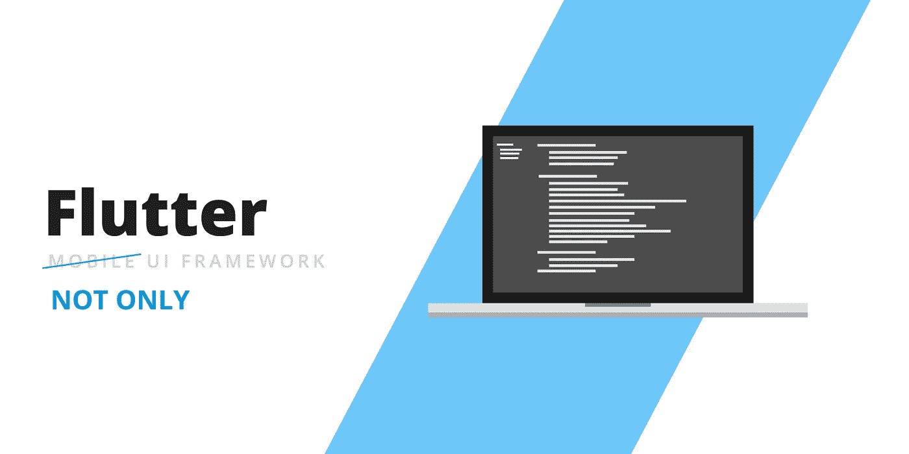

# 为网络和桌面而战——工作的现状和特点

> 原文：<https://medium.datadriveninvestor.com/flutter-for-web-desktop-current-status-and-peculiarities-of-work-91dae7995381?source=collection_archive---------10----------------------->

lutter 作为一个伟大的工具迅速赢得了声誉，它允许你在各种平台上创建一个伟大的应用程序。然而，该平台最近有所发展，现在允许开发人员为 web 和桌面构建。Flutter 摆在他们面前的目标是成为开发卓越质量体验的顶级框架，而不管屏幕如何。自 2017 年 5 月首次推出以来，Flutter 已经走过了漫长的道路，越来越多的开发部分是由于谷歌内部团队依赖这项技术以及 Dart 平台的缓慢性能。记住所有这些，让我们仔细看看现在可用的最新版本。然而，以前如果开发者在以下位置创建应用程序:

然后，他们需要调整代码库以在每个平台上工作，这造成了很多麻烦。正如我们将在后面看到的，由于 Flutter，开发人员现在只需编写一次代码，就可以在所有这些平台上工作。这是他们长久以来梦寐以求的事情，是一个非常受欢迎的进步。不用说，这带来了很多机会，因为它也可以用来构建直观的用户界面。关于这一点，让我们来看看在 Flutter 中取得的所有进步。

 [## 2019 年最值得学习的编码语言——数据驱动的投资者

### 在我读大学的那几年，我跳过了很多次夜游去学习 Java，希望有一天它能帮助我在…

www.datadriveninvestor.com](https://www.datadriveninvestor.com/2019/02/21/best-coding-languages-to-learn-in-2019/) 

# 颤动腹板

当谷歌推出 Flutter 的 web 预览版时，当他们决定立即开始增强性能并主要关注确保代码库与其他一切完美和谐时，它立即设定了很高的期望。期望的结果将是创建包含非常酷的图形和非常交互的体验的内容。如果你是一个早期采用者，继续尝试，并确保向谷歌提供你的反馈，因为他们要求它。为了向所有人展示 Flutter 的能力，谷歌创建了一个名为 Kenken 的益智游戏，供广大观众在纽约时报网站上玩。这个游戏为所有平台使用一个代码库。

由于所有这些发展，现在在 Flutter 的帮助下，[开发一个网站](https://skywell.software/web-development/)很容易，甚至是从零开始。它还可以用来创建 web 应用程序，并轻松地将其编译成标准的 web 项目。

# 为台式机而战

曾经是一个实验项目已经发展成为一个颤振发动机。虽然这些目标还不能用于生产，但一些关于创建 Flutter 应用程序的说明已经可用，无论桌面操作系统是什么。正如我们今天所看到的，web 版的 Flutter 比桌面版的要发达得多，因为后者仍然需要大量的工作。话虽如此，但无论是网络版还是桌面版都无法投入生产，尽管谷歌团队正在不知疲倦地工作，以确保在不久的将来一切都准备就绪，因为他们渴望这项技术成为主流。

# 嵌入式服务

谷歌已经使 Flutter 嵌入其他设备成为可能。事实上，他们已经在一些有限的样本中向每个人展示了 Flutter 如何在一些较小的设备上工作，如 Raspberry Pi。在最近的一次活动中，谷歌推出了下一代 Hub Max，我们发现 Flutter 已经在智能显示操作系统上工作。谷歌对 Flutter 有非常雄心勃勃的计划，比如让它支持大部分服务。这是你可以期待很快发生的事情。

# 遇到的挑战

为了让 Flutter 应用于 web，需要克服一些障碍。其中一个问题是，确保负责生成所有文本和图形的引擎达到所需的性能水平，并能够支持所有不同浏览器的基本 web 功能。他们还希望架构是平台不可知的。这之所以成为可能，是因为当你创建一个 Flutter web 应用时，整个框架都被编译成 JavaScript，这样它就可以在浏览器中运行。

# 为 Web 开发而战

随着在 Flutter 中所做的所有开发，开发者现在可以使用它来缓解在试图为用户提供跨设备的一致体验时所涉及的头痛问题。在 iOS 和 Android 的脱节问题得到处理后，我们现在离一次编写、随处工作的梦想又近了一步。谷歌最近做了很多努力来消除 Flutter 只是用于移动开发的观念，展示了如何使用它为 web 和桌面构建。Flutter 桌面应用程序现在包括一个新的和改进的键盘和鼠标支持，这是让应用程序在运行各种操作系统的 PC 上工作的整体努力的一部分。

虽然用蜂鸟这样的工具很容易创建一个 Flutter 网站，但开发几乎在任何地方都能工作的应用程序也同样简单。随着技术变得越来越发达，你可以期待它与更成熟的框架竞争。

*最初发布于*[*https://sky well . software*](https://skywell.software/blog/flutter-for-web-desktop/)*。*