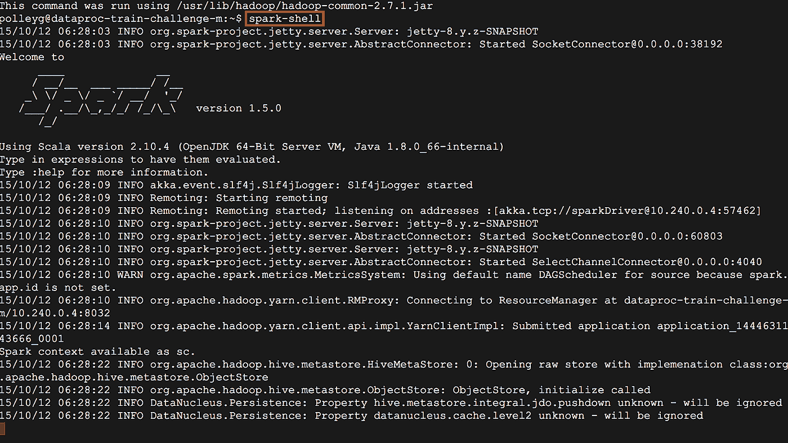

# 什么是阿帕奇火花？

> 原文：<https://medium.datadriveninvestor.com/fnu-for-non-unicorns-what-is-apache-spark-613667e98c67?source=collection_archive---------0----------------------->

Love those Unicorns!

**警告**:这不是给那些高科技的独角兽们看的，你们这些神话般的野兽闪耀着 SQL 和 Java，让代码无论走到哪里都开花结果。这是为那些想在普通水平上理解 Apache Spark 的普通人准备的。网上有许多资源可以帮助您更深入地了解 Apache Spark，但是对于不懂代码的人来说，理解它可能很困难。无意冒犯独角兽，它们真的很棒！

这是为那些想了解一点 Apache Spark 的好奇者准备的。也许你会想更进一步，了解更多；那太好了。

我们将遵循这些文章的“谁、什么、哪里、何时、为什么”和“如何”模式。我希望你喜欢它们。此外，如果你有一个话题或技术要求，请在下面的评论中告诉我。

***想学习如何通过 Cloudera 在 Spark 中可视化数据？观看联网汽车视频！***

**在我们开始之前，让我们先讨论一下什么不是阿帕奇火花:**通常由摩擦产生的静止电荷，它会导致火花或噼啪声，或者吸引灰尘或毛发。(静电)

**世卫组织**:

数据科学家使用 Apache Spark 来执行高级数据分析。Python 提供了一组广泛的高级分析功能，可以对 Spark 中的数据执行这些功能。Python 是数据科学社区中比较流行的语言之一，Spark 也通过一个名为 [pySpark](https://spark.apache.org/docs/0.9.0/python-programming-guide.html) 的工具集来支持 python。

数据工程师是数据设计者或构建者。他们通常在数据监管之旅中协助数据科学家和应用程序开发人员。他们基于用例和需求为组织开发架构。

应用程序开发人员可以使用 Apache Spark 构建解决方案。这些应用程序通常用于分析和商业智能目的。Spark 非常适合数据分析风格的应用程序，而不适合事务处理应用程序。

**底线** : Apache Spark 需要相当数量的技术知识才能工作。普通的商业人士将需要大量的帮助来运行 Apache Spark(非常慷慨)。它是为程序员、数据科学家和高技术独角兽准备的。

什么东西？

Apache Spark 是一个用于大数据工作负载的分布式处理系统。分布式系统是许多服务器的集合，它们像一个团队一样一起工作。分布式系统可以处理更大的数据集，进行更多的数据处理，并解决大数据问题，因为我将工作分散在许多计算机上。请这样想:如果你想移动一张沙发，不止一个人可以做到！

Apache Spark 还利用内存缓存对任何数据大小进行快速分析查询。内存缓存设计用于将数据存储在 RAM 中，而不是磁盘上。您可以使用 Scala、Python、R 和 SQL 等语言来利用 Apache Spark。

**底线:** Apache Spark 创建于 2009 年，并在 2012 年变得有弹性，因为 MapReduce(参见下面的原因部分)缓慢而复杂，而人们想要更快更简单的东西。Apache Spark 比 MapReduce 更快，编程也简单得多。想象一下，把一堆数据塞进计算机内存，然后能够快速地阅读、处理或做一些事情。那是阿帕奇火花。

**哪里:**

Apache Spark 可以安装在本地，甚至可以安装在您的笔记本电脑上。您也可以拥有多节点实例。Spark 也可以在云中使用，你可以很容易地在 Amazon Web Services 或 Microsoft Azure 中建立一个实例。还有 Databricks，是 Spark 的云提供商。Databricks 允许您非常快速地建立一个集群，并且有一个易于使用的 web 界面。

一句话:Apache Spark 是开源的，所以疯狂一下，自己在笔记本电脑上安装它，试试看。它也有一些例子。如果你想用 Spark 做大，我建议你先在 Databricks 上试试，或者用 AWS 或 Azure 这样的云提供商。

**何时:**

Spark 对于知道如何使用它以及如何绕过它的限制的人来说是有用的。简单的演示是不够的；不要被字数统计的例子所迷惑。这并不总是容易的。就内存问题而言，处理大规模数据可能会很困难。

当您从单节点实例转移到多节点集群环境时，就会遇到大问题。当大数据在数据大小、工作负载和环境管理方面遇到挑战时，就要向大型集群迈进。这有点像一句老话:“移动的部件越多，东西损坏的机会就越大。”

**底线**:小心行事，耐心等待。Apache Spark 需要一些真正的技术人才来工作。不要被简单的例子和演示所迷惑，确保获得大数据规模的真实例子。大数据是海量数据集，比 Excel 电子表格所能容纳的要大得多。

**为什么:**

Spark 于 2009 年在加州大学伯克利分校的 AMPLab 开发，并于 2010 年移交给 Apache 开源社区。2012 年，为了应对 MapReduce 集群计算范式(Apache Hadoop 的初始编程框架)中的挫折，它准备好了黄金时间。MapReduce 在分布式程序上强制使用线性数据流结构:MapReduce 程序从磁盘读取输入数据，跨数据映射一个函数，对映射结果进行归约，并将归约结果存储在磁盘上。通俗地说，MapReduce 速度很慢！慢+大数据=没有乐趣，于是我们得到了火花。

**底线:**在大数据世界中，开发人员对 MapReduce 的性能感到失望。因为需要是发明之母:我们有阿帕奇火花

**如何:**

如果你正在阅读这篇文章，你很好奇 Apache Spark 是什么，它是如何工作的。如果你鼓起勇气，你也可以让它在你的笔记本电脑上运行。试试看。这里有一篇关于安装 Apache Spark 单节点实例的优秀文章: [**在 Mac 上安装 Spark(PySpark)**](https://medium.com/@GalarnykMichael/install-spark-on-mac-pyspark-453f395f240b)

我相信你也能找到你内心的独角兽！

**底线:**开始使用 Apache Spark 的单个节点实例既有趣又容易！不会花很长时间，大约一个下午。Apache Spark 的单节点(一台电脑)和多节点集群(多台电脑)有很大的区别。如果你真的想在技术领域给你的朋友留下深刻印象，下次你演讲的时候打开 pySpark 窗口(见下文)。这会让他们大吃一惊！(确保你的脸上有一种自信的严肃表情，然后转移话题。)

This is the Python interface to Spark… Super easy to use right! :)

**结论:Spark 是一项令人难以置信的技术，本文仅触及其皮毛。我没有深入研究 rdd 和其他方面，但也许在以后的文章中我会。希望下次讲 Apache Hadoop 的时候能看到！**

**行动号召:**与此同时，如果你想做一些真正超级简单有趣的事情，请查看[阿卡迪亚即时](https://www.arcadiadata.com/product/instant/)。这是我们技术的免费版本。如果你好奇想了解更多，ping 我，我带你逛逛！

最初发布于:[https://www . arcadiadata . com/blog/for-non-unicorns-what-is-Apache-spark/](https://www.arcadiadata.com/blog/for-non-unicorns-what-is-apache-spark/)