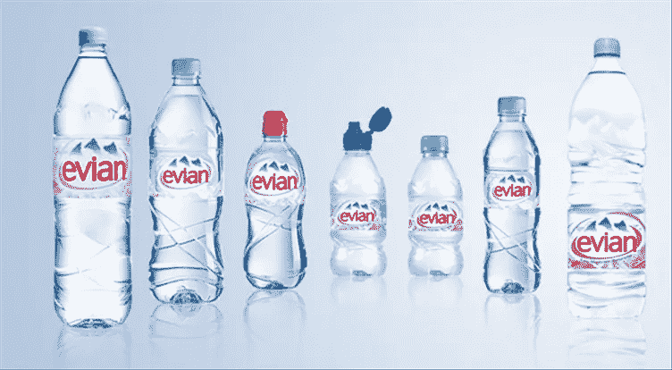

# 首先关注包装，然后解决定价问题

> 原文：<https://medium.datadriveninvestor.com/focus-on-packaging-first-then-tackle-pricing-dc2ec987ae0c?source=collection_archive---------7----------------------->

大多数定价和包装的讨论都是从有人说“我们需要改变价格”开始的当你分析问题时，通常会发现是包装带来了挑战。

无论您是为现有产品确定包装和定价，还是向市场推出新产品，首先考虑包装，其次考虑定价都是值得的。

# 包装主要是你如何计算你卖的东西

包装听起来很抽象，但实际上很简单:你如何计算你卖的东西。我从事企业软件工作，所以通常情况下，事情是由用户、机器、CPU、应用程序或 IP 许可的。你的模型可能不同，但你得到了图片。

当然，包装也包括捆绑。通常，你会把人们真正想要的东西和卖得不好的东西捆绑在一起，做成一笔划算的交易。捆绑是一个复杂的话题，所以在本文中我们将跳过它。

# 包装比定价更难解决，所以你必须把它做好

如果价格太高，销售总是可以打折的。包装很难快速修复。如果你已经在销售，你通常必须创建一个自定义的 SKU，这使得操作和更新困难。最糟糕的情况是，您必须与工程部门合作来覆盖您的许可引擎。大多数公司最终会通过打折来掩盖设计糟糕的包装。

> 如果价格太高，销售总是可以打折的。包装很难快速修复。

# 挑战您的包装假设

如果你开始考虑价格，很可能你已经对你的产品如何包装做了一个假设。确保你挑战你的假设，而不仅仅是跟随竞争。

许多很酷的新产品在定价上有很大差异。你可能会发现一个新的商业模式。想想 Spotify:打包的明显方式是出售一张专辑的永久许可证。他们选择了一个不同的衡量标准——世界上所有音乐的每月重复许可证。这很大程度上总结了他们的创新，一切都在包装中。

# 根据您的定位调整包装

定位将决定包装，至少和定价一样重要。如果你的包装不符合你的定位，你需要重新开始。

让我们假设你在推销矿泉水。如果你想把水定位为运动的补水，你的包装应该支持这一点。您将添加一个翻盖或自行车瓶喷嘴。你将为一小时的锻炼提供足够的水分。

如果你的定位是为家庭提供一种节约成本的自来水替代品，你可以制作带有简单旋转盖的大瓶子。如果你想向提供免费瓶装水的企业销售，你将再次选择不同的包装。

# 包装会影响您的工程团队

当你推出新产品时，优先考虑包装决定，因为它会对你的工程团队产生影响，或者如果你销售的是实物，会对生产产生影响。如果你没有提前进行讨论，工程会简单地“假设”你会以某种方式包装产品，你会被束缚住手脚。你的技术的许可引擎将不得不根据你的包装来编写，所以这不是你可以在发布前的最后一周改变的。

> 如果你没有提前进行讨论，工程会简单地“假设”你会以某种方式包装产品，你会被束缚住手脚。

# 包装客户想怎么买，而不是根据你的成本结构

不仅在定价时，而且在包装时，都要把自己从“成本加利润”的思维中解放出来。尤其是当你销售软件产品时，利润通常足够高，给你一些选择不同指标的灵活性。例如，谷歌广告的定价不是根据印象(这将是谷歌的成本)，而是根据点击率，因此它更受客户价值的驱动，而不是成本的驱动。

当然，你需要关注成本，但这应该是在你定价后对你的包装模型的一个理智测试，而不是一个起点。

# 以一种便于销售和购买商品的方式包装

包装可以使产品的销售变得容易或困难。考虑未来的顾客会如何考虑购买你的产品。如果你使用不同的标准，你可能很难估计出他们需要支付的价格。

一个假设的例子:如果你出售一个应用程序，它是按照你的手机一天获得一个新 IP 地址的次数来定价的，消费者将很难知道他们需要支付多少钱，因为我们大多数人都不知道。如果你问他们有多少部手机，那就简单多了。是的，这是一个人为的例子，但我见过类似的例子，包装是过度设计的，对客户不友好。

有些包装可能对您很好，因为它符合您的成本结构，但客户很难预算，特别是如果您有一个基于消费的包装指标，而不是每月或每年的固定费用。选择能让你的顾客更容易预算他们一年的花费的包装会减少销售中的摩擦。

> 选择能让你的顾客更容易预算他们一年的花费的包装会减少销售中的摩擦。

# 不要假设你的顾客是罪犯

在你的包装讨论中，你的一个同事会问:“我们如何阻止我们的客户滥用这种模式？”请不要假设你所有的顾客都是罪犯。大多数人都会遵守规则，尤其是当你向大公司销售时。是的，这里或那里会有违规行为，但它可能不会让银行破产，并且是简化业务的一个很好的权衡。

然而，你可能想在你的合同中加入一些小字来保护你自己。例如，保留退出合同的权利，或者对你提供的服务设置一些安全限制。想想“无限固定费率”，它有一个很高的 GB 限制，以确保人们不会滥用系统。它将对大多数人产生无限的影响，但保护你的业务不被滥用。

# 你认为包装怎么样？

我是从我从事企业软件工作的角度来写这些技巧的，但是我相信它们中的许多也适用于其他行业。请在下面的评论中告诉我你在包装方面的冒险经历——无论你有相同的经历还是不同的观点。