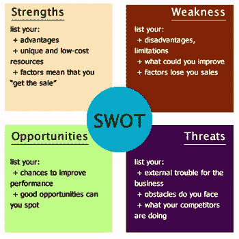

# 关注你的优势，了解你的弱点

> 原文：<https://medium.datadriveninvestor.com/focus-on-your-strength-know-your-weakness-5cbd186e4d8e?source=collection_archive---------17----------------------->

营销分析师运用优势、劣势、机会和威胁(SWOC)的概念对商业项目进行深入的审查。“威胁”一词不时被“挑战”所取代，以强调这场危机可能足够有趣，足以找到进一步发展的根源。

**实力如何？**

任何项目的优势都是通过衡量具体业务做得最好来定义的。这是每一个营销策略、位置或广告活动不可避免的一部分。例如，如果该公司是 X 国唯一生产中文杂志的公司，利基被认为是它的优势。另一个例子表明，无法与先进和被提升的企业竞争的生产商如何降低价格来吸引更多的顾客。在这种情况下，价格就是公司生产的实力。

**成功企业的核心价值观**

对商业效率感兴趣的专家们创造了一个令人兴奋的公式来描述一个成功的商业项目的组成部分。尤其是，所有有抱负的人都应该注意可靠性、能力、开放性和同情心。让我们看看这些概念是如何影响著名公司的声誉的。

**当可靠性成为关键**

大概，一个最可靠的公司，当它转向我们的宝藏，是联邦快递。这家公司在许多最方便系统的排名中获得第一名，这一点也不奇怪。除此之外，联邦快递还推出了一项名为“我们理解”的搭配活动，强调不同类型的服务:

*‘我们理解不是每个人都需要联邦快递追踪应用程序的所有功能。因此，我们也有一些其他的方法让你用联邦快递来追踪。*

**能力至关重要**

耐克是一家有专业决策能力的公司的完美例子。他们不怕诸如“如果你有身体，你就是运动员”之类的长篇大论。考虑到所生产的鞋子的质量，我们理解这家公司有权利在市场上宣称其优越性。

**开放性:如何保持联系**

星巴克是开放、联系和与观众各种互动领域的先驱。他们不仅为顾客提供美味的咖啡，还希望来到他们空间的人感到快乐。顺便说一句，客户完全有理由在访问后不感到沮丧。例如，你会很容易找到免费 Wi-Fi 区，更不用说店内音乐了。星巴克的管理人员还考虑到了这样一个事实，即咖啡吧对于小组会议和谈判来说相当方便。所以，他们想出了大桌子和独立房间的主意。在这里，一切都是关于联系和开放。

同情:这个世界需要治疗者

当我们谈论同情心时，是时候定义你的公司是否有企业社会责任了。表达同情有不同的方式。其中一个想法与生产环保产品有关，另一个想法与慈善事业和参与慈善活动有关。有些组织从来不认为道德是理所当然的，并尽最大努力捍卫世界上的道德标准。

**那么，弱点呢？**

有一次，我的一个朋友向我求助。这位领导海外教育机构的女性面临着金融危机。她失去了重要的客户，团队工作没有热情，她向她所在行业的同事借了很多钱。当我们开始查看她的活动时，我们立即发现了她认为很小的各种问题。尤其是，她没有注意到客户的需求。此外，主管没有调查市场的现状，有时无法了解哪些目的地更受欢迎或不太受欢迎。此外，她有一个网站，其中包含不相关的价格。所以，这并不奇怪，所有这些问题直接导致她陷入危机。

你知道，做生意的时候，没有小事。你做的每一件事都会影响你的下一步。在这里，我们将详细研究任何企业都可能面临的所有错误和弱点。我们开始吧。

**你有演讲吗？**

一些企业忘记在网站上做演示或工作，以在互联网上宣传他们的活动。他们也不认为拥有不同种类的传单是如此重要，这些传单可以成为任何成功演示的良好视觉背景。

此外，一些负责组织的人很可能有过时的设计，不能吸引顾客。记住，你永远不应该偏离这一领域的流行趋势。与此同时，如果竞争对手有更吸引人的网页，有相关的数据和好看的演示，很容易失败并被市场抛弃。

你是如何维护声誉的？

另一个严重的问题是缺乏对公司声誉的关注。强有力的参与者总是试图跟上时代，在顾客中进行调查，并且诚实地看待顾客是否满意，或者他们为什么不喜欢某种商品和服务。

万一排名越来越靠后，高管们应该组织一些活动，从客户对公司的态度入手。

你在营销上花了多少钱？

有时候我会从高管那里听到一些奇怪的事情。他们声称不想在营销上花钱。似乎有些公司认为只有提出高质量的产品和服务，他们才能赢得这场游戏。我们绝对不同意这种做法。

尽管质量很重要，但广告和其他促销活动在产品开发中起着相当重要的作用。

**人员怎么样？**

粗鲁的员工显示出公司缺乏专业水准。没有人会回到顾客被冒犯的商店。如果你还在犹豫，看看那些评论就知道了:

-我记得当高级餐厅的服务员评论我点的食物数量时，我是多么生气。我再也不去这个可怕的地方了！(约翰，26 岁)

-有一次服务员不允许我们用卡付账。他们要求用现金支付，但我们只带了信用卡。这很可能会造成问题，但突然餐馆的老板来了，并支付了账单。他说，他不想让我们在参观后感到沮丧。

你看，这些例子说明了好的和坏的服务是如何对选择因素产生巨大影响的。