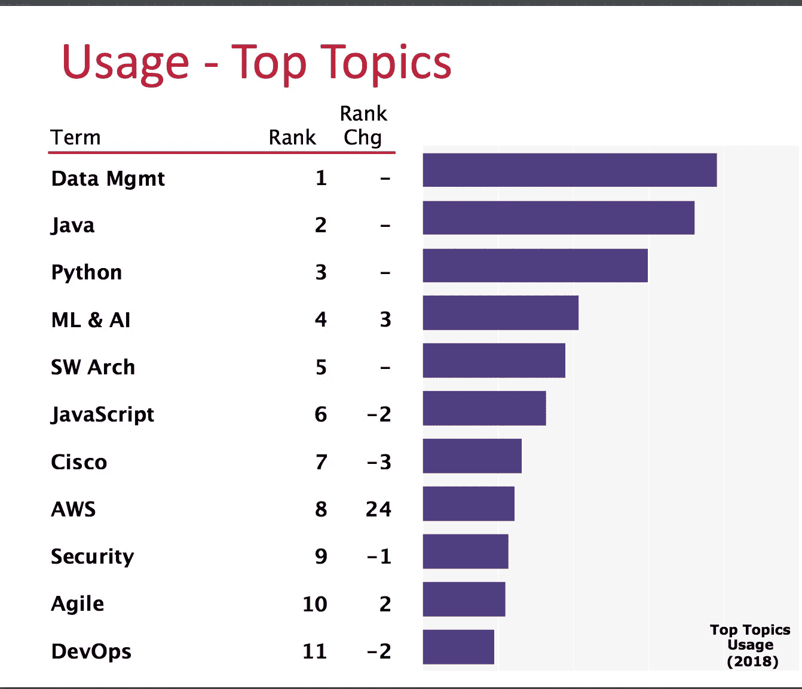

# 遵循这 5 个步骤，让自己与技术保持同步！

> 原文：<https://medium.datadriveninvestor.com/follow-these-5-steps-to-keep-yourself-updated-with-technologies-9736fec0594f?source=collection_archive---------1----------------------->

随着如此多的技术每天不断涌现，我们经常问自己这样的问题:

*   为什么科技会有如此大的进步。
*   我真的需要不断更新技术吗？
*   我如何才能真正跟上所有这些新兴技术的发展？

 [## 准备在 2019 年改变世界的技术-数据驱动的投资者

### 很难想象一项技术会像去年的区块链一样受到如此多的关注，但是……

www.datadriveninvestor.com](https://www.datadriveninvestor.com/2019/01/17/the-technologies-poised-to-change-the-world-in-2019/) 

技术进步的简单答案是，从金融/银行到零售/电子商务到制造/媒体/教育，几乎所有行业都采用了技术产品。技术已经影响了整个行业。 [**这 18 个不可思议的(像— Android、iPad、Stripe、Airbnb、Spotify)产品，10 年前还不存在**](https://www.businessinsider.in/these-18-incredible-products-didnt-exist-10-years-ago/articleshow/59620344.cms)

如果你看看 O'Reilly Safari 发布的开源技术[趋势，你会注意到一些新技术正在变得流行，让我们自己跟上这一趋势将有助于在推进你的职业生涯时做出更好的决定。请参见下面的热门技术主题列表:](https://conferences.oreilly.com/oscon/oscon-or-2018/public/schedule/detail/71443)

[https://conferences.oreilly.com/oscon/oscon-or-2018/public/schedule/detail/71443](https://conferences.oreilly.com/oscon/oscon-or-2018/public/schedule/detail/71443)

现在的问题是如何让我们自己跟上这么多新兴技术的发展。在这个故事中，我提出了 5 个步骤，如果遵循这些步骤，可以帮助你更新。

## #1 —建立动力—为什么您需要更新技术？

> 你的目标是路线图，指引着你，告诉你你的生活有什么可能。莱斯·布朗

这是你深入学习技术之前最重要的一步。**问问自己真正的动机！应该是这样的:**

*   你想在事业上获得权力或进步吗？
*   你有好奇心或学习兴趣吗？
*   你想在你的组织中建立信誉吗？
*   你想创建一个个人品牌吗？
*   你有一个想通过建造原型向世界展示的想法吗？

这里的目标是建立一个你想要达到的目的！

## #2.找到一些现实世界的问题——小而有价值

> 如果挑战存在，解决方案也必须存在。
> 
> 罗娜·姆纳里克

假设你渴望学习移动技术，那么你必须想出一个移动技术可以解决的现实世界的问题。它可以很小，但重要的是一些技术应用的想法。

当我们知道这项技术可以应用在哪里时，你就可以开始深入研究了。

目前市场上有许多基于 Android 或 iOS 技术平台的移动应用程序。你的目标应该是了解它们是如何建造的，这将在你的学习过程中给你一些意义。

## #3.开始探索可以解决这些问题的技术。

> 我选择一个懒惰的人去做艰苦的工作。因为一个懒惰的人会找到一个简单的方法去做。
> 
> ― **比尔·盖茨**

一旦你有了动力和真正的问题，就把它写在某个地方，不断提醒你。然后从实现这一目标的可能性开始。

例如，当您在研究移动应用程序开发时，您可以浏览原生应用程序或混合应用程序开发流程，并尝试找出哪些流程有助于您更快地获得结果，以及如何获得结果。

当您考虑从后端扩展时，可以探索 Java 等后端技术。net、python 和许多其他语言，看看哪一个更适合你。

***目标是找到一种能以最简单的方式解决您的问题的技术，并在此过程中理解为什么某些技术如此复杂。***

## #4.建筑材料

> 知道是不够的；我们必须申请。许愿是不够的；我们必须这么做。”——**约翰·沃尔夫冈·冯·歌德**

一旦你对各种可用的技术有了合理的理解，那么就试着去构建一些东西来在现实中看到它们。如果它是一个小应用程序，这是可以的，但遵循这一点将有助于你更好地理解这项技术。

***这里的目标是通过做来理解技术！***

## #5.分享/教学/合作

> 知道的，做。理解的人，教导。
> ― **亚里士多德**

最后，通过讨论或正式聚会，与你的同事、朋友分享你的学习成果。

当你能够教别人的时候，你就会真正知道你真正吸收了多少。

与他人分享你学习新技术的经验，并获得他人的反馈，这将进一步巩固你的知识。

***这里的目标是检查你对技术的理解程度***

## 结论

虽然这些步骤看起来简单明了，但实际上，这需要纪律来实现。

我的最后一个建议是应用这些，就像你如何执行一个客户项目一样。让自己负起责任，并保持这个过程的时间限制。

***坚持学习！***