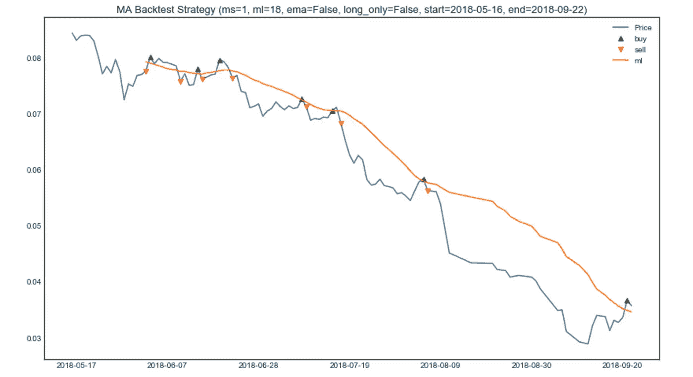
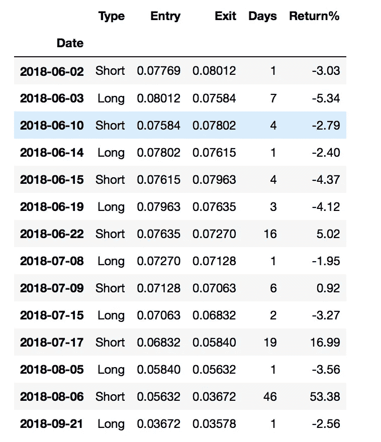
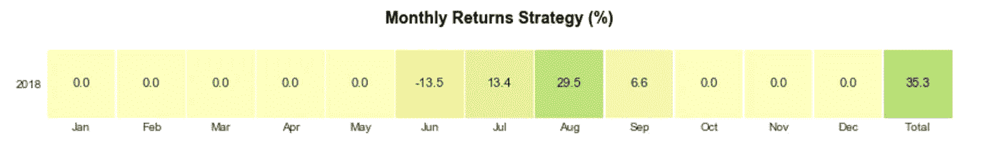

# 跟进:交易 ETH 以获取更多 BTC 的策略

> 原文：<https://medium.datadriveninvestor.com/follow-up-a-strategy-for-trading-eth-to-make-more-btc-603131aeece1?source=collection_archive---------15----------------------->


在 2018 年 5 月 15 日，我发表了[交易 ETH 以获得更多 BTC 的策略](https://medium.com/coinmonks/a-strategy-for-trading-eth-to-make-more-btc-3985c3c93c04)，其中我使用移动平均线(MA)创建了一个交易 ETH 以获得更多 BTC 的策略。如果你没有读过那篇文章，请先读一读。

自那以后发生了很多事情，所以我决定查看一下，看看这篇文章发表以来这个策略的效果如何。这是一个真正的样本外测试，因为该策略不可能考虑到 5 月 15 日后会发生什么。

正如在最初的文章中，我将使用 GDAX 交易所的 ETH 价格，可以从 [Quandl](https://www.quandl.com/data/GDAX/ETH_BTC-ETH-BTC-Exchange-Rate) 下载。在 Jupyter 笔记本 [ethereum_follow_up.ipynb](http://crypto-price-analysis/etherium_follow_up.ipynb) 中可以找到这个跟进的代码。

首先，这里是结果的摘要。买入并持有 ETH 将导致亏损-57%。另一方面，并购策略可以获得 35%的收益，这真是太棒了。请记住，这些回报是以 BTC 而不是美元计价的。2.56%的未实现收益是迄今为止尚未完成的最终交易的收益。

```
'Buy and Hold': -57.65%
'Strategy': 35.33%
'Trades': 14
'Trades_per_month': 3.3
'Unrealised': -2.56%
'Years': 0.35
```

如果你运行的策略不允许任何做空(即只允许做多)，那么策略回报将会损失-21%。一点也不好，但仍比买入并持有亏损 57%要好。

这是一张显示 ETH 价格以及 18 天移动平均线和可能被触发的买卖点的图表。



下面是实际交易的清单，以及每笔交易的回报。如你所见，大部分策略收益来自于 7 月 17 日和 8 月 6 日触发的做空。其余的交易大多都是小亏，有时也有小赚。我认为这是典型的动量策略，在强劲的趋势中你赚了所有的钱，而在其余的时间里你遭受了小的损失(如果没有趋势，随着时间的推移，损失会很快增加)。



最后，这是逐月回报的热图。唯一亏损的月份是六月。



自从写了第一篇文章，我就开始交易这种策略和其他类似的策略，看看交易的现实和理论有多吻合。这仍然是一项正在进行的工作，但这里是我迄今为止学到的一些东西:

*   不管模型怎么说，到了实际交易的时候，我发现自己在双重猜测这个决定。随着时间的推移，当结果与模型相符时，我发现我的信心建立起来了，跟着模型走也慢慢变得容易了。
*   该策略的 long only 版本执行起来相当简单。你可以在交易所买卖实际的 ETH。长/短版本增加了许多额外的复杂性、风险和成本。你可以使用 Bitfinex 交易所为空头借入 ETH(支付借款成本)，或者你可以在 Bitmex 上使用他们的长期掉期或期货为多头和空头执行策略。到目前为止，我发现 Bitmex 互换对于这种动量策略来说太“昂贵”了，因为你做多的时候通常与多头支付空头的时候一致，而你做空的时候通常与空头支付多头的时候一致。这对回报有很大的拖累。我发现使用 Bitmex 期货是一个更好的选择，尽管掉期交易有更大的流动性。Bitmex 的另一个好处是，你可以利用他们提供的杠杆来降低交易所风险，只需将一部分资金放在交易所，其余的资金只在需要时转移到 Bitmex。
*   另一个重要的实施细节是是否使用止损单进行风险管理，如果是，止损单的范围有多广。策略本身有一个自然的“内置”止损，当趋势的方向改变时，策略本身会触发反向交易。除此之外，增加实际止损单(固定的或跟踪的)会降低回报，因为止损需要足够宽，以允许策略呼吸。现在我已经决定使用额外的止损点，并且正在测试它们的最佳水平。
*   另一种思考这种策略的方式是对冲。比方说，你相信自己的长期目标，并且正在努力实现。你可以把 ETH 冷藏起来，其中的%放在 Bitmex 上，只用于做空(利用杠杆，这样你就不需要在交易所拥有超过必要的资金)。当策略说做空时，你做空 Bitmex(如果你想 100%做空，名义金额为你持有的总 ETH 的 2 倍)。当策略说做多时，你只需平仓做空。你的最大外汇风险是你在 Bitmex 上的金额。不管 Bitmex 发生了什么，你冷库里的 ETH 都是安全的。
*   该策略完全基于收盘价。如果价格在一天内穿过均线，你就忽略它，等着看收盘价会发生什么。然而，如果你使用掉期或期货，必须考虑日内峰值，因为你可能会被清算。例如，如果你目前做空，即使当天收盘时价格再次下跌，策略显示你仍应做空，盘中的大幅上涨也会将你平仓。这将导致实际结果与模型结果大相径庭。我仍在积极测试如何最好地处理它。一种方法是在交易所投入更多资金，减少或不使用杠杆，但这增加了你的交易风险。所有的资金都在一个交易所，如果交易所倒闭，你将面临破产风险，不管这种情况发生的概率有多小，唯一可以接受的破产风险是零，因为你无法从中恢复。
*   加密基本面和市场状况变化很快，2018 年的市场脉搏可能与 2016 年的状况完全无关。如果是这样的话，使用更近的数据重新校准移动平均回望周期，然后继续使用它可能是有意义的。这个想法是，你首先证明移动平均线在一般情况下可以检测到隐藏的趋势，然后你找到当前条件下最好的一个。与此相反的观点是，你会面临更高的[曲线拟合/过度拟合](https://en.wikipedia.org/wiki/Overfitting)的风险。到目前为止，我的方法是找到最近运行良好，但在一系列其他资产上也运行良好的参数，以及在过去运行良好的参数，即使它们对于过去的数据不是最优的。这包括要求在一系列不同的过去条件下工作良好，如牛市和熊市。换句话说，一般来说效果很好，但是对最近的数据结果有偏见。

如果你喜欢这篇文章或者得到了什么好处，请**鼓掌**，让其他人也能发现。

*请注意，本文中的任何内容都不应被视为投资或交易建议。以上是我个人的看法和体会。比特币和以太坊的波动性极大。在投资或交易之前，请做好自己的研究。*