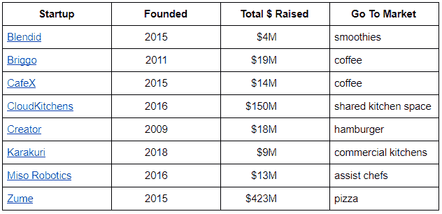
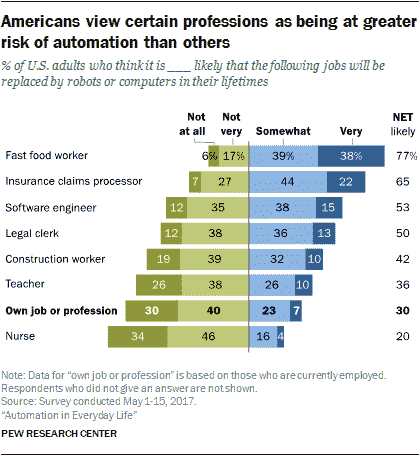

# 食品自动化:创业浪潮

> 原文：<https://medium.datadriveninvestor.com/food-automation-a-tidal-wave-of-startups-b443ea4fe0d2?source=collection_archive---------8----------------------->

photo credit: Walt Disney’s ‘Fantasia’​. Picture: Rex

在美国，食品商店比以往任何时候都多，考虑到日益繁荣和人口增长，这是可以预料的。但更重要的是，餐馆的增长速度是人口增长速度的两倍，这给 T2 带来了巨大的劳动力短缺。不断增长的市场需求，加上差异化的需要，催生了各种机器人餐厅，从拉斯维加斯的[微醺机器人酒吧](http://thetipsyrobot.com/)到波士顿的 [Spyce](http://thetipsyrobot.com/) 餐厅。但这只是冰山一角——是初创公司在驾驭和创造变革的浪潮。这篇文章主要关注这个领域的三个主要趋势。

**1)资金到位**

十年前，食品制造是一个初创公司闻所未闻的领域，因为低技术和低利润是长期存在的老生常谈。然而，现在有几十家资本雄厚的公司，因为技术越来越先进，人们对效率的期望也越来越高。事实上，风险投资基金通常有 10 年的时间跨度，因此资本涌入食品自动化的事实反映了一种普遍的看法，即食品行业正在发生巨大变化。下表按字母顺序列出了一些比较著名的初创公司，并警告说“筹集的资金总额”是公开披露的数字，这往往少报了事实。

完全披露:我是通过 Tau Ventures 投资 Blendid 的投资者。

 [## 不管准备好了没有，革命就在我们面前|数据驱动的投资者

### “对于技术如何影响我们的生活和重塑经济，我们必须形成全面的全球共识……

www.datadriveninvestor.com](https://www.datadriveninvestor.com/2019/02/12/ready-or-not-the-revolution-is-upon-us/) 

**2)回路中的人**

我们今天所知的自动化在许多方面都比人类好得多。机器人可以更快地切菜。机器人可以毫不费力地遵循同样的食谱。机器人可以追踪无限的订单。但关键是很多东西，不是所有的东西，事实上之前描述的例子都是狭义的任务。让机器人随机应变，即使是当今最好的无人监管算法也会停止。他们的服务也很糟糕。更不用说人类是确保机器有足够的原材料并且不会出现故障的人。事实上，食品自动化领域的第一批初创公司试图利用技术解决所有问题，但并没有获得巨大成功。这就是为什么你会以标题结尾，比如“[最时髦的烤奶酪企业如何被烧毁](https://www.wired.com/story/how-the-trendiest-grilled-cheese-venture-got-burnt/)”这些新兴公司的压倒性精神是人在循环中，即人对机器人运行的过程仍然是必不可少的。

**3)规模经济**

食品行业的利润率极低，餐厅的平均利润率为 2%，因此自动化带来的真正节约是规模化的。想想有数百个地点的快餐连锁店，而不是只有一个地点的，典型的高端餐馆。即使早在 2017 年，美国人就认为快餐工人是最有可能被自动化颠覆的第一职业，这并不奇怪。

事实上，今天几乎所有的创业公司都瞄准了外出就餐的 7500 亿美元，少数瞄准了家庭烹饪的 7500 亿美元。

*原载于:* [*数据驱动投资人*](https://www.datadriveninvestor.com/2019/11/05/food-automation-startups/) *。”我是*[*Tau Ventures*](https://www.linkedin.com/pulse/announcing-tau-ventures-amit-garg/)*的管理合伙人和联合创始人，在硅谷工作了 20 年，涉足企业、创业公司和风险投资基金。这些都是专注于实践见解的有目的的短文(我称之为 GL；dr —良好的长度；确实读过)。我的许多文章都在*[*https://www . LinkedIn . com/in/am garg/detail/recent-activity/posts*](https://www.linkedin.com/in/amgarg/detail/recent-activity/posts/)*上，如果它们能让人们对某个话题产生足够的兴趣，从而进行更深入的探讨，我会感到非常兴奋。如果这篇文章有对你有用的见解，请评论和/或给文章和* [*Tau Ventures 的 LinkedIn 页面*](https://www.linkedin.com/company/tauventures) *点赞，感谢你对我们工作的支持。这里表达的所有观点都是我自己的。*