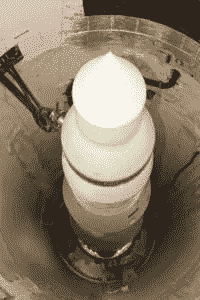
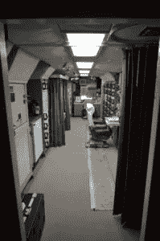
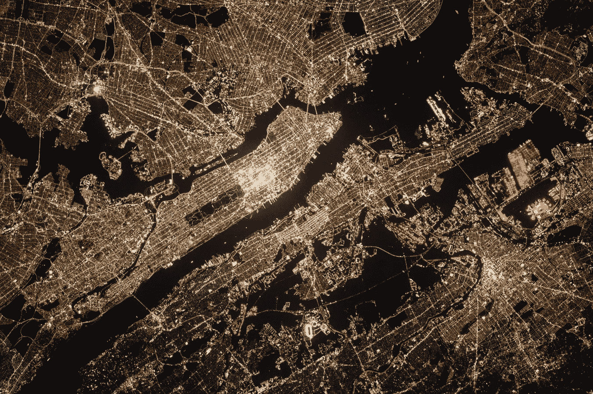

# 15 年来，美国秘密的核发射代码是“00000000”

> 原文：<https://medium.datadriveninvestor.com/for-15-years-americas-secret-nuclear-launch-codes-were-00000000-4874cb74f4bb?source=collection_archive---------1----------------------->

韦斯·安东内尔

InMilitary.com 和 InCyberDefense.com 的执行编辑,*。美国陆军和美国空军退伍军人。发言人和资深律师。*

有人说，事实往往比小说更离奇。根据[2004 年由【Bruce Blair 博士(前民兵导弹发射控制官](http://web.archive.org/web/20040404013440/http:/www.cdi.org/blair/permissive-action-links.cfm)撰写的一份备忘录，美国战略空军司令部(SAC)曾经有意将美国所有民兵核导弹发射井的发射代码设置为一系列八个零。

SAC 的目标是在第三次世界大战爆发的情况下，最大限度地缩短对苏联发动报复性核导弹打击的时间。毕竟，强迫年轻的空军军官拨 8 个随机数字只会浪费宝贵的时间。

1962 年，约翰·肯尼迪总统签署了第 160 号《国家安全行动备忘录》,要求美国的每一枚核武器都配备一个许可行动链接(PAL ),以防止未经授权获得武器。这一安全措施在美国部署了核武器的国家尤其令人担忧，因为武器的实体安全甚至东道国的稳定都有可能受到质疑。

## JFK 的核武器伙伴关系系统花了将近 20 年才被激活

尽管肯尼迪下了命令，PAL 系统还是在将近 20 年后才被激活。JFK 国防部长罗伯特·麦克纳马拉监督了美国民兵发射井上 PAL 设备的安装

然而，据 Gizmodo 报道，战略空军司令部对麦克纳马拉的出现非常不满。事实上，麦克纳马拉一离开国防部，所有 50 枚导弹的发射密码就被设定为 00000000。

值得注意的是，虽然有人可以通过 00000000 代码获得核武器，但装备实际弹头的过程要复杂得多。

[据空军国家博物馆](http://www.nationalmuseum.af.mil/Visit/Museum-Exhibits/Fact-Sheets/Display/Article/197675/launching-missiles/)，

这个过程包括打开一个“紧急战争令”保险箱，然后同时转动两把锁相距 12 英尺的钥匙。启动过程的其他部分包括输入更多的发射代码，这些代码可能不是 8 个零，并在发射开始前获得另一个机构的同意——要么是另一个发射控制设施，要么是空中指挥中心。

## 在冷战期间，战略空军司令部直接违反了总统命令

从安全的角度来看，也许最令人震惊的不是 PAL 代码被设置为 8 个零，而是 SAC 直接违反了冷战高峰时期——核局势极度紧张时期——总司令的命令。PAL 系统的全部目的是防止任何人在没有总统授权的情况下接触或发射核武器。

尽管在美国实施 PAL 系统存在问题，但核弹头的安全性可能会更差。据 BBC 报道，早在 1997 年，英国的核武器就用自行车锁保护起来了。

没有讨厌的八位数密码或双钥系统。相反，英国的核武器可以简单地通过将自行车锁钥匙插入保险开关并将其旋转 90 度来保险。

如今，美国 PAL 系统已经升级为“代码管理系统”，该系统于 2004 年上线，实现了效率和安全性的双重提升。到目前为止，访问代码已经被更改，而且毫无疑问变得更加复杂。或许密码是 123？

本文原载于 InCyberDefense.com 的