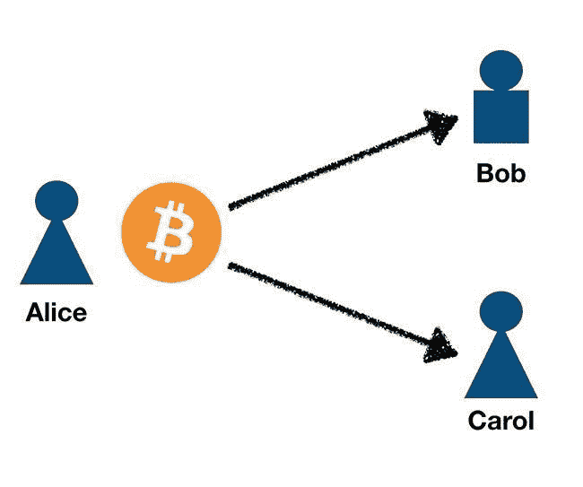
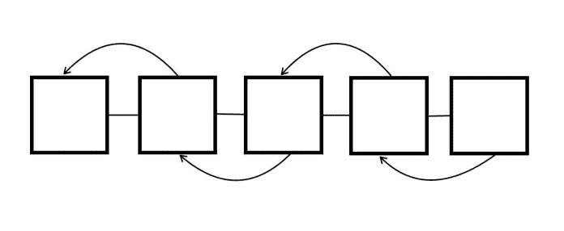
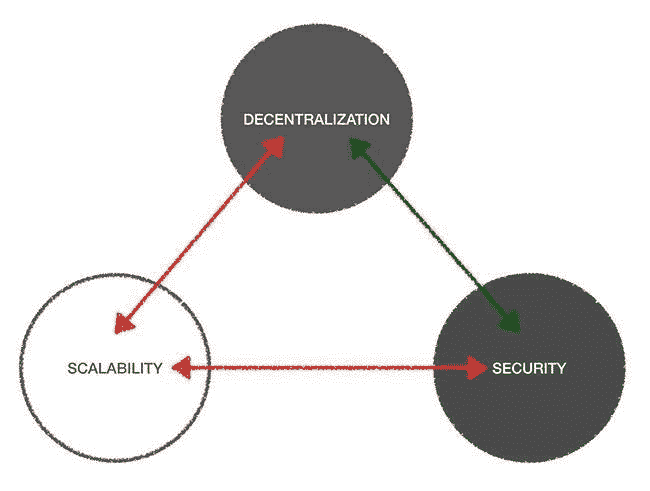

# 对比特币来说，缓慢但肯定比快速但模糊要好

> 原文：<https://medium.datadriveninvestor.com/for-bitcoin-slowly-but-surely-is-better-than-quickly-but-vaguely-2de7f22e4f39?source=collection_archive---------2----------------------->

你大概听说过很多针对 [**比特币**](https://www.datadriveninvestor.com/glossary/bitcoin/)**【BTC】**及其[共识机制](https://www.datadriveninvestor.com/glossary/consensus-mechanism/)的批评。比特币被称为速度慢、能效低。与此同时，也有批评者在推托另一种他们已经成为铁杆支持者的[加密货币](https://www.datadriveninvestor.com/glossary/cryptocurrency/)。对比特币的主要批评是，它“浪费了大量能源”，而且“速度慢，无法处理大量交易”。

如果我说这些陈述是错误的，那我就错了。事实上，他们是正确的。比特币是现存的第一个也是最古老的区块链，它有其局限性。比特币社区之间的分歧导致了 2017 年的分裂或倒退，这创造了**比特币现金(BCH)** 。在区块链世界，当人们对未来的发展方向产生分歧时，这种分歧是很常见的。BCH 的支持者希望扩大比特币的规模，以更低的交易费用变得更快。

 [## 分散金融的出现|数据驱动的投资者

### 当前的全球金融体系为拥有资源、知识和财富的人创造了巨大的财富

www.datadriveninvestor.com](https://www.datadriveninvestor.com/2019/03/14/the-emergence-of-decentralized-finance/) 

它可能会很慢，但这并不意味着它没有实现它的目标，创始人中本聪在 2008 年 10 月的白皮书中明确表示。比特币被开发成一个密码安全的 P2P 支付系统，运行在一个分散的网络上。让我们来看看为什么比特币速度慢，但仍然实现了它的目的。

## 双重花费问题

在比特币之前，数字电子支付系统面临的一个问题是所谓的“双重支出”。在电子系统中，数据很容易被复制，因为它现在是数字格式的。计算机可以复制信息，并通过分布式网络传输信息。这就是为什么我们可以轻松快速地复制数字文件，然后保存在我们选择的任何地方。问题是，当你用电子方式兑换货币时，你也可以把它存起来并不止一次地使用它。

这就是 ***【双重消费】*** 的问题，也是电子支付系统的一个固有缺陷，因为数字货币可以像任何其他数据文件一样被复制和伪造。如果允许它扩散，它会导致通货膨胀压力，因为流通中的货币量本来就不存在。这就像用[法币](https://www.datadriveninvestor.com/glossary/fiat-currency-2/)造假一样。

举个例子，假设我们有一个名为*“ePayNow”*的电子支付系统，它使用一个名为*“eP”*的[令牌](https://www.datadriveninvestor.com/glossary/token/)。爱丽丝想给鲍勃 5 便士作为他卖给她的一些商品的报酬。爱丽丝然后支付金额。现在，Alice 决定也使用相同的 5 eP 作为支付给 Carol 的款项，以购买另一件商品。理论上，你不应该用同样的货币支付给两个不同的人同样的 5 便士。在电子支付系统中，这是可能的，除非你实现了一个检查系统。

双花费攻击将允许爱丽丝花费相同的比特币来支付鲍勃和卡罗尔。

在这种情况下，系统缺少的是保证交易安全的[密码](https://www.datadriveninvestor.com/glossary/cryptography/)和验证交易的共识机制。这就产生了一个验证系统，它使用一个由不可信的计算机组成的分散网络来检查重复花费，这个网络被称为节点。然后数据被写入一个公共的分类账数据库，也就是你所说的区块链数据库。它有效地解决了双重花费的问题。现在仍然有可能发动一次双重花费的攻击，但是由于区块链，这样做变得更加困难和昂贵。

## 区块链拯救世界

中本聪让区块链成为了比特币的“英雄”。他能够[通过在区块链上使用验证交易来解决](https://www.datadriveninvestor.com/glossary/address/)重复支出问题。比特币利用博弈论，对一笔交易的有效性达成一个大体一致的协议，将其放入区块中，由所有参与网络的节点进行验证。比特币网络上产生一个[块](https://www.datadriveninvestor.com/glossary/block/)的平均时间是 10 分钟。

**区块链**是一个[数据结构](https://www.datadriveninvestor.com/glossary/data-structure/)，它是一个由加密哈希链接的分布式数据库。它在设计和用途上不同于传统的数据库。它存储用于验证目的的数据，这些数据可用作单一的真实来源。

在 PoW 共识机制中，称为*“矿工”*的节点通过尝试解决困难的密码难题来竞争验证块。得到正确答案的矿工被称为*随机数*，他将验证该块，作为回报，他将获得[奖励](https://www.investopedia.com/terms/b/block-reward.asp)。比特币使用一个[难度](https://www.datadriveninvestor.com/glossary/difficulty/)目标，该目标根据网络中的总哈希功率来确定随机数的求解速度。难度随着网络上可用的散列能力的总量而增加。哈希能力的提高与网络上的矿工数量成正比。增加难度是为了减慢积木的制作速度。这样做是为了防止耗尽比特币的所有供应。具有大部分散列率的坏演员(即，强大的计算机)可能快速挖掘块来收集奖励。因此，该算法将通过使挖掘变得更加困难来进行调整，并允许其他挖掘者有机会求解随机数。

计算随机数耗费大量电能，这就是批评者所说的低效。根据比特币传播者安德烈亚斯·安东诺普洛斯的说法，这不是浪费能源，而是创造比特币的生产过程的一部分。就像你花费能量从地下提取黄金一样，在这种情况下，能量被用来生产比特币。这就是价值所在，矿商们因为他们的计算贡献和保护网络而获得回报。然而，当看到许多矿工从哪里获得电力资源时，他们实际上是绿色和可再生资源。在冰岛，矿工利用地热发电进行[比特币](https://www.datadriveninvestor.com/glossary/bitcoin/)采矿。其他电力来源包括水热和太阳能。这个过程解释起来相当长，但基本上就是比特币支付网络上的交易是如何被验证的。

卖方不能通过假装没有收到货款来欺骗买方，反之亦然。这是因为真相被记录在区块链的数据库中，并且对所有人来说是不可改变和透明的。区块链充当公共分类账，可以证实爱丽丝支付鲍勃，鲍勃收到了他的付款。在不信任的节点之间有一个共识，它们不需要彼此知道。这有助于消除任何种类的共谋，这种共谋更可能发生在可信系统中，因为它是集中控制的。

区块链的本意是相反的，所以这是它建立信任的地方。换句话说，交易的每一部分都必须诚信行事，否则就会有后果。如果一个坏演员试图花双倍的钱，他们会意识到攻击网络的代价更大，所以他们宁愿真诚地挖掘。透明度阻止了不诚实行为，因为它对公众开放，一旦交易被加入区块链，没有人能篡改交易。因此，Bob 不能说 Alice 没有付款给他，因为如果我们使用[块浏览器](https://www.datadriveninvestor.com/glossary/block-explorer/)它可以跟踪交易以显示付款凭证。

## 可伸缩性三难困境

区块链听起来像是金融科技领域期待已久的解决方案。

没那么快，现在让我解释一下为什么不是这样。

不幸的是，区块链面临着创始人兼区块链爱好者维塔利克·布特林所说的*[***可扩展性***](https://www.datadriveninvestor.com/glossary/scalability/)*。这是因为为了获得区块链，必须做出权衡。理想情况下，区块链具有 3 个重要特性，即:**

**然而，这里的问题是，一个区块链只能拥有 3 个属性中的 2 个。**

****

**你最多只能拥有一个区块链的 3 个属性中的 2 个，分别是**和**安全**。当你拥有这两者时，你就无法实现 [**的可扩展性**](https://www.datadriveninvestor.com/glossary/scalability/) 。这可以通过**“可扩展性三难困境”**理论(比特币的例子)的图表来说明。****

****当你有更多的分散，你也有更大的安全性，但你将不得不牺牲可伸缩性。****

****当你减少去中心化，你就有了可伸缩性，但是也减少了安全性。****

****分散式系统为网络带来了更加分布式的体系结构。没有单点故障，因此更加冗余和安全。如果网络中任何一个[节点](https://www.datadriveninvestor.com/glossary/node/)出现故障，不会影响整个系统。该系统可以继续作为一个整体运行。把互联网想象成一个分散的网络。当互联网上的一台服务器受到攻击时，仍然有其他服务器保持网络正常运行。****

****在区块链中，如果在块中存储事务的节点受到攻击，也没有关系。其他节点存储该块的副本，因此它保持网络安全，因为现在所有其他节点也必须受到攻击。当您有数千个节点时，任务会变得更加困难，因为它需要更多的计算资源来完成。事实证明，这实际上会更加昂贵。尽管更安全，但系统速度较慢。这就像厨房里有太多的厨师必须就做什么达成一致。在这种情况下，节点越多，达成共识以验证交易的时间就越长，这会降低系统速度。****

****在[集中式](https://www.datadriveninvestor.com/glossary/centralized/)系统中，您可以更快地实现可伸缩性，因为您不需要复制相同数据的不可信节点。您拥有可信节点，其中一台服务器可以快速执行任务。您可以更快、更大规模地处理交易，因为您只有一个决策者，这是一个值得信赖的系统。集权意味着有更多的控制和凝聚力。当验证事务时，可信系统可以立即完成，因为它不需要与其他节点达成共识。****

****然而，这是一个单点故障，所以如果系统受到损害，那么作为系统一部分的每个人都会受到影响。这就是高度集中的传统金融体系所发生的情况。银行和其他金融机构就是很好的例子。他们还可以随时阻止交易，禁止用户进入他们的系统，因为他们控制着系统。****

****在区块链中拥有所有这三个组件是很好的，但这似乎是不可能的。有提议的扩展解决方案，但也许更多的是创新。回到区块链的目的，比特币似乎一直在完成一些事情。自从 2009 年的[创世纪区块](https://www.datadriveninvestor.com/glossary/genesis-block/)以来，比特币一直在证明它是成熟技术的一个例子，经受住了时间的考验，证明了它的价值。那么，为什么像批评家们说的那样，进展缓慢呢？****

## ****缓慢但扎实地****

****有一个关于龟兔赛跑的故事。乌龟比兔子慢，所以如果两个人比赛，结果是可以预料的。然而，乌龟也很有耐心，不管兔子做什么，乌龟都继续前进。兔子变得过于自信，认为小睡一会儿没问题，因为乌龟太慢了，不太可能赢。当兔子从午睡中醒来时，乌龟正准备冲过终点线，赢得比赛。****

****批评者认为比特币速度慢，不太可能规模化。比特币已经证明 ***慢而稳*** 比 ***快而模模糊糊*** 。我这么说的原因是，你可以通过重新设计协议和改变技术的底层基础来获得更快的比特币。但是，一旦你这样做了，就不能保证它的可靠性。您可以通过集中节点来加快速度，但是现在您的安全性可能会受到影响。如果所有的节点都为坏人所知，他们可以很容易地锁定这些节点来破坏网络。挖掘和确认的整个过程看起来缓慢而繁琐，但它保证了交易的安全性。****

********

****如果没有这一层的计算，垃圾邮件攻击可能会在网络上更加普遍，因为没有什么可以阻止它。如果共识不涉及解决复杂数学的使用，那么对坏人来说攻击网络会更容易。PoW 背后的过程是通过奖励来阻止不良行为和鼓励合作。这使得挖矿比攻击网络更有利可图。****

****仅仅为了变得更快而对其进行修改并不是基于最佳实践，因为您无法知道它在网络上是否会更安全。当结果模糊不清时，你最好选择已经奏效的方法。虽然很慢，但肯定能达到目的。****

****比特币社区的核心开发人员正在解决缩放问题。权力下放之所以如此重要，是因为任何想要做出贡献的人都会受到欢迎。你有一个社区，他们因为共同的兴趣走到一起，寻找解决问题的方法。****

****缩放问题已经提出了类似于*和 ***闪电网络*** 的解决方案。SegWit 已经通过 **BIP 141** 实现，闪电网络也已经经历了许多测试。虽然比特币本身将保持不变，但扩展解决方案旨在实现 ***【离链】*** 或作为 ***【侧链】*** 。这包括通过使用第 2 层解决方案将计算层移出区块链。侧链仍然会有一个 ***Merkle Root*** 来证明它们是同一个区块链的一部分。*****

## ****保护基础****

****开发者希望保留已经尝试过的、测试过的和真实的东西。过去比特币社区内部已经存在分歧，导致了被称为“分叉”的分裂。最重大的一次是 2017 年，比特币现金。这些想法上的差异确实影响了项目及其价格。最初的比特币协议仍然有效。虽然它可能很慢，但它仍然是您抵御黑客和网络攻击的最佳保护措施。比特币会变得更快吗？这就像问一辆缓慢但可靠的汽车能否变得和法拉利一样快。它不能，因为它的原始设计，所以它将需要其他方式来扩展它，这就是开发人员正在努力。****

*****原载于 2019 年 8 月 4 日*[*https://www.datadriveninvestor.com*](https://www.datadriveninvestor.com/2019/08/04/for-bitcoin-slowly-but-surely-is-better-than-quickly-but-vaguely/)*。*****