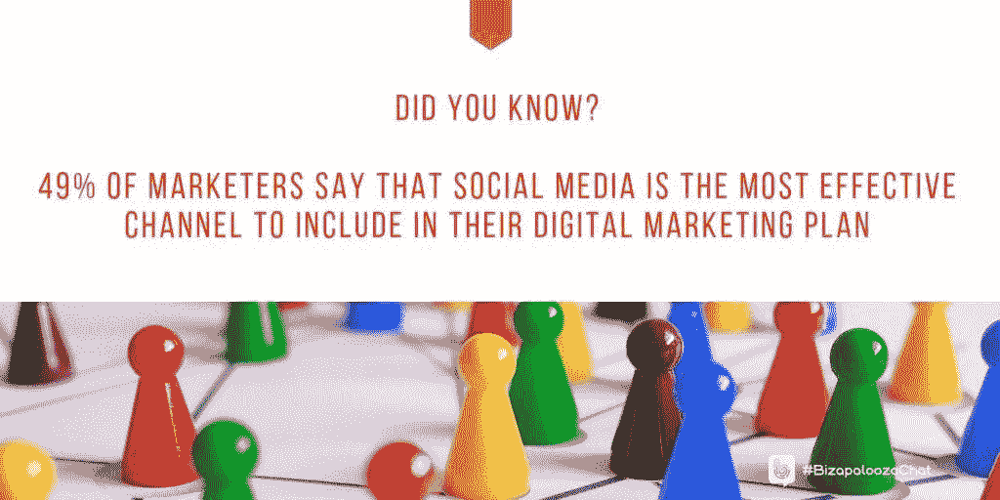
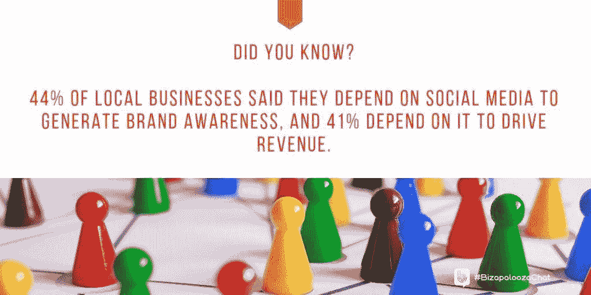

# 为了社区建设，游戏开始

> 原文：<https://medium.datadriveninvestor.com/for-community-building-game-on-bbdb16a40314?source=collection_archive---------38----------------------->

Photo by Priscilla Du Preez on Unsplash

厄尔·莫伯斯是一名不折不扣的游戏玩家。作为一名活动家、艺术家、角色扮演者和社交媒体项目经理，甚至她的网名也来自于她的游戏玩家传统。

另一方面，Morbs 不玩数字参与和社交媒体营销的游戏。千禧一代已经在社交媒体和在线社区工作了七年。

她带着权威的口吻说话，引起了[伊万娜·泰勒](https://diymarketers.com/about/)和[伊瓦·伊尼亚托维奇](https://twitter.com/IvaIgnjatovic)的注意。他们讨论了如何建立一个在线社区，如何吸引你的观众和追随者。

泰勒拥有 DIYMarketers 公司，这是一家“致力于帮助小企业主摆脱困境”的公司。Ignjatovic 是一名营销、战略、领导力和商业顾问。

他们权衡了网络和社区的区别。

“它们可能是相似的，”泰勒说。“一个网络*是*一个社区，但我不认为所有的社区都是网络。网络更多的是联系。社区是关于从属关系的。”

Ignjatovic 的视角很广。

“社区不仅仅是一个成员，”她说。“这是关于成员和归属，有意参与。”

这些在线网络具有强大的经济实力。根据 eMarketer 的调查，44%的当地企业表示他们依靠社交媒体来提高品牌知名度。此外，41%的公司依靠 it 来增加收入。

“一个网络包含由信仰、价值观和社会规范联系在一起的人们，他们经常相互分享信息、经验或行为，”Morbs 说。“网络代表人与人之间的联系或纽带。

“一个社区通常更小，更侧重于与他人的有机关系，以及社区成员对彼此和整个社区都很重要的感觉，”她说。"社区代表人与人之间的关系."

这些术语之间没有明显的区别。

“网络和社区并不相互排斥，”Morbs 说。“可能会有一些重叠。例如，您可以在一个网络中找到多个社区。”

# 自愿参与者

你不能强迫社区在一起并得到好的结果。成员们应该心甘情愿地在那里，并愿意参与。

“社区是自然形成的，就像森林一样，”泰勒说。"然而，它们可以像花园一样被建造和培育."

通常，社区不会奇迹般地出现。

“社区总是有意的，”Ignjatovic 说。“人们可以聚集在事业或品牌周围，但要让他们留在你身边，你需要有意识。”

企业有既得利益看到他们的社区成功。

“大多数群落都是自然形成的——有机的，”Morbs 说。“然而，品牌可以通过提供一种鼓励围绕产品、服务或事业建立关系的环境来影响社区。

“社区肯定会改变和进化——这并不奇怪，”Morbs 说。“人们会随着时间的推移而改变和发展，品牌也是如此。”

如今，首先建立在线社区可能更容易，尤其是如果参与者不是本地人的话。无论如何，面对面的互动带来了所有的维度。

泰勒认为在线社区和面对面社区都面临着挑战，而 Ignjatovic 认为它们融合在一起。

“线上和线下都一样，”Ignjatovic 说。“人在网上。即使你不在线，你也必须“连接”你的联系。

“建立一个社区不仅仅是发布帖子，”她说。“这需要真正的对话和参与——而且这一切都要持续进行。”

Morbs 说，在线和离线发展社区需要时间和努力，他给出了这些关键要素:

*   为你的社区创造高质量的有价值的内容。
*   有意义地定期参与。
*   提供共创机会。
*   激发社区内的支持与合作。

“时间和努力绝对是两者的一部分，”Morbs 说。“你必须为线下社区建设和活动准备一个物理空间，也必须为在线社区建设和活动准备一个数字空间。

“社交媒体和在线空间也已经成为 X 一代、千禧一代和年轻一代的第二天性，”她说。“现在有些人是伴随着互联网和在线社区成长起来的。这对他们来说是一个天然的空间。”

这种体验对企业来说也变得很自然。根据小企业趋势，53%的用户说他们购买了第一次在 Twitter 上看到的产品。

“我不认为你有一个没有参与的社区，”泰勒说。“是‘空气’让社区保持活力。”

# 建立关系

对于 Ignjatovic 来说，参与依赖于品牌知名度、品牌大使身份、接近观众、能够更好地为观众服务以及知识交流。

“参与在你的社区和你的品牌之间建立关系，”Morbs 说。“这是人情味发挥作用的地方，让真实性和同情心得以彰显。参与也刺激了跨网络的讨论和分享。

“参与度可以间接提高额外的指标，”她说。

Morbs 用自己的经历描述了在短短三个月的时间里，参与可以在多大程度上促进社区发展。

泰勒说:“繁荣、健康的社区定期相互接触，甚至在社区活动之外也是如此。”。

Ignjatovic 发现这些社区的特点是言论自由，承诺，知识和经验的交流，以及共同的目标。

“蓬勃发展的社区拥有强大的社区文化、积极的参与、品牌透明度、通过口碑传播赞美你的品牌的倡导者——赚取媒体，”Morbs 说。“他们共同创造了推动品牌创新和改进的概念。”

# 最适合营销

市场调研公司 [Ascend2](https://twitter.com/Ascend2research) 发现，49%的营销人员认为社交媒体是他们数字营销计划中最有效的渠道。

参与型社区可能只包括几个人或很多人。

“你可以有成千上万的会员，但 50 个人的参与给了你建立关系和创造能量的机会，”泰勒说。

当 Ignjatovic 说“越多越好”时，Morbs 踩下了数量的刹车。

“参与社区可以是任何规模的，”Morbs 说。“不要纠结于数字。

“参与仅仅意味着品牌与消费者、消费者与品牌或消费者与消费者之间的双向交流，”她说。“关注高质量的参与。增长会来的。”

建立和维护一个在线社区，保持活跃。这需要时间、努力和关怀的承诺。

“让社区参与进来是一项挑战，”泰勒说。“你需要试金石和提醒。”

知道从哪里开始很重要。

“选择参与平台，”Ignjatovic 说。"然后制定适当的参与策略，并保持一致."

莫尔斯提出了三个主要挑战:

*   社区节制。人们喜欢在他们感到安全和被倾听的地方交流。由于社区是关于关系和互动的，品牌应该确保社区中的交流是健康的，而不是有害的。
*   [时间管理](https://www.datadriveninvestor.com/2018/11/08/time-management-is-all-about-no/)。在线社区很少睡觉，因为互联网是 24–7–365 的。根据你的预算，你可能想投资一个社交媒体团队和社交工具。委派任务。
*   危机管理。您的社区将期待及时、透明和真实的回应。这可能包括真诚的道歉和展示改变的决心。糟糕的危机管理会损害你的社区。

“认可对社区有贡献的人是很重要的，”泰勒说。"即使他们只说了一次，你也需要承认他们."

任何人都不应被视为理所当然。

Ignjatovic 说:“品牌通常不会与他们的成员进行交流。“他们认为仅仅是社交，拥有成员或追随者就是拥有一个社区。”

Morbs 发现了这些常见的参与错误:

*   不投入。
*   加入谈话进行强行推销。
*   响应时间延迟。
*   缺乏个性化的反应，也被称为机器人发声。

伟大的社区管理者充满激情。你可以在他们的作品或视频中看到他们的热情。泰勒说，这些经理不仅承认，而且主动提出问题。

“他们主持、参与、回答和发布，”Ignjatovic 说。"他们让谈话继续下去，并让谈话在特定的语境中变得有意义."

Morbs 说，优秀的社区管理者有着共同的关键特质:

*   通过吸引外在和内在动机的内容促进参与。
*   使用引发讨论的问题和积极或有帮助的回答。
*   询问社区他们想要什么。然后跟进。

“给予是打开许多门的钥匙，”Morbs 说。“尤其是刚开始的时候，你会希望给予社区的比你期望得到的更多。一个强大的社区会在时间上给你十倍的回报。”

Twitter 聊天无疑是最好的在线社区。他们是无限的，广泛的和即时的。相比之下，脸书或其他团体都是小型社区中心。

Ignjatovic 也喜欢 Twitter，取代了 Google-plus 在她心中空出的位置。

“我最喜欢的在线社区平台是 Twitter、Reddit 和脸书集团，”Morbs 说。“我可能很快会把 Instagram 加入这个名单，因为它的视觉内容为人们提供了一种独特的联系方式。它有很大的潜力，而且这个平台正在成长。”

视觉内容也越来越重要。

“有很大的空间让你自己或你的品牌人性化，这是你无法通过纯文本内容实现的，”Morbs 说。“当视觉媒体进入画面时，我们可以非常有创意地参与进来。”

她和泰勒在 YouTube 视频中继续谈论社区建设和参与。

**关于作者**

吉姆·卡扎曼是[拉戈金融服务公司](http://largofinancialservices.com)的经理，曾在空军和联邦政府的公共事务部门工作。你可以在[推特](https://twitter.com/JKatzaman)、[脸书](https://www.facebook.com/jim.katzaman)和 [LinkedIn](https://www.linkedin.com/in/jim-katzaman-33641b21/) 上和他联系。

*原载于 2018 年 11 月 16 日*[*【www.datadriveninvestor.com】*](http://bit.ly/2OMRYYS)*。*