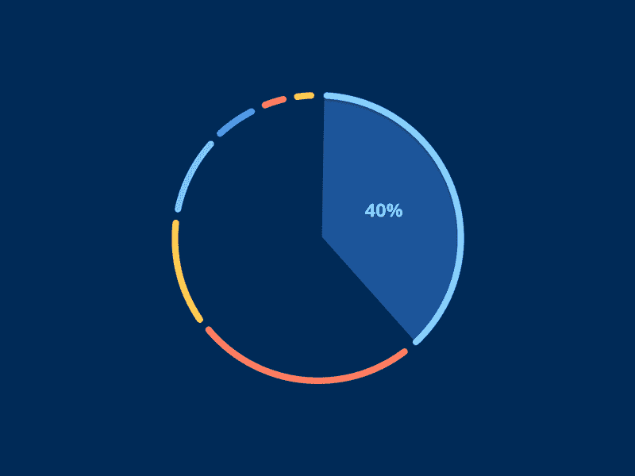
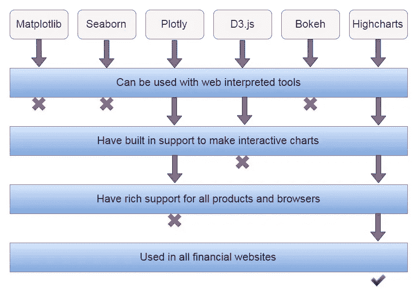

# 对于财务数据可视化，只使用高图表

> 原文：<https://medium.datadriveninvestor.com/for-financial-data-visualisations-use-only-highcharts-18f7d524766?source=collection_archive---------3----------------------->

interactive graphs

*如果你问任何一位数据科学家，他/她对哪个领域的数据可视化真正感兴趣，那么大多数人会说是在* [*金融*](https://towardsdatascience.com/machine-learning-in-finance-why-what-how-d524a2357b56) *领域。拿任何一个金融网站来说，你都会发现它是由现代网络技术创建的。*

现在，当谈到制作一个网站，特别是金融网站时，我们需要可以在网络上快速解释的语言，并且可以通过使用简单的[网络解释的](https://www.cabotsolutions.com/2017/08/how-to-select-the-best-web-technology-stack-for-your-product)工具来实现，如 HTML、CSS 和 Javascript，而不是使用 python 和 flask 框架或 Django。

*注意:我特别提到的是 python 在前端使用 Flask 或 Django 的时候，对于后端，你可以根据自己的喜好使用任何技术。*

因此，当我们使用诸如 [matplotlib](https://matplotlib.org/) 、 [seaborn](https://seaborn.pydata.org/) 或 [plotly](https://plot.ly/) 之类的图形库来可视化使用 python 的金融网站时，它在真实环境中没有任何用处，因为一家大型金融公司并不使用 python 来进行数据可视化。其次，如果你在考虑像 D3.js 或 Bokeh 甚至 plotly.js 这样的 js 框架，它们至少有一个 [Highcharts](https://www.highcharts.com/) 所缺少的因素。

比如说金融数据可视化， [D3.js](https://d3js.org/) 或 [bokeh](https://bokeh.pydata.org/en/latest/) 在这些领域的功能非常有限，因为它们不是为此而制作的，而在 plotly.js 中，它的支持有限，并且不能在旧设备上工作。

当考虑 Highcharts 时，它主要是为财务可视化而设计的，是一个纯粹的 js 库，在其官方网站上有简单的代码库和优秀的文档。

Comparison of different graphical libraries from a financial graphing point of view

此外，我发现了一篇来自罗宾·珀西的有趣文章，在他的博客 [*中反映了同样的思想，比较了最流行的 JavaScript 图表库*](https://blog.logrocket.com/comparing-the-most-popular-javascript-charting-libraries-f76fbe59ffd0) *。*

如果你仍然不相信，那就去看看任何一个显示实时股票价格的主要财经网站，比如[investing.com](https://www.investing.com/)、[纳斯达克](https://www.nasdaq.com/)、[grow . in](https://groww.in/)、[moneycontrol.com](https://www.moneycontrol.com/)等等。

# 为什么主要的金融公司使用高图表？

现在，作为 moneycontrol.com 的开发者，我们使用 highcharts 是因为它对其他设备和平台的灵活性，各种各样的技术指标，如 [SMA](https://www.investopedia.com/terms/s/sma.asp) 、 [MACD](https://www.investopedia.com/terms/m/macd.asp) 、 [CCI](https://www.investopedia.com/terms/c/commoditychannelindex.asp) 、 [RSI](https://www.investopedia.com/terms/r/rsi.asp) 、[随机指标](https://www.investopedia.com/terms/s/stochastic-modeling.asp)、[布林线](https://www.investopedia.com/articles/technical/102201.asp)、[支点](https://www.investopedia.com/terms/p/pivotpoint.asp)、 [PSAR](https://www.investorsunderground.com/technical-indicators/parabolic-sar/) 等等。此外，它比其他图形库更灵活地定制图表。

我想在这里提出的要点是，我的许多同事将使用非常简单或流行的图形库进行可视化，如果你只是想将其用于个人用途或研究目的，这是很好的，但如果你打算将其用于商业目的，那么你就错了，学习和使用 Highcharts 来可视化你的财务数据是非常明智的。

谢谢你读到这里，我真的很感谢你对这个博客的兴趣。此外，如果你对我的任何观点有看法、兴趣或矛盾，你可以在评论中发表。

如果你想和我联系，你可以跟着我

[领英](https://www.linkedin.com/in/gauravc2708/) | [推特](https://twitter.com/2796gaurav) | [邮件](http://2796gaurav@gmail.com)

在那之前，

## 快乐编码:)

别忘了拍手拍手拍手…