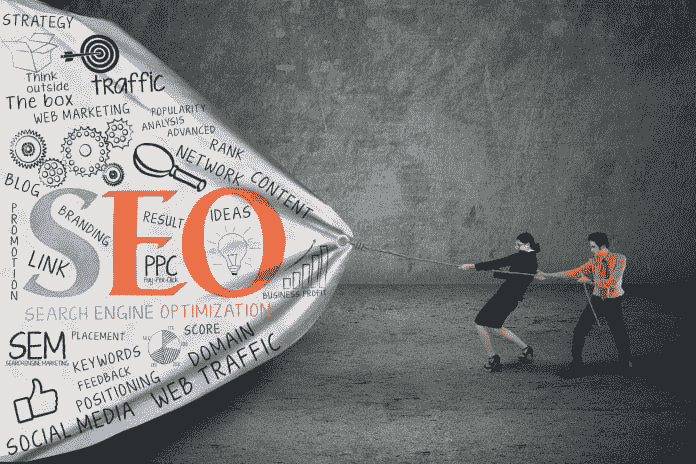
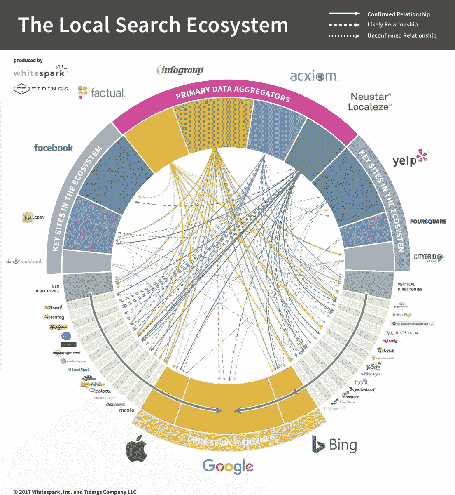
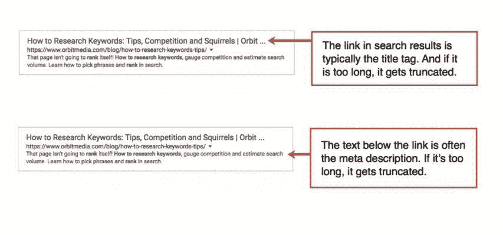

# 对于 SEO 来说，文字是关键

> 原文：<https://medium.datadriveninvestor.com/for-seo-the-words-are-key-691ed1fb8d1e?source=collection_archive---------3----------------------->

## 通过了解搜索引擎优化的基础知识来利用

搜索引擎优化对未受过训练的人来说可能是令人生畏的。从一开始，它有助于获得正确的缩写。

“这是第一步，”[安迪·克雷斯托迪纳](https://twitter.com/crestodina)说。"如果你不会拼写，你就永远不会擅长搜索引擎优化."

别的不说，Crestodina 擅长 SEO。他是一位演讲者、内容营销者、[轨道媒体](https://twitter.com/orbiteers)的联合创始人，也是《 [*内容化学:内容营销图解手册*](https://www.orbitmedia.com/about/content-chemistry/) 》的作者

Crestodina 自 2000 年 1 月以来一直从事网页设计和互动营销领域的工作。作为内容营销和道德数字营销的传播者，他已经帮助成千上万的人更好地在网上获得结果。

营销人员、社交媒体专家和播客主持人 [Madalyn Sklar](https://twitter.com/MadalynSklar) 加入了 Crestodina 的 SEO 初级读本。

 [## 用一剂健康的 SEO 飙升到顶部

### 社交媒体黑客帮助品牌脱颖而出

medium.com](https://medium.com/datadriveninvestor/surge-to-the-top-with-a-healthy-dose-of-seo-14a55d119836) 

社交媒体应用[manage fliter](https://twitter.com/ManageFlitter)的 Kate Frappell 也讨论了她的公司如何利用 SEO。

“我们在营销网站上投入了最大的搜索引擎优化努力，”她说。“自 2010 年以来，该网站在许多关键词上排名很高，比如‘取消关注’

“在 2018 年年中，我们推出了一个新版本的网站，拥有全新的设计和用户界面，”Frappell 说。“这意味着我们需要监控搜索引擎优化，以确保我们不会在迁移过程中丢失太多排名。”

# 到外面去

ManageFlitter 团队也足够聪明，知道他们需要帮助。

“我们聘请了一名搜索引擎优化顾问与工程师密切合作，”Frappell 说。“最初我们的排名确实下降了一点，但这是意料之中的。现在，我们的排名比迁移前更高。

“搜索引擎优化可能非常技术性和复杂，”她说。"如果你是一个小企业，聘请一个推荐的搜索引擎优化专家是有益的."

在这方面，Crestodina 列举了两个主要的搜索排名因素:

*   站外搜索引擎优化关乎权威和信任——来自其他网站的链接。
*   页面搜索引擎优化是关于相关性和内容——页面上的关键词。

他的视频解释了搜索涉及的三个主要因素，以及从搜索引擎吸引合格访问者的艺术和科学。

 [## 易于制作的视频让人们看到你，听到你，了解你

### 指尖控制你的信息

medium.com](https://medium.com/datadriveninvestor/easy-to-make-video-lets-people-see-you-hear-you-and-know-you-3b726a883a66) 

SEO 应该没那么复杂。如果你预先陈述了主题，并在你的内容中坚持到底，那么 SEO 应该在文章的自然流程中照顾好自己。

“SEO 是从搜索引擎吸引访问者的艺术和科学，”Crestodina 说。“搜索排名是流量的持续来源。与社交网站的访客相比，这些访客通常有更强的“意图”

他详细介绍了 SEO 的基本步骤:

*   扪心自问，“找我的人在搜索什么？”
*   请确保您有足够的权力为该短语排名。
*   如果你这样做了，做一个关于这个主题的网页。
*   如果不是，选择一个更长、更具体的短语。

Crestodina 建议通过其[链接浏览器](https://analytics.moz.com/pro/link-explorer/home)在 [Moz](https://twitter.com/Moz) 上查找域名权限。

“主要是谷歌，但也有其他类型的搜索引擎优化，”他说。"它们包括亚马逊、YouTube、iTunes、谷歌 Play 商店、本地搜索引擎优化、图片搜索引擎优化、易贝、Instagram、必应等等."

本地搜索引擎优化是出现在谷歌地图和一些搜索结果页面顶部的“本地三包”中的艺术和科学。

“这是一个完全不同的游戏，”克雷斯托迪纳说。“如果说有机搜索引擎优化是关于链接，那么本地搜索引擎优化就是关于‘引用’，即你的名字、地址和电话号码一起出现的地方。

“所有的引用都让谷歌有理由相信你的业务在那个地方，”他说。

# 完全完整的列表

[达伦·肖](https://twitter.com/DarrenShaw_)，Whitespark 的创始人——该公司为本地 SEO 开发软件并提供服务——解释了[美国本地搜索生态系统](https://whitespark.ca/local-search-ecosystem/)。

Crestodina 补充说 [Moz Local](https://twitter.com/MozLocal) 让人们检查[他们所有的本地列表](https://moz.com/local/search)是否一致和完整。

 [## “战略性社交倾听是真实的生活”

### 获得洞察力以抓住机会

medium.com](https://medium.com/datadriveninvestor/strategic-social-listening-is-real-life-90c8a07b7c3f) 

企业可以提高其内容的相关性以获得最佳搜索排名的一种方法是通过社交倾听。他们可以让自己的内容与受众的需求和痛点相关联。他们创造的任何与此相关的东西都会给他们带来搜索结果，并与那些最需要这些品牌的人建立联系。

“从品牌关键词开始，”克雷斯托迪纳说。“人们在搜索你的品牌时会搜索什么？在[关键字工具](https://keywordtool.io/)中输入您的公司名称。然后搜索这些短语。喜欢你看到的吗？

“接下来，看看你现在的排名，”他说。“什么已经起作用了？按照一步一步的过程到[找到你目前的排名](https://www.orbitmedia.com/blog/what-do-i-rank-for-how-to-check-your-rankings/)

Crestodina 补充说，并不是所有的内容都是搜索友好的。

“有很多主题没有人去搜索，”他说。“对于那些话题，在社交上推广。”

# 关键词物质

企业家可能会担心他们的谷歌排名。这使得企业迫切需要找到正确的关键词来更好地排列他们的网页。

“瞄准符合这两个标准的关键短语，”克雷斯托迪纳说。“是的，人们正在寻找它。是的，你有机会为它排名。”

他解释说，每个关键词都表明了访问者的意图，给出了三种关键词意图:

*   商业
*   报告的
*   航行的

“如果你的网站有搜索工具，你就有一个有趣的方法来找到搜索友好的主题，”Crestodina 说。“查看人们在您自己的网站上搜索什么。然后创建关于这些主题的内容。”

Orbit Media 解释了如何在谷歌分析中设置[网站搜索，并快速找到见解。](https://www.orbitmedia.com/blog/how-to-set-up-site-search-google-analytics/)

企业主需要了解他们的受众以及他们的需求和欲望。企业家对潜在客户及其语言了解得越多，他们就能更好地用听众容易理解的词汇和短语说话。

克里斯托迪纳说，营销人员应该从以通常的方式使用页面上的目标短语开始:

*   曾经在标题中
*   一旦在标题中
*   有几次在正文中

“记住，你的标题标签和元描述通常会成为谷歌搜索结果中的‘片段’，”他说。"接下来，将“语义相关”的短语整合到你的内容中."

一个 Crestodina 视频解释了在哪里可以找到这些短语。

# 排名因素

为了区分站外搜索引擎优化和页面搜索引擎优化，Crestodina 给出了关键的搜索排名因素:

*   站外搜索引擎优化关乎权威和信任——来自其他网站的链接。
*   页面搜索引擎优化是关于相关性和内容——页面上的关键词。

他的 YouTube 视频解释了这些差异。

对于可以帮助搜索引擎优化的工具，Crestodina 是 [SEMrush](https://twitter.com/semrush) 的“忠实粉丝”。

“它有很棒的工具、很棒的内容和很棒的社区，”他说。其他工具收藏夹包括 Moz、[关键词工具](https://twitter.com/keywordtoolio)和 [Ahrefs](https://twitter.com/ahrefs) 。

Crestodina 和 Sklar 在[脸书现场聊天](https://www.facebook.com/manageflitter/videos/298322650889482/?notif_id=1545174865516696&notif_t=live_video_explicit)中深入探讨了 SEO 的更多细节。

**关于作者**

吉姆·卡扎曼是拉戈金融服务公司的经理，曾在空军和联邦政府的公共事务部门工作。你可以在[推特](https://twitter.com/JKatzaman)、[脸书](https://www.facebook.com/jim.katzaman)和 [LinkedIn](https://www.linkedin.com/in/jim-katzaman-33641b21/) 上和他联系。

*原载于 2018 年 12 月 29 日 www.datadriveninvestor.com**的* [*。*](https://www.datadriveninvestor.com/2018/12/29/for-seo-the-words-are-key/)