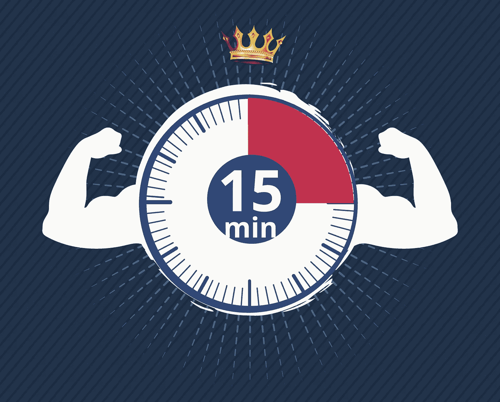

# 最高性能:强大的 15 分钟会议

> 原文：<https://medium.datadriveninvestor.com/for-the-highest-performance-the-powerful-15-minute-meeting-df4831e7723e?source=collection_archive---------18----------------------->

三个问题的会议让你的团队表现更上一层楼。

“我的团队整天都很忙，但他们的工作效率却很低？”我的朋友马克斯抱怨道，他是一家数字营销公司的首席执行官。我给他提供了一个真正适合他的解决方案。现在，我在这里告诉你。

事实是，创业团队总是忙着完成多项任务，以降低运营成本并获取利润。或者更糟，他们沉浸在处理客户和文件的日常事务中。他们太忙了，没有时间直视公司的远景或发展他们的技能。现在是翻开新的一页，想出解决办法的时候了。它将为你节省金钱、时间、精力和一个高效的团队。记住，你的团队是你公司最有价值的资产。

这里有一个受 Scrum 框架启发的解决方案，“三问会议”。这是一个每天 15 分钟的站立会议。你的所有团队成员必须站在一起分享三个问题的答案:

自从上次会议后，你做了些什么？

下一次会议之前你在做什么？

什么阻碍了你的工作？

这些问题的答案让你对团队表现和任何潜在的问题有所了解，这样你就有更好的机会在问题发生之前处理它们。

*   它激励你的团队时刻关注公司战略，并相应地实施他们的计划。
*   它通过同伴的压力点燃了团队成员之间积极的竞争精神。在这种压力下，没有人想比别人慢。因此，集体的团队努力将推动公司以最快的速度成倍增长。
*   同时，它加深了团队成员之间的关系。通过了解工作分配和知道谁在做什么，团队成员知道在哪里寻求帮助以及如何帮助其他人实现团队目标。

尽管这种方法提高了团队的生产力，但它也让团队承受了巨大的工作和时间压力。对他们为你完成的目标给予奖励是表达你感激的最好方式。奖励可以是简单的一个小庆祝或一个晚餐邀请。

这里有一个让你在团队表现上登上珠穆朗玛峰的建议:激励每个团队成员每天都有一个个人目标，比如学习在线课程，学习一门新语言，甚至减肥。让他们通过与他人分享来跟踪自己的进展，以获得整个团队的支持。一旦你的员工感到你关心他们的个人目标，他们的生产力和对你的企业的忠诚度将会加倍。

现在，你只需要想想你的第一次单口相声会是什么时候。

如果你正在寻找建立最佳客户战略，请阅读本文:
[**对于企业家:建立你的以客户为中心的战略**](https://medium.com/p/27ef44987e62?source=your_stories_page---------------------------)

如果你想打造一款吸引顾客的产品，这篇文章适合你:
[**让顾客对你的产品产生兴趣**](https://medium.com/p/8ebe0edd5ca0?source=your_stories_page---------------------------)