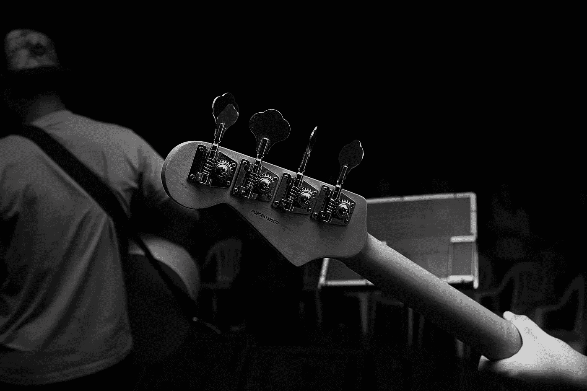

# 为了对音乐的热爱:独一无二

> 原文：<https://medium.datadriveninvestor.com/for-the-love-of-music-being-unique-6e07497aa8c7?source=collection_archive---------13----------------------->

Photo by [David Rangel](https://unsplash.com/photos/Awa19ZTpvLA?utm_source=unsplash&utm_medium=referral&utm_content=creditCopyText) on [Unsplash](https://unsplash.com/search/photos/rock-band?utm_source=unsplash&utm_medium=referral&utm_content=creditCopyText)

## 到处寻找伟大的家乡音乐

我今天错过听到的是音乐从何而来的感觉。美国及其他地方的每一个城镇都有其独特的个性，以及埋藏在其根源中的独特的声音欣赏。

我们受到听到的所有声音的影响，包括许多商业行为。当一个艺术家能够有效地将趋势融入到他们独特的个性中时，就可能成为成功的驱动力。潮流是文化运动。

个人在哪里与他们自己的存在达成协议？那些造就艺术家的独特品质在哪里？

我们越是表达我们的诚实，细心的观众就会以同样的方式回应。毕竟，我们都不是完全独一无二的。我们确实有很多相似之处。让我们与众不同的是我们来自哪里。我们的故事。我们的家庭。我们的根协会。

约翰·沃特的电影《粉红火烈鸟》就是一个极端表达的经典例子。传统雅皮士时代的粗俗。沃特先生的眼光是独一无二的，迪瓦恩和伊迪丝一起首次亮相。20 世纪 80 年代马里兰州巴尔的摩特有的景象。

地点很重要。我们的家很重要，无论是铁轨上的火车声，还是远处雾中港口浮标的叮当声。在沙漠中，可以有声音的真空，或风的声音携带峡谷鹪鹩的呼叫。走过干燥的沙漠土壤时出现细微的裂缝。小秘密很重要。

我们的家增加了我们积累的经验，推动了个人的独特性。

*约翰·科尔，*创始人/首席开发者[Muezbiz.com](https://muezbiz.com)

通过向邻居代表支付会员发行音乐的份额，努力将音乐出版业从边缘拯救回来。

[Muezbiz](https://www.muezbiz.com)是一个创业公司。“在音乐对话中结识当地朋友。分享你喜欢的音乐来赚钱。”现在从当地的某个人那里购买按地区过滤的感兴趣的媒体。

*所有加入的新成员都被转发到圣达菲民间/美国对话社交时间线，看看网站如何运作。可以通过顶部成员名称下的首选项菜单随时更改默认值。*

我更多的流浪:

[*诚实带来美味的蛋糕*](https://medium.com/datadriveninvestor/honesty-inspires-a-fabulous-cake-31318848eede)

[*地区数字内容代表能赚钱吗？绝对的。*](https://medium.com/datadriveninvestor/can-regional-digital-content-reps-make-money-absolutely-5df3460e9b20)

[*启用愿景，鼓励可能性*](https://medium.com/datadriveninvestor/enabling-visions-encouraging-possibility-2171356fd2d7)

[*音乐营销:启用“口碑”*](https://medium.com/@john_cole/music-marketing-enabling-word-of-mouth-7f3451c845da)