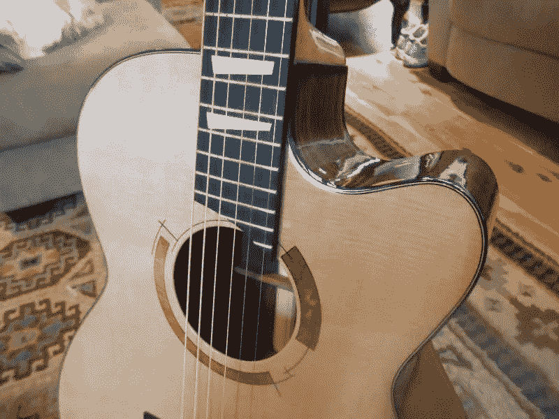

# 为了对音乐的热爱:声音，耳朵，和追求的快乐

> 原文：<https://medium.datadriveninvestor.com/for-the-love-of-music-sound-the-ear-and-the-pleasure-to-pursue-ea50d82000c9?source=collection_archive---------2----------------------->

Custom built by an acquaintance from Crestone, CO music festival, Crest Fest.

## 质疑新数码玩具的音质？不要。

66 岁生日，给 Powerbook 弄了个猩红色的 6i6 24 位 USB 接口。这个小而便宜的设备有很多令人难以置信的准确性记录吉他和人声的承诺。添加伟大的录音软件(DAW)，而记录到一个 SM57。我进入了幸福的音频连接。

作为一个数字和模拟的倡导者，我认识到老唱片的丰富性，以及 CD 带给市场的商业价值。

在 80 年代早期，CD 是如此的酷和新颖。大多数听众从未想过音乐是如何被复制的。我们被一个便携式闪亮的小磁盘和一项新技术迷住了。

我想念我的黑胶唱片。我希望我有我的 Dynico 套件放大器，和非常重的 10 英寸扬声器驾驶室。声音的丰富性是充分的，黑胶唱片充满了许多党凌晨时分。

黑胶唱片的复兴复活了一个细分市场……热爱高品质声音的人们。与此同时，廉价的内存和家庭录音技术已经冲进了 DIY 市场。

# 齐腰深的碎片

作为一名职业平面设计师，我见证了数字化的发展。我的第一台电脑是 1987 年的 Mac II。承诺开花了。

在整个 20 世纪 90 年代，我使用的笔记本电脑甚至不在新闻技术人员的视野之内。颜色，总是很难管理，变得有点可控，因为颜色配置文件把舵混乱。PDF 交付给媒体的改进仍在继续。

随着 16 位到 32 位数据处理速度的提高，同样的过程也发生在音频领域。凭借廉价的内存，现在在家就能获得精确混音的高质量录音。

# 曲线球

像任何技术一样，学习曲线充满了兔子洞，有些深不见底，有些没有。对于音频，最好的起点很简单:压缩和 EQ。添加大量插件的混响带来了复杂性和无限的可能性。简单开始。

问题仍然是，“什么是质量”？都是“模拟”的吗？数字录音能取代过去最好的模拟声音吗？这个论点对于音响发烧友来说意义重大，可以激起很多情绪。我相信，认为数字不能完全取代模拟是幼稚的。

音频是非常个人化的体验。一些人听到的微妙之处，另一些人永远听不到。创造令人愉快的数字音频正在发生，并且是一列在未来不会停下来的火车。

我回想起我那辆大约 1968 年的大众方背车的情景，车上装着我的唱片集……它的轮胎向外张开，支撑着所有的重量。我从新墨西哥开车到罗德岛，带着祈祷和许多美妙的音乐。

时代变了。有时会变得更好。现在，我的全部收藏都在我的口袋里，更高清晰度的录音文件格式提供了一种我可以充分享受的无流行音乐的声音。

*约翰·科尔，**的创始人兼首席开发者*

*通过向邻居代表支付会员发行音乐的份额，努力将音乐出版业从边缘拯救回来。*

*[Muezbiz](https://www.muezbiz.com)是一个创业公司。“在音乐对话中结识当地朋友。分享你喜欢的音乐来赚钱。”现在从当地的某个人那里购买按地区过滤的感兴趣的媒体。*

**所有加入的新成员都被转发到圣达菲民间/美国对话社交时间表，以了解网站如何运作。可以通过顶部成员名称下的首选项菜单随时更改默认值。**

*我更多的流浪:*

*[*到处支持我们的音乐罩*](https://medium.com/datadriveninvestor/supporting-our-music-hoods-everywhere-870e3b5a3af6)*

*[*诚实带来美味的蛋糕*](https://medium.com/datadriveninvestor/honesty-inspires-a-fabulous-cake-31318848eede)*

*区域数字内容代表能赚钱吗？绝对的。*

*[*启用愿景，鼓励可能性*](https://medium.com/datadriveninvestor/enabling-visions-encouraging-possibility-2171356fd2d7)*

*[*音乐营销:启用“口碑”*](https://medium.com/@john_cole/music-marketing-enabling-word-of-mouth-7f3451c845da)*